# 亚马逊公司 (Amazon.com, Inc.) —— 全球商业与云计算帝国全景介绍

> **《财富》世界500强排名：第 1 位**  
> **年度营业收入：$716,924 百万美元（约 7169 亿美元）**  
> **官方网站：[www.amazon.com](https://www.amazon.com)**

---

## 🏢 企业基本信息 (Corporate Snapshot)

| 维度 | 详细信息 |
| :--- | :--- |
| **公司全称** | 亚马逊公司 (Amazon.com, Inc.) |
| **成立时间** | 1994 年 7 月 5 日 (创立于美国华盛顿州贝尔维尤) |
| **全球总部** | 🇺🇸 美国 华盛顿州 西雅图 (Seattle, WA) / 弗吉尼亚州 阿灵顿 (HQ2) |
| **创始人** | 杰夫·贝索斯 (Jeff Bezos) |
| **现任 CEO** | 安迪·贾西 (Andy Jassy) |
| **股票代码** | NASDAQ: `AMZN` (标普500指数与纳斯达克100指数核心成分股) |
| **全球员工总数** | 约 150+ 万人（全球仅次于沃尔玛的第二大私营雇主） |
| **核心业务赛道** | 电子商务平台、全球云计算服务 (AWS)、数字流媒体与娱乐、数字广告平台、智能硬件与生成式 AI |

---

## 🌐 核心业务矩阵与商业版图 (Business Ecosystem)

```mermaid
graph TD
    AMZN["亚马逊商业帝国 (Amazon.com, Inc.)"]
    
    AMZN --> EC["1. 电子商务与零售 (E-Commerce)"]
    EC --> EC1["自营零售 (1P Retail)"]
    EC --> EC2["第三方开放平台 (3P Marketplace)"]
    EC --> EC3["全食超市 (Whole Foods Market)"]
    EC --> EC4["亚马逊生鲜 (Amazon Fresh & Go)"]
    
    AMZN --> AWS["2. 亚马逊云科技 (AWS Cloud)"]
    AWS --> AWS1["弹性计算 (EC2) & 存储 (S3)"]
    AWS --> AWS2["数据库 (Aurora/DynamoDB)"]
    AWS --> AWS3["生成式 AI 平台 (Amazon Bedrock)"]
    AWS --> AWS4["自研 AI 芯片 (Trainium/Inferentia)"]
    
    AMZN --> SUB["3. 订阅与数字内容 (Subscriptions & Media)"]
    SUB --> SUB1["Prime 会员体系 (超2亿全球订阅用户)"]
    SUB --> SUB2["Prime Video 流媒体 & 米高梅影业 (MGM)"]
    SUB --> SUB3["Amazon Music 音频 & Audible 有声读物"]
    SUB --> SUB4["Kindle 数字图书生态"]
    
    AMZN --> ADV["4. 数字广告服务 (Digital Advertising)"]
    ADV --> ADV1["搜索赞助广告 (Sponsored Ads)"]
    ADV --> ADV2["流媒体视频广告 (Prime Video Ads)"]
    
    AMZN --> HW["5. 智能硬件与物联网 (Devices & IoT)"]
    HW --> HW1["Echo 智能音箱 & Alexa 大语言模型"]
    HW --> HW2["Fire TV 电视棒 & Fire 平板"]
    HW --> HW3["Ring / Blink 智能安防系统"]
    HW --> HW4["Kuiper 卫星互联网星座 (Project Kuiper)"]

    classDef main fill:#ff9900,stroke:#232f3e,stroke-width:2px,color:#fff;
    classDef branch fill:#232f3e,stroke:#ff9900,stroke-width:1px,color:#fff;
    classDef sub fill:#f3f3f3,stroke:#232f3e,stroke-width:1px,color:#000;
    class AMZN main;
    class EC,AWS,SUB,ADV,HW branch;
    class EC1,EC2,EC3,EC4,AWS1,AWS2,AWS3,AWS4,SUB1,SUB2,SUB3,SUB4,ADV1,ADV2,HW1,HW2,HW3,HW4 sub;
```

---

## ⚡ 核心竞争壁垒与飞轮引擎 (Competitive Advantages)

### 1. 全球超级物流履约网络 (Fulfillment by Amazon, FBA)
- **仓储与机器人自动化**：全球拥有数百个高度自动化运营中心（Fulfillment Centers），部署超 75 万台 Kiva/Hercules 搬运机器人、Robin 分拣机械臂与 Proteus 全自主移动机器人。
- **自建航空与陆运干线**：拥有专属货运机队（Amazon Air）数十架波音货机，上万辆干线挂车与数万辆电动配送面包车（Rivian定制定制合作），在欧美主要城市实现“当日达”与“次晨达”。

### 2. AWS（亚马逊云科技）：全球云计算霸主
- **市场地位**：自 2006 年开创现代公有云产业以来，连续近 20 年位居全球云计算基础设施（IaaS/PaaS）市场份额第一位。
- **全栈 AI 基础设施**：推出全托管生成式 AI 平台 **Amazon Bedrock**（接入 Claude、Llama、Titan 等前沿基础模型），并自研 **Trainium 2** 训练芯片与 **Inferentia 2** 推理芯片，为全球开发者和企业级客户提供极具成本效益的 AI 算力底座。

### 3. 高利润数字广告业务崛起
- 依托数十亿次用户精准高转化购买意图搜索，亚马逊已迅速成长为仅次于谷歌与 Meta 的全球第三大数字广告巨头，年广告收入突破 500 亿美元且保持高双位数增长。

---

## 📈 历史里程碑年表 (Historical Milestones)

- **1994年**：杰夫·贝索斯在华盛顿州创立 Cadabra，后更名为 Amazon.com。
- **1995年**：第一本在亚马逊售出的书为道格拉斯·霍夫施塔特的《流体概念与创造性类比》。
- **1997年**：在纳斯达克成功上市（股票代码：AMZN），IPO 发行价 18 美元。
- **2000年**：启动 Amazon Marketplace，正式向第三方商家开放平台。
- **2005年**：正式推出 **Amazon Prime** 会员服务（最初年费 79 美元，提供无限次免费两日达）。
- **2006年**：推出 Amazon S3 和 EC2，**AWS (Amazon Web Services)** 正式诞生。
- **2007年**：发布第一代 **Kindle** 电子书阅读器，5.5小时内售罄。
- **2014年**：发布智能音箱 **Amazon Echo** 及语音助手 **Alexa**。
- **2017年**：以 137 亿美元全现金收购美国高档有机生鲜超市**全食超市 (Whole Foods Market)**。
- **2021年**：杰夫·贝索斯卸任 CEO，原 AWS 掌门人**安迪·贾西 (Andy Jassy)** 出任亚马逊新任 CEO。
- **2022年**：完成以 85 亿美元对百年好莱坞影业巨头**米高梅影业 (MGM)** 的收购。
- **2024-2026年**：亚马逊营业收入突破 7100 亿美元，连续蝉联《财富》世界500强榜首；加速部署生成式 AI 与 Kuiper 低轨宽带卫星星座。

---

## 🎯 企业文化与核心价值观 (Leadership Principles)

亚马逊闻名全球的 **16 条领导力准则 (Amazon Leadership Principles)** 构成了其高效运转与敏捷创新的基石：

1. **顾客至尚 (Customer Obsession)**：从客户出发，逆向推导，建立并维护客户信任。
2. **主人翁精神 (Ownership)**：从长远出发，绝不说“这不是我的工作”。
3. **创新与简化 (Invent and Simplify)**：要求团队始终寻求发明显著简化方案。
4. **决策常正确 (Are Right, A Lot)**：具备卓越的商业直觉与多维度洞察力。
5. **好奇求知 (Learn and Be Curious)**：对新事物始终充满探索欲并不断提升自我。
6. **选贤育能 (Hire and Develop the Best)**：每次招聘都提高人才门槛。
7. **最高标准 (Insist on the Highest Standards)**：持续追求不可思议的高标准。
8. **远大抱负 (Think Big)**：大胆思考并引导团队勇于突破。
9. **崇尚行动 (Bias for Action)**：在商业中速度至关重要，多数决策皆可逆。
10. **勤俭节约 (Frugality)**：以更少的资源实现更大的产出，约束孕育足智多谋。
11. **赢得信任 (Earn Trust)**：倾听他人、坦诚沟通并勇于自我解剖。
12. **深入细节 (Dive Deep)**：在各个层面保持关注，随时审视并验证数据。
13. **敢于谏言，服从大局 (Have Backbone; Disagree and Commit)**：有原则地提出质疑，一旦决定则全力执行。
14. **达成业绩 (Deliver Results)**：专注于核心输入并始终达成卓越结果。
15. **力求成为最佳雇主 (Strive to be Earth's Best Employer)**：创造安全、包容且高效的工作环境。
16. **胸怀大局，承担责任 (Success and Scale Bring Broad Responsibility)**：从地方社区到全球生态，承担跨国巨头应有的责任。

