# 沃尔玛公司 (Walmart Inc.) —— 全球实体与全渠道零售霸主全景介绍

> **《财富》世界500强排名：第 2 位**  
> **年度营业收入：$713,163 百万美元（约 7131 亿美元）**  
> **官方网站：[www.walmart.com](https://www.walmart.com)**

---

## 🏢 企业基本信息 (Corporate Snapshot)

| 维度 | 详细信息 |
| :--- | :--- |
| **公司全称** | 沃尔玛公司 (Walmart Inc.，原 Wal-Mart Stores, Inc.) |
| **成立时间** | 1962 年 7 月 2 日 (创立于美国阿肯色州罗杰斯市) |
| **全球总部** | 🇺🇸 美国 阿肯色州 本顿维尔 (Bentonville, AR) |
| **创始人** | 萨姆·沃尔顿 (Sam Walton) 与 詹姆斯·“巴德”·沃尔顿 (Bud Walton) |
| **现任 CEO** | 董明伦 (Doug McMillon) |
| **股票代码** | NYSE: `WMT` (道琼斯工业平均指数、标普500指数核心成分股) |
| **全球员工总数** | 约 **210+ 万人**（全球规模最大的私营雇主） |
| **全球门店网络** | 全球 19 个国家拥有超 10,500 家大型商场与会员店 |
| **核心业务赛道** | 沃尔玛美国 (Walmart U.S.)、山姆会员商店 (Sam's Club)、沃尔玛国际 (Walmart International)、全渠道电商平台、零售媒体广告 (Walmart Connect) |

---

## 🌐 核心业务矩阵与全球版图 (Business Architecture)

```mermaid
graph TD
    WMT["沃尔玛商业帝国 (Walmart Inc.)"]
    
    WMT --> US["1. 沃尔玛美国 (Walmart U.S.)"]
    US --> US1["超级购物中心 (Supercenter, 约3500+家)"]
    US --> US2["折扣百货商场 (Discount Stores)"]
    US --> US3["社区生鲜超市 (Neighborhood Market)"]
    US --> US4["数字零售与即时配送 (Walmart+)"]
    
    WMT --> SAMS["2. 山姆会员商店 (Sam's Club)"]
    SAMS --> SAMS1["高端仓储会员制零售 (全球超800+家)"]
    SAMS --> SAMS2["自有品牌 (Member's Mark) 差异化爆品"]
    SAMS --> SAMS3["山姆云仓极速达 (1小时前置仓履约)"]
    
    WMT --> INTL["3. 沃尔玛国际 (Walmart International)"]
    INTL --> INTL1["墨西哥与中美洲 (Walmex, 领先零售网)"]
    INTL --> INTL2["中国市场 (高品质山姆会员店核心驱动)"]
    INTL --> INTL3["印度市场 (控股电商独角兽 Flipkart 与 PhonePe)"]
    INTL --> INTL4["加拿大与非洲市场 (Massmart)"]
    
    WMT --> OMNI["4. 新兴高毛利多元生态 (New Growth Engines)"]
    OMNI --> OMNI1["零售广告网络 (Walmart Connect)"]
    OMNI --> OMNI2["商家履约物流服务 (Walmart Fulfillment Services, WFS)"]
    OMNI --> OMNI3["数据智能洞察平台 (Walmart Luminate)"]
    OMNI --> OMNI4["无人机即时配送 (Drone Delivery)"]

    classDef main fill:#0071ce,stroke:#ffc220,stroke-width:2px,color:#fff;
    classDef branch fill:#041e42,stroke:#ffc220,stroke-width:1px,color:#fff;
    classDef sub fill:#f3f3f3,stroke:#041e42,stroke-width:1px,color:#000;
    class WMT main;
    class US,SAMS,INTL,OMNI branch;
    class US1,US2,US3,US4,SAMS1,SAMS2,SAMS3,INTL1,INTL2,INTL3,INTL4,OMNI1,OMNI2,OMNI3,OMNI4 sub;
```

---

## ⚡ 核心竞争优势与供应链护城河 (Moat & Innovations)

### 1. 全球极致的高效供应链管理 (World-Class Logistics)
- **跨码头运转 (Cross-Docking)**：货物从供货商集装箱卡车直接卸载到分拣线，几小时内装入发往各个门店的卡车，几乎实现“零中间仓储停留时间”。
- **庞大的专属私有卡车车队**：拥有全美最大的私有货运车队之一（超 1 万名专业司机与 8 万多辆挂车），实现点对点精准高频补货。
- **自动化配送中心 (Next-Gen Automated DCs)**：引入 Symbotic 人工智能机器人立体密集仓储系统，分拣吞吐效率提升数倍，大幅降低单件商品履约成本。

### 2. 天天平价 (EDLP) 与薄利多销定价哲学
- 沃尔玛坚守“天天平价 (Every Day Low Price)”模式，拒绝繁琐的临时打折促销，通过庞大的全球直采规模将采购成本压至行业最低，并全部让利给终端消费者。

### 3. 全渠道 (Omnichannel) 数字化转型提速
- **以门店为微型履约中心**：全美 90% 的人口居住在距离沃尔玛门店 10 英里以内，沃尔玛将 4700 多家美国实体店改造为兼具购物与线上下单“路边自提 (Curbside Pickup)”的分布式前置微仓。
- **会员订阅服务 Walmart+**：提供无门槛免费送货、汽油加油折扣与 Paramount+ 流媒体权益，与亚马逊 Prime 形成强力竞争。

---

## 📈 历史关键里程碑 (Historical Milestones)

- **1962年7月2日**：萨姆·沃尔顿在阿肯色州罗杰斯市开设第一家“Wal-Mart Discount City”。
- **1970年**：沃尔玛正式在纽交所上市（股票代码：WMT），建立员工全员利润分享计划。
- **1983年**：创立首家**山姆会员商店 (Sam's Club)**，开创会员制仓储量贩先河。
- **1987年**：耗资 2400 万美元建成当时全美最大的私有商业卫星通讯系统，连通全美所有门店与卡车车队。
- **1988年**：在密苏里州开设第一家**沃尔玛超级购物中心 (Supercenter)**，实现生鲜食品与百货一站式购齐。
- **1991年**：在墨西哥开设首家海外合资门店，正式开启全球化跨国扩张。
- **1996年**：正式进入中国市场，在深圳开设第一家沃尔玛购物广场与第一家山姆会员商店。
- **2016年**：以 33 亿美元收购电商网站 Jet.com，加速线上电商基础设施重构。
- **2018年**：以 160 亿美元控股印度最大电商平台 **Flipkart** 与数字支付巨头 **PhonePe**。
- **2024-2026年**：年营收突破 7100 亿美元，凭借强大的供应链韧性、山姆会员店的高速增长与零售广告生态，持续领跑全球零售业。

---

## 🎯 企业文化与四大核心价值观 (Core Values)

沃尔玛在全球 200 多万名“合伙人 (Associates)”中践行四大基本信仰：

1. **服务顾客 (Service to the Customer)**：客户是唯一的真正的老板，始终超越客户期望。
2. **尊重个人 (Respect for the Individual)**：倾听一线员工声音，推行平等的“开门政策 (Open Door Policy)”，鼓励包容与多元发展。
3. **追求卓越 (Strive for Excellence)**：持续创新，勇于拥抱新技术，每天比昨天做得更好。
4. **恪守诚信 (Act with Integrity)**：坚持最高标准的商业道德规范，做正确的事。

