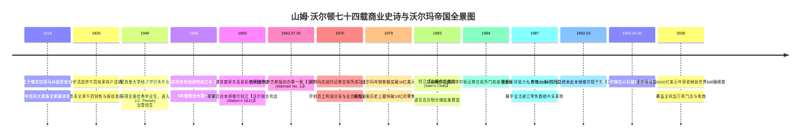
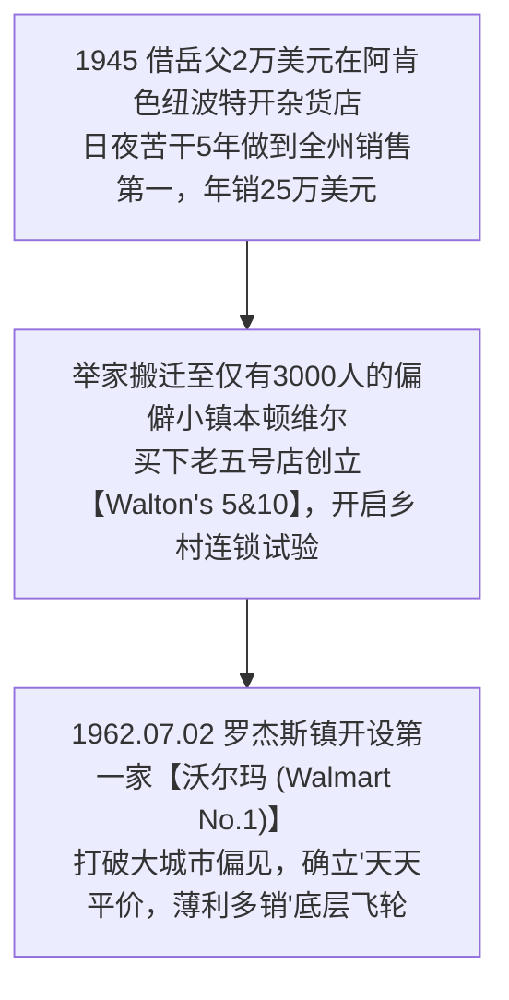
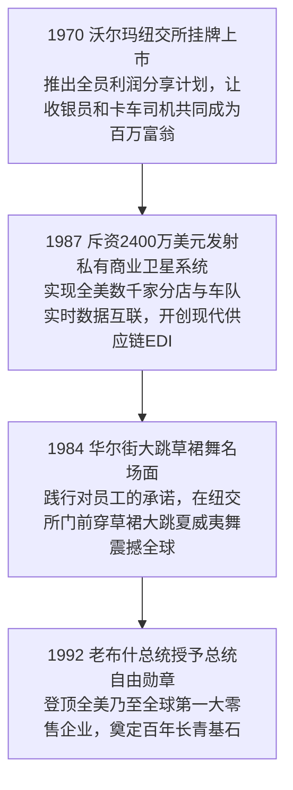

# 山姆·沃尔顿 (Sam Walton)：零售拓荒者、天天平价信仰与全球商业第一帝国全景史诗传记

> **“在这个世界上，只有一个真正的老板——那就是我们的顾客！顾客只需要做一件简单至极的事情，就能把从董事长到清洁工的每一个人全部解雇：那就是——把手里的钞票花在别的地方！我们所有的降价、所有的省吃俭用，都是为了让那些在土地里辛苦劳作的普通人，能用最体面的价格过上更有尊严的生活！”**  
> —— 山姆·沃尔顿 (Sam Walton)

---

```text
==================================================================================================
【传主档案速览】
• 全名：塞缪尔·摩尔·沃尔顿 (Samuel Moore Walton) | 1918.03.29 — 1992.04.05 (白羊座，享年 74 岁)
• 出生地：美国 俄克拉荷马州 金菲舍 (Kingfisher, OK) | 逝世地：阿肯色州 小石城
• 原生家庭：大萧条破产农场抵押贷款员之子，自幼目睹农民破产与土地强制拍卖
• 早期勤工俭学：7岁清晨挤牛奶挨家挨户配送、兼送报纸，大学期间年入超 4,000 美元（超过大学教授年薪）
• 创办实体：沃尔玛公司 (Walmart Inc., 1962 年 7 月 2 日创立于阿肯色州罗杰斯镇)
• 颠覆发明与零售革命：
  - **乡村包围城市战略**：彻底放弃被西尔斯、凯马特垄断的数十万人口大都市，专攻 5,000 人以下的偏远农业小镇；
  - **交叉带式仓储与轴辐式物流网 (Cross-Docking & Hub-and-Spoke)**：建立私有车队与中央配送中心，货物流转效率领先同行 3 倍；
  - **1987 年发射全球最大的私有商业通信卫星系统**：早于互联网时代实现全美几千家分店、卡车车队与宝洁供应链系统的毫秒级 EDI 数据互通；
  - **天天平价 (Every Day Low Price, EDLP)**：消灭虚假打折促销，将供应链压榨出的每一分钱全部让利给消费者。
• 历史地位：现代全球零售工业总设计师、连续多年蝉联《财富》世界 500 强全球第一霸主（年营收突破 6500 亿美元）
• 核心精神图腾：1979款福特红皮卡车、忠犬奥利 (Ol' Roy)、阿肯色本顿维尔五号店、1984年华尔街大跳草裙舞、总统自由勋章
==================================================================================================
```

---

## 🧭 全景生命历程与重大历史决断编年轴 (Chronological Epic)



---

## 🎬 第一章：血统、大萧条农场与清晨送奶的少年岁月 (1918 — 1936)

### 1. 俄克拉荷马农场与抵押贷款员父亲的破产目击
1918 年 3 月 29 日，第一次世界大战硝烟未散，山姆·摩尔·沃尔顿出生在俄克拉荷马州金菲舍（Kingfisher）的一个普通农场家庭。
- **大萧条土地强制拍卖的童年创伤**：
  - 父亲托马斯·沃尔顿是一名勤劳但运途多舛的农场抵押贷款经纪人。1920 年代末，席卷全美的严重干旱与大萧条彻底摧毁了美国中西部农业。
  - 幼年的山姆坐在父亲破旧的雪佛兰轿车后座上，跟随父亲穿梭在密苏里州与俄克拉荷马州的荒凉村落间。他亲眼目睹了无数相熟的农民叔叔在法警的强制拍卖锤下痛哭流涕、失去祖祖辈辈耕种的土地、房屋与牲口。
  - 这种目睹底层劳动人民在贫困中挣扎的童年记忆，让山姆·沃尔顿骨子里对“浪费每一分钱”产生了本能的厌恶与痛恨。他一生坚信：商业的最高道德，就是帮普通家庭把每一分微薄收入的购买力放大到极致。

### 2. 7 岁清晨挤牛奶与建立全镇送奶送报网络
- **农场后院的晨光启蒙**：
  - 为了补贴日益拮据的家用，7 岁的山姆每天清晨 4 点便从冰冷的被窝里爬起来，顶着刺骨寒风在自家后院给母牛挤奶。
  - 他将滚烫的鲜奶装进洗净的玻璃瓶，踩着泥泞的土路挨家挨户送到全镇几十户居民门前。送完牛奶后，他还要赶在学校上课前派送《哥伦比亚每日论坛报》。
- **早熟的商业组织天才**：
  - 他不仅自己送报，还主动说服报社将周边几个小镇的发行路线全包下来，雇佣了几个比他小的孩子分片包干，自己充当小小发行经理。在读高中时，他的月收入便高达数百美元，甚至超过了当地很多成年全职产业工人的薪水。

### 3. 母亲萨拉的自律教育与全能高中领袖
- 母亲萨拉是一名极富教养、意志坚定的女性。她给小山姆灌输了极度严格的自律精神和永不服输的竞争意识。
- 在密苏里州希克曼高中，山姆成为了全校最耀眼的明星：他不仅是校橄榄球队的主力四分卫，带领球队以全胜战绩夺得全州锦标赛冠军；同时还担任校篮球队队长，并在全校师生投票中以最高票当选学生会主席。高中毕业时，他被全校公认为“最全面发展的优秀青年”。

---

## 🔬 第二章：密苏里大学经济学、全美优秀学者与 J.C. Penney 零售学徒 (1936 — 1944)

### 1. 密苏里大学学生会主席与年入 4000 美元的打工奇才
- 1936 年秋，山姆考入**密苏里大学经济学系**。
- 进入大学后，正值大萧条最艰难的岁月，父亲的生意彻底陷入停滞。山姆向父母承诺：“我读大学不会向家里要一分钱。”
- **不可思议的大学商业奇迹**：
  - 他接管了整个大学校园的报纸派发总代理，开辟了上千名订户的庞大网络；
  - 他在学生食堂担任服务领班换取免费伙食，夏天在公立游泳池兼任救生员；
  - 大学四年期间，山姆每年的净收入超过了 **4,000 美元**（在当时甚至超过了密苏里大学正教授的年薪）。
- 1940 年 6 月，山姆以优异成绩毕业，获得经济学学士学位，并荣膺全美知名荣誉社团 QEBH 成员与全校最杰出毕业生代表。

### 2. 得梅因 J.C. Penney 的 75 美元月薪学徒岁月
- 大学毕业后，英俊干练的山姆收到了杜邦等大化工企业的面试邀请，但他毫不犹豫地选择了当时全美最负盛名的百货连锁——**J.C. Penney**。
- 1940 年 7 月，山姆来到爱荷华州得梅因市的一家 J.C. Penney 分店担任管理培训生，月薪仅 **75 美元**。
- **老店长的言传身教与零售真谛**：
  - 店长弗雷德·坎宁安是一位要求极其苛刻的老零售人。他教导山姆：“小伙子，做零售没有捷径。每天早晨开门前，地板必须擦得倒映出人影；顾客一进门，你的微笑必须在两秒钟内递到对方眼前；包裹西装的牛皮纸必须折出锋利的折角。”
  - 山姆在得梅因展现出了惊人的推销狂热。他总是比别人提前半小时到店，整理货架、擦拭玻璃，下班后还留在收银台研究当天的销售小票。在这里，他彻底爱上了零售业那种“每天都能看到努力转化为真金白银”的即时反馈快感。

### 3. 二战陆军服役与遇见一生真爱海伦·罗布森
- 1942 年，随着美国卷入二战，山姆进入美国陆军后勤特种部队服役，军衔升至少校，负责全美多个大型军用弹药厂与物资中转站的安保与仓储调度。
- 在服役期间，他在俄克拉荷马州克莱尔莫尔的一场保龄球聚会上，遇见了他一生最坚定的灵魂伴侣——**海伦·罗布森 (Helen Robson)**。
- 海伦出身名门，父亲是当地极其受人尊敬的著名律师兼银行家。海伦不仅聪明睿智、拥有商学学士学位，更有着与山姆同样坚韧低调的价值观。两人于 1943 年步入婚姻殿堂，海伦随后成为了沃尔玛帝国创立过程中最不可或缺的幕后军师。

---

## 🏬 第三章：纽波特加盟店的奇迹与遭遇房东夺店的惨痛教训 (1945 — 1950)



### 1. 借岳父两万美元在棉花小镇买下濒危杂货店
- 1945 年秋，二战正式结束，27 岁的山姆退伍回乡，渴望拥有一家完全属于自己的零售店铺。
- 他向富有的岳父借了 **20,000 美元**（年利率 5% 的借款），加上自己在军队攒下的 5,000 美元复员积蓄，在阿肯色州偏僻狭小的棉花种植小镇**纽波特 (Newport)** 买下了一家连年亏损、濒临倒闭的“本·富兰克林 (Ben Franklin)”杂货加盟店。
- 当时的纽波特镇人口不足 4,000 人，主街对面还有一家实力雄厚、由老牌零售商经营的竞争对手 Sterling 商店。

### 2. 跨州寻找低价尾货与两美分冰淇淋的营销艺术
- **打破加盟总部的垄断进货渠道**：
  - 传统的加盟店只能被动接受芝加哥总部统一定价的高价货源。山姆不信邪，他开着一辆破旧的二手小货车，连夜开往几百公里外的田纳西州孟菲斯批发市场；
  - 他直接找到工厂仓库，用现金大批量收购积压的优质女士连裤袜、毛巾和搪瓷锅尾货，拿到比总部低 50% 以上的进货成本；
- **制造街头轰动的平价奇迹**：
  - 他在店铺门口摆出了全镇第一台自动爆米花机和冰淇淋机，以每只仅 **2 美分** 的成本价向全镇孩子们供应现烤爆米花和甜筒；
  - 每天下午，整个小镇的居民都被香气吸引涌入店内。在短短 5 年内，这家原本年销售额不足 7 万美元的破烂小店，被山姆不可思议地做到了年营业额 **25 万美元**，一跃成为整个阿肯色州乃至全美南部盈利最强的加盟店！

### 3. 房东 P.K. 霍姆斯的恶意驱逐与“地点自主权”刻骨反思
- 看到这家小店爆发出惊人的财富效应，贪婪的房东 P.K. 霍姆斯（当地最有势力的富商）动了歪心思。
- 在 1945 年签署合同时，毫无商业经验的年轻山姆犯下了一个致命疏忽：合同中没有注明“5 年租约到期后拥有优先续租权”。
- **商业生涯最痛彻心扉的背叛**：
  - 1950 年租约到期前夕，霍姆斯冷冷通知山姆：拒绝续签任何租约，并要求山姆限期腾空搬出。霍姆斯的意图昭然若揭——他要霸占山姆打下的全部客流与店面，交给自己毫无经商经验的儿子直接接管！
  - 无论山姆如何提高租金哀求，霍姆斯都无动于衷。山姆被迫忍痛将经营了五年的心血店铺拱手转让给房东。
  - 妻子海伦抱着沮丧落泪的山姆安慰道：“别难过，山姆！既然我们能把纽波特的破店做成全州第一，只要换一个地方，我们就能做出十家更好的！”
  - 这次刻骨铭心的被驱逐经历，给山姆上了一堂价值连城的商业课：**从此以后，沃尔玛旗下的核心店面必须尽可能买断土地与物业自主产权，绝不把命脉交到贪婪房东的手里！**

---

## 🌪️ 第四章：移师本顿维尔老五号店与第一家沃尔玛诞生 (1950 — 1969)

### 1. 只有三千居民的偏僻小山村与 Walton's 5&10 创立
- 1950 年 5 月，山姆开着车踏遍了阿肯色州、密苏里州和堪萨斯州的每一个小镇，最终选定了阿肯色州西北部极其偏僻、全镇只有 3,000 名居民的小山村——**本顿维尔 (Bentonville)**。
- 妻子海伦之所以钟情这里，是因为本顿维尔小镇不仅民风淳朴，而且靠近阿肯色、密苏里、堪萨斯和俄克拉荷马四州交界处，有利于打猎和郊游。
- 山姆在镇中心广场西侧买下了一家名为哈里森杂货店的破旧老平房，全面买断了地产产权，正式挂上了 **“Walton's 5&10（沃尔顿五号店）”** 的木质招牌。
- **开架自选与现代购物车革命**：
  - 传统杂货店都是顾客站在柜台外、店员在柜台后拿货。山姆率先拆掉了所有封闭柜台，设立了开架式自选货架，并引进了全镇从未见过的双层金属手推购物车；
  - 这一创新让顾客在店内自由穿梭触摸商品，客单价瞬间翻倍。

### 2. 1962 年 7 月 2 日：罗杰斯镇沃尔玛一号店盛大开业
- 1960 年代初，大城市出现了一种名为“折扣商场”的全新业态。明尼苏达的塔吉特（Target）、底特律的凯马特（Kmart）相继成立，声势浩大。
- 山姆多次前往芝加哥向本·富兰克林加盟总部建议：“我们应该在小镇开设更大规模的独立折扣大卖场，把毛利率从 30% 降到 15% 以下。”总部高管傲慢地拒绝了他，并嘲讽他“疯了”。
- **押上全家身家的孤注一掷**：
  - 44 岁的山姆不再等待。他抵押了名下全部房产、小店与向银行借来的全部信用额度；
  - **1962 年 7 月 2 日**，在阿肯色州罗杰斯镇（Rogers）南郊的一片空地上，第一家正式命名为 **“Wal-Mart Discount City（沃尔玛折扣城）”** 的巨型卖场正式开门迎客！
  - 开业当天烈日炎炎，温度高达 40 摄氏度。山姆在门前搭起凉棚，放上几打西瓜。由于商品价格比全州任何地方便宜 20% 以上，几千名农夫开着拖拉机和皮卡车将道路彻底堵死，货架上的铝锅、袜子、洗衣粉在几个小时内被疯抢一空！

### 3. 乡村包围城市：避开巨头血海，深耕偏远农业小镇
- 在 1960 年代，西尔斯（Sears）和凯马特（Kmart）是不可一世的全国霸主，他们坚信“只有在人口超过 10 万人的大都市开店才能盈利”，完全看不上中西部偏远的乡村小镇。
- **山姆·沃尔顿天才的逆向战术**：
  - 山姆制定了被哈佛商学院奉为经典的**“乡村包围城市 (Rural Encirclement)”**战略；
  - 专攻人口在 5,000 到 25,000 人之间、被所有全国巨头彻底忽视的农业偏远小镇；
  - 沃尔玛在这些小镇建立几千平米的超级大卖场，提供比大城市还要便宜的生活必需品，瞬间成为方圆几十公里唯一的商业中心，构筑起了极其宽广的地理垄断护城河。

---

## 🛡️ 第五章：资本市场破局、全员合伙制与私有卫星通信革命 (1970 — 1989)



### 1. 1970 年上市与划时代的“全员合伙制 (Associate)”
- 1970 年 10 月，为了筹集自建中央配送中心的巨额资金，沃尔玛在纽约证券交易所成功挂牌上市。
- **消灭劳资对立的合伙人计划**：
  - 山姆极力反对称呼员工为“雇员 (Employees)”，在全公司统一定名为**“合伙人 (Associates)”**；
  - 他推出了全美零售业首创的**“员工利润分享与股权认购计划”**：任何一名全职在沃尔玛工作满一年的普通收银员、理货员或卡车司机，都可以用工资的一部分折价购买公司股票，公司给予高额配资；
  - 这一计划让成千上万名没有读过大学的普通蓝领工人在沃尔玛股价暴涨数百倍后，成为了身家数百万美元的富翁，极大地激发出了一线团队对公司的忠诚度与主人翁意识。

### 2. 轴辐式交叉带配送中心 (Cross-Docking & Hub-and-Spoke)
- 传统零售商的物流依赖外部第三方车队，运输时效长达数周且费用昂贵。
- **中央轴辐式物流飞轮**：
  - 山姆在每 100 到 150 家门店的地理中心，建立占地超百万平方英尺的现代化中央配送中心；
  - 沃尔玛自建了全美规模最大的重型卡车车队；
  - 率先推行**“交叉带式装卸 (Cross-Docking)”**：供应商送货的卡车开进配送中心一侧大门，传送带自动分拣扫描，另一侧大门的沃尔玛自营卡车立刻装车出发，货物在仓库停留时间不足几个小时，彻底消灭了巨额的仓储中转沉淀成本。

### 3. 1987 年耗资 2400 万美元发射私有通信卫星系统
- 1980 年代初，当全美绝大多数零售企业还在依靠电话、传真和邮寄纸质发票核对账目时，山姆做出了一个在当时被华尔街视为“异想天开”的疯狂举动：
- **发射全美最大的私有商业卫星系统**：
  - 1987 年，沃尔玛耗资 **2,400 万美元**，与 Hughes Aircraft 合作发射了属于沃尔玛自己的专用地球同步通信卫星；
  - 全美几千家分店收银台扫描的每一件商品的条形码数据，通过屋顶卫星天线在 **2 秒钟内** 实时回传至本顿维尔数据中心；
  - 沃尔玛联手宝洁（P&G）开发了开创性的 **Retail Link** 系统：宝洁工厂的工程师坐在辛辛那提办公室里，能实时看到全美每一家沃尔玛门店今天卖出了多少瓶海飞丝洗发水，系统自动触发宝洁生产线排产与发货，彻底消灭了现代供应链的牛鞭效应！

### 4. 1984 年华尔街草裙舞：说到做到的领袖魅力
- 1984 年初，为了激励全公司挑战年度税前利润率突破 8% 的艰巨目标，山姆在全员年会上公开打赌：**“如果你们今年能做到 8% 的利润率，我山姆·沃尔顿就亲自穿上草裙，在纽约华尔街证券交易所大门前当众跳夏威夷草裙舞！”**
- 当年底业绩超额达成，66 岁满头白发的亿万富豪山姆·沃尔顿毫不含糊，身穿草裙、头戴花环，在曼哈顿华尔街纽交所大门前，当着全美主流媒体的摄像机和几千名围观群众，手舞足蹈地大跳正宗夏威夷草裙舞！这一真诚可爱的举动彻底征服了全美人民的心。

---

## 👑 第六章：创立山姆会员店、全球扩张与登顶世界首富 (1983 — 1992)

### 1. 1983 年创立山姆会员店 (Sam's Club)
- 1983 年，受到加州索尔·普莱斯 Price Club 会员制仓储模式的启发，山姆迅速在俄克拉荷马州中西部市创办了第一家**山姆会员商店 (Sam's Club)**。
- 山姆会员店专为小企业主和大家庭提供超大包装、极致低毛利（毛利率仅 9%~10%）的精选大单品，迅速成长为年销售额超数百亿美元的超级业务支柱。

### 2. 击溃西尔斯与凯马特登顶全美第一
- 1990 年，沃尔玛正式超越有着百年历史的巨头西尔斯（Sears），成为**全美销售额第一大零售集团**。
- 随后，老牌巨头凯马特（Kmart）在沃尔玛高效现代化的供应链与天天平价碾压下节节败退，最终走向破产重组。

### 3. 1992 年老布什总统授予总统自由勋章与安详谢幕
- 1992 年 3 月 17 日，美国总统乔治·H·W·布什携第一夫人芭芭拉·布什，专程乘坐空军一号降落在阿肯色州本顿维尔沃尔玛总部。
- 在全场数千名员工的热烈欢呼声中，布什总统将美国平民最高荣誉——**总统自由勋章 (Presidential Medal of Freedom)** 亲自佩戴在重病中的山姆·沃尔顿胸前，并盛赞他：“山姆·沃尔顿用最纯粹的美国拓荒精神，彻底改变了全世界的商业文明。”
- **1992 年 4 月 5 日**，74 岁的山姆·沃尔顿在阿肯色州小石城大学医学中心安详辞世。他在临终前对身边人说的最后一句话依然是：“今天各店的营业额怎么样？”

---

## 🧠 第七章：山姆·沃尔顿八大底层认知工具箱 (Mental Model Toolkit)

```text
==================================================================================================
【山姆·沃尔顿八大底层商业模型与思维武器】

1. 乡村包围城市边缘突破 (Rural Encirclement Asymmetry)
   • 核心心法：避开巨头重兵把守的血海大都市。
               在被巨头遗忘的广袤偏远小镇建立密集根据地，用垄断级的低价与供应链壁垒封死通道，再向大城市合围反扑。

2. 轴辐式交叉物流飞轮 (Hub-and-Spoke Cross-Docking Engine)
   • 核心心法：库存是零售业最大的资金吞噬陷阱。
               将配送中心建在几十家门店的中心枢纽（车程一日之内），货物到达仓库后不入库上架、直接由传送带分拣至待发卡车，实现零滞留极速流转。

3. 天天平价与反折扣心理学 (Every Day Low Price / EDLP Discipline)
   • 核心心法：虚假的价格忽高忽低打折会摧毁消费者的信任并制造供应链牛鞭效应。
               以极低且长期稳定的价格消除消费者的比价顾虑，实现需求端与生产端的极致平稳预测。

4. 走进第一线空中侦察 (Cessna Aerial Reconnaissance & Frontline Walk)
   • 核心心法：不要坐在办公室吹空调听汇报。
               山姆亲自驾驶双引擎塞斯纳飞机在低空巡视竞争对手停车场的车流量；
               亲自走进竞争对手的门店蹲在货架下研究竞品价签与摆放逻辑。

5. 伙伴制全员利润分享 (Associate Profit-Sharing Alignment)
   • 核心心法：消灭“雇主与雇员”的对立阶级关系。
               把每一个一线员工称作“合伙人 (Associate)”，推行全员持股与利润分享计划，
               让收银员和理货员像打理自家小卖部一样用心为公司防损与服务。

6. 极度克制与成本领先原则 (Radical Operational Frugality)
   • 核心心法：我们在总部每浪费一分钱，最终都会加在消费者的账单上。
               高管出差住廉价汽车旅馆、两人挤一间标间，CEO 开破皮卡车办公，以领袖的带头克制消灭一切组织奢靡。

7. 供应商数据穿透共生模型 (Retail-Link Co-Evolution Paradigm)
   • 核心心法：零售商与品牌商不是零和博弈的敌人。
               向宝洁等核心供应商无保留开放底层收银台实时数据 (Retail Link)，协同预测需求与优化包装，在全链条上消除库存浪费。

8. 日落法则与十步服务定律 (Sundown Rule & 10-Foot Rule)
   • 核心心法：天下武功唯快不破。
               当天收到的客户疑问与业务请求必须在日落前给予明确答复 (Sundown Rule)；
               只要走入顾客 10 英尺范围内，员工必须主动直视对方双眼并微笑着问好。
==================================================================================================
```

---

## 🛻 第八章：破旧红皮卡、忠犬奥利与低调生活轶事 (Anecdotes & Trivia)

### 1. 开了一辈子的 1979 年款福特 F-150 红皮卡
即使在 1980 年代被《福布斯》杂志评选为全美首富之后，山姆·沃尔顿依然每天开着他那辆车漆斑驳、座椅被猎犬抓破的 **1979 年款红色福特 F-150 皮卡车** 上班。
- 每次高管去机场接机，山姆都会嫌弃豪华轿车太费油；
- 当有记者在阿肯色小路上拦下他的皮卡车问：“沃尔顿先生，您已经是全美最有钱的人了，为什么还开着这辆破皮卡？”
- 山姆把手搭在方向盘上咧嘴大笑：“小伙子，难道你让我开着一辆劳斯莱斯去装我打猎抓回来的小狗和饲料吗？这辆皮卡车结实耐用，能开干嘛要换？！”

### 2. 忠犬奥利 (Ol' Roy) 与全美销量第一狗粮
山姆一生酷爱在阿肯色荒野中打鹌鹑，他的爱犬是一只名叫“奥利 (Ol' Roy)”的忠诚猎犬。
- 无论去哪个门店巡店，山姆后座上总是载着奥利；
- 后来沃尔玛推出了以奥利头像命名的自营狗粮品牌 **“Ol' Roy”**，凭借极具杀伤力的实惠价格与高品质，最终成为了全美销量最高的宠物食品品牌！

### 3. 自己开飞机低空侦察竞争对手
山姆考取了私人飞行执照，拥有两架小型的塞斯纳双引擎飞机。
- 他巡店时不喜欢提前通知店长，而是自己开着飞机在低空盘旋，从空中数竞争对手超市停车场停放了多少辆车；
- 停稳飞机后，他会换上一件旧夹克，悄悄走进对手店内，蹲在货架旁拿出随身携带的黄色小本子，飞快记录竞品排面陈列与价格变动。

---

## 💬 第九章：山姆·沃尔顿传世经典名言金句中英对照 (Iconic Quotes)

1. **论唯一的真正老板**  
   > *“在这个世界上，只有一个真正的老板——那就是我们的顾客！顾客只需要做一件简单至极的事情，就能把从董事长到清洁工的每一个人全部解雇：那就是——把手里的钞票花在别的地方！”*  
   > _“There is only one boss. The customer. And he can fire everybody in the company from the chairman on down, simply by spending his money somewhere else.”_

2. **论天天平价与为普通人服务**  
   > *“我们所做的一切，不是为了让富人买到更多奢侈品，而是为了让那些终日在土地与工厂里辛苦劳作的普通工薪阶层，能用最实惠的价格买到最优质的生活必需品，让他们过上更有尊严的生活！”*  
   > _“We're all working together; that's the secret. If we work together, we'll lower the cost of living for everyone.”_

3. **论超越顾客期望**  
   > *“给顾客他们想要的，并且再多给一点点！如果你超越了顾客的期望，他们就会一次又一次地回到你的身边！”*  
   > _“Exceed your customers' expectations. If you do, they'll come back over and over.”_

4. **论庆祝成功与寻找快乐**  
   > *“不要把自己看得太严肃。在工作中寻找快乐，尽情庆祝团队的每一个微小胜利！如果你不能在工作中放声大笑，你就永远无法激发出团队最伟大的潜能！”*  
   > _“Celebrate your successes. Find some humor in your failures. Don't take yourself so seriously.”_

5. **论节俭与对浪费的零容忍**  
   > *“我们在总部每浪费一美元，都是从顾客的口袋里偷走的。我们保持节俭，不是因为我们小气，而是因为我们对顾客托付给我们的每一分钱抱有绝对的敬畏！”*  
   > _“Every time Wal-Mart spends a dollar foolishly, it comes right out of our customers' pockets.”_

---

## 📅 第十章：山姆·沃尔顿生平重大历史年表 (Comprehensive Chronology)

- **1918年3月29日**：出生于俄克拉荷马州金菲舍。
- **1925年**：7 岁开始在密苏里州送牛奶与报纸。
- **1940年6月**：密苏里大学经济系毕业，进入 J.C. Penney 当学徒。
- **1943年2月**：迎娶海伦·罗布森。
- **1945年9月**：在阿肯色州纽波特创办本·富兰克林加盟店。
- **1950年5月**：遭遇房东恶意夺店，举家迁往本顿维尔创立“沃尔顿五号店”。
- **1962年7月2日**：在阿肯色罗杰斯镇开设第一家沃尔玛折扣店 (Walmart No.1)。
- **1970年10月**：沃尔玛在纽约证券交易所成功上市。
- **1979年**：沃尔玛年销售额突破 10 亿美元，创全美商业史纪录。
- **1983年**：创立山姆会员商店 (Sam's Club)。
- **1984年**：在华尔街纽交所门前大跳夏威夷草裙舞兑现赌约。
- **1987年**：发射全球最大的私有商业卫星通信系统，实现全美供应链实时互联。
- **1990年**：沃尔玛超越西尔斯登顶全美第一大零售企业。
- **1992年3月17日**：老布什总统亲赴本顿维尔授予其“总统自由勋章”。
- **1992年4月5日**：在阿肯色州小石城逝世，享年 74 岁。
- **至今**：沃尔玛连续多年蝉联《财富》世界 500 强全球第一霸主宝座。
