# 国家电网有限公司 (State Grid Corporation of China) —— 全球最大公用事业与特高压电网帝国全景介绍

> **《财富》世界500强排名：第 3 位**  
> **年度营业收入：$555,371 百万美元（约 5553 亿美元）**  
> **官方网站：[www.sgcc.com.cn](http://www.sgcc.com.cn)**

---

## 🏢 企业基本信息 (Corporate Snapshot)

| 维度 | 详细信息 |
| :--- | :--- |
| **公司全称** | 国家电网有限公司 (State Grid Corporation of China) |
| **成立时间** | 2002 年 12 月 29 日 (经国务院批准，依据电力体制改革“厂网分开”方案设立) |
| **全球总部** | 🇨🇳 中国 北京市 西城区西长安街86号 |
| **企业性质** | 国务院国资委直属特大型国有重点骨干企业、中央直接管理的国有独资公司 |
| **现任掌门人** | 董事长、党组书记：张智刚；总经理、党组副书记：庞骁刚 |
| **供电区域** | 覆盖中国 26 个省（自治区、直辖市），供电范围占国土面积的 88% 以上 |
| **服务人口** | 超过 11 亿人（全球供电人口最多、电网规模最大的公用事业巨头） |
| **全球员工总数** | 约 87+ 万人 |
| **核心业务赛道** | 特高压交直流电网输配电、新型电力系统与储能、国际跨国电网资产运营、智能电网芯片与工业装备制造、综合能源服务与碳资产管理 |

---

## 🌐 核心业务矩阵与商业版图 (Business Ecosystem)

```mermaid
graph TD
    SGCC["国家电网有限公司 (State Grid Corporation of China)"]
    
    SGCC --> GRID["1. 国内核心输配电网络 (Power Transmission & Distribution)"]
    GRID --> GRID1["26个省/市/自治区电力公司 (覆盖全国88%国土)"]
    GRID --> GRID2["特高压交直流大动脉 (UHV AC 1000kV / DC ±800-±1100kV)"]
    GRID --> GRID3["六大区域电网调度与协同运行体系"]
    
    SGCC --> GREEN["2. 新能源消纳与新型储能 (Clean Energy & Storage)"]
    GREEN --> GREEN1["国网新源控股 (全球最大抽水蓄能电站运营商)"]
    GREEN --> GREEN2["新型大容量电化学储能与飞轮储能基地"]
    GREEN --> GREEN3["新能源云平台 (接入超5亿千瓦分布式与集中式风光绿电)"]
    
    SGCC --> TECH["3. 电力高端装备与工业科技 (High-End Grid Equipment & Tech)"]
    TECH --> TECH1["国网南瑞科技 (NARI, 智能电网调度与保护自动化龙头)"]
    TECH --> TECH2["中国电力科学研究院 (CEPRI, 电力科技国家战略实验室)"]
    TECH --> TECH3["国网联研院 (先进电力芯片、碳化硅功率半导体、超导技术)"]
    TECH --> TECH4["平高电气 / 许继电气 (高压断路器与特高压成套装备)"]
    
    SGCC --> INTL["4. 国际电网运营与海外资产 (International Grid Operations)"]
    INTL --> INTL1["巴西特高压输电资产 (美丽山一期/二期特高压直流项目)"]
    INTL --> INTL2["菲律宾国家电网公司 (NGCP 40%股权运营)"]
    INTL --> INTL3["葡萄牙国家能源网 (REN 25%股权)"]
    INTL --> INTL4["希腊国家电网 (IPTO) & 智利 CGE / Chilquinta"]
    INTL --> INTL5["阿曼国家电网 (EPTC) & 意大利 CDP Reti 35%股权"]
    
    SGCC --> DIGI["5. 数字能源新基建与综合服务 (Digital Energy & Services)"]
    DIGI --> DIGI1["e充电平台 (全球最大智慧车联网平台，超100万充换电桩)"]
    DIGI --> DIGI2["国网数字科技控股 (能源互联网金融、绿电绿证交易)"]
    DIGI --> DIGI3["国网英大集团 (金融保险、信托、证券与碳资产管理)"]

    classDef main fill:#006633,stroke:#003311,stroke-width:2px,color:#fff;
    classDef branch fill:#003311,stroke:#006633,stroke-width:1px,color:#fff;
    classDef sub fill:#f4f9f4,stroke:#006633,stroke-width:1px,color:#000;
    class SGCC main;
    class GRID,GREEN,TECH,INTL,DIGI branch;
    class GRID1,GRID2,GRID3,GREEN1,GREEN2,GREEN3,TECH1,TECH2,TECH3,TECH4,INTL1,INTL2,INTL3,INTL4,INTL5,DIGI1,DIGI2,DIGI3 sub;
```

---

## ⚡ 核心竞争壁垒与超级工程护城河 (Core Competitive Moat)

### 1. 全球独步的特高压（UHV）输电技术体系与国际标准话语权
- **远距离、大容量、低损耗输电巅峰**：成功攻克 1000 千伏交流和 ±800 千伏、±1100 千伏直流特高压核心技术，实现了数千公里距离上数千万千瓦级电力的安全高效输送，线损率较传统 500 千伏电网降低 50% 以上。
- **国际标准制定权**：在国际电工委员会（IEC）和电气与电子工程师协会（IEEE）主导制定特高压领域数十项国际标准，使中国成为全球首个掌握并全面商业化部署特高压成套输电技术的国家，彻底实现了从“跟跑”到“全球绝对领跑”的历史性跨越。

### 2. “三道防线”与世界最安全超大规模互联电网
- 面对全球最复杂的大电网系统，国家电网构建了基于**继电保护（第一道防线）**、**安全稳定控制装置（第二道防线）** 和 **失步解列与低频低压减载（第三道防线）** 的动态防御闭环。
- 在北美、欧洲、南美屡次发生大面积灾难性大停电的背景下，国家电网创造了保持超大规模互联电网安全稳定运行超过 20 年的全球最高安全纪录。

### 3. 全球最大规模新能源消纳平台与绿色能源底座
- 支撑中国“西电东送”、“北电南供”超级能源通道，建成“30多交30多直”特高压输电工程，跨区跨省输电能力超过 3 亿千瓦。
- 累计接入风电、光伏新能源装机超过 5 亿千瓦，运营全球规模最大的抽水蓄能电站群（如河北丰宁抽水蓄能电站），为全球能源绿色低碳转型提供坚强物理支撑。

---

## 📈 历史里程碑年表 (Historical Milestones)

- **2002年**：国务院下发《电力体制改革方案》（国发〔2002〕5号文），国家电力公司正式分拆为国家电网公司、中国南方电网公司及五大发电集团，12月29日国家电网公司正式成立。
- **2006年**：国家发改委正式核准建设首个特高压交流试验示范工程——晋东南—南阳—荆门 1000 千伏特高压交流示范工程。
- **2009年**：晋东南—南阳—荆门特高压交流示范工程正式投入商业化运行，标志着中国特高压技术打破欧美输电理论禁区。
- **2010年**：首个特高压直流工程——向家坝—上海 ±800 千伏特高压直流输电示范工程投运，开创“水落成电、点对点直达”新模式。
- **2014年**：国家电网成功中标巴西美丽山水电站 ±800 千伏特高压直流输电一期项目，实现中国特高压技术与高端装备全产业链整体出海。
- **2017年**：公司由全民所有制企业整体改制为国有独资公司，正式更名为“国家电网有限公司”。
- **2019年**：准东—皖南 ±1100 千伏特高压直流输电工程投运，成为世界上电压等级最高、输送容量最大、输电距离最长（3324公里）的特高压超级工程。
- **2021年**：白鹤滩—江苏 ±800 千伏特高压直流输电工程启动建设；公司正式提出构建“以新能源为主体的新型电力系统”行动方案。
- **2024-2026年**：年营业收入突破 5550 亿美元，连续蝉联《财富》世界500强前三名及全球公用事业榜首；在特高压、新型储能、车网互动（V2G）和电力AI大模型领域持续领跑全球。

---

## 🎯 企业文化与核心价值观 (Corporate Values & Philosophy)

- **企业宗旨**：人民电业为人民
- **企业使命**：赋能美好生活，照亮强国之路
- **核心价值观**：人民至上、创新发展、卓越服务、安全可靠
- **企业精神**：忠诚担当、求真务实、勇攀高峰、追求卓越
- **战略愿景**：建设具有中国特色国际领先的能源互联网企业
