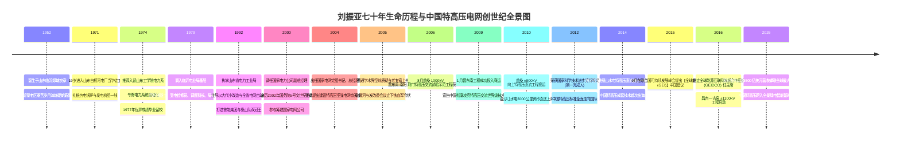
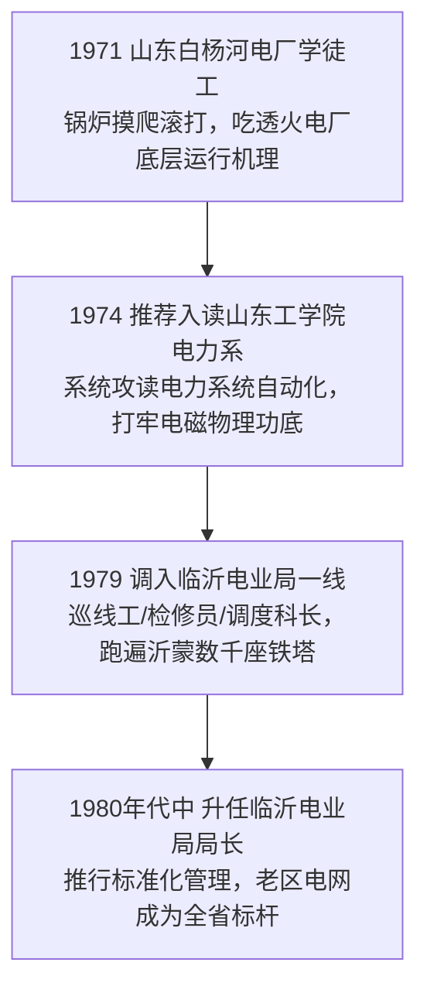
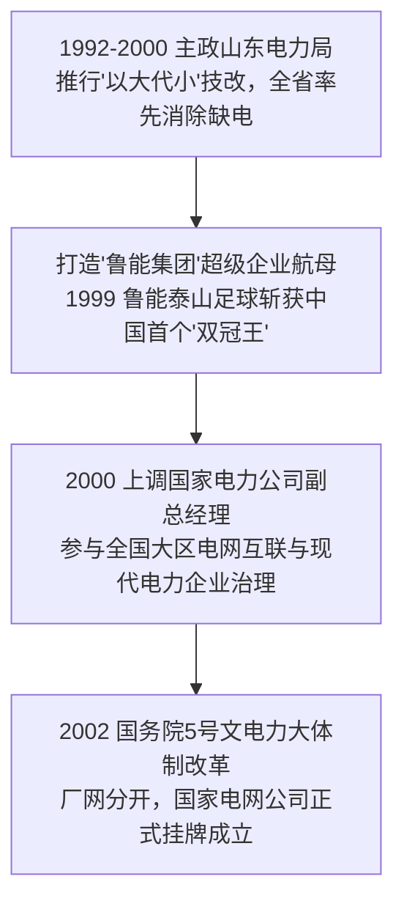
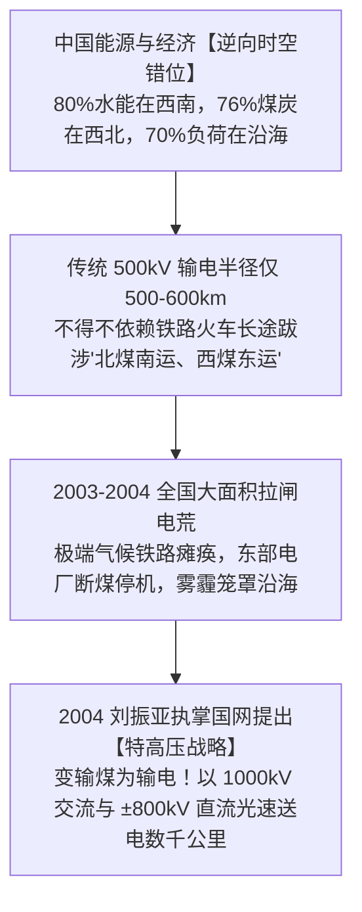
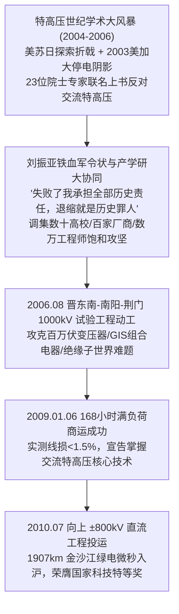
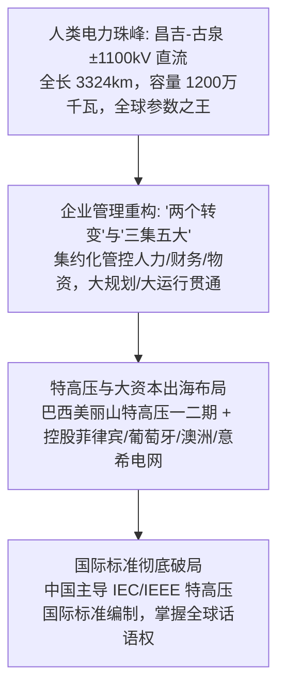
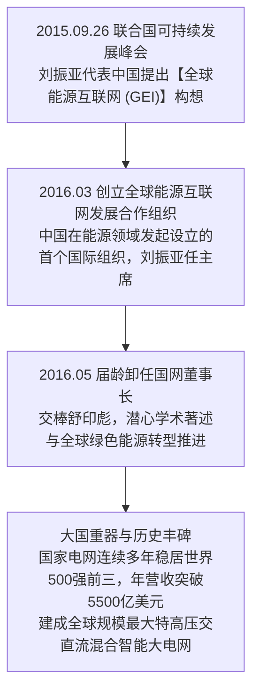

# 刘振亚与国家电网 (Liu Zhenya & State Grid)：大国重器、特高压征途与全球能源互联的创世纪史诗

> **“特高压不仅是一项前所未有的工程技术，更是关乎国家能源安全与民族复兴的战略大动脉。面对人类电力工业前所未见的‘无人区’，我们要么在质疑与冷眼中杀出一条血路，要么就永远在能源咽喉上受制于人！如果特高压搞错了，我刘振亚甘当历史罪人，撤职坐牢我都认；但如果不搞，导致中国电力卡脖子，我们就是贻误国家战略的千古罪人！”**  
> —— 刘振亚（国家电网原党组书记、董事长，全球能源互联网发展合作组织创会主席）

---

```text
==================================================================================================
【传主与核心实体档案速览】
• 核心传主：刘振亚 (Liu Zhenya, 1952年8月生，山东郯城人)
• 旗舰实体：国家电网有限公司 (State Grid Corporation of China, SGCC)
• 历史沿革：中央水利电力部 -> 电力工业部 -> 国家电力公司 -> 2002年“5号文”电改分立挂牌
• 学历背景：山东工学院（现山东大学）电力系统自动化专业工学学士、山东大学电力系统及其自动化工程硕士
• 核心历史功勋：领导攻坚并建成全球首个 1000kV 特高压交流与 ±800kV/±1100kV 特高压直流工程体系
• 荣誉与地位：国家科学技术进步奖特等奖第一完成人、中国特高压电网奠基人、全球能源互联网 (GEI) 倡议人
• 核心精神图腾：努力超越、追求卓越、西电东送、大国重器、三集五大、全球能源互联网
==================================================================================================
```

---

## 🧭 全景生命历程与大国电网特高压征途编年轴 (Chronological Epic)



---

## 🌾 第一章：血统、沂蒙农家与鲁南大地的硬核淬炼 (1952 — 1971)

### 1. 沂蒙老区的农家草根与铁血基因
1952 年 8 月，刘振亚出生在山东省临沂市郯城县一个极为普通的农民家庭。
- **沂蒙大地的地理与人文胎记**：
  - 郯城地处鲁南苏北交界，自古便是兵家必争的咽喉要地，民风淳朴勇武、重信尚义。沂蒙革命老区的厚重历史，给这片土地上的后代注入了天然的吃苦耐劳与服从大局的精神底色。
  - 新中国建国初期，鲁南农村物资极度匮乏。少年时期的刘振亚经历了三年自然灾害的饥馑岁月，一家人靠红薯干、高粱煎饼与野菜勉强度日。
  - 身材魁梧高大、性格刚烈硬朗的刘振亚，从童年时代起便展现出超越同龄人的倔强与责任感。农忙时节，他顶着烈日推独轮车运粮、割麦翻土，肩膀磨出厚厚老茧却从不叫苦；农闲时，他在昏暗如豆的煤油灯下苦读，对数学、物理中严密的逻辑因果关系展现出非同寻常的直觉与痴迷。

### 2. 煤油灯下的机械启蒙与电工梦想
在那个电网尚未延伸到中国广袤乡村的年代，煤油灯的微弱火苗是大部分农家夜晚唯一的照明工具。
- **对“电”的第一性顿悟**：
  - 少年刘振亚第一次看到县城里拉通的明亮电灯和转动的抽水泵电动机时，内心受到了无与伦比的震动。在奔流不息的无形电流之中，他隐约感受到了一种能够彻底改变亿万农人贫瘠命运的现代工业伟力。
  - 他用捡来的废旧铜丝、铁钉、电池自制电磁铁与简易电路开关；用木头和齿轮拼装水车模型。邻里乡亲家中的收音机、钟表坏了，少年刘振亚总能沉下心来，用一把螺丝刀和一把铁钳摸索修理完毕。
- **艰苦磨砺出的坚毅品格**：
  - 父母的严厉管教与山东乡土质朴的道德戒律，教会了他“做人要行得正、立得稳，做事要敢担当、不怕难”。这种融入骨血的硬汉性格，成为他日后在面对数十位权威专家质疑、在万亿级大工程前面不改色、力挽狂澜的定海神针。

---

## ⚡ 第二章：白杨河学徒、工学院深造与基层一线巡线淬火 (1971 — 1992)



### 1. 1971 白杨河电厂：从炉膛与油污中起步的学徒工
1971 年 9 月，19 岁的刘振亚走出郯城农家，作为工农兵学员参加工作，进入山东白杨河发电厂担任学徒工。
- **火力发电厂的残酷熔炉**：
  - 白杨河电厂是当时鲁南的重要电源点。在这里，青年刘振亚穿上厚重帆布工服，手握扳手，钻进数百摄氏度高温余热未退的锅炉内部清灰检修，在轰鸣刺耳的汽轮发电机组旁记录仪表参数。
  - 他不仅勤于出力，更随身携带笔记本，向老技工请教水力循环、高压蒸汽管道应力分布、母线绝缘结构。在短短三年学徒期内，他将火力发电厂从煤炭进场燃烧、蒸汽做功到高压升压变电的全套物理拓扑图烂熟于心。

### 2. 1974 山东工学院：从一线经验到系统电磁理论跃升
1974 年，凭借过硬的政治素养和极其突出的技术实践表现，刘振亚被推荐选拔进入**山东工学院（现山东大学）**电力工程系，专修电力系统自动化专业。
- **大学三年的狂热钻研**：
  - 告别轰鸣的锅炉车间，刘振亚沉浸在大学图书馆与高电压实验室中。他系统攻读了电路理论、电磁场数值计算、电力系统暂态稳定性分析、继电保护原理与微机远动技术。
  - 他的数学与物理成绩在系里名列前茅，经常为了推导一组复杂的电力系统潮流方程计算至深夜。
  - **1977 年毕业留校**：毕业时因专业技能和组织协调能力极为出众，学校决定让他留校从事教学与科研管理工作。在高校讲台与实验室的两年里，刘振亚将一线工程直觉与现代高等电力理论彻底融会贯通。

### 3. 1979 调入临沂电业局：蒙山沂水巡线十三载
1979 年，胸怀改变家乡电网落后面貌志愿的刘振亚，主动申请从济南高校调回沂蒙老区，进入临沂电业局工作。
- **爬遍数千座高压铁塔的一线硬汉**：
  - 在临沂电业局，他历任变电运行工、高压线路检修员、生产技术科科长、副局长、局长兼党委书记。
  - 临沂地势复杂，蒙山沂水之间高山峻岭林立。为了查清每一条 110kV、220kV 输电线路的走廊覆冰与雷击跳闸隐患，刘振亚身背工具包，顶着严寒酷暑，带领巡线班走遍了临沂三区九县的每一处崇山峻岭，徒手攀爬过数千座高耸入云的高压铁塔。
  - **暴雨夜的调度台传奇**：在担任调度科长与局长期间，每逢雷暴、暴雪等极端恶劣天气，刘振亚必定整夜钉在调度中心大厅。他脑中装着全临沂电网每一座变电站的主变容量、每一回出线的继电保护定值，能够仅凭电网跳闸信号秒级研判出故障点并下达倒闸指令。
- **老区电网领跑全省**：
  - 80 年代中后期，主政临沂电业局的刘振亚铁腕推行“标准化作业流程”与“安全生产零容忍”，使原本落后的临沂电网在全省率先实现县县通高压、供电可靠率名列全省前茅。

---

## 🏛️ 第三章：主政齐鲁、鲁能帝国崛起与“5号文件”电改风暴 (1992 — 2002)



### 1. 执掌山东电力：“以大代小”与消灭全省电荒
1992 年，刘振亚升任山东省电力工业局副局长兼总工程管理职务，随后出任山东省电力工业局局长兼山东电力集团公司董事长、党组书记。
- **大刀阔斧推行“以大代小”**：
  - 90 年代初，山东工业经济迅猛爆发，但电力供应严重紧缺，小火电机组林立、能耗奇高、污染严重。
  - 刘振亚以惊人的战略魄力，在全国率先启动“以大代小、关小上大”电网技术改造战役，果断关停上百座能耗高、效率低下的小火电厂，集中资金与资源建设邹县、德州、石横等一批单机 30 万千瓦、60 万千瓦的大型高效超临界火电基地。
  - 山东电网一跃成为全国第一个彻底消除“缺电拉闸”、全省拥有大机组高比例、电网自动化调度达到国际领先水平的示范省份。

### 2. 创立鲁能集团与 1999 泰山足球“双冠王”传奇
在主政山东电力期间，刘振亚展现出卓越的现代资本运作与跨界产业整合能力。
- **孵化鲁能商业巨舰**：
  - 他主导成立了山东鲁能集团，依托电力基础设施延伸至金融、煤炭、地产、矿业、高新技术，使鲁能迅速成长为山东省乃至全国最具实力的多元化特大型企业集团之一。
- **鲁能泰山足球俱乐部的半军事化“双冠王”奇迹**：
  - 1998 年初，山东电力集团正式接手济南泰山足球队，更名为“山东鲁能泰山足球俱乐部”。
  - 刘振亚将电网行业极其严明的组织纪律、铁军执行力与现代职业俱乐部治理架构全面注入足球队：实行封闭式管理、严明宵禁纪律、重金聘请前南斯拉夫名帅桑特拉奇，斥巨资在潍坊建立亚洲一流的鲁能足球足校。
  - **1999 年奇迹之夜**：山东鲁能泰山队在极其激烈的竞争中，一举斩获全国足球顶级甲 A 联赛冠军和足协杯冠军，成为**中国职业足球历史上首个“双冠王”**！这一奇迹不仅轰动齐鲁大地，更让刘振亚以“铁血治军、敢打硬仗、善打胜仗”的统帅形象名震全国。

### 3. 调任国家电力公司与 2002 年“5号文件”世纪大电改
- **2000 年 11 月**：因在山东电力的辉煌政绩与过硬作风，刘振亚奉调入京，出任**国家电力公司副总经理、党组副书记**。
- **2002 年国务院“5号文”历史性大地震**：
  - 2002 年 2 月，国务院正式印发《电力体制改革方案》（国发〔2002〕5号文），拉开了新中国电力工业历史上规模最大的一场体制变革。
  - 核心方针确定为**“厂网分开、主辅分离、输配分开、竞价上网”**：
    - 原国家电力公司的庞大发电资产被彻底剥离，重组为五大全国性发电集团（华能、大唐、华电、国电、中电投）；
    - 电网资产被划分为**国家电网公司**与**中国南方电网公司**。
- **2002 年 12 月 29 日**：国家电网公司在北京市西城区宣武门西大街正式挂牌成立，刘振亚出任国家电网公司副总经理、党组副书记，协助首任总经理赵希正完成庞大资产分立与大区电网平稳过渡。

---

## 🌪️ 第四章：创世纪：执掌国网、中国能源地理死结与特高压横空出世 (2002 — 2004)



### 1. 2004 年 10 月：执掌全球最大公用事业航母
2004 年 10 月，52 岁的刘振亚正式被任命为**国家电网公司总经理、党组书记**，全面执掌这艘服务人口超过 10 亿、连接中国 26 个省市自治区的万亿级能源中枢。

### 2. 摆在面前的大国死穴：能源地理的残酷“逆向空间错位”
执掌国网的第一天起，刘振亚的目光就死死盯在中国能源地图的巨大结构性矛盾上：
1. **资源与用电负荷的千里倒挂**：
   - **水能资源**：80% 富集在西南川滇藏交界的金沙江、雅砻江、大渡河与澜沧江峡谷中；
   - **煤炭资源**：76% 储量高度集中在晋陕蒙宁新五省区的大型荒漠露天煤田；
   - **风光资源**：全国 85% 的风能、90% 的太阳能分布在西北戈壁荒漠与东北草原；
   - **消费负荷**：然而，全国 70% 以上的工业用电与居民负荷，高度聚集在京津冀、长三角、珠三角等东中部沿海经济引擎带。
2. **“铁路运煤”的物理极限与国家级风险**：
   - 当时中国主力电网最高电压等级仅为 500kV（超高压）。根据电磁物理定律，500kV 交流输电的经济输送距离极限仅为 **500 至 600 公里**，输送容量通常不超过 **100 万千瓦**。一旦超过这一距离，线路阻抗导致的电压降落与电网稳定性将急剧恶化。
   - 结果是，中国被迫采用极其原始而沉重的**“长途铁路运煤”**模式：大秦铁路、朔黄铁路日夜不停地用万吨重载列车将山西、内蒙古的煤炭拉向秦皇岛港，再通过海运驳船运至华东、华南沿海电厂就地燃烧发电。
   - **2003—2004 年全国大电荒惨剧**：全国 24 个省区遭遇持续性大面积拉闸限电。只要华北遭遇暴风雪或铁路运力告急，东部数百家电厂存煤天数便瞬间降至危险的红线（不足 3 天），城市工厂被迫“开三停四”，甚至居民电梯停运、城市夜景一片漆黑。沿海密集燃烧劣质动力煤，更导致东部各大城市群遭遇前所未有的酸雨与重度雾霾锁城。

### 3. 2004 年底：惊天决断——“变输煤为输电”与特高压战略
在 2004 年底召开的国家电网党组扩大会议上，刘振亚猛地推开厚重的全国电网潮流图纸，站起身来，用带有浓重山东乡音但掷地有声的声音发表了震撼全行业的战略宣言：
> **“中国不能再这样走下去了！靠铁路拉煤跑几千公里去东部发电，不仅浪费了三分之一的能源，把铁路运力吃得精光，更把污染全部留在了最繁华的人口密集区！我们必须彻底颠覆旧思路：变输煤为输电，输煤输电并举！把火电厂建在西部坑口，把水电站建在西南大川，直接升压到 1000 千伏（100 万伏特）和 ±800 千伏，以每秒 30 万公里的光速，把电能瞬间输送三千公里送到长江口、珠江口！”**

这是中国电力工业史上最激进、最震撼的一次战略转向——**建设以 1000kV 交流与 ±800kV 直流为骨干网架的中国特高压（UHV）大电网**！

---

## ⚡ 第五章：生死浩劫、世纪学术大论战与晋东南破冰战役 (2004 — 2010)



### 1. 世纪学术大论战：美苏日折戟阴影与老专家联名上书
特高压战略一经提出，立即在国内外电力工程界掀起了一场持续数年、火药味十足的世纪大论战。
- **国际前驱折戟的沉重历史阴影**：
  - **苏联**：曾于 1985 年建成从埃基巴斯图兹到科克舍套的 1150kV 交流输电线路，但因设备故障率极高、绝缘频繁闪络、经济性崩溃，在苏联解体后被迫全线降压为 500kV 运行。
  - **日本**：东京电力公司在 1990 年代建成了 1000kV 交流输电线路，但因用电需求增速放缓和电磁环境抗议，十余年间一直降压至 500kV 运行，从未敢升压商运。
  - **美国、意大利、加拿大**：在 70-80 年代投入巨资建造了特高压试验基地，但最终均因技术难度太大、造价过高而彻底放弃。
- **“2003 美加大停电”阴影与学术界滔天质疑**：
  - 2003 年 8 月 14 日，北美发生历史上最严重的电网大停电，一条高压线触树跳闸引发链式雪崩，导致美加 5000 万人陷入黑暗，直接经济损失数百亿美元。
  - 国内部分原电力部老领导、知名电网老专家和院士联名上书有关部门，言辞极其激烈地指出：
    - *“特高压是已经被美、苏、日证明失败的‘技术死胡同’，盲目上马是劳民伤财！”*
    - *“如果用 1000kV 交流把华北、华中、华东强行联成一个巨型同步电网，一旦发生单一短路故障，电网连锁反应将导致半个中国陷入大停电！”*
    - *“国家电网搞特高压，本质上是为了强化垂直垄断，是对‘5号文件’电改原则的公然倒退！”*

### 2. 北戴河会议交锋与刘振亚的铁血军令状
- **2005 年 6 月与 10 月发改委论证会**：
  - 国家发改委在秦皇岛北戴河及北京组织了多次高规格的特高压技术研讨会与闭门论证会。会议室里烟雾缭绕，正反双方专家拍桌争辩，针锋相对。
  - 面对部分老专家关于“安全风险与前人教训”的严厉质问，刘振亚毫无退缩。他亲自走上讲台，用详尽的电磁场仿真数据、中国能源流向测算模型和严密的潮流计算结果逐一回击。
- **震撼全场的铁血誓言**：
  - 在一次向最高决策层的专题汇报中，刘振亚面对巨大的舆论与行政压力，立下了电力工业史上最具悲壮色彩的军令状：
    > **“中国要解决能源安全问题，就必须走一条前人没有走通的自主创新之路！美苏日没有成功，是因为他们的国情没有数千公里跨区输电的刚性需求，更是因为他们的体制无法集中力量攻克核心设备！如果我们被外国人的失败吓破了胆，中国电网将永远受制于人！如果特高压试验搞错了、失败了，我刘振亚甘愿承担全部历史责任，撤职、坐牢我都认！但如果今天因为害怕担责而止步不前，导致国家在能源大动脉上被卡脖子，我们所有人都是贻误民族复兴的千古罪人！”**

### 3. 产学研“大兵团作战”：向科技无人区发起饱和攻击
为了彻底攻克特高压这一人类工程极限，刘振亚组织了新中国工业史上规模空前的“产学研用”大协同战役：
- **高校与科研院所联盟**：联合清华大学、浙江大学、西安交通大学、华中科技大学、华北电力大学等数十所顶尖高校，中国电力科学研究院（CEPRI）、国网电科院（南瑞集团），组建了由周孝信、李立浧、舒印彪、陈维江、郭剑波、汤广福等顶尖院士专家领衔的国家级攻坚梯队。
- **重型装备制造国家队**：深度整合中国西电集团、保定天威保变、特变电工沈阳变压器、平高集团、许继集团等上百家骨干装备制造企业，在电磁环境控制、特高压套管、绝缘材料、灭弧断路器领域进行“饱和式研发攻关”。
- **三大世界级实验基地拔地而起**：
  - 投资数十亿元，在北京昌平建立**特高压交流试验基地**、在武汉建立**特高压交流试验线段**、在西藏羊八井建立**高海拔特高压试验基地**。
  - 在基地里，工程师们夜以继日地进行数百万伏人工雷电冲击试验、特高压电晕放电噪声测定、绝缘子污秽闪络试验，采集了数千万组核心实验数据。

### 4. 2006—2009 晋东南-南阳-荆门：第一条 1000kV 交流奇迹破冰
- **2006 年 8 月**：国家发改委正式核准**1000kV 晋东南—南阳—荆门特高压交流试验示范工程**。
- **工程极限参数**：
  - 线路全长 **640 公里**，起于山西长治晋东南变电站，经河南南阳开关站，止于湖北荆门变电站；
  - 两次跨越黄河与汉江，横跨太行山脉、伏牛山脉与江汉平原；
  - 变电容量高达 **3×300 万千伏安**，额定工作电压 **1000kV**，最高运行电压达 **1100kV**。
- **世界级核心装备全面自主化突破**：
  - **1000kV 单相自耦变压器**：突破百万伏绝缘油道控制、漏磁屏蔽与抗短路机械强度极限；
  - **1100kV 气体绝缘全封闭组合电器 (GIS)**：额定开断电流高达 63kA，灭弧室断口结构完全实现中国自主研发；
  - **八分裂特高压导线**：彻底解决特高压电晕效应引发的无线电干扰与可听噪声，使线路下方的电磁环境完全优于国家环保标准。
- **2009 年 1 月 6 日：见证历史的通电时刻**：
  - 2009 年 1 月 6 日 22 时，晋东南—南阳—荆门工程顺利通过 **168 小时满负荷试运行**，正式投入商业运营！
  - 现场实测线损远低于 1.5% 的设计指标，设备运行状态极其平稳。这一刻，中国正式宣告：**人类历史上第一条商业化运营的 1000kV 特高压交流线路在中国大地诞生！中国成为全球唯一掌握特高压核心技术并实现工程化商运的国家！**

### 5. 2010 向上 ±800kV 直流工程：金沙江绿电微秒入沪与国家特等奖
在特高压交流取得全面胜利的同时，刘振亚主导的特高压直流战役同步打响：
- **向家坝—上海 ±800kV 特高压直流工程（向上工程）**：
  - **2010 年 7 月 8 日正式投运**；
  - 线路全长 **1,907 公里**，起于四川宜宾向家坝换流站，止于上海奉贤换流站，跨越川、重、湖、鄂、皖、浙、沪八省市；
  - 额定电压 **±800kV**，输送容量高达 **640 万千瓦**（相当于 8 台百万千瓦级大型发电机组满负荷输出）。
  - 该工程将金沙江奔腾的清洁水电，以千分之六秒的微秒级速度送达上海，满足了当时上海全市三分之一的用电负荷，每年减少华东地区原煤消耗 1500 万吨。
- **2012 年度国家科学技术进步奖特等奖**：
  - 2013 年 1 月 18 日，在人民大会堂举行的国家科学技术奖励大会上，“特高压交流输电关键技术、成套设备及工程应用”荣膺**国家科学技术进步奖特等奖**！
  - 时任国家电网总经理、党组书记的**刘振亚荣列第一完成人**登上领奖台。这标志着特高压技术从最初的千夫所指，彻底赢得了国家最高科学权威的背书与历史性定论！

---

## 🌐 第六章：工业革命、世界珠峰准东-皖南 ±1100kV 与全球版图开拓 (2010 — 2016)



### 1. 准东—皖南 ±1100kV：人类电力工程的世界珠穆朗玛峰
在攻克 1000kV 交流和 ±800kV 直流后，刘振亚带领国家电网科研团队继续向人类输电工程的最极限发起冲击——研制 **±1100kV 特高压直流输电系统**。
- **昌吉—古泉（新疆准东至安徽皖南）±1100kV 特高压直流工程**：
  - **电压等级**：±1100kV（人类输电工程历史最高纪录）；
  - **输送距离**：**3,324 公里**（横跨新疆、甘肃、宁夏、陕西、河南、安徽六省区）；
  - **输电容量**：**1,200 万千瓦 (12GW)**（仅一条线路的输电能力就足以点亮整个上海或大半个欧洲中等国家）；
  - **技术意义**：攻克了特高压换流变压器绝缘死区、特大型换流阀光电触发晶闸管、±1100kV 穿墙套管制造等极端技术瓶颈。国际大电网委员会（CIGRE）与国际电工委员会（IEC）盛赞该工程为**“世界电力工业史上的珠穆朗玛峰”**。

### 2. 内部管理大手术：“两个转变”与“三集五大”体系变革
在推动电网技术跨越的同时，刘振亚以铁血手段在国家电网内部推行了震撼全员的管理革命：
- **“两个转变”战略总纲**：
  1. **转变电网发展方式**：从依靠各省就地平衡、分割运行的传统电网，转向以特高压为骨干网架、各级电网协调发展的坚强智能大电网；
  2. **转变公司发展方式**：从传统的省市县层层分散、粗放式管理，转向集约化、扁平化、精益化的现代特大型企业集团。
- **“三集五大”铁血重组**：
  - **“三集”**：对全集团万亿级资金、数十万人事招聘、上千亿设备采购全面实行**人力资源集约化、财务资金集约化、物资采购集约化**，彻底收回省市下沉权力，从源头消灭腐败温床与利益山头；
  - **“五大”**：重构设立**大规划、大建设、大运行、大检修、大营销**五大专业化运营中枢，建立全国统一集中的电网调度与物资供应链系统。
  - 这场涉及 150 万员工的巨型管理重构，将国家电网的运营效率与抗风险韧性提升到了前所未有的高度。

### 3. 特高压出海：巴西美丽山与全球核心资产并购
刘振亚深刻认识到，真正的世界一流企业必须拥有全球配置资源与资本的能力。
- **巴西美丽山水电特高压直流工程（中国特高压海外破冰第一单）**：
  - 巴西第二大水电站——装机 1120 万千瓦的美丽山水电站位于北部亚马孙热带雨林腹地，而主要负荷中心位于 2000 多公里外的里约热内卢与圣保罗。
  - 2014 年 2 月和 2015 年 7 月，国家电网击败西方跨国巨头，连续中标**美丽山特高压直流送出一期（±800kV，2084公里）**与**二期（±800kV，2539公里）**项目。
  - 在两国元首见证下签署协议，中国特高压技术、全套高端设备与标准成套走出国门，为巴西打通了南北纵贯的“电力超级高速公路”。
- **全球战略性公用事业资产大布局**：
  - **菲律宾**：控股运营菲律宾国家电网公司 (NGCP) 40% 股权，主导其全国电网现代化升级；
  - **葡萄牙**：入股葡萄牙国家能源网 (REN) 25% 股权；
  - **澳大利亚**：收购南澳输电网 (ElectraNet)、新加坡电力澳洲资产 (SGSPAA) 及 AusNet 核心股权；
  - **意大利与希腊**：成功入股意大利存贷款能源网公司 (CDP Reti) 35% 股权、希腊独立输电网运营公司 (IPTO) 24% 股权；
  - **智利**：全资收购智利第一大配电公司 CGE 与 Chilquinta 电力。
  - 国家电网境外投资资产规模突破数百亿美元，且全部实现稳健盈利，成为中国央企国际化经营的最佳典范。

### 4. 标准即话语权：中国特高压成为 IEC 全球通用国际标准
在刘振亚的极力推动下，国家电网成立了国际标准推进团队，舒印彪等核心专家先后当选国际电工委员会（IEC）副主席、主席。
- 由中国主导制定的数十项特高压交流、特高压直流国际标准被 IEC、IEEE 正式采纳为**全球行业通用标准**。
- 这彻底改变了西方跨国公司（西门子、ABB、GE）上百年来垄断全球电力行业规则与标准制定的格局，实现了中国工业技术从“跟跑”、“并跑”到**“全产业链彻底领跑”**的历史性跨越。

---

## 🌍 第七章：联合国讲坛、全球能源互联网 (GEI) 与大国重器传世遗产 (2015 — 至今)



### 1. 2015 年 9 月：联合国讲坛上的“全球能源互联网”中国方案
2015 年 9 月 26 日，在纽约联合国总部举行的联合国发展峰会上，刘振亚代表中国企业界登台，正式向全世界抛出了极具历史前瞻性的**“全球能源互联网 (Global Energy Interconnection, GEI)”**重大倡议。
- **GEI 的核心思想与物理逻辑**：
  - **“特高压电网 + 智能电网 + 清洁能源”**：
    - 将北极圈蕴藏的极地风能、赤道及北非撒哈拉沙漠的太阳能，通过特高压交直流电网跨国、跨洲连接起来；
    - 依托全球各时区、各季节的负荷时间差，以光速进行全球清洁电能互补互济；
    - 实现**“两个替代”**：在能源开发端实现“清洁替代”（以水风光替代化石能源），在能源消费端实现“电能替代”（以电代煤、以电代油）。
  - 这一宏伟构想被联合国秘书长潘基文、古特雷斯等国际领袖盛赞为“应对全球气候变暖、推动全人类可持续发展的具有划时代意义的中国方案”。

### 2. 2016 年 3 月：成立全球首个能源国际组织 GEIDCO
- **2016 年 3 月 29 日**：由中国发起、联合全球数百家能源巨头、顶尖学术机构与金融组织的**全球能源互联网发展合作组织 (GEIDCO)** 在北京隆重创立。
- 这是新中国成立以来在**能源领域发起设立的第一家国际组织**，刘振亚众望所归当选为首任创会主席。

### 3. 2016 年 5 月：届龄交棒与传世学术著述
- **交接权杖**：2016 年 5 月 6 日，在掌舵国家电网整整 12 年后，63 岁的刘振亚届龄卸任国家电网党组书记、董事长职务，将这艘巨舰的权杖平稳交接给并肩战斗多年的搭档**舒印彪**。
- **著书立说，留下传世思想瑰宝**：
  - 卸任后，刘振亚依然保持着每日高强度的思考与写作。他先后主编并出版了《特高压交直流电网》、《中国电力与能源》、《全球能源互联网》、《全球能源互联网跨国跨洲互联研究及工程实践》等一系列经典巨著。
  - 这些著作被翻译为英语、俄语、西班牙语、法语、阿拉伯语等多种联合国官方语言发行全球，成为全世界电力工程界与能源经济学界的核心教材与案头宝典。

### 4. 传世丰碑：世界第一公用事业帝国的终极图腾
截至 2026 年，刘振亚与中国几代电力人铸就的国家电网，已成为当之无愧的全球工业奇迹：
1. **超级经济体量**：国家电网年营业收入超过 **5,500 亿美元**，资产总额超 **5 万亿元人民币**，长年稳居《财富》世界 500 强排行榜前三位；
2. **全球最强电网**：已累计建成运营**“三十余条交直流特高压大动脉”**，跨区跨省输电能力超过 3 亿千瓦，成为世界上唯一运行 1000kV 交流和 ±1100kV 直流的超级电网；
3. **不可思议的安全神话**：在过去三十余年间，当美、加、英、印等国频频发生全国性大停电之际，中国国家电网在覆盖 11 亿人口、跨越数千公里的复杂特大型交直流混联电网下，**从未发生过一次全网大面积停电事故**，创造了人类现代电力安全史上的无上奇迹！

---

## 🧠 第八章：刘振亚八大底层战略认知工具箱与商业哲学 (Mental Models)

```text
==================================================================================================
【刘振亚与国家电网八大底层战略认知模型】

1. 逆向时空跨越与大范围资源配置模型 (Asymmetric Spatial Rebalancing)
   • 核心心法：当资源禀赋与负荷中心存在数千公里的严重空间错位时，不可在局部修修补补。
               必须利用极限电压突破物理阻抗，以光速完成宏观战略资源的重构配置。

2. 关键核心技术压强饱和攻击模型 (Engineering Saturation & Critical Breakthrough)
   • 核心心法：面对国际巨头封锁与前沿技术无人区，集中产学研全部顶尖兵力，
               在绝缘材料、断路器灭弧与特高压套管等最硬的“卡脖子”环节实施饱和式连续攻击。

3. 标准即主权与国际规则制定定理 (Standards as Global Sovereignty)
   • 核心心法：三流企业做产品，二流企业做品牌，一流企业定标准。
               将自主工程实践凝练为国际电工组织 (IEC/IEEE) 的国际通用标准，掌握全球行业数十年话语权。

4. 坚强智能大电网“三道防线”深度韧性模型 (Three-Line Defense & Deep System Resilience)
   • 核心心法：电力安全是绝不可妥协的底线。依靠继电保护（毫秒级切除）、稳控系统（毫秒级切机切负荷）
               和失步解列（保住核心孤网）三道铜墙铁壁，阻断一切单点故障的链式雪崩反应。

5. “两个转变”与“三集五大”集约化重组模型 (Intensive Restructuring & Systemic Synergy)
   • 核心心法：技术变革必须匹配组织变革。打破藩篱，实行人力、财务、物资“三集”
               与大规划、大建设、大运行、大检修、大营销“五大”体系，将超大型集团的规模优势发挥到极致。

6. 基础设施海外飞轮与标准出海模型 (Global Infrastructure Export & Capital-Tech Flywheel)
   • 核心心法：以技术优势换取特许经营权，以资本输出带动国产高端重装出海，
               在海外形成“投资-建设-运营-标准输出”的正向自我强化闭环飞轮。

7. 煤电置换与全息脱碳时空代偿模型 (Coal-to-Electricity & Decarbonization Paradigm)
   • 核心心法：减碳不能脱离国情。通过“变输煤为输电”，在西部荒漠集中实现煤炭的高效清洁燃烧，
               在东部实现全电气化终端替代，以空间置换赢得时间，平稳过渡至全绿电时代。

8. 全球能源互联网战略协同模型 (Global Energy Interconnection / GEI Vision)
   • 核心心法：利用全球各大洲跨时区昼夜差与季节差，依托特高压电网将赤道光伏与北极风能互联，
               打破地缘政治能源孤岛，构建全人类命运共同体的绿色终极能源网。
==================================================================================================
```

---

## 🎭 第九章：多维性格剖析、铁腕作风与轶事秘辛 (Anecdotes & Trivia)

### 1. 脑中装有百万级电网大数据的“人形计算机”
刘振亚以其惊人的记忆力与对工程数字的极度严谨令所有下属不寒而栗。在国家电网党组会或现场调研中，他能随口背出全国二十多个省份的最高用电负荷、大秦线煤炭调运日均车皮数、晋东南工程 1000kV 变压器的短路阻抗百分比、向上工程每公里导线的覆冰载荷参数。任何汇报人员如果在数据上含糊其辞或试图编造，都会被他当场毫不留情地揭穿并厉声训斥。

### 2. 鲁能泰山足球俱乐部的“半军事化铁规”
1999 年执掌山东电力集团期间，刘振亚主导足球俱乐部管理。他明令禁止球员在训练和比赛期间沉溺夜生活，要求全队统一作息、半军事化出操，甚至亲自过问球员体能测试数据。一名曾试图违纪外出的大牌球员被当场处以重罚并全队通报。正是这种不近人情的铁血纪律，铸就了 1999 年山东鲁能泰山队连克强敌、斩获中国足坛首个“双冠王”的铁血军魂。

### 3. 2008 年南方冰雪灾害中的“不眠之夜”
2008 年初，中国南方遭遇百年不遇的特大低温雨雪冰冻灾害，湖南、江西、贵州等地数万座高压铁塔被数十厘米厚的重冰压垮，京广铁路瘫痪、电网大面积解裂。时任国家电网总经理的刘振亚在国网应急指挥中心连续坐镇指挥七天七夜，双眼布满血丝。他直接抓起红色电话连线一线抢修指挥部，立下死命令：“调集全国 26 个省公司全部特种抢修力量与物资，不惜一切代价、不计一切成本，必须在除夕夜之前让受灾群众家中通上电！”在这场战役中，国家电网组织了 30 余万名电力抢修大军，在冰天雪地中创造了以最短时间全面恢复主电网运行的奇迹。

### 4. 国际电工谈判桌上的“山东硬汉”
在推动中国特高压标准申请国际标准时，西方跨国电工巨头起初傲慢地认为中国特高压只是“试验品”，试图在国际电工委员会（IEC）会议上设置壁垒否决中国提案。在一次日内瓦的高级别圆桌会议上，面对外国专家关于“交流特高压过电压控制是否存在理论漏洞”的质疑，刘振亚平静而霸气地回应：“我们在中国大地上已经安全满负荷运行了三年，实测数据超过数千万组，故障率是零。如果你们还有理论疑问，欢迎各位买张机票到中国山西和湖北的变电站现场，站在 1000 千伏的变压器下面，亲自听一听它的声音！”全场外国专家闻之肃然起敬。

---

## 💬 第十章：刘振亚传世经典名言金句中英对照 (Iconic Quotes)

1. **论战略担当与开拓精神**  
   > *“中国要崛起，就必须走前人没有走过的路。面对科技无人区，如果我们因为前人的失败而畏首畏尾，中国就永远只能跟在别人后面吃灰。失败了我承担全部历史责任，退缩了我们就是历史罪人！”*  
   > _“For China to rise, we must embark on roads untrodden by our predecessors. If we shrink back from the technological terra incognita simply because others have stumbled, China will forever be doomed to follow in others' dust. If this endeavor fails, I will bear all historical responsibility; but if we retreat today out of fear, we become the true sinners of history.”_

2. **论特高压的本质与国家能源命脉**  
   > *“特高压不仅是一项输电技术，它是一座国家级的能源超级立交桥。变输煤为输电，输煤输电并举，是我们破解中国能源资源与负荷中心逆向错位矛盾的唯一物理正解。”*  
   > _“Ultra-High Voltage (UHV) is far more than a transmission technology; it is a national-grade energy super-flyover. Transitioning from coal hauling to electricity transmission, and balancing both, is the only physical solution to resolve the geographical mismatch between China's energy resources and its load centers.”_

3. **论全球能源互联网的终极未来**  
   > *“全球能源互联网的实质，就是‘特高压电网 + 智能电网 + 清洁能源’。它是用清洁的方式满足全球电力需求、用特高压的方式把全球清洁能源送达千家万户的根本方案。只要全球大电网互联互通，太阳永不落山的地球将永远拥有取之不尽的绿色光明。”*  
   > _“The essence of the Global Energy Interconnection (GEI) is 'UHV Grid + Smart Grid + Clean Energy'. It represents the fundamental path to meet worldwide power demand through clean energy, and deliver that green electricity globally via UHV. As long as the global grid is interconnected, our Earth—where the sun never sets—will forever enjoy an inexhaustible supply of green light.”_

4. **论企业治理与执行力铁律**  
   > *“企业管理最怕搞花架子和诸侯割据。没有规矩不成方圆，没有集约化就没有规模效益。干大事业必须有一支令行禁止、敢打硬仗、追求卓越的钢铁之师。”*  
   > _“The greatest hazard in corporate governance is ostentation and feudal fragmentation. Without iron discipline, there can be no order; without intensive centralization, there can be no economies of scale. To achieve great undertakings, one must forge an iron army that executes orders without hesitation, dares to fight the toughest battles, and tirelessly pursues excellence.”_

5. **论创新与被误解的宿命**  
   > *“重大的战略创新从诞生的第一天起，注定要伴随着质疑、嘲讽与冷眼。真正的领航者不需要在鲜花和掌声中寻找安全感，时间、数据与浩瀚的工程实绩，会为一切做出最公正的历史判决。”*  
   > _“Monumental strategic innovations are destined, from their very inception, to be accompanied by skepticism, ridicule, and cold stares. True leaders never seek security in applause and flowers; time, data, and magnificent engineering achievements will ultimately deliver the most impartial historical verdict.”_

---

## 📅 附录：刘振亚与中国大国电网重大历史年表 (1952 — 2026)

| 历史年份 | 传主年龄 | 关键历史事件、技术攻关与战略决断 |
| :--- | :--- | :--- |
| **1952年08月** | 0岁 | 诞生于山东省临沂市郯城县一个普通农家，自幼受沂蒙老区精神熏陶。 |
| **1971年09月** | 19岁 | 参加工作，进入山东白杨河发电厂当学徒工，打下深厚的火力发电设备一线实践功底。 |
| **1974年09月** | 22岁 | 推荐考入山东工学院（现山东大学）电力工程系电力系统自动化专业学习。 |
| **1977年07月** | 25岁 | 以优异成绩毕业留校，在山东工学院从事教学与科研管理工作。 |
| **1979年05月** | 27岁 | 调入临沂电业局，历任巡线工、变电检修员、调度科长、副局长、局长兼党委书记。 |
| **1992年10月** | 40岁 | 出任山东省电力工业局副局长，主导全省电网改造与自动化建设。 |
| **1995年12月** | 43岁 | 升任山东省电力工业局局长兼党组书记、山东电力集团公司董事长。 |
| **1998年01月** | 46岁 | 主导接手山东泰山足球队组建鲁能泰山足球俱乐部，推行半军事化职业管理。 |
| **1999年12月** | 47岁 | 鲁能泰山队夺得全国甲A联赛与足协杯“双冠王”，开创中国职业足球历史。 |
| **2000年11月** | 48岁 | 奉调入京，出任国家电力公司副总经理、党组副书记。 |
| **2002年02月** | 50岁 | 亲历国务院印发《电力体制改革方案》（国发〔2002〕5号文），确立“厂网分开”路线。 |
| **2002年12月** | 50岁 | 12月29日国家电网公司挂牌成立，出任副总经理、党组副书记。 |
| **2004年10月** | 52岁 | 升任国家电网公司总经理、党组书记，首次系统提出建设特高压电网战略构想。 |
| **2005年06月** | 53岁 | 在国家发改委北戴河特高压输电研讨会上力排众议，立下铁血军令状。 |
| **2006年08月** | 54岁 | 国家发改委核准首条 1000kV 晋东南—南阳—荆门特高压交流试验示范工程，全面动工。 |
| **2008年01月** | 56岁 | 坐镇指挥抗击南方特大低温雨雪冰冻灾害，30万大军创造抗冰保电历史奇迹。 |
| **2008年05月** | 56岁 | 亲赴四川一线指挥汶川特大地震抢险救灾与电网恢复重建。 |
| **2009年01月** | 57岁 | 1月6日晋东南—南阳—荆门 1000kV 工程通过 168 小时满负荷商运，中国特高压破冰成功。 |
| **2010年07月** | 58岁 | 首条 ±800kV 向家坝—上海特高压直流示范工程投运，金沙江水电微秒入沪。 |
| **2010年10月** | 58岁 | 强力推行“三集五大”管理体系改革，彻底重塑国家电网现代化集约化治理架构。 |
| **2013年01月** | 61岁 | “特高压交流输电关键技术及成套设备”荣膺国家科学技术进步奖特等奖（第一完成人）。 |
| **2013年05月** | 61岁 | 国家电网设立董事会，刘振亚出任国家电网公司董事长、党组书记。 |
| **2014年02月** | 62岁 | 中标巴西美丽山水电 ±800kV 特高压直流一期工程，中国特高压首次成套出海。 |
| **2015年07月** | 63岁 | 独立中标巴西美丽山特高压直流二期工程，中国特高压全面主导南美能源动脉。 |
| **2015年09月** | 63岁 | 9月26日在联合国可持续发展峰会上代表中国正式提出“全球能源互联网 (GEI)”倡议。 |
| **2016年01月** | 64岁 | 昌吉—古泉（准东—皖南）±1100kV 特高压直流工程开工，挑战世界电力工程珠峰。 |
| **2016年03月** | 64岁 | 主导创立全球能源互联网发展合作组织 (GEIDCO)，当选为首任创会主席。 |
| **2016年05月** | 64岁 | 届龄卸任国家电网董事长、党组书记，交棒舒印彪。 |
| **2017年12月** | 65岁 | “特高压±800kV直流输电工程”再次荣获国家科学技术进步奖特等奖。 |
| **2019年09月** | 67岁 | 准东—皖南 ±1100kV 特高压工程投运，实现 3324 公里、1200 万千瓦世界最高峰商运。 |
| **2021年11月** | 69岁 | GEIDCO 成立五周年，推动中国特高压标准在全球绿色低碳转型中发挥关键引领作用。 |
| **2026年** | 74岁 | 国家电网以超5500亿美元营收蝉联世界前三，中国特高压成为中国高端制造世界金色名片。 |