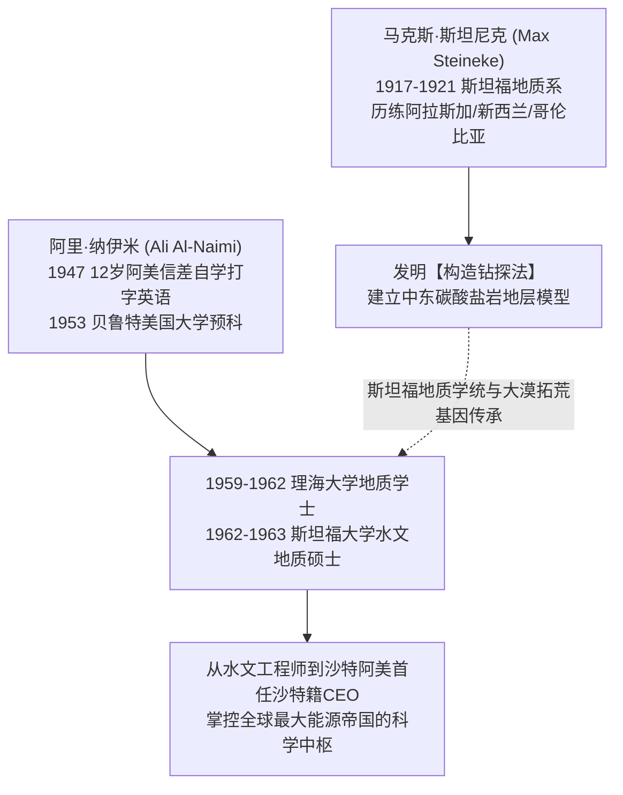
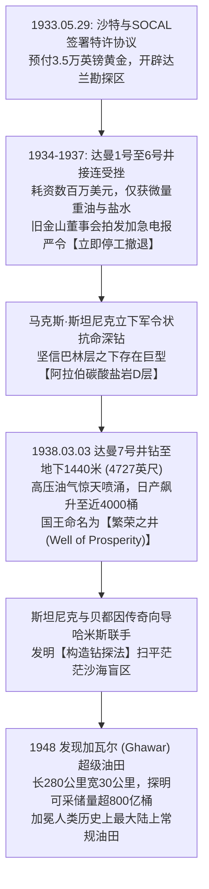
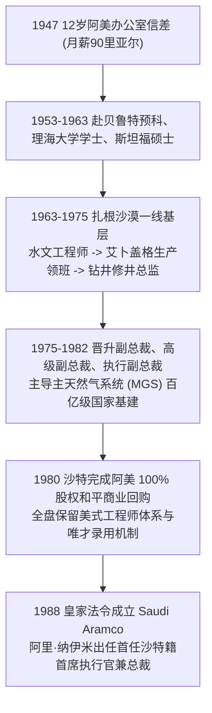
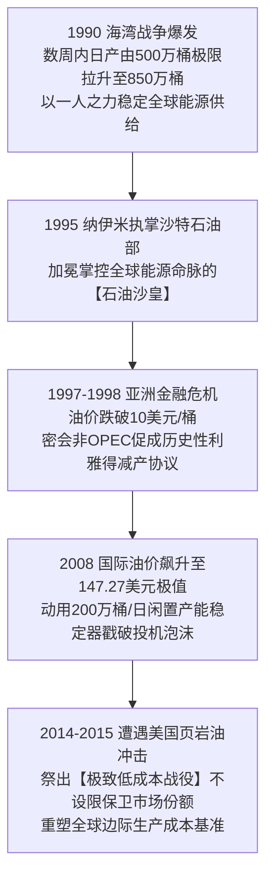
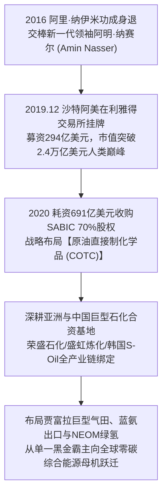
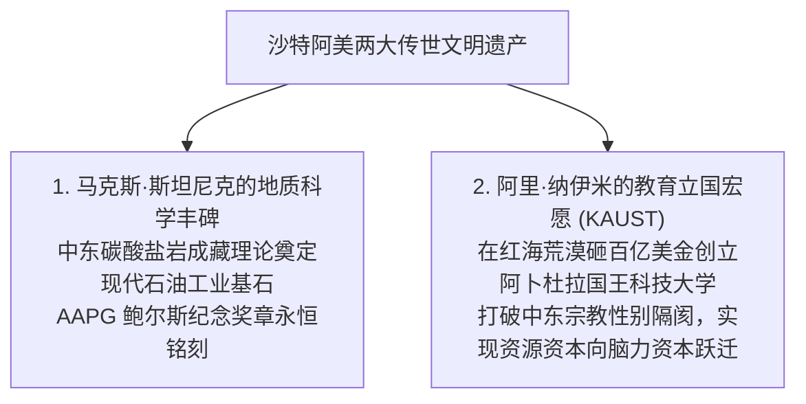

# 马克斯·斯坦尼克 (Max Steineke) & 阿里·纳伊米 (Ali Al-Naimi) 与沙特阿美：大漠黑金神话与全球能源权杖全景史诗传记

> **“在漫无边际的阿拉伯大沙漠之下，深埋着推动现代工业文明滚滚向前的黑色血液。我们的使命，不仅是用钻头征服地层，更是将这份大自然的馈赠，转化为沙特乃至全人类生生不息的繁荣动能与智慧基石。”**  
> —— 阿里·易卜拉欣·纳伊米 (Ali Al-Naimi) 与 马克斯·斯坦尼克 (Max Steineke)

---

```text
==================================================================================================
【双奠基领袖档案速览】
• 地质拓荒奠基人：马克斯·斯坦尼克 (Max Steineke, 1898 — 1952)
  - 身份：加州阿拉伯标准石油公司 (CASOC / 阿美前身) 传奇首席地质师
  - 核心功勋：抗命坚持深钻“达曼7号繁荣之井”、主导发现全球最大陆上油田加瓦尔 (Ghawar)
  - 荣誉：美国石油地质家协会 (AAPG) 最高学术荣誉“西德尼·鲍尔斯纪念奖章”获得者
• 现代掌舵与首位本土CEO：阿里·易卜拉欣·纳伊米 (Ali Ibrahim Al-Naimi, 1935 — )
  - 身份：沙特阿美首位沙特籍总裁兼首席执行官 (1988–1995)、沙特石油与矿产资源大臣 (1995–2016)
  - 传奇轨迹：从 4 岁赤足贝都因放羊娃、12 岁阿美跑腿信差，自学考入斯坦福，登顶执掌全球原油央行
• 核心实体：沙特阿拉伯石油公司 (Saudi Arabian Oil Group / Saudi Aramco)
• 历史极值市值：超 2.4 万亿美元（人类商业史上规模最大 IPO 纪录保持者）
• 核心精神图腾：达曼7号抗命一击、3美元极致开采成本护城河、闲置产能全球稳定器、教育立国
==================================================================================================
```

---

## 🧭 全景生命历程与黑金帝国百年编年轴 (Chronological Epic)

```mermaid
timeline
    title 马克斯·斯坦尼克、阿里·纳伊米与沙特阿美百年史诗全景编年
    1898 : 马克斯·斯坦尼克诞生于美国俄勒冈州 : 贫困德国移民家庭 : 12岁进入加州林场锯木厂打工
    1921 : 斯坦尼克获斯坦福大学地质学学士学位 : 历练于阿拉斯加、哥伦比亚与新西兰荒野
    1933.05 : 沙特开国国王伊本·沙特签署特许开采协议 : 加州标准石油 (SOCAL) 获93万平方公里勘探权
    1934 : 斯坦尼克抵沙特任地质师 : 发明“构造钻探法”穿透厚重流沙层
    1935 : 阿里·纳伊米诞生于达兰荒漠帐篷 : 贝都因游牧家庭 : 4岁起赤足放羊
    1938.03.03 : 达曼7号井地下1440米惊天喷涌 : 终结6口干井绝境 : 国王命名为“繁荣之井”
    1940-1948 : 斯坦尼克携贝都因向导哈米斯连续探明阿布哈德里亚与加瓦尔(Ghawar)全球最大油田
    1944 : CASOC 更名为阿拉伯美国石油公司 (Aramco) : 开启世界能源中枢征途
    1947 : 纳伊米哥哥不幸因病去世 : 12岁纳伊米任阿美跑腿信差 (月薪90里亚尔) 养家
    1950 : 建成全长1214公里的跨阿拉伯输油管道 (Tapline) : 原油直通地中海出海口
    1953-1963 : 纳伊米获阿美资助赴贝鲁特、理海大学攻读地质 : 1963获斯坦福水文地质硕士
    1963-1982 : 纳伊米拒绝办公室回归沙漠一线 : 历任水文学家、修井总监、副总裁、执行副总裁
    1980 : 沙特政府全额公允商业回购阿美 100% 股权 : 确立和平国有化与工程师治理标杆
    1988 : 皇家法令成立沙特阿拉伯石油公司 (Saudi Aramco) : 纳伊米出任首位沙特籍总裁兼CEO
    1990 : 海湾战争爆发 : 纳伊米数周内将日产由500万桶拉至850万桶稳定全球经济
    1995 : 纳伊米60岁生日当天被任命为沙特石油与矿产资源大臣 : 执掌全球石油权杖21年
    1997-1998 : 亚洲金融危机油价跌破10美元 : 纳伊米利雅得密约促成OPEC与非OPEC历史减产
    2008 : 国际油价飙升至147.27美元 : 纳伊米动用闲置产能击溃投机狂潮
    2009 : 纳伊米主导创立阿卜杜拉国王科技大学 (KAUST) : 打造红海畔的“中东斯坦福”
    2014-2015 : 美国页岩油崛起 : 纳伊米祭出极限低成本策略保卫市场份额
    2016 : 纳伊米81岁功成身退 : 出版自传《走出荒漠》: 交棒阿明·纳赛尔
    2019.12 : 沙特阿美在利雅得交易所上市 : 首日市值突破2万亿美元登顶人类市值第一
    2026 : 沙特阿美年营收超4450亿美元位居世界前列 : 战略布局绿氢、碳捕集与精细化工
```



---

## 🏜️ 第一章：血统、阶层与大漠淬炼：两个拓荒者的童年 (1898 — 1947)

### 1. 俄勒冈红杉林里的伐木童工：马克斯·斯坦尼克 (1898–1917)
1898 年，马克斯·斯坦尼克（Max Steineke）出生于美国俄勒冈州南部极为偏僻的沿海伐木小镇布鲁金斯（Brookings）。
- **极贫德国移民家庭**：斯坦尼克的父母是从德国远渡重洋来到美国西部的拓荒移民，全家一共育有 9 个孩子。在多雨严寒的太平洋西北荒野上，父亲仅靠在一小块贫瘠的开荒土地和伐木零工维持全家生计。
- **12岁离开家乡打工**：为了减轻家庭负担，年仅 12 岁的斯坦尼克就独自背着简陋的行囊离开家乡，步行穿过加利福尼亚边界，进入加州克雷森特城（Crescent City）的一家大型红杉木锯木厂当童工。
  - 在弥漫着刺鼻松脂味、木屑飞扬且充斥着致命巨大轮锯的厂房里，瘦弱的斯坦尼克承担着搬运沉重原木、清理木屑传送带、给蒸汽机轴承添加润滑油的高危重活。
  - 这段在林场锯木厂长达数年的残酷苦役，赋予了他一具如同钢铁般不知疲倦的强壮体魄，以及对机械故障、泥泞地质和恶劣户外环境近乎本能的适应力。
  - 他白天在机床前流血流汗，夜晚则在工棚昏暗的油灯下自学中学数理化课程。斯坦尼克将积攒下来的每一枚五分硬币都小心翼翼地缝进床垫，发誓要通过知识彻底改变自己与家族的命运。

### 2. 阿拉伯沙漠帐篷里的赤足放羊娃：阿里·纳伊米 (1935–1947)
1935 年深冬，在阿拉伯半岛东部省达兰荒漠的一顶粗糙黑色山羊毛帐篷里，阿里·易卜拉欣·纳伊米（Ali Ibrahim Al-Naimi）降生在世世代代逐水草而居的贝都因游牧部落（纳伊米部落）中。
- **大漠深处的生死童年**：
  - 纳伊米出生的年代，沙特阿拉伯尚未发现一滴石油，是全球最贫困、最干旱的荒漠国度之一。
  - 贝都因人的生存法则极其残酷：水源就是生命，干旱意味着死亡。从 4 岁起，年幼的阿里就光着双脚，顶着夏季地表超过摄氏 50 度的滚烫酷暑，独自赶着家里的山羊群在沙丘与砾石堆中寻找稀疏的骆驼刺。
  - 他的童年主食只有酸骆驼奶、风干的椰枣和粗糙的黑麦饼；在漫长的迁徙途中，如果遇到罕见的暴雨，全家人必须冒着被山洪冲走的危险用瓦罐抢接雨水，而一旦遭遇沙尘暴，他们只能将头埋在骆驼腹部旁紧闭口鼻苦苦硬撑数天。
- **1944年：贾巴尔学校的晨曦**：
  - 1944 年，加州阿拉伯标准石油公司（CASOC）在达兰设立了第一所专为沙特雇员及子弟提供基础教育的“贾巴尔学校 (Jabal School)”。
  - 纳伊米的亲哥哥阿卜杜拉（Abdullah）当时已经在石油公司担任底层劳工。阿卜杜拉敏锐地意识到“未来属于识字和懂机器的人”，他拉着 9 岁阿里的手，将他送进了贾巴尔学校学习阿拉伯语读写与最基础的算术。
- **1947年：兄长猝逝与12岁成为家庭顶梁柱**：
  - 1947 年初，年长且深爱阿里的哥哥阿卜杜拉突发严重急性肺炎，在缺医少药的荒漠中不幸猝然离世。
  - 兄长的离世让全家陷入了灭顶之灾。12 岁的阿里·纳伊米在一夜之间成为了母亲和年幼弟妹唯一的经济依靠。
  - 为了让这个贫困家庭活下去，阿美公司决定体恤遗属，录用 12 岁的纳伊米接替哥哥的名额，担任达兰办公区最基层的跑腿信差（Office Boy），月薪为 **90 沙特里亚尔（当时约合 24 美元）**。

---

## 🔬 第二章：地质求学、名师启蒙与深层构造顿悟 (1917 — 1963)



### 1. 斯坦尼克：斯坦福地质系与全球荒野淬炼 (1917–1934)
- **1917年入读斯坦福大学**：
  - 19 岁的斯坦尼克凭借在锯木厂攒下的学费，考入美国地质学圣殿——**斯坦福大学 (Stanford University)**。
  - 在大学期间，他为了赚取伙食费，兼任学生食堂洗碗工、夜间校车修理工，同时在构造地质学与沉积岩石学课程上斩获全优。
  - 1921 年，斯坦尼克以优异成绩获得地质学文学士（AB in Geology）学位。
- **大洋洲、南美与北极圈的极端科考**：
  - 毕业后，他被加州标准石油公司（SOCAL）录用为野外勘探地质师。
  - 在接下来的 13 年里，斯坦尼克的足迹踏遍了全球最具挑战性的极端地形：他在阿拉斯加零下四十度的暴风雪中乘雪橇考察冻土构造；在哥伦比亚蚊虫肆虐、疟疾横行的热带雨林中手持砍刀开辟道路；在新西兰地热与火山沉积带测绘断裂带。
  - 这些残酷的全球野外实战，使斯坦尼克培养出一种近乎特异功能的敏锐地质直觉：只需抓起一把岩屑、观察微小的地表露头褶皱，就能在大脑中精准还原地下数千米深处的古沉积盆地构造。

### 2. 纳伊米：从信差、贝鲁特到理海与斯坦福的求学奇迹 (1947–1963)
- **信差时期的疯狂自学**：
  - 12 岁进入阿美的阿里·纳伊米，每天的工作是在烈日下穿梭于各个办公室分发信件、倒咖啡、递送电传打字机纸带。
  - 纳伊米没有浪费哪怕一分钟的空隙。他随身携带自制的小单词本，利用一切等待时间背诵英语单词；在电传打字室，他向美国秘书请教英文打字技巧，手指在键盘上敲出了惊人的速度与准确率。
  - 晚上 6 点下班后，他立刻奔向阿美开办的夜校，如饥似渴地阅读西方科学、地理和数学书籍。阿美的美籍主管很快注意到了这个眼里闪烁着求知光芒的瘦弱少年，惊叹于他超凡的领悟力。
- **贝鲁特预科与赴美留学大门开启**：
  - 1953 年，18 岁的纳伊米在阿美全员严苛选拔考试中脱颖而出，被选派前往黎巴嫩**贝鲁特美国大学 (American University of Beirut, AUB)** 接受全英语大学预科教育。
  - 在多元文化交汇的贝鲁特，纳伊米第一次系统接触到了西方现代地质学、矿物学和微积分，并以极其拔尖的成绩完成学业。
- **理海大学与斯坦福硕士：站在大师的肩膀上**：
  - 1959 年，阿美公司全额资助纳伊米赴美深造，进入宾夕法尼亚州著名的工程名校**理海大学 (Lehigh University)** 攻读地质学学士学位。1962 年，他以顶级优等生荣誉毕业。
  - 随后，纳伊米申请进入了与沙特阿美渊源极深的**斯坦福大学 (Stanford University)** 地质与地球物理学院，专攻水文地质学（Hydrology & Geology）。
  - 在斯坦福的红瓦白墙与地质图书馆中，纳伊米无数次翻阅到马克斯·斯坦尼克当年的经典中东地质考察手稿与地层剖面图。两位来自大洋两端、相隔近四十年的斯坦福地质学者，在这一刻完成了跨越时空的知识交接与精神共鸣。
  - **1963 年**，纳伊米顺利斩获斯坦福大学理学硕士学位，毅然谢绝了美国跨国石油公司的高薪挽留，收拾行囊返回沙特阿拉伯东部省达兰荒漠。

---

## 🛢️ 第三章：大漠创世纪：达曼7号井绝境抗命与加瓦尔世界油王 (1933 — 1950)



### 1. 开国国王的国库危机与 3.5 万英镑黄金特许协议 (1933)
1930 年代初，沙特阿拉伯开国君主**阿卜杜勒阿齐兹·伊本·沙特 (Ibn Saud)** 刚刚完成了对阿拉伯半岛的艰难统一，但新生的王国正面临极度严峻的财政破产边缘。
- 1929 年爆发的全球大萧条导致前往伊斯兰圣城麦加和麦地那朝圣的穆斯林人数暴跌三分之二，朝圣税收断崖式枯竭，王室甚至难以支付内阁官员和部落卫队的薪水。
- 傲慢的英国伊拉克石油公司（IPC）认为阿拉伯半岛东部只是一片“毫无石油希望的死寂沙丘”，拒绝向国王提供实质性贷款。
- 就在国库见底的危急关头，美国加利福尼亚标准石油公司（SOCAL，雪佛龙前身）谈判代表劳埃德·汉密尔顿（Lloyd Hamilton）来到吉达。
- **1933 年 5 月 29 日**：在吉达王宫的一张木桌上，沙特财政大臣谢赫·阿卜杜拉·苏莱曼与汉密尔顿正式签署了为期 60 年的石油勘探特许协议。
  - **核心条款**：SOCAL 向沙特政府提供 **3.5 万英镑纯金金币（Sovereigns）** 的首期无息借款，每年支付 5000 英镑黄金年租金；作为回报，SOCAL 获得了沙特东部省面积达 **93 万平方公里（约合 36 万平方英里）** 的排他性勘探特许权。
  - SOCAL 随即成立了全资子公司——**加州阿拉伯标准石油公司 (California-Arabian Standard Oil Company, CASOC)**。

### 2. 连续六口枯井的至暗绝境与总部的撤退死刑令 (1934–1937)
1934 年秋，马克斯·斯坦尼克作为野外地质主管正式踏上达兰的黄沙。
- **残酷的早期钻探**：
  - 勘探队在达兰附近的石灰岩露头区域圈定了达曼穹丘（Dammam Dome）。从 1935 年 4 月达曼 1 号井开钻，到 1936 年底连续钻探了 1 号至 6 号井。
  - 钻探过程充满了灾难性的机械故障：地下高压气层多次导致井喷失控，工具卡钻断裂，钻头在砂岩中磨损殆尽，而打出的样品除了微弱的沥青痕迹，几乎全部是高浓度的死盐水和微量重质油。
- **旧金山总部的“死刑判决”**：
  - 截至 1937 年底，CASOC 已经在沙特荒漠中砸进了数百万美元巨资（相当于今天的数亿美元），颗粒无收。
  - 此时大萧条阴影尚未消散，加州标准石油公司的股东与董事会高管彻底失去了耐心。加州总部接连向达兰拍发加急绝密电报，措辞严厉地命令：
    > **“鉴于达曼地区勘探毫无商业产出，立即终止所有在钻井位，封死井口，就地遣散沙特当地雇员，美国工程技术人员全员打包撤回旧金山！”**

### 3. 斯坦尼克抗命深钻：达曼7号井与1938年3月3日破晓奇迹
面对总部的撤退死刑令，斯坦尼克展现出了一位伟大科学家的钢铁意志与战略定力。
- **颠覆性的深层地层假说**：
  - 斯坦尼克通过对邻国巴林岛浅层油田岩芯的反复对比，结合自己在沙特荒漠中收集的数千块化石碎片，推导出一个极其激进的大胆结论：**前 6 口井失败的原因是钻探深度远远不够！真正的超级巨型生油层并不在浅层的始新世或白垩系地层，而是深埋在地下 1300 米至 1500 米处的侏罗系碳酸盐岩地层（即斯坦尼克命名的‘阿拉伯带’ Arab Zone）！**
- **立下军令状抗命**：
  - 斯坦尼克亲自起草了一份长达数十页的详尽地质论证电报，直接越级发送给 SOCAL 董事会核心决策层，以自己的职业生涯和声誉作为赌注：
    > **“请给我们最后一次机会，把达曼 7 号井继续往深处钻！如果穿透阿拉伯带石灰岩依然没有油流，我将自愿辞去一切职务并承担全部责任；但如果现在撤退，我们将把人类历史上最富饶的石油盆地拱手让给竞争对手！”**
  - 董事会被斯坦尼克的笃定所打动，勉强同意给予最后三个月的宽限期。
- **1938 年 3 月 3 日：繁荣之井喷涌**：
  - 钻探工人们日夜不停地轮班操作蒸汽钻机。1938 年 3 月 3 日清晨，当钻头一路艰难推进到地下 **4,727 英尺（约 1,440 米）** 时，剧烈的高压脉冲突然从井底顺着钻杆疯狂震颤！
  - 紧接着，伴随着如闷雷般的地底轰鸣，黑褐色的轻质原油混合着天然气以摧枯拉朽之势冲破泥浆循环系统，直冲云霄，化作一场壮丽的黑色暴雨洒落在大漠之上！
  - 达曼 7 号井开井日产迅速达到 **1,585 桶**，几天后飙升至近 **4,000 桶**！其原油 API 重度高、硫含量低，具备极高的商业炼化价值。
  - 伊本·沙特国王获悉喜讯后欣喜若狂，亲自率领庞大车队穿越沙漠抵达达兰视察，并在井架前隆重宣布将达曼 7 号井永久命名为**“繁荣之井 (Well of Prosperity / 比尔·海尔)”**。这场抗命深钻，彻底改写了沙特阿拉伯王国的国家命运，拉开了人类中东现代石油纪元的壮丽序幕！

### 4. 贝都因向导哈米斯与加瓦尔超级油田会战 (1940–1948)
达曼 7 号井的成功只是开端。要在沙特东部近百万平方公里的流动沙丘中找到更多超级油田，现代地质仪器在茫茫沙海面前往往会彻底失灵。
- **沙漠罗盘：传奇向导哈米斯·本·拉姆桑**：
  - 斯坦尼克在勘探中结识了一位来自阿吉曼部落的贝都因奇人——**哈米斯·本·拉姆桑 (Khamis ibn Rimthan)**。
  - 哈米斯不识字，但拥有一种近乎神迹的沙漠定向天赋：他仅凭星辰的位置、风吹沙丘的微小弧度、沙砾的颜色与骆驼粪便的风化程度，就能在方圆数百公里的无标记荒漠中以米级精度为车队领航，从未迷失过一次方向。
  - 斯坦尼克与哈米斯结成了名垂史册的拓荒黄金搭档。斯坦尼克教哈米斯看地质图与岩芯盒，哈米斯则教会了斯坦尼克如何在沙漠严酷环境下求生、辨识沙丘背后的隐蔽露头。
- **构造钻探法 (Structure Drilling) 的发明**：
  - 针对沙特东部地表被厚达几十米流沙层覆盖、无法直接观察地下构造的难题，斯坦尼克创造性地发明了“构造钻探法”：使用安装在卡车底盘上的轻型小口径钻机，在沙漠中按网格状每隔数公里打下一批 100-300 米深的浅孔，提取标志层岩芯，绘制地下大型背斜构造等高线图。
- **1948年：发现地球陆上油田之王——加瓦尔 (Ghawar)**：
  - 依靠构造钻探法与哈米斯的精准领航，斯坦尼克团队先后发现了阿布哈德里亚（Abu Hadriya, 1940）、艾卜盖格（Abqaiq, 1940）和盖提夫（Qatif, 1945）巨型油田。
  - **1948 年**，勘探队在艾因达尔（Ain Dar）打下深井，随后通过一系列连通性钻探，揭开了一个令人目瞪口呆的超级地质奇迹——**加瓦尔油田 (Ghawar Field)**！
  - 加瓦尔油田南北纵贯 **280 公里**，东西宽达 **30 公里**，面积超过 8,400 平方公里，单体油田累计可采储量突破 **800 亿桶原油**，其单井日自喷产量动辄数万桶。
  - 这是迄今为止人类在地球上发现的**规模最大、产能最高、连续性最好的单一陆上常规油田**。加瓦尔的发现，让沙特阿美一举跃居全球石油储量与产能王座，彻底奠定了其维系全球工业命脉的核心基石地位！

---

## 👑 第四章：信差登顶：阿里·纳伊米的阿美阶梯与和平国有化奇迹 (1963 — 1988)



### 1. 扎根沙漠一线：走遍阿美每一个钻井平台的实干家 (1963–1975)
1963 年秋，拿到斯坦福大学硕士学位的阿里·纳伊米回到沙特达兰。
- **拒绝舒适，主动请缨下放一线**：
  - 当时许多沙特海归精英选择留在利雅得的政府部委办公室享受高官厚禄，但纳伊米坚持要求去最艰苦的石油生产第一线。
  - 他从**水文地质工程师 (Hydrologist)** 做起，每天顶着烈日在艾卜盖格油田负责地层注水压力监测；随后历任**生产领班 (Production Foreman)**、**修井监督 (Workover Superintendent)** 和**达兰生产部经理**。
- **精通地下每一根管线与阀门的硬核领袖**：
  - 在长达十余年的基层一线摸爬滚打中，纳伊米走遍了沙特东部的每一个油气聚集区。他甚至能仅凭水泵的声音判断出井底压力的微小异常，清楚每一座油气分离厂（GOSP）的工艺瓶颈。
  - 在面对突发的高压井喷、管道破裂或沙漠风暴断电等极端险情时，纳伊米总是第一个戴上黄色安全帽跳进泥浆坑和机械舱指挥抢修。这种与一线工人同甘共苦的硬汉作风，使他在美国专家与沙特本土员工中树立了无与伦比的崇高威信。

### 2. 1980年 100% 和平商业国有化：全球资源主权治理的最高典范
1970 年代，第四次中东战争爆发，席卷发展中国家的“资源民族主义”浪潮达到顶峰。利比亚、伊拉克、委内瑞拉等国纷纷采取激进手段强行无偿没收外资油企资产、驱逐西方技术专家，导致这些国家的石油工业迅速陷入技术断代、设备瘫痪与产量暴跌的泥潭。
- **沙特的智慧：公允赎买与渐进增持**：
  - 沙特王室与以纳伊米为代表的阿美本土管理层采取了极其高超、理性的**和平商业赎买策略**：
  - **1973 年**：沙特政府出资收购阿美公司 25% 股权；
  - **1974 年**：将持股比例平稳提升至 60%；
  - **1980 年**：沙特政府全额支付公允的资产补偿金，向美方四家跨国巨头（雪佛龙、埃克森、美孚、德士古）完成了 **100% 股权收购**，全面实现了国家对石油主权的完全自主掌控。
- **保留美式工程师体系与唯才录用（Meritocracy）防火墙**：
  - 和平国有化完成后，沙特阿美并未发生灾难性的人才流失和机构动荡。
  - 纳伊米与沙特政府达成了坚不可摧的默契：**沙特阿美必须永远保持一家独立现代化商业跨国公司的运营体制！**
  - 公司全盘保留了美国公司严密透明的财务审计准则、全球最高的埃克森级安全工程规范、严苛的技术档案管理体系，并建立了一堵坚决阻隔王室亲贵与官僚干预的“唯才录用防火墙”——任何人在阿美内部升迁，唯一凭据就是专业技能与业绩考核。这一制度设计，成为了沙特阿美此后数十年始终傲视全球国家石油公司的核心灵魂。

### 3. 1988年：皇家法令设立沙特阿美与首任沙特籍 CEO 登顶
- **主天然气系统 (Master Gas System, MGS) 的世纪工程**：
  - 1970 年代末至 1980 年代初，纳伊米升任高级副总裁与执行副总裁，主导建设了耗资百亿美元的“主天然气系统 (MGS)”。
  - 该系统彻底结束了沙特伴生气直接放空燃烧的历史，将宝贵的天然气收集、提纯并通过千公里管网输送至朱拜勒与延布工业城，催生了沙特庞大的现代石化、海水淡化与重工业体系。
- **1988 年的历史性交棒**：
  - **1984 年**：阿里·纳伊米被正式任命为阿美公司历史上**第一位沙特本土出身的总裁 (President)**。
  - **1988 年 11 月**：沙特国王法赫德颁布第 107 号皇家法令，正式将阿拉伯美国石油公司重组为**沙特阿拉伯石油公司 (Saudi Arabian Oil Company，简称沙特阿美 Saudi Aramco)**。
  - 阿里·纳伊米被任命为沙特阿美的**首任首席执行官 (CEO) 兼总裁**。
  - 从 1947 年那个光着脚、手拿信封的 12 岁贫苦放羊娃信差，到执掌全球最大能源巨擘的一号掌门人，纳伊米用整整 41 年的坚韧跋涉，书写了人类商业史上最不可思议的晋升史诗！

---

## ⚡ 第五章：石油沙皇：二十年原油央行与大宗商品世纪风暴 (1988 — 2016)



### 1. 1990年海湾战争极限压力测试：一人之力挽狂澜
1990 年 8 月 2 日，萨达姆·侯赛因下令伊拉克军队突袭入侵科威特，海湾战争爆发。
- **全球原油瞬间蒸发 400 万桶/日**：
  - 国际原油市场陷入空前恐慌，伊拉克与科威特两国原油出口瞬间完全中断，全球每日供给骤降超过 400 万桶，油价在几天内翻倍暴涨，西方主要工业国面临二战以来最严重的能源窒息危机。
- **纳伊米的惊天调度**：
  - 面对利雅得王室与华盛顿的紧急求援，纳伊米在达兰总部指挥中心下达了全员动员令。
  - 在短短三周时间内，纳伊米凭借对沙特阿美地下储层与地面分离设施的深刻理解，下令加瓦尔、布盖格和萨法尼亚等超级油田全面开启备用产能与注水加压系统，将沙特的日均原油产量从 **500 万桶硬生生拉升至创纪录的 850 万桶**！
  - 额外的 350 万桶增产原油如潮水般涌入全球市场，瞬间抹平了战争带来的供应缺口，平息了国际油价恐慌。沙特阿美在这一役中展现出的“极限增产弹性”，让全世界真正见识到了谁才是全球能源秩序不可撼动的定海神针。

### 2. 1995年出任石油大臣：掌控全球权杖二十一载
1995 年 8 月，在阿里·纳伊米 60 岁生日当天，法赫德国王颁布皇家法令，任命纳伊米出任沙特阿拉伯王国**石油与矿产资源大臣 (Minister of Petroleum and Mineral Resources)**。
- 纳伊米同时保留沙特阿美董事会主席职务，正式集国家能源外交大权与企业运营实权于一身，加冕为西方媒体笔下言出法随的“世界石油沙皇”。
- 纳伊米执掌全球能源中枢长达 **21 年（1995–2016）**，历经法赫德、阿卜杜拉与萨勒曼三任沙特国王，成为欧佩克（OPEC）历史上最具统治力、最受各方敬畏的灵魂领袖。

### 3. 1997–1998年亚洲金融风暴：利雅得密约挽救行业崩溃
1997 年夏，亚洲金融危机如海啸般爆发，亚洲“四小龙”与东南亚制造业深陷衰退，全球原油需求断崖式下跌。
- 国际油价自 1997 年底的 20 美元一路崩跌，至 1998 年底跌破了每桶 **10 美元** 大关（扣除通胀后创下 1930 年代大萧条以来历史最低点）。全球无数中小石油公司破产倒闭，委内瑞拉、俄罗斯等国财政陷入绝境。
- **纳伊米的穿梭外交与利雅得密会**：
  - 面对欧佩克内部成员国互相拆台、超配额偷产的混乱局面，纳伊米展现出大师级的外交手腕。
  - 1998 年初，他在利雅得秘密会晤了非欧佩克产油大国墨西哥与委内瑞拉的能源部长，创造性地打破了欧佩克与非欧佩克的历史壁垒，达成了被称为“利雅得协议”的三方历史性减产框架。
  - 随后，纳伊米在阿姆斯特丹和维也纳会议上以沙特阿美强悍的产能为后盾，逼迫所有产油国同步签署具有法律效力的减产配额。国际油价在此后一年内强劲反弹回升至 30 美元上方，成功将全球石油产业从全面破产的深渊中拉了回来。

### 4. 2008年油价147美元狂飙与“原油央行”闲置产能战略
2008 年上半年，国际金融投机资本大肆炒作全球原油“见顶论（Peak Oil）”，NYMEX 原油期货一路疯涨至 **147.27 美元/桶** 的人类历史最高极值。
- 高昂的油价严重拖垮了全球实体经济，西方七国集团（G7）领导人纷纷指责沙特人为制造短缺。
- 纳伊米在吉达紧急召集全球主要消费国与生产国首脑能源峰会，发表了掷地有声的公开演说：
  > **“国际原油市场上根本不存在任何现货供应短缺！当前的疯狂高价，纯粹是由华尔街金融投机客在期货衍生品市场上的无度操纵所制造的虚假泡沫！”**
- 为击垮投机泡沫，纳伊米启动了沙特阿美长期储备的 **每日 150 万至 200 万桶“富余闲置产能 (Spare Capacity)”**，开足马力向现货市场注入平价原油，并公开承诺沙特随时准备满足全球消费者的每一桶额外需求。
- 当 2008 年底雷曼兄弟倒闭、全球次贷危机全面引爆时，沙特阿美的闲置产能机制再次发挥了“原油中央银行”的反周期对冲功能，避免了全球能源供应链的剧烈休克。

### 5. 2014–2015年与美国页岩油的世纪对决
2010 年代初，得益于水力压裂和水平钻井技术的突破，美国页岩油产量以每年百万桶的速度爆发式增长，全球能源版图迎来剧烈重构。
- 2014 年下半年，原油供需再次出现严重过剩，国际油价从 115 美元开始跳水。欧佩克内部许多财政困难的成员国恳求沙特阿美单方面大幅减产以支撑油价。
- **纳伊米的冷酷决断：捍卫市场份额**：
  - 纳伊米洞察到了经济学的本质规律：如果沙特阿美单方面减产，油价短期虽然会被托住，但腾出的市场份额会被高成本的美国页岩油迅速蚕食；沙特阿美将沦为替高成本对手免费“买单”的冤大头。
  - **2014 年 11 月维也纳会议**：纳伊米力排众议，宣布沙特阿美**绝不单方面减产，任由市场供求自由决定价格**！
  - 纳伊米在接受英国《金融时报》采访时留下了那句震动全球华尔街的传世狠话：
    > **“不管是 20 美元、40 美元还是 50 美元，沙特阿美单桶生产成本只有区区 3 美元！我们拥有全世界最雄厚的现金储备和最低的成本，能坚持很多年；但那些每桶成本需要 60 到 80 美元的高杠杆对手，他们能撑多久？”**
  - 随后国际油价暴跌至 27 美元，超过 100 家高负债的美国页岩油开采商在一年内相继宣告破产清算，全球能源行业被迫进行了一场剧烈的成本去杠杆出清，沙特阿美的全球市场份额与定价底线再次得到捍卫。

---

## 🚀 第六章：第二曲线：两万亿世纪IPO、超级炼化与后石油未来 (2016 — 2026)



### 1. 2016年纳伊米功成身退与新时代交棒
2016 年 5 月 7 日，81 岁高龄的阿里·纳伊米正式卸任沙特石油大臣职务，功成身退。
- 沙特国王萨勒曼颁布法令，任命阿卜杜勒阿齐兹·本·萨勒曼亲王接任能源事务，沙特阿美资深工程师出身的**阿明·纳赛尔 (Amin H. Nasser)** 出任首席执行官兼总裁，亚西尔·鲁马扬（Yasir Al-Rumayyan）出任董事会主席。
- 纳伊米在离开达兰办公室时，平静地向陪伴自己数十年的同事们告别：“我从一个赤足放羊娃来到这里，阿美给了我一切。今天，我可以问心无愧地把一个技术最先进、制度最健全、实力最雄厚的能源帝国交还给年轻一代。”

### 2. 2019年12月：2万亿美元人类史上最大规模 IPO
在沙特王储兼首相穆罕默德·本·萨勒曼（MBS）主导的“2030 愿景 (Vision 2030)”国家转型战略蓝图下，沙特阿美启动了人类历史上最受瞩目的公开上市计划。
- **2019 年 12 月 11 日**：沙特阿美在沙特利雅得证券交易所（Tadawul）正式敲钟挂牌（股票代码：`2222`）。
- **刷新人类所有商业金融纪录**：
  - IPO 最终定价为每股 32 沙特里亚尔，通过行使超额配售权累计募集资金 **294 亿美元**，打破了此前阿里巴巴在纽交所保持的 250 亿美元纪录，成为**人类商业史上融资规模最大的 IPO**；
  - 上市次日，沙特阿美股价即触及涨停板，公司总市值飙升突破 **2 万亿美元（约合 14 万亿人民币）**，一举超越苹果与微软，成为地球上唯一市值迈过两万亿美元门槛的超级上市公司；其单年净利润突破千亿美元大关，相当于苹果、谷歌与埃克森美孚三者利润的总和！

### 3. 691亿美元并购 SABIC 与“原油直达化学品 (COTC)”革命
面对全球能源转型的百年大变局，沙特阿美果断开辟了第二增长曲线——从单一的原油开采销售商，向全球顶尖的高附加值化学材料巨头转型。
- **2020 年以 691 亿美元收购沙特基础工业公司 (SABIC) 70% 股权**：
  - 将全球最大原油供应商与全球第三大特种石化巨头完成世纪合体。
- **突破“原油直接制化学品 (Crude to Chemicals, COTC)”世界级工艺**：
  - 传统炼厂只能将 10%-20% 的原油转化为基础化工品，其余全为成品燃油；而阿美自研的 COTC 催化裂解技术，能够将多达 **70% 至 80%** 的单桶原油直接转化为高性能聚合物、工程塑料和特种碳纤维。
  - **深耕中国与亚洲产业链**：阿美先后战略入股中国民营石化龙头荣盛石化（投资超 240 亿人民币）、盛虹石化与东方盛虹，在辽宁盘锦合资建设百亿美元级精细化工一体化基地，与中国制造业建立起了深度利益捆绑。

### 4. 贾富拉非常规气田、蓝氨与零碳未来 (2024–2026)
在“双碳”时代背景下，沙特阿美正在以惊人的工程体量推进低碳新基建：
- **贾富拉巨型非常规气田 (Jafurah Field)**：投资超 1000 亿美元加速开发拥有 200 万亿标准立方英尺可采储量的贾富拉盆地，为沙特国内工业提供低成本清洁电力，全面替代原油直接燃烧。
- **蓝氢与蓝氨先锋出口**：2020 年，沙特阿美向日本运送了全球第一批经权威认证的商业化低碳“蓝氨 (Blue Ammonia)”；并在朱拜勒建设年捕集能力达 900 万吨的巨型碳捕集与封存（CCS）枢纽。
- **NEOM 新未来城绿氢巨无霸**：与 Air Products 合作在沙特西北部沙漠建设全球最大的绿氨生产基地，完全利用沙漠太阳能与风能制造绿色零碳能源。

---

## 🏛️ 第七章：传世遗产、荒漠大学与黑金文明的未来图腾



### 1. 斯坦尼克的永恒丰碑：照亮人类油气勘探一个世纪
1951 年，美国石油地质家协会（AAPG）将全球地质科学界的最高荣誉——**西德尼·鲍尔斯纪念奖章 (Sidney Powers Memorial Medal)** 郑重颁发给马克斯·斯坦尼克，以表彰他在沙特荒漠中以非凡的科学洞察力和无畏勇气发现中东巨型油田的开创性贡献。
- 1952 年，斯坦尼克在加州帕洛阿尔托因病逝世，享年仅 54 岁。
- 斯坦尼克创立的“构造钻探法”、对侏罗系阿拉伯带碳酸盐岩储层沉积相模式的精确划分，至今仍被全球各大石油学院写入教科书，成为了全球地质学家勘探深层碳酸盐岩油气藏的圣经。
- 在沙特达兰的阿美总部，达曼 7 号井的井架被永久保留作为历史国家丰碑，静静注视着由斯坦尼克当年抗命一击所开创的工业奇迹。

### 2. 纳伊米的教育宏愿：阿卜杜拉国王科技大学 (KAUST)
在阿里·纳伊米看来，大自然赋予沙特的地下黑金终有耗尽的一天；唯有人类大脑中的智慧与科学创造力，才是永不枯竭的泉眼。
- **红海荒漠上的奇迹大学**：
  - 2006 年，阿卜杜拉国王将一项近乎不可能的绝密国家使命交给了纳伊米：在沙特西部红海之滨的图瓦尔（Thuwal）荒漠渔村上，在短短三年内建成一所比肩斯坦福与麻省理工的全球顶级全英文综合性研究型大学——**阿卜杜拉国王科技大学 (KAUST)**。
  - 纳伊米亲自担任大学筹建委员会主席兼首任董事会主席。他调集了沙特阿美最顶尖的项目管理团队，以阿美级的施工速度与工程质量，在红海荒滩上建起了耗资超百亿美元的现代化超算中心、海水淡化实验基地和纳米科技实验室。
- **打破禁忌的现代化绿洲**：
  - 纳伊米坚决顶住了国内保守势力的巨大阻力，在 KAUST 校园内实现了沙特历史上史无前例的制度突破：**男女同校、学术完全自由、女性无需佩戴头巾或穿着黑袍即可在校园内自由驾车与开展实验**；
  - 纳伊米为学校设立了规模高达 **200 亿美元的独立学术禀赋基金（Endowment）**，位居全球高校前列，吸引了来自全球上百个国家的顶级科学家在此攻关前沿太阳能、海水淡化、合成生物与先进催化技术。
  - 纳伊米在 KAUST 成立典礼上深情宣告：**“KAUST 是我一生中最引以为傲的事业。它是一座灯塔，将指引阿拉伯世界走出对石油的单纯依赖，重回千年前阿拉伯文明引领全球科学与数学创新的黄金时代。”**

---

## 🧠 第八章：八大底层战略与认知工具箱 (Mental Models)

```text
==================================================================================================
【沙特阿美与奠基领袖八大传世底层认知模型】

1. 极致低成本护城河模型 (Lowest-Cost Producer Moat)
   • 核心心法：大宗商品本质上是同质化的，任何溢价都是暂时的。只有将单桶全流程开采成本
               死死压制在全行业全球绝对底线 ($3-$5/桶)，才能在油价经历 10 美元暴跌的任何
               极端凛冬中依然产生充沛的自由现金流，在漫长残酷的周期中活活熬死所有高成本对手。

2. 闲置产能战略威慑模型 (Spare Capacity Leverage / Central Bank of Oil)
   • 核心心法：常年不惜牺牲短期收益保留 150-200 万桶/日随时可启用的“富余闲置产能”，
               使沙特阿美拥有了如同全球“原油中央银行”般的非对称权力——能在供应中断时
               开闸平抑恐慌，也能在对手扩产时放水施压，掌握全球大宗商品定价终极话语权。

3. 地质深层第一性原理 (Subsurface First-Principles Drilling)
   • 核心心法：当所有人都在地表浅层按既有经验寻找参照物时，敢于打破浅层教条，从岩石学、
               沉积古地理与古构造应力场的底层物理机理出发，做出反共识的深层钻探战略豪赌。

4. 和平商业赎买与制度嫁接模型 (Peaceful Buyout & Institutional Continuity)
   • 核心心法：资源主权回归绝不能诉诸民粹式的暴力没收与盲目排外。以公允的商业资产补偿
               换取和平交接，全盘移植并保留西方最顶级的工程规范、财务透明度与唯才录用机制，
               实现国家所有权与跨国卓越运营能力的完美统一。

5. 梯子全层攀爬领导力 (Every-Rung Leadership Ladder)
   • 核心心法：真正的行业统帅必须从最底层的信差、钻井工、水文员干起，亲自摸过每一根管道、
               闻过每一批泥浆。唯有对系统每一个最微小的齿轮了如指掌，才能在高层战略决策中
               穿透下属的粉饰汇报，做出最接地气、最致命的精准决断。

6. 贝都因极端环境韧性思维 (Bedouin Desert Resilience)
   • 核心心法：像沙漠游牧民族面对沙暴一样审视商业周期：永远不为丰水期的繁荣冲昏头脑，
               永远在丰年储备骆驼奶与水源（现金流与闲置产能）；在沙暴降临时把头埋低保持定力，
               等待风暴散去后再迅速出击捕获战果。

7. 原油直达化学品价值跃迁模型 (Crude-to-Chemicals Value Chain Leap)
   • 核心心法：摆脱对传统低附加值初级燃料消费的单一路径依赖，通过重组并购与尖端催化技术，
               将 70%-80% 的原油直接解构重塑为高技术门槛、长生命周期的特种高分子化学材料，
               实现产业链维度上的跨越式升维。

8. 资源资本向脑力资本转化飞轮 (Resource-to-Knowledge Endowment Flywheel)
   • 核心心法：不可再生的地下矿藏是上天的暂时馈赠，唯有将不可再生的地质财富在黄金窗口期
               迅速转化为源源不断的人才储备、基础科研基础设施与学术禀赋基金，才能打破资源诅咒，
               让国家文明在后化石时代获得永续繁衍的动力源泉。
==================================================================================================
```

---

## 🎭 第九章：多维性格剖析、生活怪癖与轶事秘辛 (Anecdotes & Trivia)

### 1. 斯坦尼克与贝都因向导哈米斯：一盒岩芯与一片星空
在 1930 年代艰苦卓绝的勘探岁月里，马克斯·斯坦尼克与贝都因向导哈米斯·本·拉姆桑几乎形影不离。
- 斯坦尼克常常坐在沙漠营地的篝火旁，拿着放大镜耐心地教哈米斯看显微镜下的微体古生物化石；而哈米斯则拉着斯坦尼克躺在滚烫的沙地上，指着头顶浩瀚银河中阿拉伯游牧民族代代相传的星座导航图。
- 两人之间跨越了语言、文化和宗教的巨大鸿沟，结成了生死莫逆之交。1950 年代哈米斯病逝后，沙特阿美特意将东部省一座重要的新油田命名为“拉姆桑油田 (Ramthan Field)”，并将一艘数十万吨级超大型油轮命名为“哈米斯号”，以永久纪念这位大漠先驱。

### 2. 阿里·纳伊米的“清晨 5 点慢跑外交”
作为叱咤风云的“世界石油沙皇”，纳伊米在维也纳参加一年两次极其紧张激烈的欧佩克部长级会议时，有一个数十年如一日雷打不动的习惯：
- 每天清晨 5 点整，当维也纳街头还笼罩在冰冷的薄雾中、各国记者与投机交易员还在睡梦中时，年过七旬的纳伊米已经换上一身灰色运动装和跑鞋，准时出现在下榻的帝国酒店门口，沿着环城大道慢跑一小时。
- 敏锐的彭博社和路透社资深记者们很快发现了这个规律，于是也纷纷穿着跑鞋在清晨 5 点在酒店门口“蹲守”，一边喘着粗气陪着这位石油沙皇晨跑，一边试图从纳伊米轻松幽默的谈笑中捕捉全球油价的微小信号。纳伊米常常一边调整呼吸一边打趣记者：“想从我嘴里套出沙特的增产数字？先跟上我的配速再说！”

### 3. 一块瑞士巧克力的自律与信差时期的打字测试
在达兰阿美内部流传着一个关于纳伊米年轻时的励志传奇：
- 1948 年，13 岁的纳伊米刚当上信差不久，达兰总部的美国行政主管考夫曼先生为了测试这批沙特小童工的诚实与自律，故意在自己空无一人的办公室办公桌正中央放了一块极其罕见、包装精美的瑞士巧克力，并在桌上留下了需要整理的文件。
- 面对在当时荒漠中比金子还珍贵的甜食诱惑，饥肠辘辘的纳伊米走进办公室，目不斜视地将文件摆放整齐、把桌面擦拭得一尘不染，没有碰那块巧克力哪怕一下。
- 躲在百叶窗后的考夫曼先生当场被这个沙特少年的自律所折服，第二天便破格将纳伊米调入核心电传打字室并为他报销全部夜校学费。

### 4. 拒绝“石油沙皇”头衔：一位永远记得羊群味道的斯坦福地质学家
在掌管全球万亿级能源命脉的二十多年里，国际媒体和华尔街投行无数次冠以纳伊米“全球最具权势人物”、“能源沙皇”、“油价操盘手”等显赫头衔。
- 但纳伊米在每一次公开演讲或接受采访时，总是平静地微笑着纠正对方：
  > **“请不要叫我沙皇。我不是什么政客，也不是什么金融大鳄。我本质上永远是一个在沙漠里放过羊的贝都因孩子，一个毕业于斯坦福大学、热爱观察岩石和地层水流的普通地质工程师。”**
- 即使在退休后，纳伊米依然经常独自一人开车深入达兰周围的荒漠，抓起一把沙砾放在鼻尖轻嗅，凝视着远处的抽油机起伏，回味着那片赋予了他一切的大漠泥土气息。

---

## 💬 第十章：传世经典名言金句中英对照 & 详尽生平重大历史年表

### 经典名言金句 (Iconic Quotes)

1. **论地质勘探与战略定力 (马克斯·斯坦尼克)**  
   > *“大地从不轻易交出它的秘密。当所有平庸的数据都告诉你该放弃时，真正的突破往往就藏在再往下多钻几百英尺的坚硬地层之中。”*  
   > _“The Earth does not give up its secrets easily. When all ordinary data tells you to quit, the true breakthrough is often hidden just a few hundred feet deeper into the rock.”_

2. **论大宗商品周期与极致成本 (阿里·纳伊米)**  
   > *“大宗商品的周期狂风永远会来去无常。不要试图去预测风暴何时降临，而要确保你的全流程生产成本比全世界所有对手都低。只要你的成本是 3 美元，你就拥有在任何狂风暴雨中泰然自若的特权。”*  
   > _“The winds of commodity cycles come and go. Do not try to predict the storm; simply ensure your production costs are lower than anyone else in the world. As long as your cost is $3 a barrel, you hold the privilege of staying calm through any hurricane.”_

3. **论大漠出身与求知信仰 (阿里·纳伊米)**  
   > *“大沙漠教会了我两件事：第一，水源是生命，必须极度珍惜每一滴资源；第二，贫穷和出身绝不能定义你的天花板。只要你手里拿着书本，心里怀揣好奇，即使是光着脚的放羊娃也能走向世界的舞台中央。”*  
   > _“The desert taught me two things: First, water is life, and you must cherish every drop. Second, poverty and birth never define your ceiling. As long as you hold a book and remain curious, even a barefoot shepherd boy can walk to the center of the world stage.”_

4. **论原油央行的闲置产能威慑 (阿里·纳伊米)**  
   > *“拥有闲置产能就像是在刀鞘中保留着一柄未出鞘的利刃。你不需要每天挥舞它，但全世界所有人都知道它能在几秒钟内斩断任何投机者的非分之想。”*  
   > _“Having spare capacity is like keeping a sharp sword in its scabbard. You do not need to wield it every day, but the entire world knows it can cut through any speculator’s greed in seconds.”_

5. **论和平国有化与制度传承 (阿里·纳伊米)**  
   > *“国家的尊严不在于你用愤怒夺回了什么，而在于你用智慧保留并光大了什么。沙特阿美最宝贵的财富不是地下的原油，而是那套严苛、透明、唯才是举的现代化工程师管理灵魂。”*  
   > _“A nation’s dignity is not measured by what it seizes in anger, but by what it preserves and elevates through wisdom. Saudi Aramco’s greatest asset is not the oil underground, but its rigorous, transparent, and meritocratic engineering soul.”_

6. **论后石油时代与教育立国 (阿里·纳伊米)**  
   > *“石器时代之所以结束，并不是因为地球上的石头用光了；石油时代也终将落幕，但绝不是因为地下没有了石油。真正的繁荣不在于我们开采了多少桶原油，而在于我们用这些财富培养了多少拥有创造力的大脑。”*  
   > _“The Stone Age did not end because the world ran out of stones, and the Oil Age will end long before the world runs out of oil. True prosperity is not measured by the barrels we pump, but by the creative minds we nurture with that wealth.”_

---

### 📅 跨越百年重大历史编年史 (1898 — 2026)

| 年份 | 关键人物 / 主体 | 历史性里程碑与重大决断 | 历史影响与战略意义 |
| :---: | :---: | :--- | :--- |
| **1898** | 马克斯·斯坦尼克 | 诞生于美国俄勒冈州布鲁金斯极贫德国移民家庭 | 奠基人早年苦难童年与钢铁意志淬炼之始 |
| **1917–1921** | 斯坦尼克 | 考入斯坦福大学攻读地质学，以全优成绩获学士学位 | 建立扎实构造地质与沉积岩石学知识体系 |
| **1933.05.29** | 伊本·沙特国王 / SOCAL | 在吉达签署 60 年特许开采协议，预付 3.5 万英镑纯金借款 | 成立加州阿拉伯标准石油公司 (CASOC)，勘探区达 93 万平方公里 |
| **1934** | 斯坦尼克 | 抵沙特出任首席地质师，发明“构造钻探法 (Structure Drilling)” | 突破沙漠巨厚流沙覆盖盲区，建立中东碳酸盐岩地层模型 |
| **1935** | 阿里·纳伊米 | 诞生于沙特东部省达兰荒漠的贝都因游牧帐篷中 | 4岁起赤足放牧羊群，历经干旱沙暴严苛淬炼 |
| **1935–1937** | 斯坦尼克 / CASOC | 连续钻探达曼 1 号至 6 号井皆受挫，加州总部下达撤退停工令 | 面临耗资数百万美元、项目濒临彻底流产的至暗绝境 |
| **1938.03.03** | 斯坦尼克 | **达曼 7 号井在 1440 米处惊天喷涌，日产达 4,000 桶** | **终结阿拉伯半岛无油论，国王命名为“繁荣之井”，开启中东石油纪元** |
| **1940** | 斯坦尼克 / 哈米斯 | 联手发现阿布哈德里亚 (Abu Hadriya) 与艾卜盖格巨型油田 | 证明沙特东部存在大范围连续性高品质油气富集带 |
| **1944** | CASOC | 正式更名为阿拉伯美国石油公司 (Arabian American Oil Company, Aramco) | 开启向全球超级能源跨国巨头演进的新阶段 |
| **1947** | 纳伊米 | 哥哥因病不幸逝世，12 岁纳伊米入职阿美担任跑腿信差 (月薪 90 里亚尔) | 开启长达 41 年从最底层信差到一号掌门人的攀爬史诗 |
| **1948** | 斯坦尼克 / 阿美 | **勘探发现全球最大陆上常规油田——加瓦尔油田 (Ghawar)** | **长280公里宽30公里，探明储量超800亿桶，奠定沙特百年黑金王座** |
| **1950** | 阿美财团 | 建成全长 1,214 公里的跨阿拉伯输油管道 (Tapline) 直达地中海 | 确立波斯湾原油直通欧洲战后重建工业的黄金通道 |
| **1951** | 斯坦尼克 | 荣获美国石油地质家协会 (AAPG) 最高学术荣誉“西德尼·鲍尔斯纪念奖章” | 确立其作为世界石油地质学史上最伟大拓荒大师的历史地位 |
| **1952** | 斯坦尼克 | 在加利福尼亚州帕洛阿尔托逝世，享年 54 岁 | 一生为沙特发现数千亿桶级储量，成为中东地质不朽丰碑 |
| **1953–1963** | 纳伊米 | 获阿美全额资助赴贝鲁特预科、理海大学学士、斯坦福大学水文地质硕士 | 掌握全球最顶尖地质水文工程学，完成从信差到科学家的跃迁 |
| **1963–1975** | 纳伊米 | 拒绝高官回一线，历任水文学家、修井总监、生产部经理 | 走遍阿美每一个井位与车间，树立坚实一线技术威信 |
| **1973–1980** | 沙特政府 / 纳伊米 | **通过公允商业赎买完成 100% 股权收购，实现和平国有化** | **全盘保留美式工程师治理体系与唯才录用机制，创全球典范** |
| **1984** | 纳伊米 | 被任命为阿美公司历史上首位沙特本土出身的总裁 (President) | 本土化人才战略取得历史性里程碑突破 |
| **1988** | 纳伊米 / 沙特政府 | **皇家法令成立沙特阿拉伯石油公司 (Saudi Aramco)，纳伊米任 CEO 兼总裁** | **沙特阿美全面扬帆起航，纳伊米正式统领全球最大石油航母** |
| **1990** | 纳伊米 | 海湾战争爆发，数周内将日产由 500 万桶拉至 850 万桶抹平供给缺口 | 确立沙特阿美作为全球工业命脉“终极救火队员”的战略威慑力 |
| **1995** | 纳伊米 | 60 岁生日当天被任命为沙特石油与矿产资源大臣，执掌全球石油权杖 | 出任 OPEC 核心领袖长达 21 年，被称为“世界石油沙皇” |
| **1997–1998** | 纳伊米 | 亚洲金融危机油价跌破 10 美元，主导“利雅得协议”促成全球大减产 | 成功挽救全球能源行业免于崩溃，树立跨组织多边协调典范 |
| **2008** | 纳伊米 | 国际油价飙升至 147.27 美元，动用 200 万桶闲置产能击溃金融投机泡沫 | 充分展现“原油中央银行”的反周期市场稳定器功能 |
| **2009** | 纳伊米 | 主导创立阿卜杜拉国王科技大学 (KAUST)，任首任董事会主席 | 红海荒漠崛起世界一流高校，推动沙特向“脑力知识经济”转型 |
| **2014–2015** | 纳伊米 | 面对美国页岩油冲击坚持不减产，利用 3 美元成本优势捍卫全球份额 | 倒逼全球能源行业完成成本出清与技术去杠杆 |
| **2016** | 纳伊米 | 81 岁功成身退，出版自传《走出荒漠》，交棒阿明·纳赛尔 | 完成历史权杖交接，留下制度最健全的超级黑金帝国 |
| **2019.12** | 沙特阿美 | **在利雅得交易所成功上市，募资 294 亿美元，首日市值突破 2 万亿美元** | **创人类商业史上规模最大 IPO 与首家突破两万亿美元市值纪录** |
| **2020** | 沙特阿美 | 耗资 691 亿美元收购 SABIC 70% 股权，推进原油直接制化学品 (COTC) | 开启向全球高科技化工材料与下游精细炼化综合巨头的跃迁 |
| **2024–2026** | 沙特阿美 | 年营收超 4450 亿美元稳居世界前列，全力押注贾富拉气田、绿氢与碳捕集 | 在“2030愿景”引领下，向世界级低碳零碳综合能源母机全面进发 |
