# 苹果公司 (Apple Inc.) —— 全球消费电子霸主与软硬件一体化帝国全景介绍

> **《财富》世界500强排名：第 6 位**  
> **年度营业收入：$416,161 百万美元（约 4161 亿美元）**  
> **官方网站：[www.apple.com](https://www.apple.com)**

---

## 🏢 企业基本信息 (Corporate Snapshot)

| 维度 | 详细信息 |
| :--- | :--- |
| **公司全称** | 苹果公司 (Apple Inc.，前称 Apple Computer, Inc.) |
| **成立时间** | 1976 年 4 月 1 日 (由史蒂夫·乔布斯、斯蒂夫·沃兹尼亚克、罗纳德·韦恩创立于加州洛斯阿尔托斯) |
| **全球总部** | 🇺🇸 美国 加利福尼亚州 库比蒂诺 (Cupertino, CA, Apple Park 飞船总部) |
| **创始人** | 史蒂夫·乔布斯 (Steve Jobs)、斯蒂夫·沃兹尼亚克 (Steve Wozniak) |
| **现任掌门人** | 董事会主席：阿瑟·莱文森 (Arthur D. Levinson)；首席执行官：蒂姆·库克 (Tim Cook) |
| **股票代码** | NASDAQ: `AAPL` (人类首家跨过 1 万亿、2 万亿及 3 万亿美元市值大关的企业) |
| **活跃设备基数** | 全球活跃 Apple 设备突破 **22 亿台** |
| **全球员工总数** | 约 16+ 万人 |
| **核心业务赛道** | 智能手机 (iPhone)、个人电脑 (Mac)、平板电脑 (iPad)、可穿戴与智能家居 (Apple Watch/AirPods)、空间计算 (Vision Pro)、数字软件与服务平台 (Services)、自研芯片与端侧 AI |

---

## 🌐 核心业务矩阵与商业版图 (Business Ecosystem)

```mermaid
graph TD
    APPLE["苹果商业帝国 (Apple Inc.)"]
    
    APPLE --> HW["1. 标志性智能硬件矩阵 (Hardware Products)"]
    HW --> HW1["iPhone (全球智能手机利润之王, 年营收超2000亿美元)"]
    HW --> HW2["Mac (MacBook Pro/Air, iMac, Mac Studio, 搭载自研 M 系列芯片)"]
    HW --> HW3["iPad (iPad Pro/Air/mini, 平板电脑行业绝对标杆)"]
    HW --> HW4["可穿戴与家居 (Apple Watch 智能手表, AirPods 无线耳机, HomePod)"]
    HW --> HW5["Apple Vision Pro (空间计算与混合现实 MR 革命性头显)"]
    
    APPLE --> SERV["2. 高毛利数字服务生态 (Digital Services)"]
    SERV --> SERV1["App Store 应用商店 (管理超百亿美元全球开发者经济)"]
    SERV --> SERV2["金融支付 (Apple Pay, Apple Card, Apple Cash)"]
    SERV --> SERV3["流媒体与订阅 (Apple Music, Apple TV+, Apple Arcade, Apple Fitness+)"]
    SERV --> SERV4["云存储与生产力 (iCloud+, Apple News+, Apple Podcasts)"]
    
    APPLE --> OS["3. 专有操作系统与生态底座 (Proprietary Platforms)"]
    OS --> OS1["iOS & iPadOS (全球最高 ARPU 值移动操作系统)"]
    OS --> OS2["macOS & watchOS & tvOS & visionOS"]
    
    APPLE --> SILICON["4. 自研芯片与 Apple Intelligence (Custom Silicon & AI)"]
    SILICON --> SILICON1["A 系列仿生芯片 (A17/A18 Pro, 全球领先端侧高能效算力)"]
    SILICON --> SILICON2["M 系列超级芯片 (M3/M4 Max/Ultra, 统一内存架构 UMA)"]
    SILICON --> SILICON3["Apple Intelligence (端侧生成式 AI 与私有云计算 Private Cloud Compute)"]

    classDef main fill:#555555,stroke:#000,stroke-width:2px,color:#fff;
    classDef branch fill:#222222,stroke:#888,stroke-width:1px,color:#fff;
    classDef sub fill:#f5f5f7,stroke:#222,stroke-width:1px,color:#000;
    class APPLE main;
    class HW,SERV,OS,SILICON branch;
    class HW1,HW2,HW3,HW4,HW5,SERV1,SERV2,SERV3,SERV4,OS1,OS2,SILICON1,SILICON2,SILICON3 sub;
```

---

## ⚡ 核心竞争壁垒与护城河 (Core Competitive Moat)

### 1. 软硬件垂直一体化与极致封闭生态 (Vertical Integration)
- 苹果是全球极少数同时掌控**核心芯片架构 (Apple Silicon)**、**专有操作系统 (iOS/macOS)**、**硬件工业设计**与**应用分发生态 (App Store)** 的科技企业。
- 软硬件深度协同使得苹果设备在功耗控制、运行流畅度、软硬件调用时延与隐私安全方面建立起 Windows 和 Android 阵营难以企及的断层级优势。

### 2. 超过 22 亿活跃设备的超强用户锁定与飞轮网络效应
- 苹果构建了基于 AirDrop、iMessage、iCloud 协同、Hand-off 接力等功能的“生态围墙”。用户拥有的苹果设备越多，迁移到其他平台的心理与操作门槛就呈指数级提升。
- 规模庞大的高净值用户群体，推动服务业务（Services）年收入突破 900 亿美元且毛利率高达 70% 以上，成为公司极其稳健的第二盈利增长极。

### 3. 库克掌舵下的全球精密供应链统治力
- 依托极致的供应链管理（JIT 准时制、极低库存周转天数、数十亿美元提前锁定核心零部件产能），苹果在富士康、立讯精密、台积电等全球数千家顶级供应商中拥有绝对的定价权与排他性协同能力。

---

## 📈 历史里程碑年表 (Historical Milestones)

- **1976年**：乔布斯、沃兹尼亚克与韦恩在加州车库创立苹果电脑公司，推出手工组装的 Apple I。
- **1977年**：发布开创现代个人电脑产业先河的 **Apple II**，年销售额迅速突破千万美元。
- **1984年**：在超级碗发布震撼全球的《1984》广告，正式推出首款配备图形用户界面（GUI）与鼠标的 **Macintosh**。
- **1985年**：因管理理念冲突，乔布斯被董事会罢免一切管理职权，愤而离开苹果创立 NeXT 与皮克斯（Pixar）。
- **1997年**：苹果濒临破产边缘，乔布斯临危受命王者归来，砍掉 70% 冗余产品线，推出划时代的彩色透明 **iMac** 与《Think Different》品牌宣言。
- **2001年**：发布便携式数字音乐播放器 **iPod** 与 **iTunes Store**，颠覆全球唱片音乐产业。
- **2007年**：乔布斯在 Macworld 大会上发布革命性的初代 **iPhone**，定义了现代智能手机交互标准。
- **2010年**：发布初代 **iPad**，开创平板电脑品类。
- **2011年**：史蒂夫·乔布斯与世长辞，首席运营官**蒂姆·库克 (Tim Cook)** 出任新任 CEO。
- **2018年**：苹果成为人类商业史上首家市值突破 **1 万亿美元** 的上市公司（随后在 2020 年突破 2 万亿，2023 年突破 3 万亿美元）。
- **2020年**：发布首款自研 ARM 架构电脑芯片 **Apple M1**，彻底告别英特尔处理器，开启 Mac 性能与能效革命。
- **2024年**：正式发售首款空间计算设备 **Apple Vision Pro**，并全面发布 **Apple Intelligence** 系统级生成式 AI。
- **2024-2026年**：年营业收入突破 4160 亿美元，稳居《财富》世界500强前六名及全球科技硬件第一。

---

## 🎯 企业文化与核心价值观 (Culture & Core Values)

1. **非同凡响 (Think Different)**：致敬那些疯狂的、不墨守成规的创新者，勇于打破既有常规。
2. **至繁归于至简 (Simplicity is the Ultimate Sophistication)**：通过极其深度的工程思考，为用户呈现最自然、直觉、纯粹的产品交互体验。
3. **科技与人文的十字路口 (Liberal Arts & Technology)**：坚信伟大的科技产品不仅要有强悍的技术参数，更必须拥有直击心灵的美学品味与温度。
4. **隐私是一项基本人权 (Privacy as a Human Right)**：在硬件与系统底层嵌入端侧加密与权限管控，绝不以出卖用户个人隐私作为商业盈利筹码。
5. **环境责任与 Apple 2030**：承诺在 2030 年前实现整个供应链与产品全生命周期的 100% 碳中和。
