# Alphabet公司 (Google) —— 全球搜索引擎霸主与人工智能超级帝国全景介绍

> **《财富》世界500强排名：第 8 位**  
> **年度营业收入：$402,836 百万美元（约 4028 亿美元）**  
> **官方网站：[abc.xyz](https://abc.xyz) / [www.google.com](https://www.google.com)**

---

## 🏢 企业基本信息 (Corporate Snapshot)

| 维度 | 详细信息 |
| :--- | :--- |
| **公司全称** | Alphabet公司 (Alphabet Inc. / Google LLC) |
| **成立时间** | 1998 年 9 月 4 日 (由拉里·佩奇与谢尔盖·布林创立于加州门洛帕克车库) |
| **全球总部** | 🇺🇸 美国 加利福尼亚州 山景城 (Mountain View, CA, Googleplex) |
| **创始人** | 拉里·佩奇 (Larry Page)、谢尔盖·布林 (Sergey Brin) |
| **现任掌门人** | 董事会主席：约翰·轩尼诗 (John L. Hennessy)；首席执行官：桑达尔·皮查伊 (Sundar Pichai) |
| **股票代码** | NASDAQ: `GOOGL` / `GOOG` (全球最高市值前五大巨头之一，标普500核心权重股) |
| **全球覆盖** | 拥有 9 款全球月活跃用户突破 **10 亿** 的超级产品 (Search, YouTube, Android, Maps, Chrome, Gmail, Drive, Play, Photos) |
| **全球员工总数** | 约 18+ 万人 |
| **核心业务赛道** | 全球互联网搜索与数字广告 (Google Ads)、视频流媒体与创作者经济 (YouTube)、移动操作系统 (Android)、云计算与大数据 (Google Cloud)、前沿人工智能 (DeepMind & Gemini)、自动驾驶无人出租车 (Waymo) |

---

## 🌐 核心业务矩阵与商业版图 (Business Ecosystem)

```mermaid
graph TD
    ALPHABET["Alphabet 科技帝国 (Alphabet Inc.)"]
    
    ALPHABET --> SERV["1. Google Services 核心消费互联网与广告"]
    SERV --> SERV1["Google Search (全球搜索引擎绝对霸主, >90% 全球市场份额)"]
    SERV --> SERV2["YouTube (全球最大视频流媒体平台, 月活超 25 亿用户)"]
    SERV --> SERV3["Android 移动操作系统 (全球超 30 亿活跃智能终端)"]
    SERV --> SERV4["Google Chrome 浏览器 & Google Maps & Gmail"]
    SERV --> SERV5["Google Ads & AdSense (全球最吸金精准拍卖广告系统)"]
    
    ALPHABET --> CLOUD["2. Google Cloud 谷歌云科技 (Enterprise Cloud)"]
    CLOUD --> CLOUD1["Google Cloud Platform (GCP 弹性计算与 BigQuery 实时大数据分析)"]
    CLOUD --> CLOUD2["Vertex AI 全托管机器学习与企业级大模型服务平台"]
    CLOUD --> CLOUD3["自研 TPU (Tensor Processing Unit v5/v6) 专用 AI 算力芯片"]
    CLOUD --> CLOUD4["Google Workspace 企业协同办公套件 (Docs, Sheets, Meet)"]
    
    ALPHABET --> AI["3. Google DeepMind 全栈前沿人工智能 (Frontier AI)"]
    AI --> AI1["Gemini 系列原生多模态通用大语言模型 (Ultra/Pro/Flash)"]
    AI --> AI2["AlphaFold 3 蛋白质与分子相互作用结构预测 (颠覆生物医药研发)"]
    AI --> AI3["AlphaGo / AlphaZero (人类强化学习突破标志)"]
    
    ALPHABET --> BETS["4. Other Bets 前沿登月创新计划 (Moonshots)"]
    BETS --> BETS1["Waymo (全球首家全无人商业化运营 Robotaxi 领跑者)"]
    BETS --> BETS2["Verily (精准医疗与智能健康传感器) & Calico (人类抗衰老研究)"]
    BETS --> BETS3["Wing (物流无人机配送) & GV (Google Ventures 风险投资)"]

    classDef main fill:#4285F4,stroke:#0d47a1,stroke-width:2px,color:#fff;
    classDef branch fill:#0d47a1,stroke:#4285F4,stroke-width:1px,color:#fff;
    classDef sub fill:#f0f4fc,stroke:#0d47a1,stroke-width:1px,color:#000;
    class ALPHABET main;
    class SERV,CLOUD,AI,BETS branch;
    class SERV1,SERV2,SERV3,SERV4,SERV5,CLOUD1,CLOUD2,CLOUD3,CLOUD4,AI1,AI2,AI3,BETS1,BETS2,BETS3 sub;
```

---

## ⚡ 核心竞争壁垒与飞轮护城河 (Core Competitive Moat)

### 1. PageRank 算法与千亿网页超大规模知识图谱索引
- 谷歌构建了人类文明历史上最庞大的网页实时索引和实体知识图谱（Knowledge Graph）。
- 依托数十年来积累的超高并发分布式系统架构（GFS、MapReduce、BigTable 到 Spanner），谷歌能够在毫秒级时间内在全球数十亿网页中精准匹配用户最深层的查询意图。

### 2. 超级流量闭环：Android + Chrome + YouTube
- **Android（30亿+设备）** 和 **Chrome（65%+浏览器份额）** 构成了直接触达全球用户的默认流量入口，牢牢锁定了全球搜索分发权。
- **YouTube** 形成了庞大的创作者商业分成生态与用户高黏性流媒体壁垒，年广告及订阅收入突破 400 亿美元。

### 3. 全球最顶尖的 AI 基础研发与全栈自研 TPU 算力底座
- 从 2017 年发明奠定当代大模型基石的 **Transformer 架构**（《Attention Is All You Need》），到 AlphaGo、AlphaFold 与 Gemini 多模态大模型，谷歌始终是全球 AI 理论与技术的最高殿堂。
- 谷歌自研的 TPU 芯片矩阵使其摆脱了对外部 GPU 芯片的完全依赖，构建了极具能效比的企业级 AI 训练与推理超级基础设施。

---

## 📈 历史里程碑年表 (Historical Milestones)

- **1996年**：斯坦福大学博士生拉里·佩奇与谢尔盖·布林启动研究项目 BackRub，开发出基于超链接网络拓扑的 PageRank 算法。
- **1998年**：9月4日，佩奇和布林在朋友苏珊·沃西基的车库里正式注册成立 Google 公司。
- **2000年**：推出自主研发的在线关键词精准竞价广告系统 **Google AdWords**，奠定商业变现基石。
- **2004年**：在纳斯达克挂牌上市，开创性地采用“荷兰式拍卖（Dutch Auction）”进行 IPO 定价，市值达 230 亿美元。
- **2005年**：以仅 5000 万美元闪电收购初创企业 **Android**（安迪·鲁宾团队），为移动时代埋下霸权火种。
- **2006年**：以 16.5 亿美元全股票收购在线视频先驱 **YouTube**。
- **2008年**：发布极速开源的 **Google Chrome** 浏览器与首款商用 Android 智能手机 HTC G1。
- **2014年**：以约 5 亿美元收购伦敦前沿深度学习实验室 **DeepMind**。
- **2015年**：宣布惊天企业架构重组，成立母公司 **Alphabet Inc.**，佩奇出任母公司 CEO，布林出任总裁，桑达尔·皮查伊执掌 Google 核心业务。
- **2016年**：DeepMind 研发的 **AlphaGo** 在首尔以 4:1 击败世界围棋冠军李世石，引爆全球深度学习科技革命。
- **2019年**：佩奇与布林正式卸任管理职务，皮查伊兼任 Alphabet 与 Google 双料 CEO。
- **2024-2026年**：年营业收入突破 **4028 亿美元**，位列《财富》世界500强第 8 位；全面融入 Gemini 原生多模态 AI 智能体体系，旗下 Waymo 在全美实现每周数十万单全自动驾驶商业载客运营。

---

## 🎯 企业文化与核心价值观 (Corporate Culture)

1. **不作恶 (Don't Be Evil) / 做正确的事 (Do the Right Thing)**：以长期用户信任为最高准绳，坚守中立客观的搜索结果呈现。
2. **10x 登月思维 (Moonshot Thinking)**：不追求 10% 的微小改良，而追求将问题解决能力提升 10 倍（1000%）的颠覆式创新。
3. **牙刷测试法则 (The Toothbrush Test)**：一款伟大的产品必须像牙刷一样——每天至少被数十亿人使用一到两次，并真正改善他们的生活。
4. **20% 自由创新时间 (20% Time)**：鼓励工程师将每周 20% 的工作时间用于探索个人热爱的疯狂主意（Gmail、Google News、AdSense 皆诞生于此）。
5. **OKR 目标管理法 (Objectives and Key Results)**：全员公开透明的目标与关键结果对齐体系，推动超敏捷团队协同。
