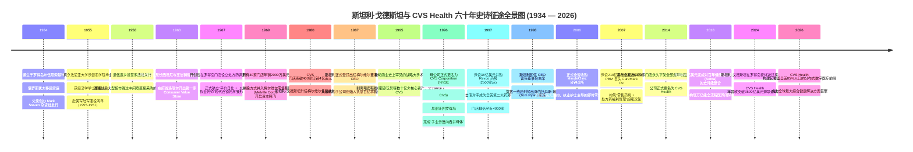
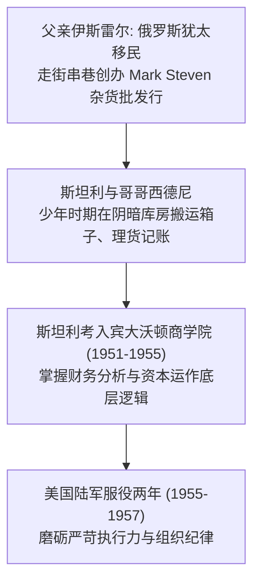
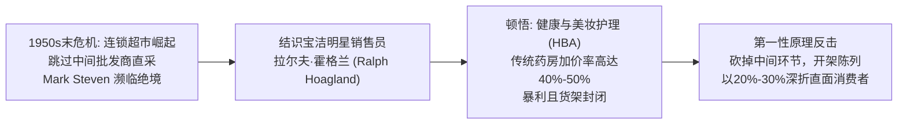
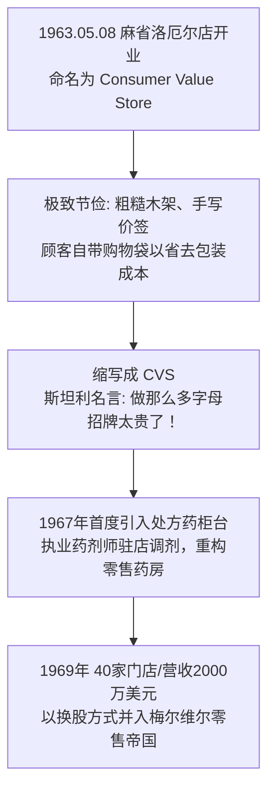
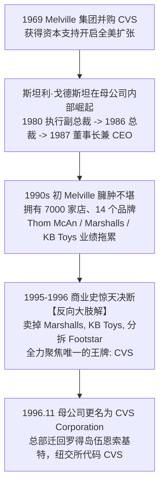
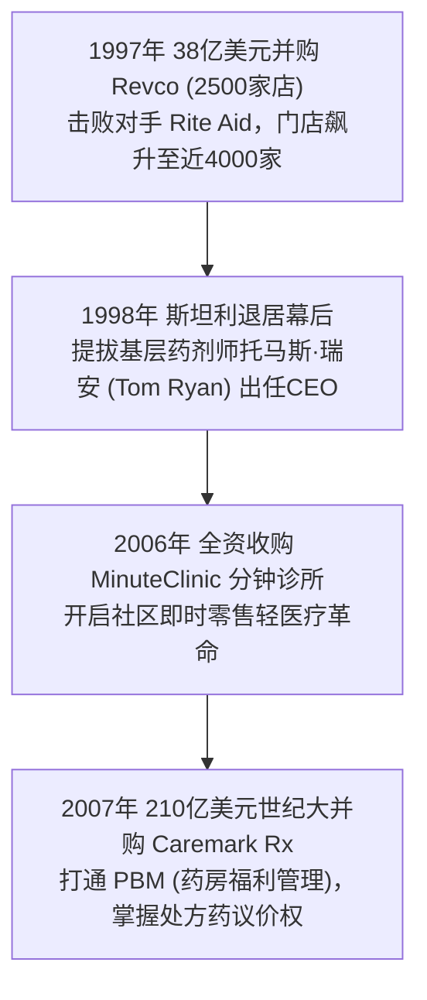
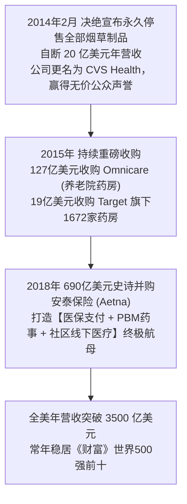
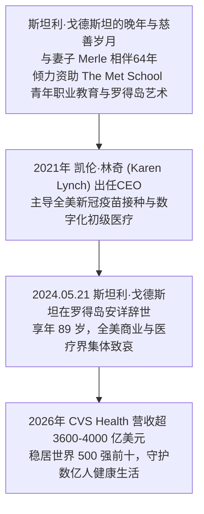

# 斯坦利·戈德斯坦 (Stanley Goldstein) 与 CVS Health：从平价杂货铺到四千亿医疗健康帝国的全景史诗传记

> **“在商业世界里，最深刻的真理往往伪装成最朴素的常识。不要整天盘算‘我们怎么才能赚到这笔利润’，你只需要日复一日地倾听消费者的声音，把实实在在的价值双手奉上，利润自然会作为副产品奔涌而来。当你的企业使命关乎人类生命与健康时，任何向暴利的妥协都是对灵魂的背叛。”**  
> —— 斯坦利·戈德斯坦 (Stanley P. Goldstein, 1934–2024)

---

```text
==================================================================================================
【传主与企业档案速览】
• 领衔奠基人：斯坦利·P·戈德斯坦 (Stanley P. Goldstein, 1934–2024)
• 联合缔造者：西德尼·戈德斯坦 (Sidney Goldstein, 1929–1995) & 拉尔夫·P·霍格兰三世 (Ralph P. Hoagland III, 1933–2020)
• 商业演进图腾：Mark Steven 批发行 (1950s) -> Consumer Value Stores (1963) -> Melville 核心资产 (1969) -> CVS Corporation (1996) -> CVS Caremark (2007) -> CVS Health (2014)
• 学历背景：宾夕法尼亚大学沃顿商学院 (Wharton School, UPenn) 经济学学士 (Class of 1955)
• 历史地位：全美最大综合医疗健康与处方药零售帝国缔造者、现代医药福利管理 (PBM) 垂直整合之父、企业反向分拆聚焦 (Reverse Metamorphosis) 商业教父
• 历史极值体量：年营业收入超 3600 亿美元（位列《财富》世界 500 强第 9 位 / 全美第 6 位），服务全美超 1 亿会员
• 标志性壮举：自断 20 亿美元营收全美首家永久禁售烟草、690 亿美元并购安泰保险 (Aetna)、打造全美最密集的社区医疗触点
• 核心精神图腾：消费者价值 (Consumer Value)、常识管理哲学、使命纯粹性溢价、反向吞噬母体、社区健康第一道大门
==================================================================================================
```

---

## 🧭 全景生命历程与 CVS 商业征途编年轴 (Chronological Epic)



---

## 🏭 第一章：纺织小镇、犹太移民批发商与沃顿商学院的理智淬炼 (1934 — 1957)

### 1. 黑色烟囱下的罗得岛移民家庭
1934 年 6 月 5 日，正值美国大萧条的至暗深渊，斯坦利·P·戈德斯坦（Stanley P. Goldstein）降生在罗得岛州北部边陲的工业重镇——伍恩索基特（Woonsocket）。

- **工业小城的灰暗底色**：20 世纪初的伍恩索基特是全美著名的纺织与橡皮工业中心，黑石河（Blackstone River）两岸林立着轰鸣的织布厂与染坊，浓密的煤烟终日笼罩着红砖瓦房。这里聚集了大量来自东欧、法裔加拿大和爱尔兰的移民劳工，生活清贫却充满顽强的生存韧性。
- **父亲伊斯雷尔·戈德斯坦 (Israel Goldstein)**：是一位从东欧沙俄迫害中逃难至美国的俄罗斯犹太移民。为了在异国他乡扎下根基，父亲在 1930 年代骑着自行车走街串巷，向杂货铺、糖果摊贩推销日用小百货。凭借微薄的积蓄与极佳的人缘，父亲在伍恩索基特创办了一家名为 **Mark Steven Service Merchandisers**（马克史蒂文商品服务行，简称 Mark Steven）的家庭日化与糖果批发行。
- **母亲埃塔·哈尔珀恩 (Etta Halpern Goldstein)**：是一位知书达理、坚韧不拔的女性，在逼仄的公寓里操持家务，并教导三个孩子：**“在犹太人的传统里，财富会因为战乱与萧条化为乌有，但脑子里的智慧、诚实的信誉以及对社区的责任，是任何人都夺不走的资产。”**



### 2. 少年时期的仓库淬炼：指尖上的毛利与搬运工
从 10 岁起，斯坦利与年长 5 岁的胞兄西德尼·戈德斯坦（Sidney Goldstein）的童年几乎都在父亲阴冷潮湿的仓库里度过。
- 当同龄孩子在街头打棒球时，兄弟俩要帮父亲搬运沉重的肥皂箱、剃须膏箱和糖果罐，用毛笔在瓦楞纸箱上手写批号，并跟着送货卡车在泥泞的乡间小道上给罗得岛和麻省边境的杂货小铺送货。
- 在这里，斯坦利学到了商业世界最底层的“账房常识”：**每一打肥皂的批发差价只有几美分，任何破损、受潮或算错账，都会将一整天的辛苦利润吞噬殆尽。**
- 哥哥西德尼性格沉稳、精通商品品类与供应链细节；而斯坦利则天生具备对商业数字、人际交往与未来趋势的极度敏锐。

### 3. 迪恩学院与沃顿商学院：从实战杂货到顶级商业思维 (1951–1955)
1951 年，斯坦利以优异成绩从当地著名的迪恩学院（Dean Academy，现 Dean College）毕业。凭借突出的数学天赋与强烈的商业志向，他成功考入常春藤名校**宾夕法尼亚大学沃顿商学院 (Wharton School, University of Pennsylvania)**。

- **沃顿商学院的系统化洗礼**：在沃顿的四年里，斯坦利系统研读了宏观经济学、公司金融、会计审计与供应链物流。在战后美国经济腾飞的大背景下，他敏锐地观察到：传统的街头夫妻老婆店与层层加价的多级分销体系，正在遭遇现代规模化零售工业的降维冲击。
- **1955 年**，21 岁的斯坦利以经济学理学学士学位（B.S. in Economics）从沃顿商学院荣耀毕业。
- **1955 至 1957 年陆军服役**：大学毕业后，斯坦利响应国家号召加入**美国陆军 (U.S. Army)** 服役两年。在军队严格的军需调配与组织管理中，他磨砺出了临危不乱的心理素质与雷厉风行的决断力。

---

## ⚡ 第二章：批发商绝境、宝洁销售员与开架平价的破晓顿悟 (1958 — 1963)

### 1. 战后零售巨变：中间商的灭顶之灾
1957 年底，23 岁退伍脱下军装的斯坦利回到伍恩索基特，正式与哥哥西德尼一同接管家族的批发企业 Mark Steven。

然而，等待他们的不是家族企业的繁荣，而是一场席卷全美的零售业生存浩劫：
- **超市革命的降维打击**：战后 1950 年代末，A&P、Safeway、First National 等巨型连锁超级市场如雨后春笋般崛起。这些超级巨头拥有庞大的采购量，开始绕过像 Mark Steven 这样的区域性日化批发商（当时被称为“货架整理商/Rack Jobbers”），直接向宝洁（P&G）、高露洁（Colgate-Palmolive）、吉列（Gillette）等大型制造厂商集中直采。
- **利润被挤压殆尽**：Mark Steven 赖以生存的传统小杂货店客户成批倒闭，上游大药厂和日化巨头不断压低给批发商的佣金返点。
- 斯坦利看着账本上逐月萎缩的现金流，在深夜的办公室里对哥哥西德尼直言：**“西德，时代变了。如果我们继续死守着给别人搬箱子的批发老路，不出五年，Mark Steven 就会被这些连锁超市彻底碾死在沙滩上。我们必须拥有自己的零售触点！”**



### 2. 宿命合伙人：宝洁金牌推销员拉尔夫·霍格兰
就在兄弟俩苦苦寻求破局出路的关键时刻，一个极具传奇色彩的年轻人走进了他们的办公室——**拉尔夫·普拉特·霍格兰三世 (Ralph Pratt Hoagland III)**。

- **精英推销员的敏锐洞察**：霍格兰出生于 1933 年，先后毕业于**普林斯顿大学 (Princeton University)** 和**哈佛商学院 (Harvard Business School, MBA)**，当时正是消费品霸主**宝洁公司 (Procter & Gamble)** 派驻新英格兰地区的金牌销售代表。
- 霍格兰每周都要前往 Mark Steven 公司推销宝洁的洗发水、肥皂与佳洁士牙膏。在与斯坦利和西德尼的频繁接触中，三个年轻人的商业野心与敏锐嗅觉瞬间产生了强烈的化学共振。
- 霍格兰向兄弟俩抛出了一份震撼的市场调研观察：
  > **“你们看看波士顿和普罗维登斯街头的传统药房（Apothecary/Drugstore）——它们把洗头膏、雪花膏和剃须刀锁在玻璃柜台后面，必须由药剂师或营业员一件件拿出来；更离谱的是，它们的加价率高达 40% 甚至 50%！工薪家庭生病买药、买日化品要付出沉重的溢价。既然折价百货（Discount Store）能席卷全美，我们为什么不能开一家专门针对‘健康与美容护理品 (Health & Beauty Aids, HBA)’的极限折扣自选店？”**

### 3. 破局第一性原理：平价、自选与去中间化
斯坦利、西德尼与霍格兰关起门来，用整整一个周末确立了颠覆性的新商业模型：
1. **彻底粉碎封闭式柜台**：采用超市化的“全开放式开架自选货架”，让顾客可以自由拿起商品阅读成分与价格；
2. **消灭一切中间溢价**：直接从日化大厂整车皮批发进货，将传统药房 40% 的毛利率压缩至 15%~20%，全线商品提供 **20%~30% 的绝对降价折扣**；
3. **薄利多销，高周转率**：不靠单件暴利赚钱，而是依靠令人发指的高库存周转速度和极致单店客流建立壁垒。

---

## 🛒 第三章：创世纪：洛厄尔第一店、自带购物袋与药房专柜革命 (1963 — 1969)



### 1. 1963年5月8日：棉纺荒漠麻省洛厄尔的第一缕火花
1963 年 5 月 8 日清晨，在马萨诸塞州洛厄尔市（Lowell）中央街与梅里马克街交汇处的一处破旧临街门面，第一家 **Consumer Value Store（消费者价值商店）** 正式推开大门公测营业。

- **为什么选择洛厄尔？**
  - 洛厄尔曾是美国工业革命的摇篮，但到了 1960 年代初，棉纺织厂大批南迁关闭，小镇失业率高企，工薪蓝领阶层对日常开销的“每一分钱折扣”都极度敏感；
  - 这里的商铺租金极其低廉，且靠近波士顿北部的交通枢纽，方便从罗得岛仓库调配卡车补货。
- **开业名场面：连购物袋都要自备的极限节俭**：
  - 店内的装修寒酸到令人难以置信：没有光鲜亮丽的霓虹灯，只有未经打磨的裸露松木货架与悬挂在天花板上的日光灯管；商品直接整箱切开摆放在地上，价格是用红色粗油笔手写的大字标签；
  - 为了把每一分钱的运营成本抠出来让利给顾客，斯坦利甚至**拒绝向顾客提供免费的纸质购物袋**。店门口立着一块手写告示牌：“为了维持全城最低价格，请顾客自备菜篮或购物袋；如需本店纸袋，每个收取 3 美分成本费。”
  - 三位创始人与几名身穿简易红色罩衫的店员一起站在过道里补货和收银。令全镇居民轰动的是，店里的佳洁士牙膏、高露洁肥皂、强生婴儿油和吉列刀片，售价竟然比街角传统药房便宜整整 30% 到 40%！
  - 开业当天，蜂拥而至的工薪家庭妇女将狭窄的通道挤得水泄不通，收银机清脆的撞针声整整响了一整天，首日营业额打破了该街区数十年的零售纪录。

### 2. 缩写传奇：“做一串大招牌的字母太贵了，就叫 CVS！”
随着第一家店的一炮而红，三个合伙人在短短几个月内迅速在麻省萨默维尔（Somerville）和布罗克顿（Brockton）连开数家分店。

在为后续连锁门店统一制作户外招牌时，广告制作商给出了昂贵的报价表：招牌按英文字母的个数单独计费。
斯坦利盯着账单，果断对霍格兰和西德尼说：
> **“‘Consumer Value Stores’ 这串名字足足有 19 个英文字母，每一个字母挂在门头都要烧掉我们一大笔安装和电费成本。顾客买我们的东西是因为我们给他们省钱，而不是因为招牌字多。把每个词的首字母提出来——就叫 CVS！既好记，又省下了大笔广告费！”**

就这样，这个后来响彻全球商业史的三个字母缩写 **“CVS”**，在最朴素的省钱本能中横空出世。

```text
==================================================================================================
【1963年初代 CVS 门店颠覆性运营模型】
• 空间布局：开架式无障碍货架，商品整箱开盖陈列，取消一切玻璃展柜隔阂
• 选品逻辑：100% 聚焦于高频、易耗的健康与美妆日化品（洗发水、香皂、牙膏、剃须刀、急救创口贴）
• 定价机制：低于传统零售指导价 20%~30%，依靠 10 倍于传统药房的高周转率实现盈利
• 人工成本：顾客自选自提，收银台统一结算，员工身着统一红色罩衫，人效比极高
==================================================================================================
```

### 3. 1967年历史性飞跃：引入处方药柜台，现代药房帝国破茧
前四年的野蛮生长中，CVS 只是一个纯粹的折扣健康美妆杂货铺，并没有配药资格。然而，斯坦利与西德尼很快意识到：**真正的健康需求核心，永远是生病时的“处方药 (Prescription Drugs)”**。顾客如果买药要去传统药店，买洗发水才来 CVS，客户的忠诚度就会被割裂。

- **1967 年**：CVS 在罗得岛州坎伯兰（Cumberland）和沃威克（Warwick）的新店中，首次开创性地在后区设立了**专业处方药调剂专柜 (Pharmacy Counter)**，并聘请全职持证执业药剂师驻店。
- 这一举措彻底重构了美国社区零售药房的物种形态：
  - **前店 (Front Store)**：售卖极致平价的日化、美妆与非处方药（OTC），聚集海量客流；
  - **后店 (Pharmacy)**：提供专业严谨的处方药调配、慢病用药咨询与患者档案管理，形成极高粘性与高毛利护城河。
- 到 **1969 年**，成立仅 6 年的 CVS 已经迅猛裂变出 **40 家连锁门店**，全系统年营业额突破 **2000 万美元**，成为新英格兰地区最具杀伤力的零售新星。

---

## 🏛️ 第四章：梅尔维尔并购、逆向渗透与“反向吞并母体”的资本奇迹 (1969 — 1996)



### 1. 1969年并入梅尔维尔：借力资本巨人的翅膀
随着门店数量快速激增，初创团队遭遇了所有高速扩张型零售企业共同的瓶颈：**流动资金枯竭与跨区域供应链建设的巨额资本开支**。

1969 年，纽约零售巨头**梅尔维尔集团 (Melville Corporation)** 的掌门人弗朗西斯·C·鲁尼（Francis C. Rooney Jr.）与鞋业大亨沃德·梅尔维尔（Ward Melville）向戈德斯坦兄弟抛出了橄榄枝。
- 梅尔维尔当时是纽交所著名的多品牌零售综合体，旗下拥有全美最大的鞋类连锁 Thom McAn 等品牌，拥有雄厚的资本与遍布全美的商场租赁网络，但正急切寻找能够抵御经济周期波动的非服装类新增长引擎。
- 双方一拍即合：梅尔维尔以全股票置换方式收购 CVS，并给予戈德斯坦兄弟极高的独立运营权，斯坦利·戈德斯坦继续担任 CVS 总裁。
- 联合创始人拉尔夫·霍格兰在交易完成后选择套现退出，去追寻他心爱的独立电影院与社会慈善事业（他在剑桥创办了著名的 Orson Welles 电影院）；而**斯坦利·戈德斯坦与兄长西德尼则选择全情留守，开启了一场长达三十年的内部资本逆袭史诗**。

### 2. 斯坦利在母公司的火箭式攀升：从子公司掌门到帝国最高统帅
在梅尔维尔雄厚资金与地产资源的加持下，斯坦利大显身手：
- **1974 年**：CVS 门店突破 100 家，年销售额突破 **1 亿美元** 大关；
- **1977 年**：收购拥有 36 家门店的新泽西 Clinton Drug and Discount 连锁，拉开外延式并购大幕；
- **1980 年**：CVS 门店突破 400 家，年销售额跨越 **4 亿美元**，成为梅尔维尔集团旗下利润率最高、现金流最稳健的王牌资产；
- **从边缘到权力核心**：斯坦利卓越的战略眼光与谦和务实的管理风格赢得了梅尔维尔董事会的极度信任。
  - **1980 年**：斯坦利被任命为母公司梅尔维尔集团高级副总裁；
  - **1985 年**：升任执行副总裁；
  - **1986 年**：出任梅尔维尔集团总裁兼首席运营官 (President & COO)；
  - **1987 年**：斯坦利·戈德斯坦正式当选为**梅尔维尔集团董事长兼首席执行官 (Chairman & CEO)**！

商业史上极为罕见的一幕诞生了：**一个在 1969 年被跨国大集团收购的小连锁店创始人，用了不到二十年时间，凭借无懈可击的业绩与领导力，最终反客为主，成为了掌控整个母体巨型集团的最高统治者！**

### 3. 1995-1996 绝世大手术：商业史上最悲壮的“反向吞噬母体”
进入 1990 年代初，梅尔维尔集团已经膨胀成一个拥有 **7000 多家门店、14 个独立零售品牌、年销售额超百亿美元** 的巨型企业巨无霸：
- 旗下不仅拥有 CVS，还拥有全美折价服饰巨头 **Marshalls**、鞋类巨头 **Thom McAn**、玩具连锁 **Kay-Bee Toys (KB Toys)**、家居软装 **Linens 'n Things**、皮具连锁 **Wilsons Leather**、男装连锁 **Chess King** 等。
- **多元化帝国的崩塌危机**：随着沃尔玛、Target 等全品类大卖场的无情碾压以及商业地产泡沫破裂，梅尔维尔旗下庞杂的服装、鞋履和玩具业务陷入了严重的同店增长停滞与亏损泥潭，母公司股价长期萎靡不振。

坐在集团 CEO 宝座上的斯坦利·戈德斯坦，做出了他一生中最具远见、也最冷酷决绝的战略决断。
在 1995 年的董事会秘密闭门会议上，斯坦利拍着桌子向全体股东与董事宣告：
> **“多元化零售综合体（Conglomerate）的时代已经彻底终结！我们在鞋服和玩具上浪费了太多的管理带宽。这个集团未来唯一的真命天子就是药房与健康服务——CVS！我们必须砍掉所有其他枝桠，把所有的非核心资产通通剥离，让母公司彻底蜕变成一家纯粹的医药健康巨头！”**

```text
==================================================================================================
【1995–1996 斯坦利·戈德斯坦主导的 Melville 世纪大拆解与聚焦工程】
• 剥离 Marshalls：以 5.5 亿美元全现金及股票出售给 TJX Companies
• 剥离 Kay-Bee Toys：以 3.15 亿美元出售给 Consolidated Stores
• 剥离分拆鞋业帝国：将拥有百年历史的 Thom McAn 与 Meldisco 分拆为独立上市公司 Footstar, Inc.
• 关停与出售非核心：先后出售 Linens 'n Things、Wilsons Leather、This End Up、Bob's Stores
• 终局蜕变 (1996.11)：母公司 Melville 彻底注销，重组更名为 CVS Corporation
• 资本与地理回归：股票代码变更为 NYSE: "CVS"，将全球总部从纽约搬回创始地罗得岛伍恩索基特
==================================================================================================
```

这场被哈佛商学院奉为“反向企业蜕变 (Reverse Metamorphosis)”经典案例的重组，彻底释放了 CVS 的全部潜能。斯坦利亲手杀死了曾经收购自己的母体，以 CVS 的血肉与灵魂重塑了整个上市公司！

---

## ⚔️ 第五章：狂暴并购大决战、托马斯·瑞安与药房福利管理霸权 (1997 — 2013)



### 1. 1997年 Revco 闪电战：38亿美元翻倍吞并
重获独立上市公司身份的 CVS，手里握着剥离非核心资产换来的数十亿美元巨额现金。斯坦利·戈德斯坦与他的接班团队没有丝毫停歇，立即向全美发起了狂风暴雨般的并购扩张。

- **1997 年 Revco 争夺战**：总部位于俄亥俄州的 **Revco D.S., Inc.** 拥有超过 **2,500 家连锁药房**，是美国中西部和东南部最大的药房网络。竞争对手 Rite Aid 曾试图以 18 亿美元敌意收购 Revco 但被联邦贸易委员会（FTC）以反垄断为由否决。
- 斯坦利与团队敏锐捕捉到战机，迅速开出 **38 亿美元**（含承接债务）的无法拒绝的现金支票，以闪电般的速度完成了对 Revco 的整体合并。
- **历史性跨越**：这起交易是当时美国医药零售史上规模最大的并购案。CVS 的门店网络一夜之间从 1,400 家狂飙至近 **4,000 家**，覆盖全美 24 个州，年销售额瞬间突破 130 亿美元，一举奠定了全美药房前两强的无可撼动地位。

### 2. 基层药剂师的传承奇迹：托马斯·瑞安 (Tom Ryan) 接棒
斯坦利·戈德斯坦一生中最伟大的管理成就之一，就是他建立的**“一线执业者治理”**人才梯队。

- **1974 年的打工药剂师**：1974 年，毕业于罗得岛大学药学院的 22 岁年轻人托马斯·瑞安（Thomas M. Ryan）加入 CVS，最初只是一名在罗得岛门店调剂药剂的普通员工。
- 斯坦利在巡店过程中发现了瑞安身上兼具药师专业敬畏与罕见商业魄力的潜质，一路对他悉心栽培与破格提拔：从店长、区域主管、药房运营副总裁，一路提拔至 CVS 总裁。
- **1998 年 5 月**：年满 64 岁的斯坦利·戈德斯坦正式卸任首席执行官，将权杖交给了托马斯·瑞安，自己继续担任董事会主席至 1999 年退休。斯坦利在交接仪式上深情说道：
  > **“CVS 的灵魂是一家为大众健康服务的药房，而不是一家冰冷的金融公司。把这艘大船交给一位从我们门店柜台里成长起来的药剂师，我比任何时候都更放心。”**

### 3. MinuteClinic 革命与 210 亿美元并购 Caremark (2006–2007)
在托马斯·瑞安与斯坦利奠定的战略轨道上，CVS 展开了两次彻底改变全美医疗格局的升维打击：

1. **2006 年：全资收购 MinuteClinic（分钟诊所）**
   - 传统美国医疗体系看病需要提前数天甚至数周预约家庭医生，急诊费用高昂且排队漫长。
   - CVS 将由执业护士（Nurse Practitioners）主导的“MinuteClinic”引入旗下数千家门店：**无需预约、7天开放、明码标价、15分钟内完成流感检测、疫苗接种、咽喉炎化验与基础慢病筛查**。
   - 这项创新把 CVS 从“卖药的地方”直接升级为“全美最大的社区基础医疗前哨”。
2. **2007 年：210 亿美元世纪大并购 Caremark Rx**
   - 传统的零售药房永远处于产业链下游，受制于掌握企业医保处方目录和定价权的**药房福利管理公司 (PBM, Pharmacy Benefit Manager)**。
   - 2007 年 3 月，CVS 斥资 **210 亿美元** 完成对全美三大 PBM 巨头之一 **Caremark Rx** 的合并，组建 **CVS Caremark Corporation**。
   - **闭环威力大爆发**：这一世纪整合将上游 9000 万企业投保人的处方药福利审核、邮寄送药、药品集采议价权，与下游近万家物理药房和分钟诊所深度打通，构筑了全美医药健康领域最强大的利益协同飞轮！

---

## 🩺 第六章：千亿决断：停售香烟、690亿吞并安泰与超级健康闭环 (2014 — 2020)



### 1. 2014年2月5日的“20亿美元豪赌”：全美首家决绝禁烟
2014 年初，已经成长为全美最大连锁药房巨擘的 CVS Caremark，面临着一个拷问灵魂的伦理悖论：
- 每年，公司通过遍布全美的 7,600 多家门店售卖香烟、雪茄和烟草制品，斩获超过 **20 亿美元** 的稳定高毛利收入；
- 但与此同时，医学界已经无可辩驳地证明烟草是导致肺癌、心脏病和慢性呼吸道疾病的头号元凶。当药剂师在后方为慢病患者配降压药和抗癌药，而前台收银员却在向青少年递上万宝路香烟时，企业的“健康使命”显得无比虚伪。

**2014 年 2 月 5 日**，时任首席执行官拉里·墨洛（Larry Merlo）在与董事会（包括退休后仍作为精神图腾的斯坦利·戈德斯坦的长期价值传承）深度审议后，向全球投下了一枚震撼商业界的深水炸弹：
> **“销售烟草产品与我们作为一家医疗保健提供商的目标有着根本的冲突。我们做出了一个不可逆的决定：CVS 将在全美所有门店永久下架所有香烟和烟草制品！为了帮助人们走上通往更好健康的道路，这是我们必须做出的正确抉择。”**

```text
==================================================================================================
【2014年 CVS 停售香烟的历史影响与商业奇迹】
• 直接财务代价：立即蒸发 20 亿美元年销售额，短期利润承压，华尔街投行一片唱衰
• 提前履约：原定 2014 年 10 月 1 日截止，CVS 提前一个月在 9 月初彻底清理完全美所有烟架
• 企业更名：公司正式由 CVS Caremark 更名为纯粹崇高的 **CVS Health**
• 历史级声誉红利：
  - 获得全美医学界、美国癌症学会及白宫总统奥巴马的最高赞誉（“为全美树立了非凡典范”）
  - 数千家注重员工健康的大型企业与地方政府，将员工医保福利订单从竞争对手处独家转移给 CVS
  - 随后几年内，CVS 在处方药、PBM 与临床服务上的新增营收，以数十倍的体量轻松覆盖了损失的20亿烟草流水！
==================================================================================================
```

### 2. 2015年两大战役：Omnicare 与 Target 药房全面整合
在禁烟带来的顶级道德声誉护城河下，CVS Health 开启了新一轮横向大兼并：
- **2015 年 5 月**：斥资 **127 亿美元** 收购全美最大的长期护理与养老机构药房服务商 **Omnicare**，将健康触角直接延伸至全美数百万养老社区与失能老人床头；
- **2015 年 6 月**：斥资 **19 亿美元** 全面收购全美第二大折扣百货巨头 **Target 旗下全部 1,672 家药房及 79 家零售诊所**，将 CVS 的专业药事服务体系直接植入 Target 的中产客群腹地。

### 3. 2018年 690 亿美元并购安泰保险 (Aetna)：人类医疗史上的终极闭环
2018 年 11 月 28 日，CVS Health 斥资 **690 亿美元**（加上承接债务总价值达 **770 亿美元**），正式完成了对拥有 165 年历史的美国健康险三巨头之一——**安泰保险 (Aetna)** 的世纪大并购。

这场并购彻底打破了美国商业历史上长达百年的行业藩篱，将三大孤立的万亿级赛道融合为一体：
1. **支付端 (Payer - Aetna)**：掌握全美超 2,200 万投保人的医保资金池与风险定价权；
2. **管理端 (PBM - Caremark)**：掌控超 1 亿人的处方药集采、药价谈判与福利报销网络；
3. **服务端 (Provider - CVS Retail & MinuteClinic & HealthHUB)**：依托全美近万家社区药房和分钟诊所，让 **85% 的美国人在方圆 5 英里之内** 都能享受到面对面的健康管理、慢性病监控与即时诊疗。

至此，斯坦利·戈德斯坦当年在棉纺小镇点燃的这簇平价杂货火苗，经过半个多世纪的持续迭代，最终演化成了一艘年营收超 3600 亿美元、掌握全美健康生命线的无敌商业巨舰。

---

## 🕊️ 第七章：传奇谢幕、精神传承与四千亿医疗帝国 (2021 — 至今)



### 1. 凯伦·林奇 (Karen S. Lynch) 时代与抗疫中流砥柱
2021 年 2 月，原安泰保险总裁凯伦·S·林奇（Karen S. Lynch）正式接任 CVS Health 总裁兼 CEO，成为执掌《财富》世界 500 强前十企业中最高职位的女性领袖。

在席卷全球的世纪新冠疫情大流行期间，CVS Health 展现出了国家级战略基础设施的强大威力：
- 依托遍布全美的大规模社区门店与分钟诊所，CVS 设立了数千个汽车穿梭（Drive-thru）核酸检测点与疫苗注射站；
- 累计完成了**超过 3,200 万次病毒检测与超 8,000 万剂次新冠疫苗接种**，成为美国公共卫生抗疫最前线的定海神针。

### 2. 斯坦利的平民晚年：查帕奎迪克岛的帆影与教育慈善
退休后的斯坦利·戈德斯坦始终保持着极度的低调与谦逊。他没有像许多华尔街大亨那样购置奢华游艇或私人飞机，而是选择长年定居在他挚爱的罗得岛，与结发 64 年的挚爱妻子**默尔·卡茨·戈德斯坦 (Merle Katz Goldstein)** 相濡以沫。

- **查帕奎迪克岛的夏日**：每年夏天，斯坦利会带着孩子和孙辈前往马萨诸塞州马萨葡萄园旁的查帕奎迪克岛（Chappaquiddick Island），在宁静的海风中阅读历史传记，驾驶小帆船出海，或者为波士顿红袜棒球队和新英格兰爱国者橄榄球队呐喊助威。
- **ELMS 基金会与 The Met School 的教育奇迹**：
  - 斯坦利通过家族 ELMS 基金会向罗得岛的教育、公共医疗和艺术机构捐赠了数千万美元；
  - 他倾注心血最多的是担任罗得岛大都会职业技术公立中学（**The Met School**, Metropolitan Regional Career and Technical Center）的董事会主席达十数年之久。这是一所专门招收贫困家庭与移民边缘青少年的创新高中，斯坦利亲自为学生们设计“每周两天深入企业真实实习”的学徒制课程，帮助成千上万名底层贫困学子打破阶级固化、走进大学与职场。

### 3. 2024年5月21日：商业巨擘安详远行
2024 年 5 月 21 日，斯坦利·P·戈德斯坦在罗得岛州的家中安详离世，享年 89 岁。

全美商业界、医疗界与罗得岛政界发表了隆重的悼词。时任 CVS Health 首席执行官凯伦·林奇在悼念声明中写道：
> **“斯坦利不仅创办了一家公司，他塑造了一种全心全意为普通人服务的商业文明。从 60 年前洛厄尔那间简陋的小铺子，到今天服务全美上亿家庭的健康港湾，斯坦利留下的常识管理哲学、对消费者的无限敬畏以及崇高的企业道德，将永远是 CVS Health 灵魂深处的北极星。”**

---

## 🧠 第八章：斯坦利·戈德斯坦与 CVS Health 八大底层认知模型 (Mental Models)

```text
==================================================================================================
【斯坦利·戈德斯坦与 CVS Health 八大传世商业与哲学认知模型】

1. 逆向吞噬与纯粹性聚焦模型 (Reverse Conglomerate Metamorphosis)
   • 核心心法：当企业多元化导致认知与资本分散时，必须具备敢于“反向肢解母体”的决绝魄力。
               砍掉所有平庸盈利的非核心枝桠，将全盘资源死死压在唯一具备指数级护城河的王牌业务上。

2. 消费者价值第一性与常识管理学 (Consumer Value & Common Sense Principle)
   • 核心心法：商业没有高深的秘诀，只有朴素的常识。不要算计如何从客户身上巧取豪夺，
               永远思考如何将成本压到极限并全额返还给消费者。满足了客户，利润是不请自来的副产品。

3. 使命纯粹性溢价与道德非对称性 (Mission Purity Asymmetry / The $2B Paradox)
   • 核心心法：当短期暴利业务（如香烟）与企业终极使命（人类健康）发生不可调和的冲突时，坚决壮士断腕。
               看似自断 20 亿美元即时营收，换来的却是千金难买的全社会顶级信任，释放出数百亿级的长期战略溢价。

4. 医药全流程三位一体闭环 (The Healthcare Trinity: Payer + PBM + Provider)
   • 核心心法：打破传统医疗中“保险买单方、中间药事管理方、终端药房诊所”三方割裂博弈的零和死局。
               通过垂直一体化整合消除交易摩擦，实现处方数据、控费算法与线下履约的无缝飞轮自转。

5. 物理触点作为分布式健康基站 (Physical Footprint as a Decentralized Health Hub)
   • 核心心法：将线下密集门店网络从单纯的“商品陈列货架”升维为“全美 85% 人口 5 英里内的医疗服务基站”。
               实体网点的不可替代性在于高频次、面对面的即时关怀与专业信任。

6. 危机倒逼的品类跃迁法则 (Crisis-Induced Category Mutation)
   • 核心心法：当传统渠道（中间批发）遭遇产业链上下游挤压濒临死局时，不要在旧泥潭里挣扎，
               果断利用自身对商品的理解，降维杀入直面终端消费者的新品类，完成由批发商到零售巨头的物种突变。

7. 分布式去中心化即时轻医疗 (Frictionless Front-Door Healthcare)
   • 核心心法：医疗服务越繁琐、预约周期越长，慢性病恶化的社会总成本就越高。
               用执业护士主导的“分钟诊所 (MinuteClinic)”作为入口，提供 15 分钟平价即时服务，化解大医院冗余负担。

8. 一线执业者治理与内生传承模型 (Frontline Practitioner Governance)
   • 核心心法：坚决杜绝脱离实际业务的空降职业经理人官僚主义。
               让从门店柜台调剂药剂、亲手服务过病患的基层药剂师（如 Tom Ryan / Larry Merlo）成长为集团统帅，
               确保企业战略的基因永远扎根在真实的泥土与患者痛点之中。
==================================================================================================
```

---

## 🎭 第九章：多维性格剖析、生活怪癖与轶事秘辛 (Anecdotes & Trivia)

### 1. “每一个英文字母都要花钱”：招牌缩写的抠门艺术
斯坦利·戈德斯坦对浪费有着近乎生理性的厌恶。1963 年在制作第一批连锁门店户外灯箱招牌时，广告公司报价每个字母需收取 50 美元制作费和每月维护费。“Consumer Value Stores” 共有 19 个英文字母，做一块招牌就要花掉近千美元。斯坦利当场拿起笔划掉了 16 个字母：“全美工薪家庭来买东西是为了省钱，不是来看我们挂长名字显摆的。只留三个字母——CVS！省下来的钱能多给客户便宜几分钱牙膏！”这一“抠门”举措不仅为公司省下了数十万美元早期资本，更误打误撞创造了全美商业史上最著名、传播力最强的高辨识度超级品牌。

### 2. 漫步管理法与走廊里的“常识测试”
即使在执掌数百亿美元资产的梅尔维尔与 CVS 集团期间，斯坦利的办公室门也永远向所有人敞开。他极度讨厌繁杂冗长的 PPT 汇报和充满商学院术语的官僚黑话。在走廊里遇到中高层管理者时，斯坦利经常会冷不丁停下来问一个极简问题：“如果你是一个带着两个生病孩子、兜里只有 20 美元的单身母亲，走进我们的店，你最希望看到什么？”如果管理者回答了一堆财务指标或毛利测算，斯坦利会摇摇头说：“回去重新想。常识是：她需要立刻找到退烧药，价格一眼看得清清楚楚，收银员给她一个温暖的微笑，让她两分钟内就能买完回家喂孩子吃药。”

### 3. 自带购物袋的传统：半个世纪的环保先锋
在 1963 年洛厄尔第一家店开业时，斯坦利为了省下包装成本，要求顾客自备购物袋，甚至在全美率先推出“自备袋子立减 3 美分”的激励政策。当时许多传统同行嘲笑 CVS“寒酸吝啬、不懂零售礼仪”。然而半个世纪后，当全球零售巨头在环保法案推动下纷纷取消免费塑料袋、推广可重复使用购物袋时，商业分析师们才惊叹地发现：斯坦利早在 1963 年就通过极致追求成本效率的本能，无意中引领了领先全人类半个世纪的绿色零售潮流。

### 4. 2014年禁烟前夜的董事会密谈
在 2014 年决定彻底禁售香烟的关键董事会前夕，部分华尔街外部董事曾激烈反对，警告称这一决定不仅会瞬间蒸发 20 亿美元营收，更会导致大量吸烟者连带不在 CVS 购买口香糖和饮料，实际损失难以估量。当时已经退休多年的斯坦利·戈德斯坦虽不在一线，但在与核心高管沟通时坚定地给予了最大的精神支持。他平静地说道：“1963 年我们创办 CVS 时，名字里写着‘Consumer Value’；后来我们增加了药房，使命就变成了守护健康。如果一个人手里拿着烟草毒害肺部，嘴里却喊着关爱健康，那这家公司就没有资格继续存在。丢掉 20 亿，我们会赢得全美人民的心。”这一表态彻底坚定了管理层壮士断腕的决心。

---

## 💬 第十章：经典名言金句中英对照 & 详尽生平重大历史年表 (Quotes & Chronology)

### 1. 传世经典名言金句中英对照 (Iconic Quotes)

1. **论商业成功的朴素本质**  
   > *“商业成功并没有什么高深莫测的魔法，它简单得就像认真倾听你的顾客。千万不要整天挖空心思想着‘我们怎样才能从这里赚到利润’。你只要全身心去满足你的顾客，把价值给足，所有的商业回报自然会水到渠成。”*  
   > _“It’s as simple as listening to your customers. Don’t think, ‘Let’s make a profit this way or that way.’ You satisfy your customers, you’ll do fine.”_

2. **论常识管理与善待员工**  
   > *“在管理人的方式上，我们不过是运用了最基本的常识。尊重每一个人，给他们尊严与成长的机会，你就自然会成为所有人最向往的工作场所。”*  
   > _“We just used common sense in the way we treated people. We became a preferred place to work.”_

3. **论企业使命与道德纯粹性**  
   > *“当一家企业的核心使命是帮助人们重获健康时，在柜台上售卖吞噬健康的香烟就是对这份承诺最刺眼的嘲讽。做正确的事，短期内或许要付出高昂的代价，但时间的复利永远站在正直与善良这一边。”*  
   > _“Selling tobacco is inconsistent with our purpose of helping people on their path to better health. Doing the right thing might carry a short-term price, but the compounding of time always favors integrity.”_

4. **论企业战略的断舍离**  
   > *“多元化的陷阱在于让你产生无所不能的幻觉。最强大的领导力不是决定去做什么，而是敢于斩断那些平庸的诱惑，把所有的筹码押在你真正能够做到世界第一的核心赛道上。”*  
   > _“The trap of diversification is the illusion of invincibility. True leadership is not about deciding what to add, but having the courage to strip away the distractions and bet everything on where you can truly be the best in the world.”_

5. **论零售药房的社会根基**  
   > *“我们从来不仅仅是在卖药或卖洗头水。每一间开在街角的 CVS 门店，都是社区居民在面对疾病、焦虑和日常琐碎时，能够走得进、靠得住的第一道温暖大门。”*  
   > _“We are never just selling pills or shampoo. Every CVS store on the corner is the trusted front door where community members turn for warmth, care, and comfort in their most vulnerable moments.”_

---

### 2. 斯坦利·戈德斯坦与 CVS 帝国详尽历史编年对照表

| 年份 | 关键历史节点与里程碑事件 |
| :--- | :--- |
| **1934** | 6月5日，斯坦利·P·戈德斯坦出生于美国罗得岛州伍恩索基特的一个俄罗斯犹太移民家庭。 |
| **1951** | 从迪恩学院 (Dean Academy) 毕业，考入宾夕法尼亚大学沃顿商学院 (Wharton School)。 |
| **1955** | 沃顿商学院经济学学士毕业；加入美国陆军服役两年 (1955–1957)。 |
| **1958** | 退役返乡与哥哥西德尼共同接掌家族日化批发企业 Mark Steven，遭遇战后大型超市直采冲击。 |
| **1960** | 斯坦利与默尔·卡茨 (Merle Katz) 结为夫妇，开启长达 64 年相濡以沫的婚姻。 |
| **1963** | 5月8日，斯坦利、西德尼与宝洁前销售代表拉尔夫·霍格兰在麻省洛厄尔开出第一家 **Consumer Value Store**。 |
| **1964** | 门店扩张至 17 家；将冗长的品牌名正式简化缩写为 **CVS**。 |
| **1967** | 开创性在罗得岛门店设立首个处方药调剂专柜 (Pharmacy)，奠定现代连锁平价药房形态。 |
| **1969** | CVS 扩张至 40 家门店、年销 2000 万美元；以股票置换方式并入梅尔维尔零售集团 (Melville Corp.)。 |
| **1974** | 门店数突破 100 家，年销售额首次跨越 **1 亿美元** 大关。托马斯·瑞安作为基层药剂师入职。 |
| **1977** | 收购新泽西 Clinton Drug and Discount Stores (36家店)，开启跨区域外延式兼并。 |
| **1980** | CVS 门店突破 400 家，年销超 4 亿美元；斯坦利·戈德斯坦出任梅尔维尔集团高级副总裁。 |
| **1986** | 斯坦利升任梅尔维尔集团总裁兼首席运营官 (President & COO)。 |
| **1987** | 斯坦利正式当选为梅尔维尔集团董事长兼首席执行官 (Chairman & CEO)，实现子公司创始人执掌母体。 |
| **1990** | CVS 门店突破 800 家，年销售额突破 20 亿美元。 |
| **1995** | 斯坦利主导史上最彻底的战略大手术：全面剥离甩卖 Marshalls、KB Toys、Footstar 等非核心资产。 |
| **1996** | 母公司正式更名为 **CVS Corporation**，在纽交所挂牌 (NYSE: `CVS`)，总部迁回罗得岛伍恩索基特。 |
| **1997** | 斥资 **38 亿美元** 并购 Revco 药房 (2500家店)，击败对手成为全美第二大药房，门店增至近 4000 家。 |
| **1998** | 斯坦利卸任 CEO，由基层药师出身的托马斯·瑞安接任；同年斥资 15 亿美元收购 Arbor Drugs。 |
| **1999** | 斯坦利正式卸任董事长退休，留任董事会；CVS 上线全美首家大型线上药房 CVS.com。 |
| **2004** | 斥资 21.5 亿美元收购 J.C. Penney 旗下的 1260 家 Eckerd 药房与零售网络。 |
| **2006** | 正式全资收购 **MinuteClinic (分钟诊所)**，开创全美无预约、执业护士主导的即时零售轻医疗。 |
| **2007** | 斥资 **210 亿美元** 完成与 PBM 巨头 **Caremark Rx** 的合并，组建 CVS Caremark，打通医保药事闭环。 |
| **2008** | 斥资 29 亿美元收购美西与夏威夷零售药房巨头 Longs Drugs (521家店)。 |
| **2011** | 药剂师出身的拉里·墨洛 (Larry Merlo) 出任 CVS 总裁兼首席执行官。 |
| **2014** | 宣布全美近 8000 家门店永久停止售卖一切烟草制品（年损20亿营收），更名为 **CVS Health**。 |
| **2015** | 斥资 127 亿美元收购 Omnicare；斥资 19 亿美元收购 Target 旗下 1672 家药房及诊所。 |
| **2018** | 斥资 **690 亿美元** 完成对百年健康险霸主安泰保险 (Aetna) 的史诗级整合，缔造全流程医养巨兽。 |
| **2021** | 凯伦·林奇 (Karen S. Lynch) 接任 CEO；CVS 承担全美数千万剂新冠疫苗与检测，成为国家抗疫支柱。 |
| **2024** | 5月21日，斯坦利·P·戈德斯坦在罗得岛家中安详辞世，享年 89 岁；CVS 营收稳居世界 500 强前十。 |
| **2026** | CVS Health 年营业收入稳定在 3600 亿-4000 亿美元区间，位列全球第9位，服务超 1 亿美国人。 |
