# 伯克希尔－哈撒韦公司 (Berkshire Hathaway Inc.) —— 全球资本配置与实业控股超级航母全景介绍

> **《财富》世界500强排名：第 11 位**  
> **年度营业收入：$371,444 百万美元（约 3714 亿美元）**  
> **市值规模：超 10,000 亿美元（全球首家突破万亿美元市值的非科技公司）**  
> **官方网站：[www.berkshirehathaway.com](https://www.berkshirehathaway.com)**

---

## 🏢 企业基本信息 (Corporate Snapshot)

| 维度 | 详细信息 |
| :--- | :--- |
| **公司全称** | 伯克希尔－哈撒韦公司 (Berkshire Hathaway Inc.) |
| **创立/重组时间** | 1839 年（源自罗德岛纺织厂 Valley Falls Company；1965年沃伦·巴菲特入主重组） |
| **全球总部** | 🇺🇸 美国 内布拉斯加州 奥马哈 (Omaha, Nebraska, Kiewit Plaza) |
| **核心掌门人/奠基者**| 沃伦·巴菲特 (Warren Buffett, 董事长兼CEO) 与 查理·芒格 (Charlie Munger, 1924–2023, 前副董事长) |
| **接班管理层** | 格雷格·阿贝尔 (Greg Abel, 非保险业务副董事长兼候任CEO)、阿吉特·贾恩 (Ajit Jain, 保险业务副董事长) |
| **股票代码** | NYSE: `BRK.A` (每股超60万美元，从不拆股) / `BRK.B` (面向大众流动性分拆股) |
| **总资产规模** | 超 1.1 万亿美元；**现金与短期美债储备常年保持 1500亿-3000亿美元** |
| **全球员工总数** | 约 39+ 万人（实业子公司合计员工总数，奥马哈总部核心仅约 26 人） |
| **核心业务赛道** | 财产与意外险/巨灾再保险、跨国铁路货运网络 (BNSF)、能源与公用事业 (BHE)、高端制造/工业/零售控股、全球巨额公开股权投资组合 |

---

## 🌐 核心业务矩阵与商业版图 (Business Ecosystem)

```mermaid
graph TD
    BRK["伯克希尔－哈撒韦资本帝国 (Berkshire Hathaway Inc.)"]
    
    BRK --> INS["1. 财产与巨灾保险 (Insurance & Float Engine)"]
    INS --> INS1["GEICO 政府雇员保险 (全美领先直销车险)"]
    INS --> INS2["通用再保险 (General Re, 全球巨灾再保险巨头)"]
    INS --> INS3["Berkshire Hathaway Reinsurance / Primary Group"]
    INS --> INS4["超 1600+ 亿美元极低/负成本长期保险浮存金 (Insurance Float)"]
    
    BRK --> RAIL["2. 铁路干线与物流基建 (Railroad)"]
    RAIL --> RAIL1["伯灵顿北方圣太菲铁路公司 (BNSF Railway)"]
    RAIL --> RAIL2["全美最大铁路网之一 (连接美国中西部与西海岸关键动脉)"]
    
    BRK --> ENG["3. 能源与公用事业 (Berkshire Hathaway Energy, BHE)"]
    ENG --> ENG1["中美能源 / 太平洋电力 / 内华达能源公司"]
    ENG --> ENG2["天然气州际长输管道网络 (全美约8%天然气输送)"]
    ENG --> ENG3["可再生能源投资 (美国风电与光伏大型基础设施)"]
    
    BRK --> MANU["4. 制造、工业、服务与零售全资控股 (Manufacturing & Retail)"]
    MANU --> MANU1["精密机件 Precision Castparts / 润滑油路博润 Lubrizol"]
    MANU --> MANU2["建筑建材预制屋 Clayton Homes / 本杰明摩尔涂料"]
    MANU --> MANU3["消费名品: 喜诗糖果 See's Candies / 冰雪皇后 Dairy Queen / 果之月 Fruit of the Loom"]
    MANU --> MANU4["供应链物流巨头 McLane Company (年入超500亿美元) / NetJets 公务机租赁"]
    
    BRK --> EQUITY["5. 公开市场巨额股权投资组合 (Public Equity Portfolio)"]
    EQUITY --> EQ1["科技龙头: 苹果公司 (Apple Inc.)"]
    EQUITY --> EQ2["金融消费: 美国运通 (Amex) / 可口可乐 (Coca-Cola) / 美国银行"]
    EQUITY --> EQ3["传统能源: 雪佛龙 (Chevron) / 西方石油 (Occidental Petroleum)"]
    EQUITY --> EQ4["国际布局: 日本五大商社 (三菱/三井/住友/伊藤忠/丸红)"]

    classDef main fill:#002244,stroke:#d4af37,stroke-width:2px,color:#fff;
    classDef branch fill:#1c3f60,stroke:#d4af37,stroke-width:1px,color:#fff;
    classDef sub fill:#f8f9fa,stroke:#002244,stroke-width:1px,color:#000;
    class BRK main;
    class INS,RAIL,ENG,MANU,EQUITY branch;
    class INS1,INS2,INS3,INS4,RAIL1,RAIL2,ENG1,ENG2,ENG3,MANU1,MANU2,MANU3,MANU4,EQ1,EQ2,EQ3,EQ4 sub;
```

---

## ⚡ 核心竞争护城河与运转逻辑 (Competitive Advantages)

### 1. 负成本保险浮存金 (Zero/Negative Cost Float) 构成的永动机
- **浮存金机制**：投保人提前缴纳保费，而理赔发生在未来数月乃至数十年后。伯克希尔保险业务（以阿吉特·贾恩掌管的巨灾险与 GEICO 为核心）长期保持承保利润，意味着这笔规模超过 **1600 亿美元** 的浮存金不仅无需支付利息，反而享有正向承保收益。
- **复利放大器**：相较于普通基金必须面临赎回压力与高昂融资利息，伯克希尔享有永久性、免赎回、无限期的资本弹药，使得巴菲特能够在市场崩溃、流动性极度枯竭时从容执行“大象级”跨周期抄底。

### 2. 极致去中心化与“放手让经理人成为企业国王”
- **总部仅 26 人**：管理着数千亿美元资产、几十万员工的伯克希尔，奥马哈总部仅有二十余名员工，无公关部、法务大军、战略规划部或冗长的审批链条。
- **神圣信托契约**：全资收购优秀实业公司后，总部绝不干预其日常运营与人事安排，只负责三件事：
  1. 资本的终极再配置（各子公司上缴利润由总部统一优化投向回报率最高处）；
  2. 选聘并激励具备商业道德与热忱的 CEO；
  3. 坚守声誉与法律红线。这种“所有权避风港”使得全球家族企业创始人乐于将毕生心血卖给伯克希尔。

### 3. “要塞级”现金储备与声誉溢价资本救火队长
- **绝不拿公司生存下赌注**：永远保持至少数百亿美元现金及短期美债，拒绝过度杠杆。在 2008 年次贷危机等系统性金融海啸中，高盛、通用电气、瑞士再保险争相以极优厚优先股条件向巴菲特“借名背书”求救，奠定了其全球终极流动性提供者的垄断地位。

---

## 📈 历史里程碑年表 (Historical Milestones)

- **1839年**：奥利弗·蔡斯（Oliver Chace）在罗德岛创立 Valley Falls 纺织厂，后与 Berkshire 制造公司、Hathaway 制造公司合并为伯克希尔－哈撒韦。
- **1962年**：沃伦·巴菲特发现股价低于营运资产净值的伯克希尔股票，开始建仓买入“烟蒂”。
- **1965年**：因管理层回购背信弃义，巴菲特愤而控股伯克希尔，接管董事会。
- **1967年**：以 860 万美元收购国民赔偿公司 (National Indemnity)，正式开启保险与浮存金商业模式。
- **1972年**：在查理·芒格主导下以 2500 万美元收购**喜诗糖果 (See's Candies)**，开启“以合理价格买伟大公司”的价值投资范式跃迁。
- **1976-1996年**：多次抄底并最终于 1996 年全资收购车险巨头 **GEICO**；阿吉特·贾恩加入创立巨灾再保险帝国。
- **1988年**：斥资约 10 亿美元重仓**可口可乐**，数年内获得超 10 倍收益，成为传世经典战役。
- **1998年**：以 160 亿美元全股票收购通用再保险 (General Re)。
- **2008年**：全球金融危机期间，向高盛（50亿美元）、通用电气（30亿美元）、比亚迪等逆势注资，大获全胜。
- **2009-2010年**：以 263 亿美元完成对**伯灵顿北方圣太菲铁路 (BNSF)** 的世纪收购，下注美国经济内陆大动脉。
- **2016年**：打破不碰科技股惯例，大举建仓**苹果公司 (Apple Inc.)**，持股市值一度突破 1700 亿美元，贡献超千亿美元账面利润。
- **2020-2024年**：斥资超 200 亿美元投资日本五大商社；增持西方石油；伯克希尔市值正式跨越 **1 万亿美元** 大关。

---

## 🎯 企业文化与治理哲学 (Operating Philosophy)

1. **伙伴关系原则 (Partnership Principle)**：把股东视为合伙人。巴菲特与芒格将 99% 以上个人净资产投入伯克希尔股票，与所有股东同甘共苦。
2. **声誉第一 (Reputation is Sacred)**：巴菲特名言：“如果要用公司的钱换取声誉，我宁可失去哪怕一分钱；但如果损失了公司的哪怕一丝声誉，我将冷酷无情。”
3. **长期主义与无期限持有**：“我们最喜欢的持有期限是——永远。”
4. **简洁诚实的沟通**：每年出版长篇《致股东信》，坦诚公布投资失误与经营细节，奥马哈“资本家狂欢节”年度股东大会成为全球投资者的朝圣地。
