# 中国石油化工集团有限公司 (Sinopec Group) —— 全球炼化与能源化工超级巨擘全景介绍

> **《财富》世界500强排名：第 12 位**  
> **年度营业收入：$364,033 百万美元（约 3640 亿美元）**  
> **企业性质：特大型中央骨干国有企业 / 国务院国资委直管中央企业**  
> **官方网站：[www.sinopec.com](http://www.sinopec.com)**

---

## 🏢 企业基本信息 (Corporate Snapshot)

| 维度 | 详细信息 |
| :--- | :--- |
| **公司全称** | 中国石油化工集团有限公司 (China Petrochemical Corporation) |
| **成立/重组时间** | 1983 年 7 月（中国石油化工总公司成立；1998年重组为集团公司） |
| **全球总部** | 🇨🇳 中国 北京市 朝阳区 朝阳门北大街 22 号 |
| **领导层架构** | 党组书记、董事长：马永生（中国工程院院士、沉积学家） |
| **主要上市主体** | 中国石化 (`600028.SH` / `00386.HK` / `SNP` / `SNO.L`) |
| **产业行业地位** | **全球第一大炼油能力企业**、全球第二大化工产品生产商、中国最大成品油与石化产品供应商 |
| **资产与员工** | 资产总额超 2.3 万亿元人民币；员工总数超 37 万人 |
| **核心业务赛道** | 石油与天然气勘探开发、炼油与石油炼制、基础化工原料与高端新材料、成品油与天然气零售分销（易捷）、氢能及地热等绿色新能源 |

---

## 🌐 核心业务矩阵与商业版图 (Business Architecture)

```mermaid
graph TD
    SINOPEC["中国石油化工集团 (Sinopec Group)"]
    
    SINOPEC --> UP["1. 上游: 油气勘探与绿色开发 (Upstream E&P)"]
    UP --> UP1["常规油气田 (胜利油田/中原油田/西北油田)"]
    UP --> UP2["深层/超深层油气突破 (顺北油气田 '地下珠峰' 攻坚)"]
    UP --> UP3["高含硫天然气田 (普光气田/元坝气田)"]
    UP --> UP4["页岩气战略基地 (涪陵页岩气田——国家级示范区)"]
    
    SINOPEC --> MID["2. 中游: 世界级炼油与高分子化工 (Refining & Chemicals)"]
    MID --> MID1["全球第一大炼油规模 (年原油加工能力超 2.5 亿吨)"]
    MID --> MID2["乙烯与芳烃制造 (镇海炼化/茂名石化/上海石化/中韩石化)"]
    MID --> MID3["高端化工新材料 (高性能碳纤维/聚烯烃弹性体 POE/医用高分子)"]
    MID --> MID4["合成树脂、合成橡胶与合成纤维三大合成材料体系"]
    
    SINOPEC --> DOWN["3. 下游: 成品油营销与综合服务 (Marketing & Retail)"]
    DOWN --> DOWN1["30,000+ 座加能站网络 (全国覆盖最广终端销售通道)"]
    DOWN --> DOWN2["易捷便利店 (Easy Joy, 全国便利店连锁门店数第一)"]
    DOWN --> DOWN3["润滑油 (长城润滑油——航天神舟飞船/高铁指定用油)"]
    DOWN --> DOWN4["航煤供应与保税船供油全球网络"]
    
    SINOPEC --> NEW["4. 新能源与低碳转型 (New Energy & Transition)"]
    NEW --> NEW1["中国第一大氢能供应商 (新疆库车万吨级绿氢示范项目)"]
    NEW --> NEW2["全国最大地热能开发运营商 (雄安新区'无烟城'地热供暖)"]
    NEW --> NEW3["万座 '油气氢电服' 综合能源服务加能站"]
    NEW --> NEW4["百万吨级 CCUS 碳捕集利用与封存项目 (齐鲁石化-胜利油田)"]

    classDef main fill:#d8232a,stroke:#ffcc00,stroke-width:2px,color:#fff;
    classDef branch fill:#8b0000,stroke:#ffcc00,stroke-width:1px,color:#fff;
    classDef sub fill:#f9f9f9,stroke:#d8232a,stroke-width:1px,color:#000;
    class SINOPEC main;
    class UP,MID,DOWN,NEW branch;
    class UP1,UP2,UP3,UP4,MID1,MID2,MID3,MID4,DOWN1,DOWN2,DOWN3,DOWN4,NEW1,NEW2,NEW3,NEW4 sub;
```

---

## ⚡ 核心竞争护城河与战略优势 (Competitive Moats)

### 1. 全球无出其右的炼化一体化规模优势与基地集群
- **规模与成本杀手**：中国石化原油一次加工能力超 2.5 亿吨/年，乙烯产能超 1500 万吨/年，形成了镇海、茂名、上海、古雷、湛江等一批千万吨级炼油、百万吨级乙烯的世界级沿海炼化一体化超级基地。原料互供、副产物充分综合利用，构筑了全球极高的单位生产成本壁垒。

### 2. 深入中国城乡经济毛细血管的 3 万座加能站与“易捷”零售帝国
- **终端零售通路垄断**：拥有超 3 万座加油（加气、加氢、充换电）站和超 2.8 万家“易捷”便利店，构成了中国规模最大的线下零售服务网络。
- **高附加值非油业务**：易捷便利店年营业收入与品牌价值高居全国连锁前列，洗车、养车、快餐、全国特色农产品直供形成强大的跨界增值飞轮。

### 3. “深地工程”与超高难度油气勘探开采自主核心技术
- **向地下万米进军**：突破顺北油气田超深断控缝洞型油气藏勘探技术，成功钻探并投产多口深度突破 8000 米乃至 9000 米的“地下珠峰”油气井；自主攻克高含硫气田（普光）安全开采净化与涪陵大型页岩气田自主压裂装备核心技术。

### 4. 绿色氢能与地热能产业领跑者
- 建成全国首个万吨级光伏绿氢制绿氨/炼油示范工程（新疆库车）；地热供暖能力覆盖超 1 亿平方米；建成全国首个百万吨级 CCUS 全产业链示范工程。

---

## 📈 历史里程碑年表 (Historical Milestones)

- **1983年7月**：经党中央、国务院批准，打破部门分割，正式成立**中国石油化工总公司**（部级），统一管理全国炼油、石化、化纤骨干企业。
- **1998年7月**：根据国务院机构改革方案，以黄河为界实施石油石化战略重组，组建**中国石油化工集团公司**。
- **2000年10月**：中国石化股份公司在香港、纽约、伦敦成功挂牌上市；次年8月在上海证券交易所成功发行 A 股。
- **2006年**：国家“十一五”重点工程——普光高含硫气田正式开工建设，攻克特大型高含硫气田开发世界级难题，“川气东送”重大工程全线启动。
- **2012年**：重庆涪陵页岩气田取得历史性勘探突破，中国页岩气开发正式迈入商业化规模化时代。
- **2021年**：中石化宣布打造“中国第一大氢能公司”，启动新疆库车绿氢示范项目；全面推进顺北“深地一号”工程。
- **2022年**：中国石化齐鲁石化-胜利油田百万吨级 CCUS 示范项目正式投产，开启中国碳捕集工业化应用新纪元。
- **2024-2026年**：深度推进高端聚烯烃、高端碳纤维自主可控攻坚，连续蝉联《财富》世界500强前15强。

---

## 🎯 企业文化与价值观 (Corporate Values)

- **企业宗旨**：为美好生活加油 (Fueling Beautiful Life)
- **企业愿景**：打造世界领先洁净能源化工公司
- **企业精神**：爱我中华、振我国威；艰苦奋斗、求真务实
- **核心价值观**：人本、责任、诚信、精细、创新、共赢
