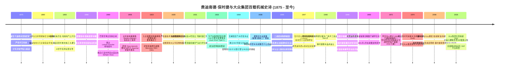
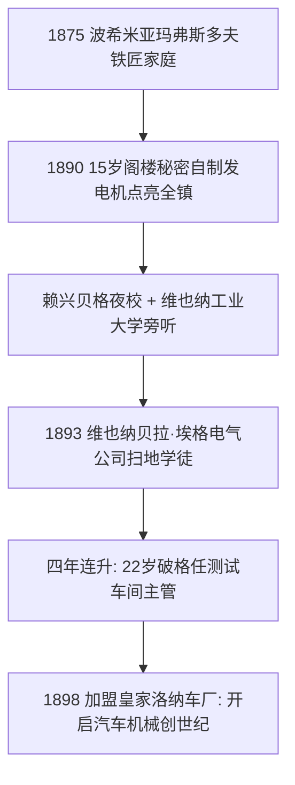
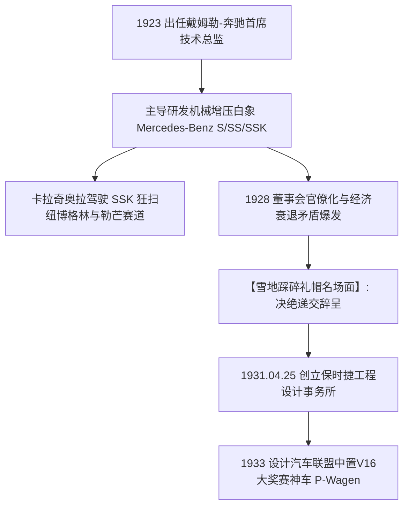
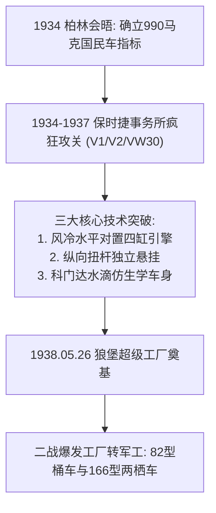
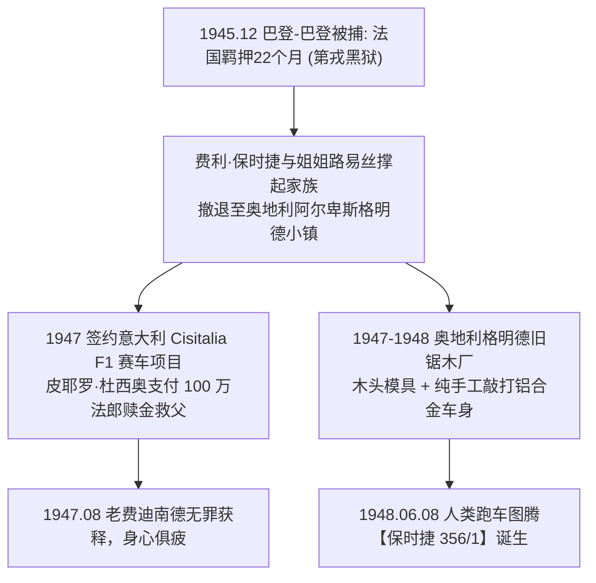
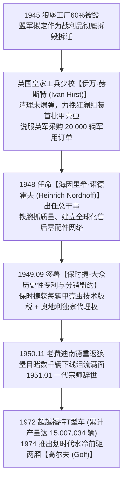
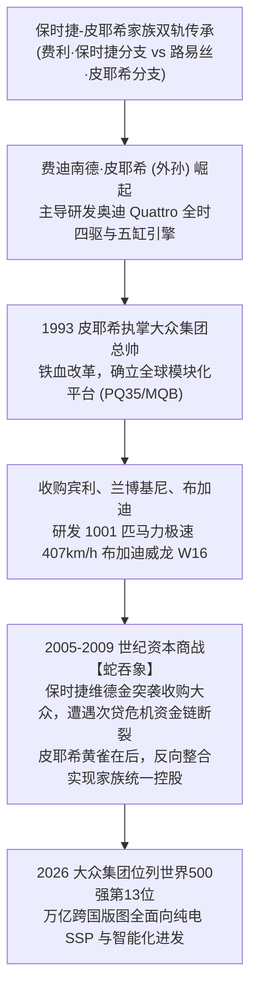

# 费迪南德·保时捷 (Ferdinand Porsche) 与大众汽车：甲壳虫神话、格明德锯木厂与欧洲汽车工业之神全景史诗传记

> **“当我环顾四周，在全世界的街道上都找不到一辆我梦想中的轻量化、高效率、充满纯粹操控激情的跑车时，我决定——自己亲手去制造一辆！汽车工程绝不是冰冷钢铁与机械零件的死板堆砌，它是人类打破空间禁锢、征服速度极限与驾驭物理法则的最高艺术。”**  
> —— 费迪南德·保时捷 (Ferdinand Porsche) & 费利·保时捷 (Ferry Porsche)

---

```text
==================================================================================================
【传主档案速览】
• 工程巨神：费迪南德·保时捷 (Ferdinand Porsche, 1875年9月3日 — 1951年1月30日) | 处女座
  - 出生地：奥匈帝国波希米亚玛弗斯多夫 (Maffersdorf, 现捷克弗拉季斯拉维采)
  - 荣誉头衔：维也纳工业大学与斯图加特工业大学荣誉工学博士 (Dr. Ing. h.c.)、德国国家艺术与科学奖
• 品牌与商业继承人：费利·保时捷 (Ferdinand Anton Ernst "Ferry" Porsche, 1909–1998, 缔造保时捷 356)
• 世纪核心创造：
  - 1900 年巴黎世博会推出人类首款轮毂电机驱动车“洛纳-保时捷 (Lohner-Porsche)”；
  - 1901 年研发出世界首款增程式油电混合动力汽车“Semper Vivus (永生号)”；
  - 1928 年主导研发横扫欧洲大奖赛的机械增压狂暴超跑梅赛德斯-奔驰 SSK / SSKL；
  - 1933 年为汽车联盟 (Auto Union) 研发革命性中置 V16 引擎大奖赛赛车 (P-Wagen)；
  - 1934 年主导设计售价仅 990 帝国马克的国民神车——大众甲壳虫 (Volkswagen Beetle / KdF-Wagen)；
  - 1948 年二战后在奥地利格明德废弃锯木厂纯手工敲打出保时捷跑车开山图腾——保时捷 356；
  - 奠定了大众汽车集团 (Volkswagen Group) 旗下大众、奥迪、保时捷、宾利、兰博基尼、斯柯达等豪门版图。
• 历史地位：20 世纪全球汽车工业最伟大的机械工程总宗师、“甲壳虫之父”、“保时捷帝国开山始祖”
• 核心精神图腾：后置风冷水平对置四缸发动机 (Boxer Flat-4)、990 帝国马克国民车、格明德锯木厂手工铝车身、狼堡大众总部
==================================================================================================
```

---

## 🧭 全景生命历程与大众帝国大编年轴 (Chronological Epic)



---

## ⚡ 第一章：铁匠熔炉、阁楼暗夜之光与维也纳学徒 (1875 — 1897)

### 1. 波希米亚铁匠之家的严苛管教与少年反叛
1875 年 9 月 3 日，费迪南德·保时捷（Ferdinand Porsche）降生在奥匈帝国北部波希米亚小镇玛弗斯多夫（Maffersdorf，现属捷克弗拉季斯拉维采）的一个德意志裔手工业者家庭。
- **父亲安东·保时捷 (Anton Porsche)**：是当地备受尊敬的白铁匠大师（Tinsmith and Plumber），经营着一间挂满马掌、铁管、镀锌铁皮与沉重风箱的手工作坊。安东性格严厉、作风专制，信奉日耳曼手艺人代代相传的师徒铁律。
- **长兄早逝的宿命重压**：安东原本寄希望于长子安东·二世继承铁匠铺，但在 1888 年的一场车间意外事故中，长兄不幸身亡。失去长子的老安东随即将目光死死锁定在二儿子费迪南德身上，要求他放下一切“不切实际的幻想”，每天在铁砧旁挥动沉重的铁锤敲打马掌和排水铁管。
- **对“无形之火”——电学的狂热痴迷**：然而，年轻的费迪南德对敲击铁皮毫无热情。在 19 世纪 80 年代末，欧洲刚刚迈入第二次工业革命的门槛，神秘而充满无限可能的“电（Electricity）”彻底俘获了少年的灵魂。他瞒着暴躁的父亲，用零花钱省吃俭用购买铜线、锌板、稀硫酸与旧电池罐，把家里的狭窄阁楼改造成了秘密电气实验室。

### 2. 15岁阁楼惊天实验：自制发电机点亮全镇首座带电民宅
费迪南德的“不务正业”多次激怒父亲。有一次，老安东在作坊里发现了儿子藏在木箱里的化学蓄电池酸液，愤怒地将电池罐摔得粉碎，勒令费迪南德彻底断绝电学实验。
- 但禁令阻挡不了天才的脚步。费迪南德在阁楼里用废弃铜线手摇绕制电枢线圈，自己打磨碳刷与换向器，硬是用双手组装出了一台能够稳定运转的小型直流发电机。
- 他在阁楼上方架设了微型配电盘，并将细铜线沿着屋檐和墙角悄悄铺设到整栋房屋的各个房间。
- **1890 年深秋的历史性一幕**：
  - 傍晚时分，老安东在暴风雨中拖着疲惫的身躯从作坊回家。当他推开家门的那一瞬间，整个保时捷宅邸突然绽放出刺眼而明亮的光芒——费迪南德在阁楼合上了电闸，整座房屋瞬间被洁白璀璨的电灯照亮！
  - 在当时的玛弗斯多夫，除了一家大型地毯纺织厂和富裕的市长官邸外，没有任何一户平民住宅拥有电灯。
  - 老安东站在通体透亮的客厅里，手中的工具箱滑落在地，震惊得说不出话来。赶来围观的邻居和镇长对少年的机械神技赞不绝口。那一晚，老安东第一次沉默地承认：自己的儿子不是平庸的铁匠，而是一个被上帝亲吻过双手的工程奇才。

### 3. 维也纳的雨夜偷师：贝拉·埃格电气公司的无名扫地僧
看清儿子的天赋后，老安东终于妥协，允许费迪南德在白天完成铁匠铺工作后，前往邻近赖兴贝格（Reichenberg）的帝国皇家国立技术学校攻读夜校课程。
- **1893 年（18岁）**：怀揣着对电气工业的狂热向往，年轻的费迪南德告别故乡，孑然一身前往奥匈帝国的心脏——维也纳。
- 他在维也纳著名的**贝拉·埃格电气公司 (Béla Egger & Co.，后来的布朗-勃法瑞 / ABB 前身)** 谋得了一份最底层的清洁工兼机械学徒差事。
- **夜校偷听与四年火箭跃升**：
  - 费迪南德没有正规大学文凭，但他每天利用下班时间潜入著名的**维也纳工业大学 (Vienna Technical University)** 阶梯教室，旁听高等数学、电磁力学与机械动力学课程。
  - 在车间里，凭借在父亲铁匠铺锤炼出的神级金属加工手艺与过人的电磁悟性，费迪南德屡屡攻克老工程师都束手无策的电动机换向器打火与绕组烧蚀难题。
  - **短短四年之内（1893–1897）**：年仅 22 岁的费迪南德从一名扫地学徒一路破格飙升为贝拉·埃格公司的**测试车间总主管 (Head of Testing Department)**，并协助开发了当时最先进的工业电动机。



---

## 🏎️ 第二章：轮毂电机、混动鼻祖与奥地利戴姆勒赛车王朝 (1898 — 1922)

### 1. 1900年巴黎世博会：洛纳-保时捷轮毂电机与“永生号”混动开山作
1898 年，维也纳著名的皇家马车制造商雅各布·洛纳（Jacob Lohner）敏锐地察觉到汽车时代的来临。洛纳对当时喧闹、震动剧烈且散发刺鼻恶臭的早期内燃机汽车深恶痛绝，他发誓要制造出一种静谧、优雅的高端电动汽车，并四处物色顶级电学工程师。
- 23 岁的费迪南德·保时捷被洛纳一眼相中，加盟雅各布·洛纳公司担任首席设计师。
- **颠覆传统的轮毂电机 (Wheel-Hub Motor)**：
  - 传统内燃机汽车需要沉重的传动轴、复杂的链条、飞轮和笨拙的变速齿轮箱，机械能量在层层传递中损耗高达 40% 以上。
  - 保时捷做出了一个震惊当时工程界的天才设想：**为什么不彻底消灭所有传动齿轮，把电动机直接做进车轮的轮毂内部？**
  - 他发明了直接驱动的轮毂电机系统，前后轴可独立配置，甚至能够实现人类历史上最早的**四轮全轮驱动 (4WD)** 与四轮刹车制动。
- **1900 年巴黎世界博览会 (Exposition Universelle 1900)**：
  - 保时捷驾驶着他设计的 **“洛纳-保时捷 (Lohner-Porsche)”** 纯电动汽车缓缓驶入巴黎大皇宫展厅。
  - 这款没有变速箱、运行如丝绸般静谧、外形优雅的电动车瞬间引爆全欧洲科技界，荣获巴黎世博会全场最高荣誉金奖。英国《汽车报》惊呼：“这是本届世博会最杰出、最颠覆的机械艺术发明！”
- **1901 年人类首台增程式油电混合动力汽车：Semper Vivus (永生号)**：
  - 纯电动洛纳-保时捷车身装载了重达 410 公斤的铅酸电池组，续航里程仅有约 50 公里，且电池极易耗尽。
  - 保时捷立即展开头脑风暴：**“如果车上自带一台发电机，一边跑一边发电呢？”**
  - **1901 年**，保时捷在底盘上加装了两台法国 De Dion-Bouton 3.5 马力单缸汽油发动机，汽油机不直接驱动车轮，而是驱动两台发电机为蓄电池组充电，再由电池向轮毂电机供电——这正是现代增程式油电混合动力（Series Hybrid）的开山鼻祖！
  - 该车被命名为 **“Semper Vivus”**（拉丁语，意为“永远鲜活/永生号”），并在 1901 年巴黎车展正式向公众震撼展示。

### 2. 皇储专职司机与奥地利戴姆勒掌舵人 (1906–1914)
- **1906 年**：保时捷卓越的技术声誉吸引了奥匈帝国最强大的工业巨头——**奥地利戴姆勒汽车公司 (Austro-Daimler)**。31 岁的保时捷正式接替保罗·戴姆勒（戈特利布·戴姆勒之子），出任奥地利戴姆勒技术总监兼首席总工程师。
- **斐迪南大公的御用司机**：
  - 凭借沉稳精准的高超驾驶技术与对机械的绝对掌控，保时捷被选为奥匈帝国皇储**弗朗茨·斐迪南大公 (Archduke Franz Ferdinand)** 的专职司机。在多次帝国军事演习中，他亲自驾驶奥地利戴姆勒豪华军车护送大公穿梭于崎岖山区。
- **1910 年亨利亲王拉力赛 (Prinz-Heinrich-Fahrt) 的技术统治**：
  - 亨利亲王拉力赛是当时欧洲难度最高、路程最严酷的长途房车赛（全程达 1,944 公里）。
  - 保时捷亲自操刀设计了一款符合流体力学原理的郁金香形水滴流线车身跑车（Prinz-Heinrich Car），并搭载 5.7 升顶置凸轮轴四缸发动机。
  - 保时捷亲自戴上风镜跳入驾驶舱飞驰，最终以巨大优势包揽比赛前三名，他本人亲自驾驶 1 号车斩获全场总冠军，威震欧洲大陆。

### 3. “萨沙”轻量化赛车与塔加·佛罗里奥传奇 (1922)
一战结束后，奥匈帝国解体，欧洲经济陷入废墟与恶性通胀。当时各大车企普遍执迷于制造排量超过 5 升、车重达数吨的笨重豪华赛车。
- 保时捷力排众议提出了超前的**“极简轻量化方程式”**：轻量化不仅能以更小排量达到惊人极速，更能以无与伦比的弯道敏捷度粉碎重型跑车。
- 在狂热赛车爱好者、奥地利电影制片人格拉夫·萨沙·科洛夫拉特-克拉科夫斯基（Count Sascha Kolowrat）的资助下，保时捷在 1922 年打造了传奇轻量化赛车 **Austro-Daimler “Sascha” ADS-R**。
  - 该车排量仅为 **1.1 升（1089cc）**，但采用了超轻铝合金气缸体与轻量化车架，整车重量仅为不可思议的 **598 公斤**！
  - **1922 年意大利西西里岛塔加·佛罗里奥大赛 (Targa Florio)**：
    - 在西西里岛险峻曲折的盘山公路上，“萨沙”赛车以灵巧至极的操控在发卡弯中肆意穿梭，一举击败了排量大其数倍的阿尔法·罗密欧与菲亚特重型赛车，斩获组别冠军与全场亚军，震惊世界车坛！

---

## ⚡ 第三章：奔驰总工程师的增压狂澜、踩碎礼帽与斯图加特破晓 (1923 — 1933)

### 1. 入主斯图加特：机械增压白象 Mercedes-Benz SSK 的速度暴政
1923 年 4 月，位于德国斯图加特翁特蒂克海姆的戴姆勒汽车公司（Daimler-Motoren-Gesellschaft，1926年与奔驰合并为戴姆勒-奔驰 Daimler-Benz AG）陷入技术危机，董事会重金礼聘费迪南德·保时捷出任戴姆勒董事会执行董事兼**首席总工程师**。



- **给引擎装上“暴怒的涡轮之肺”**：
  - 保时捷将航空引擎的罗茨式机械增压器（Roots Supercharger）技术移植到民用与赛用跑车上。
  - 他连续主导推出了汽车工业史上威名赫赫的 **Mercedes-Benz S、SS、SSK (Super Sport Kurz)** 与 **SSKL** 传奇车系。
  - 当油门踩到底、机械增压器离合器啮合的瞬间，这台 7.1 升直列六缸引擎会发出令人毛骨悚然的嘶吼，狂暴输出高达 250 至 300 匹马力，极速突破 235 km/h！
  - 德国传奇车神鲁道夫·卡拉奇奥拉（Rudolf Caracciola）驾驶着被车迷称为“白色大象（White Elephant）”的 Mercedes-Benz SSK，以摧枯拉朽之势横扫了 1920 年代末欧洲所有顶级公路拉力赛与爬山赛，奠定了梅赛德斯-奔驰统治全球高端豪华运动车型的金字招牌。

### 2. 寒冬雪地的“踩碎礼帽”事件：决绝告别大企业官僚体系
尽管战功赫赫，但保时捷与戴姆勒-奔驰董事会之间保守派官僚的矛盾日益尖锐。
- 保时捷一直渴望开发一款轻量化、低成本、普通大众都买得起的小型国民轿车，但由金融资本家主导的董事会却认为小型车利润微薄，执意要求将全部资源压在昂贵的大型豪华车上。
- **1928 年深冬的院落风暴**：
  - 在翁特蒂克海姆研发中心外的白雪皑皑的院子里，保时捷就梅赛德斯-奔驰 8/38 小型车项目的底盘刚度与成本预算，与董事会高层爆发了极其激烈的争吵。
  - 面对官僚们冷嘲热讽的质疑与层层财务掣肘，性格极其刚烈、对工程真理有洁癖的保时捷彻底暴怒。
  - 他一把扯下头上的深色软呢宽檐礼帽，狠狠摔在雪地上，当着所有高管与工程师的面，用皮靴疯狂地将其踩成一团泥泞的碎布，咆哮道：
    > **“你们这群坐在办公室里数铜板的会计师，永远也不会懂得什么是真正的汽车！如果一辆车连普通老百姓都造不起、买不起，那你们的豪华车也不过是行将就木的棺材！”**
  - 保时捷随即摔门而去，断然拒绝续签高薪合同，正式向戴姆勒-奔驰递交辞呈。在奥地利斯太尔汽车（Steyr）短暂工作一年后，他彻底下定决心：**永不再受任何大企业官僚的摆布，自己做自己的老板！**

### 3. 王冠大街24号：保时捷工程事务所与汽车联盟“中置怪兽” P-Wagen
1931 年 4 月 25 日，全球正处于大萧条的至暗时刻，56 岁的费迪南德·保时捷在德国斯图加特王冠大街 24 号（Kronenstraße 24）正式注册成立了**“保时捷名誉工学博士工程与车辆设计咨询有限公司 (Dr. Ing. h.c. F. Porsche GmbH, Konstruktionen und Beratungen für Motoren und Fahrzeugbau)”**。
- **黄金技术铁三角**：
  - 保时捷召集了追随他多年的欧洲顶级技术大脑：天才空气动力学大师**埃尔温·科门达 (Erwin Komenda)**、底盘与悬挂大师**卡尔·拉贝 (Karl Rabe)**、发动机专家**约瑟夫·卡莱斯 (Josef Kales)** 与 **弗朗茨·克萨韦尔·赖姆施皮斯 (Franz Xaver Reimspiess)**；
  - 他的儿子、年仅 22 岁便展现出极高工程与商业天分的**费利·保时捷 (Ferry Porsche)** 亦出任核心助理。
- **开天辟地的中置引擎赛车：汽车联盟 P-Wagen (Auto Union Type C)**：
  - 1933 年，国际汽联出台 750 公斤最大车重方程式。保时捷事务所接下了由四家破产车企合并而成的汽车联盟（Auto Union，奥迪前身）的赛车研发外包合同。
  - 保时捷做出了领先全人类 25 年的颠覆性创举：**将一台 6.0 升 16 缸 (V16) 机械增压发动机直接放置在驾驶员后方、后轴前方——这就是现代 F1 赛车沿用至今的“中置后驱 (Mid-Engine Layout)”架构！**
  - 这台代号为 **P-Wagen（保时捷 22 型）** 的赛车拥有恐怖的 520 匹马力，由天才车手伯恩德·罗斯迈尔（Bernd Rosemeyer）驾驶，在极速超过 380 km/h 的状态下肆虐欧洲各大赛道，与梅赛德斯“银箭”并驾齐驱，统治了 1930 年代的黄金赛车纪元。

---

## 🐞 第四章：创世纪：990帝国马克国民神车、狼堡奠基与战争泥潭 (1934 — 1945)

### 1. 柏林凯撒霍夫酒店的秘密会晤与不可能的技术红线
在 1930 年代初的德国，汽车依然是专属于贵族与巨富阶层的奢侈玩具。全德国千人汽车拥有量不足 5 辆，甚至落后于法国与英国，工薪家庭连一辆廉价摩托车都难以负担。
- 保时捷心中始终燃烧着一个梦想：制造一款结构极度简单、皮实耐用、价格低廉，能让每一个普通工人家庭开着去度假的“国民之车 (Volkswagen)”。



- **1934 年 5 月柏林凯撒霍夫酒店 (Hotel Kaiserhof) 的历史性会面**：
  - 德国新掌权当局急需一项能够收买千万底层劳工民心的标志性国家级工程。保时捷被召至柏林凯撒霍夫酒店面谈。
  - 当局向保时捷抛出了一份几乎不可能实现的极端严苛技术指标：
    1. **售价上限红线**：整车零售价**绝不能超过 990 帝国马克 (Reichsmark)**（当时德国市场上最便宜的微型车售价也在 1600 马克以上）；
    2. **空间与性能要求**：必须能够轻松容纳 2 名成年人与 3 名儿童（全家五口人），在新建的帝国高速公路上以 100 km/h 极速持续巡航；
    3. **油耗与耐用性**：百公里油耗不得超过 7 升，能够应对零下 30 度的暴雪酷寒与野外泥泞，没有私人车库露天停放也不会损坏。
  - 德国汽车工业协会（RDA）的同行们一致嘲笑保时捷疯了，断言“990 马克连买四个轮子和一套车架都不够，这在物理和经济学上都是天方夜谭”。
  - 但保时捷毫不退缩，于 **1934 年 6 月 22 日** 正式代表保时捷事务所与帝国汽车工业联合会签署了大众汽车原型车研发合同。

### 2. 机械天才的四重重构：风冷水平对置引擎、扭杆悬挂与仿生流线
为了将成本压到 990 马克的极限，同时保证坚不可摧的机械素质，保时捷在斯图加特费利家的私人车库里带领团队日夜苦战，用推倒一切传统的第一性原理完成了四项伟大重构：
1. **后置风冷水平对置四缸发动机 (Air-Cooled Boxer Flat-4 Engine)**：
   - 彻底废黜了传统汽车庞大笨重的水箱、水泵、散热器、橡胶水管与冷却防冻液。风冷设计让发动机在严寒暴风雪中永远不会结冰冻裂水箱，在沙漠烈日下永远不会沸腾开锅。
   - 水平对置活塞运动天然平衡了二阶震动，重心极低且结构极为紧凑，直接安放在后轴上方，驱动轮获得最大下压力与抓地力。
2. **中央管状脊梁车架与纵向扭杆独立悬挂 (Torsion Bar Suspension)**：
   - 保时捷发明并申请了专利的圆形扭杆弹簧悬挂，取代了笨重昂贵的多片钢板弹簧。悬挂行程长、结构紧凑、零部件极少，即使在坑洼烂路上颠簸数万公里也绝不疲劳断裂。
3. **埃尔温·科门达的水滴仿生空气动力学车身**：
   - 车身外形摒弃了当时所有方盒子车身的刀削线条，完全依据斯图加特大学风洞数据，设计出如同水滴与昆虫甲壳一般的圆弧曲线。这不仅将风阻系数降至惊人的 0.38，更利用双曲面薄钢板冲压技术，使薄钢板具备了极其强悍的抗扭刚度，省去了昂贵的内部加强横梁。
4. **甲壳虫之名诞生**：
   - 原型车代号从 V1、V2、V3 到 VW30、VW38。1938 年，《纽约时报》在报道这款奇特圆润的汽车时惊呼：“它看起来就像一只在地上爬行发光的小甲壳虫（Beetle）！”——这一全球闻名的名字自此传遍世界。

### 3. 1938年狼堡破土动工与被战争劫持的甲壳虫
- **1938 年 5 月 26 日**：在下萨克森州法勒斯莱本（Fallersleben）的一片宁静森林与沼泽地旁，举行了盛大的奠基典礼。
  - 这座当时全欧洲规模最庞大、全面引进福特底特律流水线自动化技术的超级汽车母工厂正式破土动工，周围拔地而起一座现代化的汽车新城（战后正式定名为**沃尔夫斯堡 / 狼堡 Wolfsburg**）。
  - 官方将该车命名为 **KdF-Wagen**（取自国家劳工阵线口号“Kraft durch Freude / 通过欢乐获得力量”）。
  - 全德国超过 **33.6 万名普通工人** 参加了“每周储蓄 5 帝国马克印花贴纸”的购车计划，梦想着攒满 990 马克就能提走属于自己的甲壳虫汽车。
- **战争阴云吞噬梦想**：
  - 然而，1939 年 9 月第二次世界大战全面爆发，狼堡工厂在尚未交付哪怕一辆民用甲壳虫给普通百姓之前，便被全面强行转为军用生产。德国工人们积攒的数亿马克储蓄金被军方悉数挪用，保时捷的平民国民车梦想被战争机器无情撕碎。

### 4. 军工转型的极限造物：82型桶车、166型两栖车与巨型坦克之争
在战争期间，保时捷被任命为帝国军工委员会主席。作为一名纯粹沉迷于机械极限的狂热工程师，保时捷将甲壳虫那坚不可摧的底盘架构推向了战地军用的极致：
- **82 型桶车 (Kübelwagen Type 82)**：
  - 基于甲壳虫底盘与后置风冷引擎改装的轻型越野指挥车。整车自重仅 715 公斤，在北非炽热的撒哈拉沙漠与俄罗斯零下 40 度的冰原泥泞中，由于无需冷却水且自重极轻，可靠性甚至超越了美军吉普车，累计生产超过 5 万辆。
- **166 型水陆两栖车 (Schwimmwagen Type 166)**：
  - 加装密封船体底盘、四轮驱动与后置可翻转三叶螺旋桨，成为二战中机动性最强的两栖侦察载具（累计生产超 1.4 万辆）。
- **重型装甲的狂想曲与挫败**：
  - 保时捷将其早年的油电混合驱动构想搬上了重型坦克：设计了搭载双汽油机发电驱动电动机的“保时捷虎 (VK 45.01 P)”。但由于战时铜资源极度匮乏且电控系统在极端重载下频繁过热，军方最终选择了亨舍尔公司的传统机械传动方案。
  - 保时捷底盘随后被改装为著名的“斐迪南/象式 (Ferdinand/Elefant)”重型坦克歼击车，并在战争末期设计了重达 188 吨的陆地钢铁巨兽“鼠式 (Maus)”超重型坦克。
- 这一段深深卷入战时军工体系的过往，为保时捷家族在战后埋下了毁灭性的清算伏笔。

---

## ⛓️ 第五章：至暗浩劫：法国第戎22个月黑狱、格明德锯木厂与356传奇 (1945 — 1949)



### 1. 巴登-巴登的鸿门宴：标致家族的清算与第戎监狱的暗无天日
1945 年 5 月德国战败投降，斯图加特工厂与狼堡基地沦为一片废墟，保时捷事务所的所有银行账户被盟军冻结。
- **巴登-巴登的诱捕陷阱**：
  - 1945 年 11 月，法国工业部部长兼共产党人马塞尔·保罗（Marcel Paul）通过中间人向 70 岁高龄的费迪南德·保时捷、儿子费利以及女婿安东·皮耶希（Anton Piëch）发出正式邀请，请他们前往法占区巴登-巴登（Baden-Baden），商讨协助法国雷诺公司与标致公司研发法国国民小轿车的合作协议。
  - 然而，这完全是一场精心策划的“鸿门宴”。以标致汽车家族（Peugeot）为代表的法国工业寡头绝不容许保时捷染指法国汽车工业，他们暗中向法国军法部门施压。
  - **1945 年 12 月 15 日**：保时捷一行刚抵达巴登-巴登的会谈酒店，便被法国宪兵以“涉嫌二战期间强迫法国劳工与掠夺标致工厂设备”的战犯嫌疑当场逮捕。
- **第戎监狱的 22 个月苦役**：
  - 老费迪南德与女婿安东被押解转运至巴黎，随后关押在法国第戎（Dijon）一座阴暗潮湿、建于中世纪的古老监狱中。
  - 监狱牢房阴冷刺骨，老费迪南德患上了严重的肺炎与心力衰竭。在这段长达 22 个月的漫长监禁中，法国当局甚至逼迫这位年过古稀、步履蹒跚的工程宗师在监狱冰冷的水泥地上为雷诺 4CV 小型车审查底盘图纸和修改悬挂设计。

### 2. 费利与路易丝的绝境救赎：杜西奥的百万法郎与奇西塔利亚F1
费利·保时捷在被法国关押半年后先行获释返回奥地利。此时，保时捷家族面临着有史以来最彻底的绝境：老父亲命悬一线、斯图加特总部被美军征用、全部财产被封存、法国当局开出了高达 **100 万法国法郎（约合 50 万奥地利先令）** 的天价保释金！
- 面对滔天巨浪，38 岁的费利·保时捷与意志坚如钢铁的姐姐**路易丝·皮耶希 (Louise Piëch)** 挺身而出，在奥地利克恩顿州偏远闭塞的山区小镇**格明德 (Gmünd)** 的一间废弃旧锯木厂里，重新召集了从斯图加特流散而来的数十名忠诚老工匠。
- 他们靠修理废旧农用拖拉机、水泵、割草机和水车绞盘艰难糊口，挣取每一分微薄的先令。
- **意大利工业巨子杜西奥的天降甘霖**：
  - 1947 年初，富有传奇色彩的意大利纺织大亨兼赛车手**皮耶罗·杜西奥 (Piero Dusio)** 渴望制造一辆能称霸国际汽联顶级大奖赛的超级赛车，创立了奇西塔利亚 (Cisitalia) 车队。
  - 杜西奥找到了格明德锯木厂里的费利·保时捷，委托保时捷团队为其设计一款革命性的四轮驱动大奖赛赛车（代号 Porsche Type 360 Cisitalia F1）。
  - 费利凭借该合同斩获了宝贵的设计预付款，立即将沉甸甸的 **100 万法国法郎现金** 亲自送往巴黎与第戎法庭。
  - **1947 年 8 月 5 日**：法国军事法庭正式裁定费迪南德·保时捷所有战争罪名不成立、无罪开释。在暗无天日的黑狱中被折磨了 22 个月的老费迪南德终于重见天日，步履蹒跚地回到了奥地利格明德家人的怀抱。

### 3. 奥地利格明德旧锯木厂：木模与铁锤敲打出的保时捷 356/1
获释后的老费迪南德身体极度虚弱，但年轻的费利·保时捷已经在格明德旧锯木厂里酝酿着一项彻底改变世界跑车史的伟大工程。
- **费利的终极困惑与顿悟**：
  - 费利后来在自传中写下了那段著名的创世纪心路历程：
    > *“在二战结束后的混乱岁月中，我环顾四周，寻找一辆我心目中完美的汽车：它不需要巨大的排量和昂贵的油耗，但必须小巧轻盈、极其敏捷、在阿尔卑斯山险峻的发卡弯中如离弦之箭般自由飞驰。我在市场上找遍了每一个角落，都找不到这样一辆车。于是，我决定在格明德的锯木厂里，自己动手造一辆！”*
- **木头模具上的手打铝合金交响乐**：
  - 格明德锯木厂没有任何现代化冲压机床和模具设备。
  - 工程师们先用粗糙的木头雕刻出 1:1 的车身模型框架；
  - 随后，老工匠们将一块块最薄、最轻的飞机级铝合金板料铺在木模上，**手握木槌与铁锤，一锤一锤、纯手工敲击打磨出光滑完美的流线型曲面**；
  - 底盘上，费利巧妙地复用了大众甲壳虫成熟轻巧的风冷水平对置四缸发动机、前后悬挂与转向机构，并将发动机中置强化调校，最大功率提升至 35 马力。
- **1948 年 6 月 8 日：人类跑车图腾降生**：
  - 这一天，底盘编号为 **356-001** 的两座银色敞篷铝合金跑车获得了奥地利克恩顿州政府颁发的正式公路牌照（牌照号：K45-286）——**人类历史上第一辆正式挂上“PORSCHE”车标的跑车“保时捷 356/1 Roadster”正式诞生！**
  - 老费迪南德坐进儿子亲手打造的 356 驾驶座上，在阿尔卑斯山公路上进行了长途试驾。熄火走下车后，老父亲紧紧拥抱了费利，眼含热泪赞叹道：**“费利，每一颗螺栓都完美无瑕，如果让我来造，也不会比你造得更好了！”**
  - 保时捷随后在格明德纯手工打造了 52 辆极其珍贵的铝合金 356 Gmünd Coupe 轿跑车，并于 1950 年正式迁回斯图加特祖芬豪森（Zuffenhausen），开启了横扫勒芒耐力赛与全球豪车市场的超级传奇！

---

## 🏛️ 第六章：狼堡涅槃：英国少校伊万·赫斯特、诺德霍夫铁腕与全球霸权 (1948 — 1974)



### 1. 皇家工兵少校赫斯特的废墟奇迹：从两万辆订单到拒绝拆毁
1945 年战火停息后，沃尔夫斯堡超级工厂遭遇了超过 60% 的轰炸破坏，厂区内到处是瓦砾废墟与未引爆的重磅炸弹。
- **盟军原本的死刑判决**：
  - 盟军技术委员会最初认定该工厂毫无民用工业价值，拟将其作为战利品彻底炸毁拆除。英国汽车业代表团（包括著名罗孚汽车与鲁特斯集团老板）在视察狼堡后傲慢地撰写了一份臭名昭著的评估报告：
    > *“这款名为甲壳虫的汽车外形丑陋、噪音刺耳、机械结构极其怪异。它在商业上毫无吸引力，让它投入民用生产完全是浪费资金。”*
  - 甚至连美国福特汽车掌门人亨利·福特二世在被提议免费接管狼堡工厂时也轻蔑地拒绝：“这家工厂一文不值，我连一分钱都不会投。”
- **孤胆英雄：英国工兵少校伊万·赫斯特 (Major Ivan Hirst)**：
  - 关键时刻，被派驻接管工厂的 29 岁英国皇家电机与机械工兵少校**伊万·赫斯特 (Ivan Hirst)** 展现出了惊人的远见与实干担当。
  - 赫斯特在废墟中清理出几台完好的冲压机床，组织德国留守工人排除了车间里的未爆航弹，手工拼装出了一辆民用甲壳虫供英军军官试驾。
  - 赫斯特敏锐地意识到占领区急缺轻型运输载具，他凭借高超的说服力，成功从英国军政府争取到了一笔 **20,000 辆甲壳虫的军用采购救命大单**！
  - 这笔订单让濒临拆毁的狼堡工厂瞬间复活，数万名饥寒交迫的工人们领到了面包与工资，为大众汽车保留下了最珍贵的工业火种。

### 2. 诺德霍夫铁腕治厂与1949年保时捷-大众历史性专利盟约
1948 年 1 月 1 日，英国军管当局将大众汽车的日常运营大权移交给了前欧宝汽车高级生产总监——**海因里希·诺德霍夫 (Heinrich Nordhoff)**。
- **诺德霍夫的“质量即信仰”铁腕**：
  - 诺德霍夫上任第一天便向全厂工人训话：“我们只有一条出路——把甲壳虫的质量做到全世界无可挑剔！每一辆出厂的甲壳虫，都必须像瑞士钟表一样精准耐用！”
  - 他砍掉一切多余行政开支，将利润全额投入到全球零配件分销中心与售后服务网络的建设上。无论你在全球任何偏远小镇，只要你的甲壳虫出现故障，24 小时内都能买到原厂标准化替换零件。
- **1949 年 9 月：保时捷与大众的历史性大盟约**：
  - 随着大众甲壳虫开始爆发式量产，费利·保时捷与诺德霍夫在斯图加特坐到了谈判桌前，签署了奠定两大豪门半个世纪合作基石的历史性契约：
    1. **专利与技术版税**：大众汽车正式承认费迪南德·保时捷事务所为甲壳虫的原始设计专利所有者，大众每生产一辆甲壳虫汽车，均向保时捷事务所支付固定技术特许权使用费（约合每辆 5 德国马克）；
    2. **零部件供应与技术开发外包**：大众汽车承诺以成本价向保时捷跑车提供成熟的零配件，并将大众未来的底盘与发动机研发改进外包给保时捷事务所；
    3. **奥地利独家总代理权**：由路易丝·皮耶希与费利·保时捷在萨尔茨堡创立的**保时捷控股公司 (Porsche Holding Salzburg)**，获得大众汽车与保时捷跑车在奥地利全境的独家进口与总分销垄断权。
  - 这份盟约让保时捷家族获得了源源不断、高达数亿马克的稳定现金流分红，为日后保时捷跑车帝国的研发扩张筑牢了最雄厚的财务护城河。

### 3. 1950年泪洒狼堡与一代工程宗师的安详谢幕
1950 年 11 月，在海因里希·诺德霍夫的盛情邀请下，75 岁高龄、重病初愈的老费迪南德·保时捷在儿子费利的陪同下，终于重返阔别已久的沃尔夫斯堡工厂。
- 当老人的轿车缓缓驶入厂区，眼前展现的是一望无际、整洁现代的现代化超级总装流水线。成千上万名产业工人停下手中的扳手，集体起立向这位白发苍苍的老宗师致敬。
- 在输送带末端，一辆辆崭新锃亮、漆着各种明快色彩的甲壳虫小轿车正如潮水般源源不断地下线驶向全球货运列车。
- 老费迪南德颤抖着抚摸着一辆崭新甲壳虫光滑圆润的引擎盖，眼泪夺眶而出。他紧紧握住诺德霍夫的手，激动地哽咽道：
  > **“海因里希，谢谢你……你把当年所有人都认为不可能实现的那个 990 马克疯狂梦想，变成了全人类最真实的奇迹！”**
- **1951 年 1 月 30 日**：在从狼堡返回斯图加特数周后，老费迪南德·保时捷因中风不幸逝世，享年 75 岁。一代机械工程巨神安详地闭上了双眼，长眠在奥地利滨湖采尔（Zell am See）的家族墓地中。

### 4. 席卷全球的“甲壳虫狂潮”：从DDB“Think Small”到超越福特T型车
进入 1950 至 1960 年代，大众甲壳虫以不可阻挡之势席卷全球。
- **“Think Small (想想还是小的好)”广告革命**：
  - 1959 年，纽约恒美广告公司（DDB）传奇广告大师威廉·伯恩巴克（William Bernbach）为大众甲壳虫操刀了广告史上最著名的平面广告——**“Think Small”** 与 **“Lemon”**。
  - 在当时充斥着大排量、大尾翼、奢靡浮夸的美国汽车市场，极简黑白背景下一辆不起眼的小甲壳虫，以诚实、幽默、自嘲的口吻宣示其省油、耐用、好停车的极致实用主义，彻底击穿了美国中产阶层与年轻一代的心智，单年在美国狂销超 50 万辆！
- **1972 年 2 月 17 日：登顶人类历史销量之王**：
  - 在沃尔夫斯堡总装线上，第 **15,007,034 辆（1500 万零 7034 辆）** 浅蓝色甲壳虫缓缓驶下生产线。
  - 大众甲壳虫正式打破了福特 T 型车保持了近半个世纪的世界纪录，加冕为**人类汽车工业史上累计产销量最高的单一车型**！
  - 其全球终身总产量最终定格在惊人的 **21,529,464 辆**（最后一辆初代风冷甲壳虫于 2003 年 7 月 30 日在墨西哥普埃布拉工厂荣耀下线）。

### 5. 从T1微型巴士到高尔夫Golf：欧洲汽车霸主的现代蜕变
大众并未止步于甲壳虫单一神车。
- **大众 Type 2 (Transporter / Microbus, 1950)**：
  - 基于荷兰进口商本·庞（Ben Pon）在笔记本上勾勒的几笔简单草图，大众工程师将甲壳虫底盘与发动机前移后移，打造了人类历史上首款平头厢式面包车（T1 Microbus）。它不仅是战后欧洲经济复兴的运输功臣，更在 1960 年代成为美国嬉皮士与爱与和平运动的文化图腾。
- **1974 年高尔夫 (Golf) 破晓：前驱水冷平台革命**：
  - 1970 年代初，石油危机爆发，后置风冷技术遭遇排放与空间瓶颈。
  - 大众聘请意大利当代设计宗师乔治亚罗（Giorgetto Giugiaro）操刀，推出了前置前驱、水冷四缸横置引擎、折线两厢溜背造型的划时代力作——**大众高尔夫 (Volkswagen Golf)**。
  - 高尔夫一经推出便成为风靡全球的超级新爆款（累计销量超越 3500 万辆），带领大众汽车成功完成从单一神车向现代多元汽车平台的伟大蜕变！

---

## 👑 第七章：百年豪门恩怨、皮耶希技术暴君与万亿大众帝国 (1975 — 至今)



### 1. 保时捷与皮耶希两大分支的权力博弈与暗战
老费迪南德·保时捷去世后，其庞大的商业与技术遗产被平分给了两大分支：
- **儿子费利·保时捷（Porsche 家族分支）**；
- **女儿路易丝·皮耶希（Piëch 家族分支，嫁给安东·皮耶希）**。
- 两大家族第三代子女中人才辈出，但也爆发了旷日持久的控制权争夺。
- 为了平息内耗，1972 年，费利·保时捷与路易丝·皮耶希做出铁血决断：**所有家族直系成员一律退出保时捷与大众的日常具体经营管理层，改由职业经理人打理，家族仅保留监事会控制权**。
- 这一决断逼出了一位汽车工业史上最具统治力的技术沙皇——老费迪南德的外孙**费迪南德·皮耶希 (Ferdinand Piëch)**。

### 2. “技术暴君”费迪南德·皮耶希：Quattro四驱、模块化平台与布加迪威龙
费迪南德·皮耶希（1937–2019）完美继承了外祖父老保时捷的天才工程大脑与狂暴独裁性格。
- **奥迪的逆天改命**：
  - 离开保时捷后，皮耶希加入大众旗下当时沦落为二线品牌的老化工厂奥迪（Audi）。
  - 他以一人之力推出了**奥迪 Quattro 全时四轮驱动系统**、五缸涡轮增压引擎与 TDI 柴油直喷技术，带领奥迪在 WRC 世界拉力锦标赛中大杀四方，一举将奥迪从平庸品牌提升至与奔驰、宝马平起平坐的全球一线豪华阵营。
- **1993 年入主大众集团总帅**：
  - 1993 年，大众集团陷入年亏损数亿马克的濒死绝境。皮耶希临危受命出任大众集团董事会主席兼 CEO。
  - 他力推**全球模块化汽车平台战略 (Platform Sharing)**，通过将大众高尔夫、奥迪 A3、斯柯达明锐、西雅特莱昂的底盘架构完全通用化，瞬间将大众集团的规模采购与研发成本摊薄到了极致，令集团奇迹般扭亏为盈。
- **超级豪华帝国构建狂想**：
  - 皮耶希以惊人的魄力主导收购了**宾利 (Bentley)、兰博基尼 (Lamborghini)、布加迪 (Bugatti)、斯柯达 (Škoda)、杜卡迪 (Ducati)**，并将斯堪尼亚 (Scania) 与 MAN 重卡纳入麾下。
  - 为了证明大众无可匹敌的工程极限，皮耶希力排众议斥资数亿欧元打造了搭载 8.0 升四涡轮增压 W16 引擎、拥有 **1001 匹马力、极速突破 407 km/h** 的陆地飞行器——**布加迪威龙 (Bugatti Veyron)**，震碎了全球汽车极速天花板！

### 3. 2005-2009“蛇吞象”反向收购大战：家族资本史诗与帝国终极融合
2005 年至 2009 年间，保时捷与大众之间爆发了人类现代商业并购史上最惊心动魄、跌宕起伏的“世纪收购大战”。
- **维德金的闪电偷袭**：
  - 保时捷跑车当时的传奇 CEO 文德林·维德金（Wendelin Wiedeking）在费利·保时捷之子沃尔夫冈·保时捷的支持下，利用复杂的股票期权衍生品，以年销量仅几万辆的保时捷跑车，秘密在公开市场建仓，企图以小博大、反向吞并年销量数百万辆的巨无霸大众汽车集团！
  - 截至 2008 年秋，保时捷宣布已秘密控制大众汽车超过 74% 的表决权股份与期权，引发华尔街对冲基金世纪空头踩踏，大众股价一度飙升突破 1000 欧元，短暂成为**全球市值第一大上市公司**！
- **次贷风暴与皮耶希的终极绝杀**：
  - 然而，2008 年底雷曼兄弟倒闭引发全球金融海啸，全球流动性瞬间枯竭。
  - 保时捷为了收购大众背负了超过 100 亿欧元的沉重银行借款，各大财团纷纷催债，维德金的资金链濒临断裂。
  - 此时，身任大众集团监事会主席的费迪南德·皮耶希展现出了毒蛇般冷酷的战略定力。他联合下萨克森州政府与德国工会，卡住大众资产注入保时捷的通道，逼迫保时捷断臂求生。
  - 最终，维德金引咎辞职，两大家族达成终极和解：**大众汽车集团以全现金收购了保时捷汽车股份公司 (Porsche AG) 100% 的造车业务；而保时捷-皮耶希家族控股的保时捷汽车控股公司 (Porsche SE) 则反向持有大众汽车集团 53.3% 的表决权投票股份！**
  - 兜兜转转近百年，大众与保时捷这对孪生巨人最终以最牢固的资本血缘结构彻底合二为一，保时捷家族稳稳坐上了欧洲最大工业帝国的最高王座。

### 4. 迈向万亿产值的新纪元：电动化转型与世界500强前沿
截至 2026 年，大众汽车集团在全球 150 多个国家拥有超过 110 座现代化制造基地与 65 万名员工，年营收突破 **3400 亿美元**，在《财富》世界 500 强排行榜中稳居第 13 位，领跑欧洲整个现代工业体系。
- 集团全面推进 SSP 纯电可扩展平台、CARIAD 智能座舱与自动驾驶架构，以及与全球顶尖动力电池与智能科技企业的深度结盟。
- 从 1875 年波希米亚铁匠阁楼里的一星微弱火花，到 1900 年巴黎世博会的轮毂电车，再到如今席卷全球五大洲的千万辆汽车帝国，费迪南德·保时捷与费利·保时捷父子用跨越一个多世纪的工程信仰，写下了人类工业史上最瑰丽的传奇史诗！

---

## 🧠 第八章：保时捷父子八大底层认知工具箱与工程哲学 (Mental Models)

```text
==================================================================================================
【保时捷家族八大传世底层工程与商业认知模型】

1. 极致轻量化与机械极简定律 (Extreme Lightweight & Simplicity)
   • 核心心法：马力可以在直道上加速，但轻量化可以在任何弯道与地形中飞翔。
               消灭一切冗余的中间机械传动机构，每一克车身重量的削减都直接转化为操控响应与燃油效率。

2. 平台模块化衍生复用模型 (Modular Platform Cascading & Synergy)
   • 核心心法：打造一套经过极端环境考验的底层成熟机械架构（如甲壳虫平台/MQB平台），
               既能向下衍生出普及数千万家庭的廉价国民车，又能向上衍生出称霸赛道的顶级超跑（356），实现研发成本最大化复利。

3. 从赛道极限反哺民用量产 (Motorsport-to-Road Innovation Loop)
   • 核心心法：赛道是测试工程极限最残忍的实验室。
               在勒芒24小时、塔加·佛罗里奥与纽博格林北环承受过数千小时超极限运转的技术（如机械增压、中置引擎、双离合PDK、碳陶刹车），
               下放到民用车上时将具备坚不可摧的降维打击可靠性。

4. 极端约束催生颠覆设计 (Constraint-Driven Breakthrough / The 990-Mark Mandate)
   • 核心心法：宽松的预算只能堆砌平庸，极端的限制才能逼出天才。
               990马克的严苛成本红线直接逼出了无水箱风冷水平对置引擎、纵向扭杆与冲压仿生流线车身等三大百年革命。

5. 仿生空气动力学第一性原理 (Aerodynamic Organic Form Follows Physics)
   • 核心心法：外形设计绝不是设计师主观审美的炫技涂抹，而是物理定律与空气阻力在风洞中的具象雕刻。
               水滴与甲壳虫的双曲面形态天然具备最低风阻与最高结构刚度。

6. 模块解耦与热管理独立性 (Self-Sustaining Thermal Autonomy / Air-Cooled Philosophy)
   • 核心心法：系统中多一个复杂零件，就多一万个失效概率。
               废除水冷循环回路，依靠空气动力流场带走热量，消灭冻结与开锅的物理根源，使机械系统在零下40度至50度均具备全天候生存力。

7. 家族股权制衡与双轨驱动架构 (Dual-Track Dynasty Architecture)
   • 核心心法：将所有权（家族控股）与经营权（职业经理人）严格解耦；
               用双家族分支（保时捷 vs 皮耶希）相互监督制衡，避免单一家长独裁盲区，在资本危机时形成战略互锁。

8. 痛点自造与梦想创造定律 (The Void-Filling Creation Principle / Build What Doesn't Exist)
   • 核心心法：“当我环顾四周找不到梦想中的汽车时，我决定亲手去制造它。”
               不要试图通过平庸的市场调研去迎合大众已有的妥协，以第一性直觉创造前所未有的极致产品，市场自会被你重构。
==================================================================================================
```

---

## 🎭 第九章：多维性格剖析、生活怪癖与轶事秘辛 (Anecdotes & Trivia)

### 1. 暴躁宗师与“雪地踩碎礼帽”
老费迪南德·保时捷拥有典型的波希米亚日耳曼工匠脾气——对工程精度极度狂热，对官僚敷衍有着零容忍的暴怒。
- 在戴姆勒-奔驰担任首席总工期间，每当绘图员拿出的图纸存在公差瑕疵或机械死角时，保时捷会抓起红铅笔狠狠在图纸上打上巨大的叉，甚至将图纸撕得粉碎摔在地上。
- 1928 年在戴姆勒-奔驰院落的积雪中踩碎软呢礼帽拂袖而去的故事，成为德国工业界流传近百年的经典名场面。保时捷的助手们后来回忆：“博士的暴怒就像夏天的雷阵雨，来得极其猛烈，但他永远对事不对人；一旦你攻克了技术难题，他会像慈父一样掏出最好的雪茄请你抽。”

### 2. 无需计算尺的“机械透视眼”与餐巾纸草图
保时捷具备令同时代所有顶级工程师惊叹的“三维空间机械直觉”。
- 在计算机甚至精密滑尺尚未普及的年代，保时捷在构思一台复杂的多气门引擎或行星齿轮传动机构时，完全不需要列出繁琐的偏微分力学计算式。
- 他经常在维也纳或斯图加特的小咖啡馆里，一边抽着香烟，一边在粗糙的餐巾纸或香烟盒背面，用铅笔徒手绘制出比例分毫不差的齿轮啮合剖面图与悬挂几何摆臂草图。
- 助手卡尔·拉贝曾按照保时捷在餐巾纸上随手画出的扭杆弹簧尺寸进行长达数周的高等数学应力校核，最终得出的力学最优解与保时捷的直觉草图误差**不足千分之二**！

### 3. 终身未受过正规大学工程教育的“荣誉工学博士”
令人难以置信的是，这位设计出人类首款轮毂电机、首款增程式混动、奔驰 SSK、中置 V16 赛车、大众甲壳虫与虎式坦克的机械巨神，**一生从未获得过任何一所正规大学的本科工程学士学位**！
- 他的全部知识均来自于父亲铁匠铺的千锤百炼、维也纳工业大学的夜间旁听，以及数十年如一日的车间亲手拆解。
- 1917 年，维也纳工业大学鉴于其在航空发动机与军事工程领域的开创性贡献，破格向其授予了**荣誉工学博士学位 (Dr. Ing. h.c.)**；
- 1924 年，斯图加特工业大学再次向其授予荣誉博士学位；
- 保时捷极为珍惜这一头衔，他一生创办的所有事务所和企业名称中，均自豪地冠以 **“Dr. Ing. h.c.”** 的前缀。

### 4. 格明德锯木厂的“手工铝板交响乐”
1948 年在奥地利格明德制造保时捷 356 原型车时，由于锯木厂旁边就是湍急的山间溪流和简陋的水力木材切割车间，整座小镇每天回荡着震耳欲聋的金属敲打声。
- 费利·保时捷与十几名老工匠每天穿着粗布工装裤，满手沾满机油与铝屑，趴在木制模具上挥舞木槌。
- 当地村民以为这群人在制造农用翻斗车，直到一辆银光闪闪、线条优美如天鹅般的 356 敞篷跑车发出低沉悦耳的轰鸣驶出锯木厂大门时，全镇居民纷纷脱帽惊呼。这辆在锯木厂里诞生的手工跑车，日后被纽约现代艺术博物馆（MoMA）永久珍藏为“20世纪人类工业设计的至高艺术品”。

---

## 💬 第十章：传世经典名言金句中英对照 (Iconic Quotes)

1. **论独立创造与梦想的终极起源**  
   > *“当我环顾四周，寻找一辆小巧、轻盈且高效的跑车而不可得时，我决定自己亲手制造一辆。”*  
   > _“In the beginning, I looked around and could not find quite the car I dreamed of which was small, lightweight, and uses energy efficiently. So I decided to build it myself.”_  
   > —— 费利·保时捷 (Ferry Porsche, 1948)

2. **论完美工程与功能美学的合一**  
   > *“一辆设计完美的汽车，应当在它静止不动的状态下，就让人能够从其流线中直观地看到它的极速与力量；功能决定形态，物理定律是最高的美学导师。”*  
   > _“A design that is valid must be imperatively functional. The shape must follow the physical laws of nature without superfluous ornamentation.”_  
   > —— 费迪南德·保时捷 (Ferdinand Porsche)

3. **论赛道极限与民用可靠性**  
   > *“最好的汽车不是在实验室里被算出来的，而是在最残忍的赛道终点线上被铸造出来的。经得起勒芒与阿尔卑斯山严酷考验的机械，才能陪伴普通人一生。”*  
   > _“The ultimate test of automotive engineering is not found in sterile laboratories, but across the brutal finish lines of motorsport endurance.”_  
   > —— 费迪南德·保时捷 (Ferdinand Porsche)

4. **论轻量化对大马力的降维打击**  
   > *“马力让你在直线加速上飞快，但极致的轻量化让你在每一个弯道中掌控全场。”*  
   > _“Excess horsepower makes you fast on the straights; extreme lightweight makes you fast everywhere.”_  
   > —— 费利·保时捷 (Ferry Porsche)

5. **论大众国民车的平民信仰**  
   > *“如果一辆汽车只能为极少数巨富阶层服务，那么它不过是一件精致的奢侈品玩具；真正的汽车工业文明，应当让每一个辛勤劳作的普通家庭都能握住方向盘，驶向远方的自由与阳光。”*  
   > _“If an automobile can only be afforded by the wealthy few, it remains merely a luxury toy. The true destiny of the automotive industry is to put the steering wheel into the hands of every working family.”_  
   > —— 费迪南德·保时捷 (Ferdinand Porsche, 1934)

6. **论直面失败与坚守第一性原理**  
   > *“在工程创新的漫长道路上，如果你从未被别人嘲笑为疯子，那只能说明你的步伐迈得还不够远。物理定律从不向世俗的妥协屈服，你唯有打破常规，才能开辟新的天地。”*  
   > _“If people don't occasionally think your ideas are completely crazy, you're not innovating aggressively enough. The laws of physics never compromise with mediocrity.”_  
   > —— 费迪南德·皮耶希 (Ferdinand Piëch)

---

## 📅 附录：费迪南德·保时捷与大众帝国重大历史编年表 (1875 — 2026)

| 历史年份 | 关键历史节点与里程碑事件 |
| :--- | :--- |
| **1875年9月3日** | 费迪南德·保时捷出生于奥匈帝国波希米亚小镇玛弗斯多夫的白铁匠家庭。 |
| **1890年** | 15岁在自家阁楼秘密自制小型直流发电机与配电系统，点亮全镇首座带电平民住宅。 |
| **1893年** | 赴维也纳贝拉·埃格电气公司当学徒，夜间旁听维也纳工大课程，四年内破格升任测试车间主管。 |
| **1898年** | 加盟维也纳雅各布·洛纳皇家车辆厂，担任首席汽车设计师。 |
| **1900年** | 巴黎世博会推出轮毂电机驱动车 Lohner-Porsche，荣获最高金奖，艳惊欧洲。 |
| **1901年** | 打造人类首款增程式油电混合动力汽车“Semper Vivus (永生号)”，开启混动先河。 |
| **1906年** | 接替保罗·戴姆勒出任奥匈戴姆勒 (Austro-Daimler) 首席总工程师兼技术总监。 |
| **1909年9月19日** | 儿子费利·保时捷 (Ferdinand Anton Ernst "Ferry" Porsche) 诞生于奥地利维也纳新城。 |
| **1910年** | 保时捷亲自驾驶水滴形 Prinz-Heinrich 赛车斩获亨利亲王长途拉力赛全场总冠军。 |
| **1917年** | 荣获维也纳工业大学授予的荣誉工学博士学位 (Dr. Ing. h.c.)。 |
| **1922年** | 研发出仅重 598 公斤的超轻量化赛车 Austro-Daimler “Sascha”，在塔加·佛罗里奥大赛一战封神。 |
| **1923年** | 入主斯图加特戴姆勒汽车公司出任首席总工程师，主导研发机械增压超跑 Mercedes SSK / SSKL。 |
| **1928年** | 因坚持小型车与工程理念分歧，在雪地怒掷踩碎礼帽，决绝辞别戴姆勒-奔驰。 |
| **1931年4月25日** | 在斯图加特王冠大街 24 号创立【保时捷工程设计事务所】，开启独立设计外包传奇。 |
| **1933年** | 为汽车联盟设计中置 V16 机械增压大奖赛赛车 P-Wagen (Type C)，统治纽博格林赛道。 |
| **1934年6月22日** | 签署国民汽车研发合同，受命以 990 帝国马克上限研发大众甲壳虫 (KdF-Wagen)。 |
| **1936-1937年** | 攻克后置风冷水平对置引擎与纵向扭杆悬挂，完成 VW30 / VW38 原型车数百万公里极限路试。 |
| **1938年5月26日** | 沃尔夫斯堡 (狼堡) 超级工厂举行隆重奠基典礼，现代汽车城破土动工。 |
| **1939-1944年** | 二战期间狼堡转产军工，保时捷主导研发 82 型桶车、166 型两栖车与象式坦克歼击车。 |
| **1945年12月** | 保时捷父子在巴登-巴登被捕，老费迪南德在法国第戎监狱遭受长达 22 个月苦役监禁。 |
| **1947年8月5日** | 费利以奇西塔利亚 F1 设计合同获得的 100 万法郎赎金救出父亲，老费迪南德无罪获释。 |
| **1948年6月8日** | 费利在奥地利格明德旧锯木厂纯手工造出首辆【保时捷 356/1】，保时捷跑车品牌诞生。 |
| **1948年** | 英国工兵少校伊万·赫斯特挽救狼堡废墟；海因里希·诺德霍夫出任大众汽车总干事。 |
| **1949年9月** | 签署历史性《保时捷-大众技术与分销协议》，确立甲壳虫专利版税与奥地利独家代理权。 |
| **1950年11月** | 75 岁老费迪南德重返狼堡，目睹数千辆甲壳虫流水线下线，泪洒现场。 |
| **1951年1月30日** | 费迪南德·保时捷在斯图加特因中风逝世，享年 75 岁，一代工程宗师长眠滨湖采尔。 |
| **1959年** | 纽约 DDB 推出划时代“Think Small”广告战役，甲壳虫席卷全美与全球市场。 |
| **1972年2月17日** | 第 15,007,034 辆甲壳虫下线，正式超越福特 T 型车登顶人类历史上最畅销单一车型。 |
| **1974年** | 乔治亚罗操刀的前驱水冷两厢掀背车【高尔夫 (Golf)】发布，开启大众现代平台化新纪元。 |
| **1993年** | 外孙费迪南德·皮耶希出任大众集团董事会主席，力推模块化平台与超级豪华品牌矩阵。 |
| **1998年3月27日** | 费利·保时捷在奥地利滨湖采尔逝世，享年 88 岁。 |
| **2003年7月30日** | 最后一辆初代经典风冷甲壳虫在墨西哥普埃布拉工厂下线，全球累计总产量超 2152 万辆。 |
| **2005-2009年** | 保时捷与大众爆发世纪“蛇吞象”反向收购大战，最终形成家族控股大众集团的终极格局。 |
| **2026年** | 大众汽车集团年营收超 3400 亿美元蝉联《财富》世界500强第13位，加速全线电动化。 |
