# 埃克森美孚公司 (ExxonMobil Corporation) —— 全球能源化工超级霸主与一体化巨擘全景介绍

> **《财富》世界500强排名：第 15 位**  
> **年度营业收入：$332,238 百万美元（约 3322 亿美元）**  
> **市值规模：约 4500-5000 亿美元（全球市值最高、盈利能力最强的传统能源巨头）**  
> **官方网站：[corporate.exxonmobil.com](https://corporate.exxonmobil.com)**

---

## 🏢 企业基本信息 (Corporate Snapshot)

| 维度 | 详细信息 |
| :--- | :--- |
| **公司全称** | 埃克森美孚公司 (ExxonMobil Corporation) |
| **起源/重组时间** | 1870 年（约翰·D·洛克菲勒创立标准石油；1999年埃克森与美孚完成 810 亿美元世纪合并） |
| **全球总部** | 🇺🇸 美国 德克萨斯州 斯普林 (Spring, Texas) |
| **历史鼻祖** | 约翰·D·洛克菲勒 (John D. Rockefeller) |
| **现任 CEO** | 达伦·伍兹 (Darren Woods, 董事长兼首席执行官) |
| **股票代码** | NYSE: `XOM` (道琼斯工业指数、标普500指数核心巨头) |
| **全球员工总数** | 约 **6.2+ 万人** |
| **油气日产量** | 约 380-450 万桶油当量/天（全球非国家石油公司中规模第一） |
| **核心业务赛道** | 上游油气勘探开采 (Upstream)、产品解决方案 (Product Solutions: 炼油/成品油/美孚润滑油/高端石化)、低碳解决方案 (Low Carbon Solutions: 碳捕集利用与封存 CCS/氢能/生物燃料) |

---

## 🌐 核心业务矩阵与全球版图 (Business Ecosystem)

```mermaid
graph TD
    XOM["埃克森美孚全球帝国 (ExxonMobil Corporation)"]
    
    XOM --> UP["1. 上游勘探开发 (Upstream)"]
    UP --> UP1["南美圭亚那深海油田 (Stabroek区块 - 超110亿桶储量)"]
    UP --> UP2["美国二叠纪盆地页岩油 (Permian Basin / 整合先锋自然资源)"]
    UP --> UP3["全球液化天然气 LNG 枢纽 (卡塔尔/澳大利亚/巴布亚新几内亚/莫桑比克)"]
    UP --> UP4["墨西哥湾深水油气与超深海钻探"]
    
    XOM --> PROD["2. 炼油与特种产品解决方案 (Product Solutions)"]
    PROD --> PR1["世界级沿海炼化一体化基地 (德州贝敦/新加坡/比利时安特卫普)"]
    PROD --> PR2["美孚 1 号 (Mobil 1) 全球全合成润滑油第一品牌"]
    PROD --> PR3["高性能聚合物、合成橡胶与特种石化催化剂"]
    PROD --> PR4["埃克森美孚航空燃油与全球航运船供油"]
    
    XOM --> LOW["3. 低碳前沿解决方案 (Low Carbon Solutions)"]
    LOW --> L1["全球最大碳捕集与封存 (CCS) 商业网络 (年捕集数千万吨协议)"]
    LOW --> L2["低碳氢能与低碳合成氨制造基地"]
    LOW --> L3["先进生物柴油与可持续航空燃料 (SAF)"]
    LOW --> L4["阿肯色州盐水提锂新能源电池级材料 (Mobil Lithium)"]

    classDef main fill:#e31b23,stroke:#0c2340,stroke-width:2px,color:#fff;
    classDef branch fill:#0c2340,stroke:#e31b23,stroke-width:1px,color:#fff;
    classDef sub fill:#f8f9fa,stroke:#0c2340,stroke-width:1px,color:#000;
    class XOM main;
    class UP,PROD,LOW branch;
    class UP1,UP2,UP3,UP4,PR1,PR2,PR3,PR4,L1,L2,L3,L4 sub;
```

---

## ⚡ 核心竞争护城河与工业壁垒 (Competitive Moats)

### 1. 全球顶级低成本、高回报上游核心资产垄断
- **圭亚那深海油田奇迹**：在南美圭亚那海域发现超过 110 亿桶优质油气储量，不仅开采成本低至每桶 30 美元以下，且通过 FPSO（浮式生产储卸油船）实现极速商业化投产，成为全球最赚钱的深海油田之一。
- **二叠纪盆地超级霸主**：2023-2024 年以 600 亿美元收购先锋自然资源（Pioneer Natural Resources），在北美最核心的二叠纪盆地掌控超高品质连续作业区块，日产量突破 130 万桶油当量，奠定了无可动摇的低成本页岩油产能霸权。

### 2. 炼化一体化基地与高附加值化学品协同
- 拥有全球规模最大的炼油与石化一体化基地网络（如美国贝敦炼厂、新加坡裕廊岛炼厂），原料自给自足、蒸汽热能循环利用、中间馏分油与高分子化学品灵活切换，使得埃克森美孚在经历极端油价暴跌周期时，下游高毛利石化与润滑油业务能够形成完美的业绩减震缓冲垫。

### 3. 冷酷严谨的资本支出纪律与 OIMS 安全管理
- **OIMS (Operations Integrity Management System)**：建立全球工业界最严密的运营完整性管理系统，将工程事故风险降至最低。
- **逆周期投资大师**：在行业繁荣期坚决控制盲目并购，在行业冰点期凭借坚如磐石的资产负债表从容抄底核心资源。

---

## 📈 历史里程碑年表 (Historical Milestones)

- **1870年**：约翰·D·洛克菲勒在俄亥俄州克利夫兰创立**标准石油公司 (Standard Oil)**。
- **1882年**：建立世界上第一个托拉斯垄断组织——标准石油托拉斯。
- **1911年**：美国联邦最高法院依据《谢尔曼反托拉斯法》判决将标准石油拆分为 34 家独立公司，其中最大两家为**新泽西标准石油 (Standard Oil of New Jersey, 后演变为 Exxon)** 与 **纽约标准石油 (Standard Oil of New York, 后演变为 Mobil)**。
- **1972年**：新泽西标准石油正式更名为**埃克森 (Exxon)**。
- **1999年**：埃克森与美孚完成震惊世界的 **810 亿美元合并**，两大标准石油核心后裔世纪重聚，成立埃克森美孚 (ExxonMobil)。
- **2015年**：在南美圭亚那海域获得世界级历史性油气大发现（Liza 油田）。
- **2021年**：正式设立“低碳解决方案 (Low Carbon Solutions)”独立业务部门，斥巨资进军 CCS 碳捕集。
- **2023-2024年**：以 600 亿美元全股票收购北美页岩油龙头**先锋自然资源 (Pioneer Natural Resources)**；启动 Mobil Lithium 盐水锂矿项目。
- **2024-2026年**：年净利润突破 360-400 亿美元，连续蝉联全球盈利能力最强的综合性能源帝国。

---

## 🎯 企业文化与价值观 (Operating Principles)

1. **安全与运营诚信至上 (Safety First)**：无人身伤亡、无环境污染是所有商业利益的先决红线。
2. **严苛的工程理性主义**：基于严格的数据量化分析与严谨的地质物理模型进行万亿级资本决策。
3. **长期股东价值创造**：无惧短期大宗商品价格波动，专注于全生命周期资本回报率 (ROCE)。
