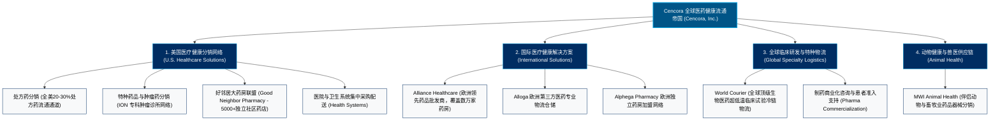

# Cencora 公司 (Cencora, Inc. / 原美源伯根) —— 全球医药流通与特种药健康服务巨擘全景介绍

> **《财富》世界500强排名：第 16 位**  
> **年度营业收入：$321,333 百万美元（约 3213 亿美元）**  
> **行业地位：全球三大医药分销商之一（Big Three），特种药分销领域全球第一**  
> **官方网站：[www.cencora.com](https://www.cencora.com)**

---

## 🏢 企业基本信息 (Corporate Snapshot)

| 维度 | 详细信息 |
| :--- | :--- |
| **公司全称** | Cencora, Inc. (2023年前名为 AmerisourceBergen Corporation 美源伯根) |
| **合并重组时间** | 2001 年（由创立于1888年的 Bergen Brunswig 与创立于1900年代的 AmeriSource 对等合并；2023年更名） |
| **全球总部** | 🇺🇸 美国 宾夕法尼亚州 康舍霍肯 (Conshohocken, Pennsylvania) |
| **历史奠基人** | 吕西安·布伦斯威格 (Lucien Brunswig)、埃米尔/罗伯特·卑尔根 (Emil & Robert Bergen) |
| **现任 CEO** | 罗伯特·毛奇 (Robert P. Mauch, 总裁兼首席执行官) |
| **股票代码** | NYSE: `COR` (原代码 `ABC`) |
| **全球员工总数** | 约 **4.6+ 万人** |
| **全球网络覆盖** | 业务遍及全球 50+ 个国家，连接数十万家医院、药房、诊所及制药研发厂商 |
| **核心业务赛道** | 美国医疗健康解决方案 (U.S. Healthcare Solutions: 品牌药/仿制药/特种药分销、肿瘤及专科医生网络)、国际医疗健康解决方案 (International Healthcare Solutions: 欧洲 Alliance Healthcare 药房分销、World Courier 全球温控临床试验物流、MWI 动物保健) |

---

## 🌐 核心业务矩阵与商业版图 (Business Ecosystem)

---

## ⚡ 核心竞争护城河与供应链壁垒 (Competitive Moats)

### 1. 全球第一大特种药品 (Specialty Pharmaceuticals) 垄断高地
- **特种药王者**：相较于传统低毛利仿制药，用于肿瘤、罕见病、自身免疫疾病的复杂生物大分子药物（特种药）单价极高、储存运输条件极端苛刻。Cencora 旗下拥有全美最大的社区肿瘤医生网络 **ION Solutions**，在特种药分销、患者依从性管理和保险报销准入服务上占据无可争议的全球第一份额。

### 2. 超大规模微利供应链飞轮与极速周转
- 医药分销是典型的“万亿规模、薄利多销（净利率仅约 1% 左右）”行业。Cencora 凭借日均处理数百万行订单的高度自动化仓储中心、夜间分拣与次日清晨送达的无缝物流，将营运资金周转天数压缩到极限，形成了新进入者根本无法企及的单位成本优势。

### 3. 与零售巨头沃博联 (Walgreens) 的战略结盟与欧洲扩张
- 战略深度绑定全美第二大连锁药房 Walgreens Boots Alliance (WBA)，不仅获得了 WBA 的长期全额处方药分销大单，更于 2021 年斥资 65 亿美元收购 WBA 旗下的 **Alliance Healthcare**，一举将业务版图延伸至欧洲十几个国家数万家药房，完成跨大西洋医药分销网络的构建。

### 4. World Courier：全球临床试验超低温冷链天花板
- 拥有在 50 多个国家覆盖的 **World Courier** 临床试验物流网络，能够提供从 -196℃ 液氮到常温的全球全天候门到门精确温控运输，承担了全球绝大多数前沿 CAR-T 细胞疗法、基因疗法与 mRNA 疫苗临床试验的核心物流。

---

## 📈 历史里程碑年表 (Historical Milestones)

- **1888年**：吕西安·布伦斯威格在加利福尼亚州洛杉矶创立 Brunswig Drug Company。
- **1947年**：埃米尔·卑尔根与罗伯特·卑尔根兄弟在新泽西创立 Bergen Drug Company。
- **1969年**：Bergen Drug 与 Brunswig Drug 合并组建**伯根布伦斯威格公司 (Bergen Brunswig)**。
- **2001年8月**：美源健康公司 (AmeriSource Health Corp.) 与伯根布伦斯威格公司完成对等合并，正式诞生**美源伯根 (AmerisourceBergen Corporation)**。
- **2012年**：收购全球临床试验特种物流标杆 **World Courier** 与动物保健分销龙头 **MWI**。
- **2013年**：与全球药房巨头沃博联 (Walgreens Boots Alliance) 达成 10 年期战略分销与股权合作协议。
- **2021年**：以 65 亿美元完成对欧洲大型医药批发巨头 **Alliance Healthcare** 的全资收购。
- **2023年8月**：美源伯根正式完成全球品牌重塑，更名为 **Cencora, Inc.**（股票代码变更为 `COR`）。
- **2024-2026年**：营业收入突破 3200 亿美元，连续蝉联《财富》世界500强前20强。

---

## 🎯 企业文化与价值观 (Corporate Purpose)

- **企业宗旨**：我们团结一致，共同创造更加健康的未来 (We are united in our responsibility to create healthier futures)。
- **核心价值观**：
  1. **以患者为中心 (Patient-Centric)**：我们所递送的每一盒药品背后都维系着一条生命。
  2. **协作共赢 (Collaborative)**：与制药研发商、医院、药房结成不可分割的生命线同盟。
  3. **激情创新 (Passionate & Innovative)**：利用前沿数字化与冷链技术突破医疗健康准入瓶颈。
