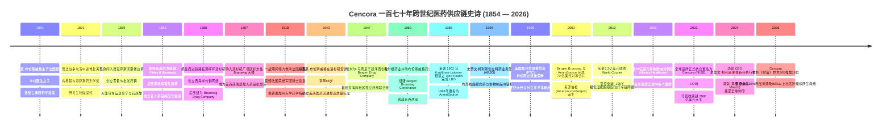
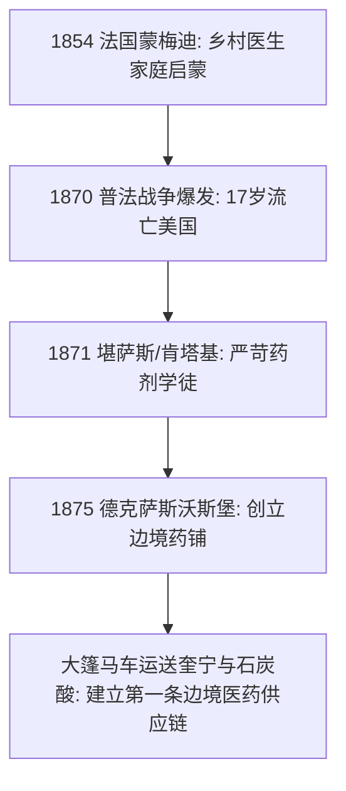
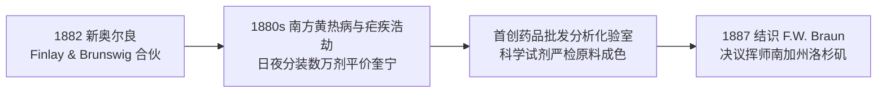
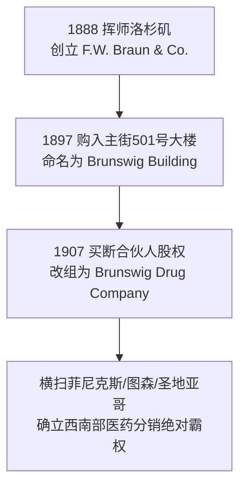
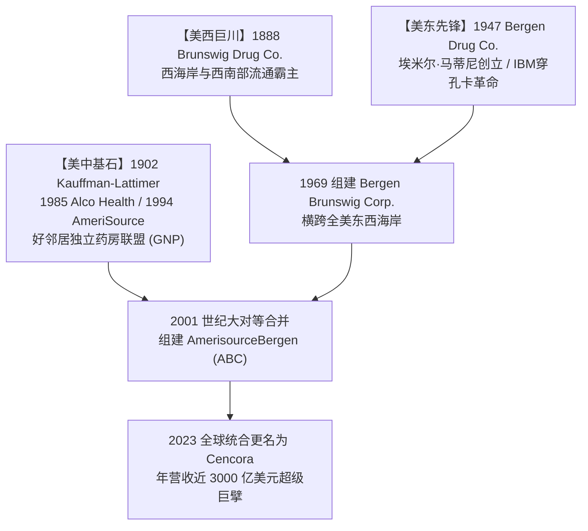
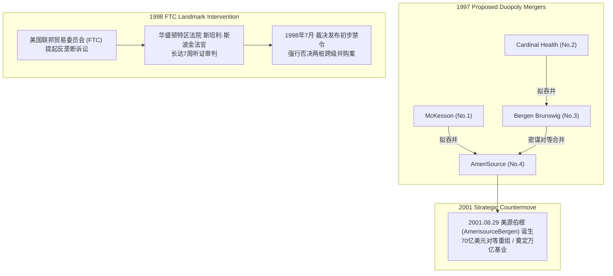
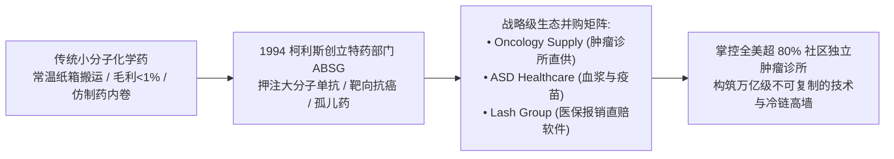
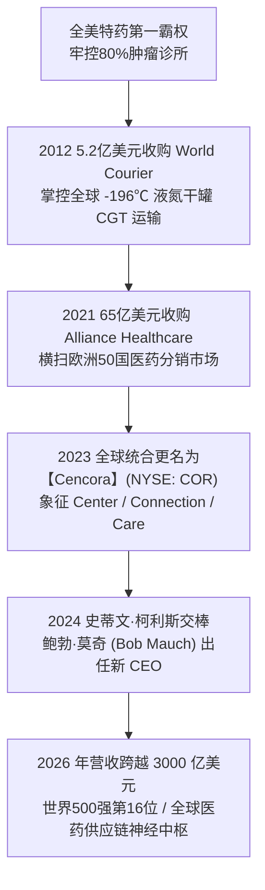
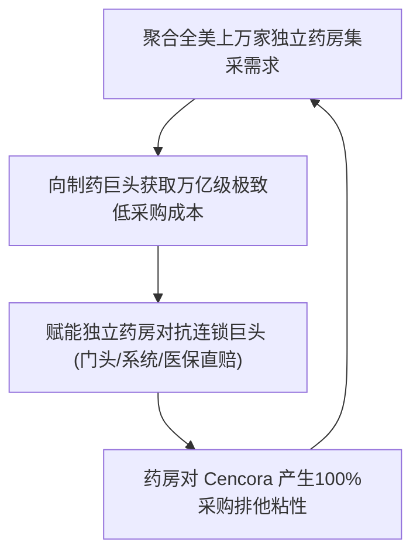

# 卢西恩·拿破仑·布伦斯威格 (Lucien Napoleon Brunswig) 与 Cencora：从边境药铺到全球万亿特药供应链帝国的全景史诗传记

> **“药品的流通绝非简单的商业仓储与吨位搬运，它是实验室微观分子与病患生命之间最不可断裂的信任纽带。无论是 19 世纪末用大篷马车穿越印第安荒原运送高纯度奎宁，还是 21 世纪用零下 196 度的液氮干罐横跨大洋护送活体 CAR-T 细胞，每一剂药品的精准交付，都是人类对抗疾病与死亡的庄严契约。”**  
> —— 卢西恩·拿破仑·布伦斯威格 (Lucien Napoleon Brunswig) & 现代管理团队

---

```text
==================================================================================================
【传主与现代缔造者档案速览】
• 历史奠基人：卢西恩·拿破仑·布伦斯威格 (Lucien Napoleon Brunswig, 1854–1943)
• 现代合流领袖：埃米尔·马蒂尼 (Emil P. Martini Jr.)、罗伯特·马蒂尼 (Robert E. Martini)、
               戴夫·约斯特 (R. David Yost)、史蒂文·柯利斯 (Steven H. Collis)、鲍勃·莫奇 (Bob Mauch)
• 创办/演进谱系：Brunswig Drug Co. (1888) + Bergen Drug Co. (1947) + Kauffman-Lattimer / AmeriSource (1902/1994)
               -> AmerisourceBergen (2001 世纪合并) -> Cencora, Inc. (2023 全球统合更名)
• 出生与国籍：1854 年 8 月 10 日生于法国默兹省蒙梅迪 (Montmédy, France) | 美籍法裔药剂拓荒家
• 企业历史地位：2026年《财富》世界500强第16位 (年营业收入超 2900 亿~3000 亿美元)
               全美最大的专科特药 (Specialty) 与肿瘤药物分销中枢、全球超低温细胞基因疗法 (CGT) 冷链领军者
• 核心精神图腾：生物特药冷链极值防御、好邻居独立药房生态飞轮、静脉到静脉零容错、化学纯度第一性原理
==================================================================================================
```

---

## 🧭 全景生命历程与跨世纪商业征途编年轴 (Chronological Epic)



---

## 🎬 第一章：血统、战火流亡与德州边境的大篷车药铺 (1854 — 1881)

### 1. 默兹省乡村医生的严谨家风与普法战火
1854 年 8 月 10 日，在法国东北部默兹省（Meuse）靠近比利时边境的历史要塞古城蒙梅迪（Montmédy），卢西恩·拿破仑·布伦斯威格（Lucien Napoleon Brunswig）诞生在一个深受古典启蒙思想熏陶的家庭。
- **父亲查尔斯·A·布伦斯威格 (Charles A. Brunswig)**：是一名备受当地村民尊重的乡村全科医生。在 19 世纪中叶霍乱与伤寒频发的法国乡村，老布伦斯威格整日奔波于泥泞的农舍之间，随身携带着沉重的皮革药箱，亲手用天平为穷苦病人研磨草药、调配退热散。
- **母亲罗莎莉·拉扎德 (Rosalie Lazard)**：出身于法国阿尔萨斯-洛林地区的商人望族，赋予了少年卢西恩对商业契约、数字核算与严谨秩序的天生敏锐度。
- **药剂学的最初烙印**：在父亲的诊疗室里，小卢西恩最深刻的童年记忆不是玩具，而是整齐排列的深棕色玻璃药瓶、研钵捣碎植物根茎散发出的苦涩香气，以及父亲反复告诫他的铁律：
  > **“卢西恩，天平上的指针哪怕偏离半个格林（Grain，英厘），给病人服下的就不是治病的良药，而是致命的毒药。药剂师的手，必须比法官的天平还要精准。”**

### 2. 1870 普法战争浩劫与 17 岁少年的跨洋逃难
1870 年夏天，普法战争爆发。拿破仑三世的法兰西第二帝国在色当战役惨败，普鲁士大军长驱直入，默兹省全境沦为战火硝烟弥漫的前线。
- 战乱之中，学校被迫停课，法国家庭面临严重的物资匮乏与强行征兵。为了避免年轻的卢西恩被卷入残酷的战火与随后的政治动荡，1871 年，刚满 17 岁的卢西恩在父母的含泪叮嘱下，只身登上了开往美利坚合众国的蒸汽客轮。
- 抵达纽约港时，这位年轻的法国少年几乎不会说一句完整的英语，口袋里只有父母东拼西凑的少量金币和一套法文版《法兰西药典》。他没有选择留在繁华但竞争残酷的东海岸港口，而是跟随着西进移民的洪流，一路辗转前往肯塔基州的路易斯维尔（Louisville），随后又前往堪萨斯州的阿奇森（Atchison）。

### 3. 学徒苦旅：研磨生物碱与边境拓荒启蒙
在堪萨斯州阿奇森的一家简陋药铺里，卢西恩开始了长达数年的严苛学徒生涯。
- 他每天清晨 5 点起床生火、打扫店铺、清洗上百只被油脂和药膏污染的玻璃烧杯；白天跟随经验丰富的老药师学习辨识北美本土植物、提炼奎宁（Quinine）、水杨酸与鸦片酊剂；夜晚则在油灯下刻苦攻读英文药理学著作与拉丁文处方术语。
- 凭借在法国打下的扎实化学功底和近乎强迫症般的严谨配药手法，卢西恩很快在当地药剂行业崭露头角，获得了独立执业药剂师的资格。



### 4. 1875 孤身闯入德克萨斯沃斯堡：大篷马车上的医药奇迹
1875 年，21 岁的卢西恩·布伦斯威格做出了一个极其大胆的决定——前往刚刚通铁路线、被誉为“西进大门”的德克萨斯州沃斯堡（Fort Worth）。
- 当时的沃斯堡正处于奇泽姆牛道（Chisholm Trail）的繁荣顶点，牛仔、赌徒、铁路工人和拓荒移民云集，枪战、霍乱、疟疾与坏疽肆虐，医疗物资极度匮乏。
- 卢西恩用自己打工积攒的微薄积蓄，在沃斯堡主街搭起了一间兼具零售与批发的简易药铺。
- **荒原上的大篷车供应链**：当时的德州内地定居点远离铁路，卢西恩雇佣当地马车夫，用厚重帆布包裹着从东海岸采购来的高纯度秘鲁树皮（奎宁原药）、石炭酸消毒液、乙醚麻醉剂与无菌绷带，冒着印第安人袭击与严酷荒漠风暴，穿行于德克萨斯与新墨西哥边境。
- **抵制劣质假药的第一战**：在 19 世纪 70 年代的狂野西部，市场上充斥着大量掺杂糖水、烈酒与工业重金属的“万能神油”（Patent Medicines）。卢西恩公开在店门口树立告示牌，用化学试剂现场为拓荒者检测药剂纯度，并立下铁誓：**“凡盖有布伦斯威格印记的药剂，若有一丝杂质，赔付十倍货值。”** 这种在蛮荒之地建立的极致科学信誉，让他的边境药铺在短短三年内成为北德克萨斯最受信任的医疗中枢。

---

## 🔬 第二章：新奥尔良大熔炉、黄热病浩劫与分析化验室革命 (1882 — 1887)

### 1. 移师密西西比河咽喉：芬利与布伦斯威格的黄金盟约
1882 年，随着沃斯堡业务的稳固，28 岁的卢西恩将目光投向了当时整个美国南部与中南美洲贸易的最大门户——路易斯安那州新奥尔良（New Orleans）。
- 当时新奥尔良著名药品批发商**乔治·R·芬利 (George R. Finlay)** 正在为其历史悠久的商号寻找一位精通药理化学与供应链运营的合伙人。芬利看中了卢西恩无与伦比的专业声誉，两人一拍即合，正式组建了 **Finlay & Brunswig** 联合商号。
- 新奥尔良地处密西西比河出海口，来自欧洲的化学原料、来自南美洲的药用植物（如金鸡纳树皮、古柯叶）以及来自美国内陆的农产品在此交汇。卢西恩迅速对仓储与分销网络进行了标准化改造，建立了当时全美最先进的分拣与防潮仓储系统。



### 2. 1880年代南方瘟疫浩劫：日夜不熄的平价生命线
1880 年代中叶，肆虐美国南方的黄热病（Yellow Fever）与恶性疟疾数次大爆发，新奥尔良港口一度陷入死寂，数以千计的市民死于高热与抽搐。
- 市场上黑心药商趁机囤积居奇，将一剂奎宁的价格炒高至普通工人半个月的薪水。
- 卢西恩·布伦斯威格断然拒绝投机暴利。他下令仓库全天候 24 小时开门营业，调集全部大宗库存，按照疫情前的平价向所有诊所、修女院和贫民救济所足额供应退热与消毒药品。
- 为了应对激增的用药需求，卢西恩亲自在地下配药室带领工人连续工作数十个昼夜，将大桶大桶的高纯度硫酸奎宁精确分装为胶囊与粉剂。
- 1885 年，老合伙人乔治·芬利不幸逝世，31 岁的卢西恩全面执掌企业大权，将其重组为 **L. N. Brunswig & Company**。

### 3. 创设全美批发业第一座分析化验室
在 19 世纪末，全美药品分销行业普遍停留在“来货转手、只管买卖”的粗放经纪人阶段，批发商根本不负责药品的有效成分检测。
- 卢西恩·布伦斯威格率先打破这一陈腐规则。他在新奥尔良总部开辟出专门的化学分析实验室，高薪聘请专业分析化学家，购置德国进口的高倍显微镜、比重计、极化仪与滴定设备。
- 每一批运抵码头的洋地黄（Digitalis）、颠茄酊（Belladonna）、阿片浸膏以及各种无机盐类，必须经过化学定量分析，确定其活性成分含量达到医学标准后方可入库分销；凡是掺假或有效成分不足的原料，一律就地销毁并退款。
- 这一具有划时代意义的“科学质检前置”机制，比美国国会通过著名的《1906年纯净食品与药品法案》（Pure Food and Drug Act of 1906）整整早了近二十年，彻底奠定了布伦斯威格在全美医药界崇高的学术与商业声誉。

### 4. 结识 F.W. 布劳恩与西进战略萌芽
1887 年，卢西恩在新奥尔良结识了同样富有远见卓识的德国裔药剂企业家 **F.W. 布劳恩 (F.W. Braun)**。
- 此时，横贯美国大陆的圣菲铁路（Santa Fe Railway）与南太平洋铁路（Southern Pacific Railroad）在南加州交汇，加利福尼亚州掀起了继淘金热之后最壮阔的“80年代大繁荣（Boom of the Eighties）”。
- 卢西恩敏锐地意识到，随着西海岸人口的爆炸式增长，太平洋沿岸必将诞生一个不亚于密西西比河流域的庞大医药消费市场。他与布劳恩达成协议：由布伦斯威格提供充足的资本与质量管理体系，布劳恩亲赴加州开拓前哨，共同开启征服美西的伟大征程。

---

## 🏛️ 第三章：加州淘金潮、洛杉矶布伦斯威格大楼与百年药业帝国 (1888 — 1943)

### 1. 1888 挥师天使之城：从泥泞小镇到美西医药中枢
1888 年，布劳恩代表合伙商号在加利福尼亚州洛杉矶正式设立了分支机构 **F.W. Braun & Company**。
- 当时的洛杉矶还只是一个尘土飞扬、常住人口不足 5 万人的半边境城镇。但随着柑橘种植业、石油大发现以及横贯大陆铁路带来的汹涌移民潮，整个南加州与西南部领地（亚利桑那、内华达、新墨西哥）对正规药品的渴求呈几何级数爆发。
- 卢西恩源源不断地从新奥尔良和欧洲调配最优质的医药化工原料、外科手术器械以及标准化制剂输往洛杉矶。洛杉矶分部迅速成长为连接加利福尼亚、墨西哥边境乃至夏威夷群岛的最大医药批发枢纽。



### 2. 1897 洛杉矶广场区地标：维克里-布伦斯威格大楼
1897 年，公司购入了位于洛杉矶历史发源地——老广场（Plaza）附近的北主街 501 号（501 N. Main Street）的五层砖石结构宏伟建筑，即著名的**维克里-布伦斯威格大楼 (Vickrey-Brunswig Building)**。
- 1903 年，为了全身心投入西海岸无可限量的发展前景，卢西恩做出了彻底的战略转移：他将新奥尔良的老业务高价出售，举家永久迁居洛杉矶。
- **1907 买断更名 Brunswig Drug Company**：1907 年，卢西恩正式出资全额收购了合伙人布劳恩的股份，将企业正式重组并更名为 **Brunswig Drug Company（布伦斯威格药业公司）**，亲自出任总裁兼董事长。
- 他在布伦斯威格大楼内建立了更加宏大的五层综合现代医药枢纽：地下一层为恒温地窖，存放易挥发醚类与血清疫苗；一层为急诊配药与分拣发货大厅；二层为全美西最奢华的外科仪器展示厅；三层至四层为庞大的原料药仓储；五层则是名震西部的“布伦斯威格现代药物化验室”。

```text
+-----------------------------------------------------------------------+
|              BRUNSWIG DRUG COMPANY - 1907 (501 N. MAIN ST)            |
|                                                                       |
|  [5F] 分析化学与生物制剂化验室 (Purity & Standard Testing Lab)         |
|  [4F] 大宗原料药与进口天然植物药材仓 (Bulk Botanicals & Chemicals)      |
|  [3F] 标准化片剂/酊剂/胶囊包装流水线 (Compounding & Bottling Line)    |
|  [2F] 外科精密手术器械与医院装备展厅 (Surgical Instruments & Hospital) |
|  [1F] 铁路与马车极速分拣调度中枢 (Express Logistics & Fulfillment)     |
|  [B1] 恒温地窖生物血清与特种疫苗储存库 (Cold Storage Serums & Vaccines)|
+-----------------------------------------------------------------------+
```

### 3. 西南版图大扩张：菲尼克斯、图森与圣地亚哥连锁重镇
在卢西恩的运筹帷幄下，布伦斯威格药业展开了极具前瞻性的区域裂变：
- 先后在亚利桑那州的菲尼克斯（Phoenix）、图森（Tucson）以及加州的圣地亚哥（San Diego）建立了现代化的大型配钞配送分中心。
- 他与南太平洋铁路公司签订包车货运协议，让偏远矿山、牧场小镇的独立药房和诊所能够在电报下单后 24 至 48 小时内收到急救抗毒素与标准药品。这一庞大的毛细血管网络，让布伦斯威格药业牢牢掌控了整个美西西南部超过 60% 的药品批发市场份额。

### 4. 战火大爱、南加州大学药学院与荣誉军团勋章
卢西恩·布伦斯威格不仅是一位商业奇才，更是一位具有崇高人文情怀的公民领袖与慈善巨擘。
- **一战援法义举与“法兰西失怙孤儿”基金**：1914 年第一次世界大战爆发，祖国法国遭受德军重创，数十万儿童沦为孤儿。身在洛杉矶的卢西恩挺身而出，担任“法兰西失怙孤儿救济会”（Fatherless Children of France）西南战区总指挥，个人带头捐出巨资，并动员加州政商各界筹集了数百万美元的医疗物资与收养基金。
- **法国荣誉军团骑士勋章**：为了表彰他在一战期间对国际人道主义救援的杰出贡献，法国政府隆重授予卢西恩·布伦斯威格**法国荣誉军团骑士勋章 (Chevalier de la Légion d'honneur)**。
- **捐资南加州大学药学院 (USC School of Pharmacy)**：卢西恩深知专业人才对现代药学工业的决定性意义。他长期担任南加州大学（USC）的校董与核心捐赠人，出资建立了当时加州最顶尖的药学研究大楼（Brunswig Hall），设立“卢西恩·布伦斯威格卓越奖学金”，为全美培养了整整三代顶尖药剂师与药理学家。
- **历史保护与奥维拉街重生**：1920 年代末，洛杉矶市政府一度计划拆除破败的老广场区修建现代道路。卢西恩联手文化界人士奔走呼吁，慷慨解囊资助历史建筑修缮，亲手拯救并促成了如今闻名世界的洛杉矶墨西哥文化地标——**奥维拉街 (Olvera Street)** 的永续留存。

### 5. 1943 传奇落幕与传世遗产
1943 年，在第二次世界大战的烽火正酣之际，88 岁高龄的卢西恩·拿破仑·布伦斯威格在洛杉矶家中安详辞世。
- 他的一生跨越了从马车时代到航空时代的世纪剧变，将一个在德克萨斯边境大篷车上的冒险梦想，淬炼成了一座守护美西数百万人健康生命的医药商业丰碑。
- 他留给后世的不仅是一家年流水数千万美元的巨型分销企业，更是一套刻入企业基因的信仰：**“医药流通的本质是交付安全与希望。”**

---

## ⚡ 第四章：三源合流：卑尔根药业、美源健康与信息革命前夜 (1947 — 1994)

布伦斯威格药业在西海岸的辉煌，只是现代 Cencora 宏大拼图的第一块核心版图。在随后的半个世纪中，另外两股奔腾的商业洪流在美东与美中腹地破土而出，最终汇聚成万亿级的医药分销航母。



### 1. 埃米尔·马蒂尼与卑尔根药业的新泽西破晓 (1947)
1947 年，二战刚刚结束，美国迎来婴儿潮与郊区化大发展。在新泽西州哈肯萨克（Hackensack, NJ），执业药剂师**埃米尔·P·马蒂尼 (Emil P. Martini Sr.)** 创办了 **Bergen Drug Company（卑尔根药业公司）**。
- 老马蒂尼敏锐地发现，随着大型连锁超市的兴起，散布在各个社区小镇的独立零售药房（Mom-and-Pop Pharmacies）因采购规模小、拿货成本高而面临生死威胁。
- 老马蒂尼推出了革命性的“社区药房联合采购代理”模式：卑尔根药业充当数百家独立药店的集采后盾，以大宗议价权向制药厂压低进价，再以每日高频小批量配送的方式为社区药房补货。
- 1955 年老马蒂尼去世后，他的两个儿子——**埃米尔·马蒂尼二世 (Emil P. Martini Jr.)** 与 **罗伯特·E·马蒂尼 (Robert E. Martini)** 继承父业。兄弟俩展现出了惊人的商业与技术天赋。

### 2. 率先拥抱计算机革命：从 IBM 穿孔卡到 Ultipharm 终端
1960 年代初，当全美绝大多数批发商还在用厚厚的纸质账本手工记账时，马蒂尼兄弟率先引进了 IBM 大型机与穿孔卡系统。
- 1965 年，卑尔根药业成功在公开市场上市。
- **首创电子订单录入系统 (Ultipharm)**：1970 年代，卑尔根药业研发出名为 Ultipharm 的电子手持终端设备，免费配发给签约药房。药剂师只需拿着扫描器在货架条形码上轻轻一扫，补货数据便通过电话线即时传入卑尔根药业的中央主机，夜间自动生成拣货单，次日清晨配送车即可将药品精准送达药房门口。
- 这场“信息技术赋能实体流通”的先锋革命，将库存周转率提升了整整三倍，差错率降至万分之几。

### 3. 1969 跨大西洋级大重组：Bergen Brunswig Corporation 诞生
1969 年 5 月，在埃米尔·马蒂尼二世的主导下，新泽西的卑尔根药业以惊人的魄力跨越整个美洲大陆，全资收购了拥有 81 年历史的美西霸主布伦斯威格药业。
- 双方合并重组为 **Bergen Brunswig Corporation（卑尔根布伦斯威格集团）**。
- 这场合并被载入美国商学院教科书：卑尔根先进的计算机调度技术与东海岸渠道，与布伦斯威格在加利福尼亚、亚利桑那庞大的西海岸仓储基地实现完美融合，瞬间缔造出一座横跨美国东西海岸的全国性医药供应链超级帝国。

### 4. 美源健康 (AmeriSource) 的百年伏线与好邻居药房联盟
与此同时，第三股力量正在美国铁锈地带与中大西洋地区孕育壮大：
- **1902 Kauffman-Lattimer 渊源**：其历史根基可追溯至 1881/1902 年在俄亥俄州哥伦布由著名药学家乔治·B·考夫曼（George B. Kauffman）创立的 **Kauffman-Lattimer Company** 药品批发商号。
- **Alco Standard 聚合与 1988 LBO**：1977 年起，多元化产业财阀 Alco Standard（由传奇并购家 Tinkham Veale II 掌舵）大举进军医药流通，先后吃下 The Drug House、Kauffman-Lattimer 等多家中西部与东部老牌批发商，并在 1985 年将其分拆为 **Alco Health Services Corporation**。
- 1988 年，公司管理层在**约翰·F·麦克纳马拉 (John F. McNamara)** 与 **R. 戴夫·约斯特 (R. David Yost)** 的带领下，联合花旗等机构完成了举世瞩目的管理层杠杆收购（LBO），摆脱母公司束缚独立运营。
- **1994 蜕变 AmeriSource 与 Good Neighbor Pharmacy 飞轮**：
  - 1994 年，Alco Health 正式更名为 **AmeriSource Health Corporation**。
  - 戴夫·约斯特倾力打造了全美最负盛名的独立药房超级联盟——**好邻居药房 (Good Neighbor Pharmacy, GNP)**。
  - GNP 绝非普通加盟店，它在保留药剂师完全独立所有权的前提下，统一输出品牌门头、数字化处方流转中枢、全美医保报销直连网络以及全国性电视广告营销，让上万名乡村与社区药剂师拥有了抗衡 CVS 与 Walgreens 巨型连锁药店的强大护甲。

---

## ⚔️ 第五章：世纪反垄断大审判与 70 亿对等世纪大合并 (1997 — 2001)

### 1. 1997 “四进二”资本狂暴海啸：行业窒息时刻
1990 年代末，美国医疗控费（Managed Care）浪潮席卷全国，药品批发行业的毛利率被压缩至惊人的 1.5%~2% 的极低水平。规模经济成为了活下去的唯一铁律。
- 1997 年秋天，华尔街爆发了震惊全球医药产业的资本大地震：
  - 全美第一大分销商 **麦克森 (McKesson)** 宣布拟以 22.5 亿美元收购第四大分销商 **AmeriSource**；
  - 紧接着，第二大分销商 **卡地纳健康 (Cardinal Health)** 宣布拟以 26 亿美元强行吞并第三大分销商 **Bergen Brunswig**。
- 如果这两场世纪并购同时获准，全美前四大医药分销商将瞬间合体为两家掌控全美 80% 以上药品供应的绝对双寡头（Duopoly）。全美医院协会、独立社区药房联盟与制药厂商陷入了前所未有的集体恐慌。



### 2. 1998 FTC 世纪诉讼：斯波金法官的当头棒喝
面对行业垄断的致命威胁，美国联邦贸易委员会（FTC）于 1998 年 3 月正式向哥伦比亚特区联邦地区法院提起反垄断民事诉讼（*FTC v. Cardinal Health, Inc. & FTC v. McKesson Corp.*）。
- 这场由美国著名联邦法官**斯坦利·斯波金 (Judge Stanley Sporkin)** 主审的世纪大审判整整持续了 7 周，数百名行业高管、经济学家和反垄断专家出庭作证，堆积的证据卷宗高达数十万页。
- 诉讼焦点在于：药品分销是否是一个独立的、不可替代的国家级相关市场？
- 1998 年 7 月 31 日，斯波金法官签署了长达 60 页的历史性判决书，斩钉截铁地下达禁令阻止合并：
  > **“处方药的批发分销不仅是单纯的物流，它是全美数万家社区药房、养老院和重症医院赖以生存的氧气管道。如果允许市场集中于两家超级寡头，竞争的熄灭必将导致药品配送费率上涨、服务质量下降，最终将不可承受的代价转嫁到最无助的重症患者身上！”**
- 判决一出，两项轰动华尔街的跨级并购案彻底宣告流产。

### 3. 2001.08.29 密谋破局：美源伯根 (AmerisourceBergen) 70亿对等合并
并购禁令让 Bergen Brunswig 与 AmeriSource 逃过了被吞并的命运，但也让两家位列行业中游的巨头面临着必须在规模上打破僵局的生死抉择。
- 2001 年初春，宾夕法尼亚州福吉谷（Valley Forge）的一间隐秘会议室里，AmeriSource 首席执行官**戴夫·约斯特 (David Yost)** 与 Bergen Brunswig 董事长**罗伯特·马蒂尼 (Robert Martini)** 展开了长达数周的绝密磋商。
- 既然“第一吞第四、第二吞第三”触犯反垄断法，那么“第三与第四实施势均力敌的对等合并（Merger of Equals）”不仅完全符合反垄断审查标准，更能瞬间打破第一和第二的垄断优势！
- **2001 年 8 月 29 日**：耗资 70 亿美元的换股对等合并正式交割。
  - 新集团定名为 **AmerisourceBergen Corporation (美源伯根，纽交所代码：ABC)**；
  - 集团总部设在宾夕法尼亚州福吉谷；
  - 戴夫·约斯特出任新集团总裁兼首席执行官，罗伯特·马蒂尼出任董事会主席；
  - 合并首年，美源伯根的年营业收入即跨越 **360 亿美元**，全美药品分销由“两超多强”正式定格为无可撼动的“三巨头鼎立（The Big Three: McKesson, AmerisourceBergen, Cardinal Health）”。

---

## 🧬 第六章：生物特药革命：史蒂文·柯利斯与肿瘤冷链霸权 (1994 — 2020)

当普通小分子化学药片（如阿司匹林、降压药、抗生素）的流通毛利率随着专利到期与仿制药泛滥被压缩到不足 1% 时，美源伯根内部一位来自南非的年轻高管，以超凡的战略远见掀起了一场彻底改写全球医药分销版图的“特药革命”。



### 1. 史蒂文·柯利斯 (Steven Collis) 的战略顿悟
史蒂文·柯利斯出生于南非约翰内斯堡，毕业于著名的金山大学（University of the Witwatersrand），拥有极其扎实的商业与会计学功底。
- 1990 年代初移民美国加盟公司后，柯利斯敏锐地捕捉到了现代分子生物学革命的破晓曙光：
  - 过去一个世纪，人类医学主要依赖人工合成的“小分子化学药”，它们性质稳定、耐常温、可以通过普通纸箱卡车大批量运输；
  - 但随着基因工程与单克隆抗体技术的突破，未来的抗癌药、自身免疫药与罕见病药将全面转向“大分子生物制品（Biologics）”。
  - 这些药物单支售价高达数千至数万美元，其分子结构极其脆弱，对温度震荡极其敏感（必须严格保持在 2℃~8℃ 甚至更低冷链），且必须由专业医生在临床环境下注射给药。

### 2. 1994 创立 ABSG：特药分销的第一性原理
1994 年，柯利斯在集团内部力排众议，创立了**美源伯根特药业务部 (AmerisourceBergen Specialty Group, ABSG)**。
- 柯利斯确立了特药分销的三大底层铁律：
  1. **零温差失活容忍 (Zero Temperature Excursion)**：建立全流程带有高频温度传感器记录的军工级冷链包装，一旦运输途中温度偏离标准区间 0.5 度，系统自动报警并拦截；
  2. **从分销商向临床合伙人跃迁**：不仅卖药，更向肿瘤诊所提供专门的临床库存智能管理柜（Smart Cabinets）与患者辅助软件；
  3. **复杂医保直赔通道 (Reimbursement Navigation)**：生物特药价格极其高昂，若患者保险理赔延迟，诊所垫资压力将导致破产。ABSG 成立专门的医保政策团队，协助诊所一键完成复杂的商业保险预先授权（Prior Authorization）。

### 3. 收购 Oncology Supply 与 Lash Group：卡死全美肿瘤诊所生命线
在柯利斯的操盘下，美源伯根展开了一系列堪称教科书级的特药生态并购：
- **收购 Oncology Supply & ASD Healthcare**：将全美最大的独立肿瘤医生药品直供网络与血浆/生物制品龙头收归麾下；
- **收购 Lash Group**：将全美领先的患者支持与医保报销技术平台深度嵌入数十万肿瘤医生与罕见病患者的诊疗全流程；
- **收购 Innomar Strategies**：将特药分销与患者支持生态直接复制至整个加拿大市场。
- **垄断性战果**：到了 2010 年代，美源伯根已经牢牢掌控了全美超过 **80% 的独立社区肿瘤诊所** 的药品供应中枢，成为全球抗癌靶向药物与单抗生物制品流通无可争议的绝对王者。

---

## ❄️ 第七章：零下196度的生命链、欧洲征服与 Cencora 涅槃 (2012 — 2026)



### 1. 2012 斥资 5.2 亿美元收购 World Courier：征服极低温细胞基因疗法 (CGT)
2011 年，史蒂文·柯利斯正式接任美源伯根总裁兼首席执行官。上任第二年，他便打出了一记震撼全球冷链物流界的重拳——以 **5.2 亿美元现金** 全资收购全球超高端特种医药物流先锋 **World Courier（世 courier）**。
- **CAR-T 细胞疗法的“静脉到静脉 (Vein-to-Vein)”极限挑战**：
  - 随着诺华（Kymriah）、吉利德（Yescarta）等突破性 CAR-T 细胞免疫疗法的问世，人类医学进入了“活体细胞制药”时代。
  - 流程要求：从病人体内抽取 T 细胞（静脉端），在 24~48 小时内空运至数千公里外的基因工程实验室进行病毒载体改造，在零下 196 度的液氮环境下完成扩增冻存，再以毫秒不差的时效横跨大洋护送回医院，重新回输到濒危癌症患者体内（静脉端）。
- **World Courier 的黑科技护城河**：
  - 拥有全球数百个经过严格认证的液氮充装中心（Liquid Nitrogen Charging Stations）与航空级极低温干罐（Cryogenic Dry Shippers）；
  - 全球每台运输罐配备实时卫星 GPS 轨迹追踪、三轴重力防倾斜震荡传感器与秒级温度记录仪；
  - 实现了人类医药史上对生物活性物质最严苛的“链条身份唯一性 (Chain of Identity, COI)”与“责任交接链 (Chain of Custody, COC)”全流程数字化不可篡改锁定。

```text
+-----------------------------------------------------------------------------------------+
|                  CENCORA / WORLD COURIER "VEIN-TO-VEIN" CGT LIFELINE                    |
|                                                                                         |
|  [1. 患者采血] ---> [2. 2~8℃ 极速温控空运] ---> [3. 药企中心实验室基因修饰/扩增]           |
|                                                                    |                    |
|  [6. 医院复苏回输] <--- [5. -196℃ 液氮干罐全球直递] <--- [4. -196℃ 液氮深低温玻璃化冻存] |
+-----------------------------------------------------------------------------------------+
```

### 2. 2021 并购欧洲巨头 Alliance Healthcare：65 亿美元的全球大合纵
2021 年 6 月，在史蒂文·柯利斯的主导下，美源伯根完成了公司历史上最大规模的跨国并购——以 **65 亿美元（约 54.7 亿欧元）** 现金从沃尔格林联合博姿（Walgreens Boots Alliance, WBA）手中全资收购了欧洲最大的医药分销商之一 **Alliance Healthcare**。
- **全球版图瞬间补齐**：这场大并购直接为集团注入了覆盖英国、法国、西班牙、荷兰、挪威、土耳其、埃及等全球 25 个以上主要国家的 300 多座现代化区域配送中心，直接连接了欧洲超过 47,000 家药房与 115,000 家诊所。
- 集团自此彻底摆脱了单一北美市场的地域限制，蜕变为一家横跨美洲、欧洲、亚太与中东的真正意义上的全球医药供应链无缝超级巨擘。

### 3. 2023 凤凰涅槃：全球统合更名为【Cencora】
随着百年兼并整合形成的多重历史品牌（AmerisourceBergen、Alliance Healthcare、World Courier、Innomar、ABSG），企业迫切需要一个统一的全球超级品牌图腾。
- **2023 年 8 月 30 日**：公司正式宣布将旗下全部跨国业务统合更名为 **Cencora, Inc.**，并在纽约证券交易所启用全新的黄金交易代码 **`COR`**。
- **Cencora 名字的深层哲学隐喻**：
  - **CEN (Center / Central)**：代表公司作为全球医疗生态绝对中枢的连接地位；
  - **COR (Core / Heart)**：象征着以生命为核心的坚守与炽热的初心；
  - **CARE**：宣示每一剂药物的流转皆是对人类健康的终极关怀。

### 4. 2024–2026 帅印交接：鲍勃·莫奇接棒与 3000 亿帝国时代
2024 年 10 月 1 日，执掌帅印长达 13 年、带领公司年营收从千亿美元狂飙至近三千亿美元的功勋领袖史蒂文·柯利斯光荣卸任 CEO，转任董事会执行主席。
- 集团元老、深耕医药供应链与客户运营逾 30 年的集团首席运营官**鲍勃·莫奇 (Bob Mauch)** 正式升任 Cencora 总裁兼首席执行官。
- 莫奇上任后全面推进“AI 驱动的全球动态库存路由算法”与“罕见病全球一站式患者通道”。
- **2026 年最新里程碑**：Cencora 在《财富》世界500强榜单中稳居第 **16** 位，年营业收入逼近 **3000 亿美元**，日均安全处理并交付超过上千万剂处方药与高精密生物制剂，服务全球逾 1.5 亿患者的生命健康。

---

## 🧠 第八章：Cencora 八大底层商业认知工具箱 (Mental Models)

```text
==================================================================================================
【Cencora 传世八大第一性商业与供应链思维模型】
1. 生物特药冷链极值防御模型 (Biological Cold-Chain Moat)
2. 独立药房命运共同体飞轮 (Independent Pharmacy Cooperative Flywheel)
3. 静脉到静脉零容错生命链法则 (Vein-to-Vein Zero-Defect Lifeline)
4. 药品化学纯度第一性原理 (Standard of Chemical Purity & Anti-Counterfeit)
5. 临床诊所全周期深度嵌合模型 (Clinical Practice Full-Cycle Embedding)
6. 万亿周转极低毛利精益套利模型 (Scale-Velocity Working Capital Arbitrage)
7. 全球医药供应链冗余与韧性防御 (Global Pandemic Resilient Redundancy)
8. 三源归一品牌势能聚合模型 (Unified Brand Energy Convergence)
==================================================================================================
```

### 1. 生物特药冷链极值防御模型 (Biological Cold-Chain Moat)
- **底层心法**：在成熟的商业社会中，容易运输的标品终将沦为无利润的红海泥潭；而**物理交付难度最高、环境容错率最低的品类，蕴藏着最坚不可摧的超额利润高墙**。
- **落地机制**：普通药片跌落常温毫无影响，但动辄价值数万美元一支的单抗、mRNA 疫苗或细胞悬液，温度超出 2℃~8℃ 超过半小时即会蛋白质变性报废。Cencora 不惜重金自建遍布全球的物联网智能冷链温控网络，通过极高技术与资本壁垒，让制药巨头和顶级医院不得不深度捆绑其物流体系。

### 2. 独立药房命运共同体飞轮 (Independent Pharmacy Cooperative Flywheel)
- **底层心法**：不要试图做吞噬客户的巨无霸，而要**做让成千上万小客户变得无法被巨头击垮的超级赋能平台**。
- **落地机制**：通过创建 Good Neighbor Pharmacy（GNP）品牌联盟，Cencora 聚拢全美数千家独立社区药店。药店获得万亿级集采集运成本优势、智能处方系统与医保议价权；Cencora 则获得了极其稳定、排他的高粘性全美末梢零售分销渠道。连续十余年荣膺 J.D. Power 全美药房客户满意度第一名。



### 3. 静脉到静脉零容错生命链法则 (Vein-to-Vein Zero-Defect Lifeline)
- **底层心法**：在大宗商品流通中，99.9% 的准确率意味着优秀；但在个性化活体细胞免疫治疗（CGT）中，**0.1% 的失误就等于一条鲜活生命的永久消逝**。
- **落地机制**：World Courier 建立的“静脉到静脉”机制，通过独一无二的条码与生物芯片绑定患者身份（COI）与交接责任链（COC）。在 -196℃ 液氮干罐中配置三冗余传感器，全程航线由人工特派专员（On-Board Courier）点对点护送过关，做到全球运输绝对零失误。

### 4. 药品化学纯度第一性原理 (Standard of Chemical Purity & Anti-Counterfeit)
- **底层心法**：商业信任的基石不是合同条款，而是**对产品物理与化学纯度的终极把关能力**。
- **落地机制**：从 1880 年代卢西恩·布伦斯威格在新奥尔良建立全美第一间批发化验室、坚决销毁劣质假药，到 21 世纪 Cencora 严格执行 FDA 《药品供应链安全法案》(DSCSA) 的全序列条码数字化溯源，Cencora 始终将“杜绝哪怕一粒假药进入流通渠道”作为立身之本。

### 5. 临床诊所全周期深度嵌合模型 (Clinical Practice Full-Cycle Embedding)
- **底层心法**：如果你只提供物流，你随时会被更便宜的货运公司取代；**只有当你成为客户日常业务运行所依赖的操作系统时，你才不可替代**。
- **落地机制**：Cencora 不仅向肿瘤诊所按时送达化疗与靶向药物，更向医生免费或深度提供 IntelliDose 智能配药核算软件、ION Solutions 医生采购联盟网络，以及 Lash Group 商业医保预审直赔中台，将服务深度融入处方开具、耗材核算与账单结算全流程。

### 6. 万亿周转极低毛利精益套利模型 (Scale-Velocity Working Capital Arbitrage)
- **底层心法**：当综合毛利率低于 3% 时，**经营的胜负不在于赚取高额差价，而在于营运资本（Working Capital）的极致周转速度与现金流时间差套利**。
- **落地机制**：Cencora 每年管理近 3000 亿美元的商品流通，依靠高度自动化的配送中心和先进算法预测，将全美库存周转天数压缩到极低水平；利用应付账款与应收账款的微妙时间差沉淀数百亿无息现金流，并凭借千亿级规模获取制药厂商的大额现金折扣（Prompt-Pay Discounts）。

### 7. 全球医药供应链冗余与韧性防御 (Global Pandemic Resilient Redundancy)
- **底层心法**：人类社会的突发公共卫生危机是必然事件，**平时看似多余的备用运力与多源库存，在灾难降临时代替的就是人类的生机**。
- **落地机制**：Cencora 在全球 50 多个国家布局了超过 500 座多功能温控物流中心，每一关键物流节点均配备双路应急电力、备用液氮补给站与卫星备用通信链路。在飓风、疫情或地缘冲突阻断常规航线时，能在 2 小时内无缝切换至备用陆运/包机路由。

### 8. 三源归一品牌势能聚合模型 (Unified Brand Energy Convergence)
- **底层心法**：当企业通过数十年连续并购汇聚了多重区域与业务品牌时，**多品牌会导致认知涣散与协作内耗，必须以统一的全球图腾完成心智聚焦与势能升维**。
- **落地机制**：2023 年将 AmerisourceBergen、Alliance Healthcare、ABSG 等数十年老品牌统一重塑为“Cencora”，不仅实现了纽交所上市代码的简化与品牌资产集中，更向全球制药巨头确立了“无论在巴黎、纽约还是东京，Cencora 提供完全一致的高水准健康服务”的全球一体化定位。

---

## 🎭 第九章：多维性格、生活怪癖与历史秘辛 (Anecdotes & Trivia)

### 1. 卢西恩·布伦斯威格的“显微镜试炼”与逐客令
在 19 世纪末的洛杉矶，许多制造“万能神油”的江湖游医和劣质药贩试图让布伦斯威格庞大的分销网络代销他们的药水。
- 卢西恩·布伦斯威格在办公室里常年摆放着一台高倍光学显微镜和一排化学试剂滴瓶。每当推销员吹嘘其药剂拥有“神奇疗效”时，卢西恩从不多言，直接当着推销员的面抽取样品滴入试剂。
- 有一次，一位推销“秘鲁神草生发治癌水”的商人被化验出液体中 95% 为劣质烈酒加红墨水。卢西恩脸色铁青，直接将样品瓶砸在废纸篓里，指着大门用带着浓重法国口音的英语怒斥：**“先生，请带着你的毒药滚出我的大楼！布伦斯威格的大门只为真正的科学敞开，绝不给杀人谋财的骗子分销一滴污水！”**

### 2. 拯救洛杉矶老街：亲自在奥维拉街石板路铺砖的慈善家
1920 年代末，当现代推土机开向洛杉矶老广场、企图将充满加州早期西语裔历史记忆的泥泞小巷彻底铲平时，年过古稀的卢西恩·布伦斯威格成为了保卫历史街区的精神领袖。
- 他不仅带头向修缮基金捐款数万美元，甚至在周末脱下名贵西装，换上工装裤，亲自来到奥维拉街（Olvera Street）工地上，跟着墨西哥裔工匠一起用手推车搬运红陶地砖、修补喷泉石阶。
- 当记者问这位亿万富豪为何要为一条破旧小巷大费周章时，卢西恩微笑着说：**“一个不知道自己从哪里来的城市，就永远不知道自己的灵魂该往哪里去。洛杉矶给了我一切，我有责任为这座城市的孩子留住她的童年。”**

### 3. 马蒂尼兄弟的“半夜三点查账法”与打孔卡奇迹
在 1960 年代 Bergen Drug 引进 IBM 大型计算机初期，由于设备极其昂贵且发热量巨大，数据处理只能安排在深夜进行。
- 罗伯特·马蒂尼（Robert Martini）作为副总裁兼持牌药师，几乎每天凌晨 3 点都会驱车来到新泽西哈肯萨克的机房。
- 他习惯一边喝着浓缩黑咖啡，一边亲自抽检从打印机里吐出的穿孔纸带，核对新泽西各家乡村诊所订购的吗啡、阿托品与胰岛素数量是否与医生处方严格吻合。
- 罗伯特常对机房程序员说：**“计算机是冰冷的铁盒子，但纸带上每一个打孔背后躺着的都是一个等待天亮吃药救命的邻居。如果机器出了一个错误你没发现，明天清晨就可能有一名婴儿服错剂量。”**

### 4. 史蒂文·柯利斯的“液氮保温瓶登机测试”
2012 年在决定是否斥巨资 5.2 亿美元收购 World Courier 的尽职调查期间，时任 CEO 史蒂文·柯利斯决定亲自测试其冷链安全极限。
- 柯利斯要求 World Courier 团队准备一个装有假体活性分子的极低温便携式液氮干罐，由他亲自作为手提行李携带，从费城登机，经过多次转机飞往南非约翰内斯堡，途中故意经历高温暴晒、剧烈颠簸与漫长的海关开箱检查。
- 当他在南非开普敦的实验室亲手打开封条、读取传感器数据时，发现罐内温度在整整 72 小时的严酷跨洋折腾中始终死死锁定在 -195.8℃，温差波动不到 0.2 度。柯利斯在实验室当场拨通了董事会的越洋电话，只说了掷地有声的一句话：**“先生们，立刻签署收购协议。他们掌控着通往未来生物医学帝国的钥匙。”**

---

## 📜 第十章：传世经典名言金句中英对照 & 重大历史编年表

### 经典名言金句 (Iconic Quotes)

1. > **“药品的流通不是简单的商业仓储与吨位搬运，它是微观分子与病患生命之间最不可断裂的信任纽带。”**  
   > *“Pharmaceutical distribution is never merely commercial warehousing and tonnage hauling; it is the unbreakable bond of trust between micro-molecules and human lives.”*  
   > —— 卢西恩·拿破仑·布伦斯威格 (Lucien Napoleon Brunswig)

2. > **“天平上的指针哪怕偏离半个格林，给病人服下的就不是治病的良药，而是致命的毒药。药剂师的天职是捍卫绝对的精确。”**  
   > *“Even if the needle on the balance deviates by half a grain, what is administered to the patient is no longer medicine, but deadly poison. The pharmacist's calling is to defend absolute precision.”*  
   > —— 卢西恩·布伦斯威格 (1885 年新奥尔良化验室训诫)

3. > **“不要试图消灭独立药房，我们要成为他们最坚强的后盾，让每一个街角的邻里药剂师都拥有对抗商业托拉斯的力量。”**  
   > *“Do not attempt to eliminate independent pharmacies; we must become their strongest backbone, empowering every neighborhood pharmacist on the corner to stand against commercial trusts.”*  
   > —— 戴夫·约斯特 (R. David Yost, 创立 Good Neighbor Pharmacy 宣言)

4. > **“在小分子时代，分销拼的是吨位与速度；在细胞与生物制药时代，分销拼的是零下 196 度的极温控制与零容错的生命责任。”**  
   > *“In the era of small molecules, distribution competed on tonnage and speed; in the era of cellular and biopharmaceuticals, it competes on minus 196-degree extreme thermal control and zero-tolerance responsibility for life.”*  
   > —— 史蒂文·柯利斯 (Steven H. Collis)

5. > **“我们之所以更名为 Cencora，是因为我们的使命已经超越了简单的地理名称拼凑。我们是全球健康的枢纽，每一剂药物的流转皆是对生命的终极关怀。”**  
   > *“We rebranded to Cencora because our mission has transcended a mere patchwork of legacy geographical names. We are the central hub of global health, and every delivery of medicine is an ultimate act of care.”*  
   > —— 鲍勃·莫奇 (Bob Mauch, 2023 全球更名演讲)

---

### 详尽生平与企业重大历史编年表 (1854 — 2026)

| 历史年份 | 历史分期 | 重大历史决断、技术突破与商业里程碑 |
| :--- | :--- | :--- |
| **1854 年** | 诞生启蒙 | 8月10日，卢西恩·拿破仑·布伦斯威格出生于法国默兹省蒙梅迪；父亲为乡村全科医生。 |
| **1871 年** | 跨洋逃难 | 普法战争爆发后逃难赴美，在肯塔基与堪萨斯担任药剂学徒，研读药理学与生物碱提纯。 |
| **1875 年** | 德州拓荒 | 孤身前往德克萨斯州沃斯堡开设零售与批发药铺，以大篷马车运送奎宁与石炭酸，建立边境医药供应链。 |
| **1882 年** | 新奥尔良合伙 | 移师路易斯安那州新奥尔良，与乔治·芬利合伙创立 Finlay & Brunswig 药品批发商号。 |
| **1885 年** | 科学化验革命 | 芬利去世后全面接管公司，重组为 L.N. Brunswig & Co.，创设全美首个批发药品分析化学实验室。 |
| **1888 年** | 挥师洛杉矶 | 抓住西进铁路狂潮，派遣合伙人 F.W. Braun 赴洛杉矶设立分号，开拓美西西南部医药网络。 |
| **1897 年** | 地标大楼确立 | 购入洛杉矶广场区北主街 501 号大楼（Brunswig Building），建立五层现代化多功能医药枢纽。 |
| **1902 年** | 中西部根基奠定 | 乔治·B·考夫曼在俄亥俄州哥伦布壮大 Kauffman-Lattimer 药业，为日后 AmeriSource 埋下世纪伏线。 |
| **1907 年** | 布伦斯威格药业 | 卢西恩买断布劳恩全部股权，正式组建 **Brunswig Drug Company**，出任总裁兼董事长。 |
| **1918 年** | 荣誉军团勋章 | 一战期间领导全美西南地区救助法国战孤运动，荣获法国政府颁发荣誉军团骑士勋章。 |
| **1930 年** | 药学教育与慈善 | 捐资南加州大学药学院建立 Brunswig Hall；全力资助并保护洛杉矶历史文化地标奥维拉街。 |
| **1943 年** | 传奇奠基人辞世 | 卢西恩·布伦斯威格在洛杉矶安详辞世，享年 88 岁；其确立的质量标准成为美西药业典范。 |
| **1947 年** | 卑尔根药业破土 | 药剂师埃米尔·P·马蒂尼在新泽西哈肯萨克创办 Bergen Drug Company，开启社区药房批发联合体。 |
| **1965 年** | 资本与技术破晓 | 卑尔根药业在马蒂尼兄弟带领下公开上市，率先引进 IBM 大型机与穿孔卡数字化库存管理。 |
| **1969 年** | 东西海岸大合流 | 卑尔根药业以小博大并购布伦斯威格药业，组建 **Bergen Brunswig Corporation**，雄霸东西两岸。 |
| **1977 年** | Alco Standard 入局 | 产业财阀 Alco Standard 大举收购 Kauffman-Lattimer 等中东部批发商，奠定综合网络基石。 |
| **1985 年** | Alco Health 分拆 | Alco Standard 将旗下医药分销板块独立分拆为 Alco Health Services Corporation。 |
| **1988 年** | 管理层 LBO | 约翰·麦克纳马拉与戴夫·约斯特率领管理层完成杠杆收购，Alco Health 成为独立私有化巨头。 |
| **1994 年** | 美源健康与特药破晓 | Alco Health 更名为 **AmeriSource Health**，推出 GNP 联盟；史蒂文·柯利斯创立特药部门 ABSG。 |
| **1998 年** | FTC 反垄断审判 | 联邦法官斯坦利·斯波金签发禁令，阻止 McKesson 与 Cardinal 的垄断并购，拯救中坚力量。 |
| **2001 年** | 70亿对等世纪合并 | 8月29日，Bergen Brunswig 与 AmeriSource 完成对等合并，组建 **AmerisourceBergen (ABC)**。 |
| **2002 年** | 肿瘤特药生态集结 | 收购 Oncology Supply、ASD Healthcare 及 Lash Group，一举确立全美肿瘤与特药分销绝对霸主地位。 |
| **2011 年** | 史蒂文·柯利斯掌舵 | 史蒂文·柯利斯升任 AmerisourceBergen 总裁兼首席执行官，全面推进全球化与高精尖生物物流战略。 |
| **2012 年** | 吞并 World Courier | 斥资 5.2 亿美元收购 World Courier，建立全球 -196℃ 液氮干罐 CAR-T 细胞与基因疗法超低温供应链。 |
| **2013 年** | 结盟 Walgreens | 与全球零售巨头 Walgreens Boots Alliance 达成长期战略分销协议与股权深度绑定。 |
| **2021 年** | 65亿横扫欧洲 | 斥资 65 亿美元收购 Alliance Healthcare，将分销网络覆盖至欧洲 25 国及 4.7 万家药房。 |
| **2023 年** | 统合更名【Cencora】 | 8月30日，集团正式全球统一更名为 **Cencora, Inc.** (NYSE: `COR`)，年营业收入跨越 2900 亿美元。 |
| **2024 年** | 帅印交接鲍勃·莫奇 | 史蒂文·柯利斯转任董事会执行主席；集团资深领袖鲍勃·莫奇 (Bob Mauch) 升任总裁兼首席执行官。 |
| **2026 年** | 万亿医药中枢巅峰 | Cencora 位列《财富》世界500强第 16 位，年营收逼近 3000 亿美元，稳居全球特药流通第一霸主。 |

---
