# 微软公司 (Microsoft Corporation) —— 全球软件操作系统霸主与生成式 AI 算力帝国全景介绍

> **《财富》世界500强排名：第 18 位**  
> **年度营业收入：$281,724 百万美元（约 2817 亿美元）**  
> **市值规模：超 30,000 亿美元（全球市值最高的超级科技巨头之一）**  
> **官方网站：[www.microsoft.com](https://www.microsoft.com)**

---

## 🏢 企业基本信息 (Corporate Snapshot)

| 维度 | 详细信息 |
| :--- | :--- |
| **公司全称** | 微软公司 (Microsoft Corporation) |
| **成立时间** | 1975 年 4 月 4 日 (创立于美国新墨西哥州阿尔伯克基) |
| **全球总部** | 🇺🇸 美国 华盛顿州 雷德蒙德 (Redmond, WA, One Microsoft Way) |
| **创始人** | 比尔·盖茨 (Bill Gates) 与 保罗·艾伦 (Paul Allen, 1953–2018) |
| **现任 CEO** | 萨提亚·纳德拉 (Satya Nadella, 董事长兼首席执行官) |
| **股票代码** | NASDAQ: `MSFT` (标普500指数与纳斯达克100指数头号核心成分股) |
| **全球员工总数** | 约 **22.8+ 万人** |
| **核心业务赛道** | 智能云服务 (Azure, GitHub, Windows Server)、生产力与业务流程 (Microsoft 365, Teams, LinkedIn, Dynamics 365)、个人计算与数字娱乐 (Windows 11, Surface, Xbox, 动视暴雪)、全栈生成式 AI (Microsoft Copilot, Azure OpenAI) |

---

## 🌐 核心业务矩阵与商业版图 (Business Architecture)

```mermaid
graph TD
    MSFT["微软科技帝国 (Microsoft Corporation)"]
    
    MSFT --> CLOUD["1. 智能云与开发者平台 (Intelligent Cloud)"]
    CLOUD --> C1["Microsoft Azure (全球第二大超级公有云平台)"]
    CLOUD --> C2["Azure OpenAI Service (GPT-4/GPT-4o 企业级独家托管)"]
    CLOUD --> C3["GitHub (超1亿全球开发者开源协作中心 / GitHub Copilot)"]
    CLOUD --> C4["企业级基础设施 (Windows Server / SQL Server / Visual Studio)"]
    
    MSFT --> PROD["2. 生产力与业务流程 (Productivity & Business)"]
    MSFT --> PROD1["Microsoft 365 (Office 商业套件: Word/Excel/PowerPoint/Outlook)"]
    PROD --> PROD2["Microsoft Teams 智能协作平台 (日活超3亿企业用户)"]
    PROD --> PROD3["LinkedIn 领英 (全球最大职业社交平台，超10亿会员)"]
    PROD --> PROD4["Dynamics 365 企业资源规划 (ERP/CRM)"]
    
    MSFT --> AI["3. 全栈生成式 AI 生态 (AI & Copilot System)"]
    AI --> AI1["Microsoft Copilot (重塑 Windows、Office、Security、GitHub)"]
    AI --> AI2["OpenAI 深度独家战略同盟 (累计投资超 130 亿美元)"]
    AI --> AI3["自研算力芯片: Azure Maia 100 AI 加速芯片 & Cobalt 100 CPU"]
    
    MSFT --> PERS["4. 更多个人计算与游戏娱乐 (More Personal Computing)"]
    PERS --> P1["Windows 11 操作系统 (全球数十亿 PC 桌面底座)"]
    PERS --> P2["Xbox 游戏生态与 Xbox Game Pass (XGP 订阅体系)"]
    PERS --> P3["动视暴雪 (Activision Blizzard - 687亿美元收购《使命召唤》《魔兽》)"]
    PERS --> P4["Surface 智能硬件与 Bing/Edge AI 搜索"]

    classDef main fill:#00a4ef,stroke:#7fba00,stroke-width:2px,color:#fff;
    classDef branch fill:#243a5e,stroke:#00a4ef,stroke-width:1px,color:#fff;
    classDef sub fill:#f3f3f3,stroke:#243a5e,stroke-width:1px,color:#000;
    class MSFT main;
    class CLOUD,PROD,AI,PERS branch;
    class C1,C2,C3,C4,PROD1,PROD2,PROD3,PROD4,AI1,AI2,AI3,P1,P2,P3,P4 sub;
```

---

## ⚡ 核心竞争护城河与战略支柱 (Competitive Moats)

### 1. 全球企业级软件的“空气与水”：无与伦比的 B 端生态黏性
- **不可替代的生产力入口**：从 Windows 到 Office 365、Teams、LinkedIn，微软深深嵌入了全球绝大多数财富 500 强企业、政府机构与中小企业的日常运营骨髓。极高的客户转换成本、跨产品组合协同效应，使得其企业级订阅（SaaS）业务拥有全行业罕见的极高续约率与源源不断的强劲现金流。

### 2. Azure 超级公有云与全球 AI 基础设施制高点
- **全球公有云第二极**：Azure 遍布全球数十个数据中心大区，拥有业界最完善的合规与企业级安全认证。
- **独家锁定 OpenAI 超级底座**：通过向 OpenAI 投资逾百亿美元，微软获得了 OpenAI 基础前沿大模型的独家云托管与商业化授权，并在第一时间将 Copilot 深度原生融合进 Windows、Office、GitHub 等全线产品，建立了全行业最领先的生成式 AI 商业变现飞轮。

### 3. 极高毛利的零边际成本软件复利
- 软件一旦完成代码编写，多复制一份的边际成本几乎为零。微软营业利润率常年高达 **40% 以上**，自由现金流年超数百亿美元，为其在云计算、AI 芯片以及游戏领域的超大型战略并购（如 687 亿美元收购动视暴雪、262 亿美元收购领英）提供了深不可测的弹药库。

---

## 📈 历史里程碑年表 (Historical Milestones)

- **1975年4月**：比尔·盖茨与保罗·艾伦在新墨西哥州创立 Micro-Soft，推出首款产品 Altair BASIC。
- **1980年**：与 IBM 签署世纪合作协议，提供 **MS-DOS** 操作系统，保留非独家软件著作权。
- **1985年11月**：正式发布 **Windows 1.0**，开启图形用户界面时代。
- **1986年3月**：在纳斯达克成功上市（IPO），比尔·盖茨年仅 31 岁成为超级科技新贵。
- **1995年8月**：发布震撼全球的 **Windows 95**；盖茨发布《互联网浪潮》备忘录，全面转向互联网。
- **1998-2001年**：遭遇美国司法部反垄断诉讼风暴；盖茨卸任 CEO，史蒂夫·鲍尔默接任。
- **2001年**：发布传奇操作系统 **Windows XP** 与首款游戏主机 **Xbox**。
- **2014年2月**：**萨提亚·纳德拉 (Satya Nadella)** 出任第三任 CEO，推行“移动为先，云为先”与拥抱开源战略。
- **2016年**：斥资 262 亿美元全资收购全球最大职业社交平台**领英 (LinkedIn)**。
- **2018年**：以 75 亿美元收购全球最大开源代码托管平台 **GitHub**。
- **2019-2023年**：深度投资 OpenAI，推出全栈 **Microsoft Copilot**；以 687 亿美元完成对**动视暴雪**的世纪收购。
- **2024-2026年**：微软市值正式跨越 **3 万亿美元** 大关，全面领跑全球生成式 AI 产业革命。

---

## 🎯 企业文化与价值观 (Cultural Transformation)

- **企业使命**：予力全球每一人、每一组织，成就不凡 (To empower every person and every organization on the planet to achieve more)。
- **成长型思维 (Growth Mindset)**：纳德拉重塑微软文化的精髓——从“无所不知 (Know-it-all)”转变为“无所不学 (Learn-it-all)”，强调同理心、多元包容与对技术极限的敬畏。
