# 壳牌公司 (Shell plc) —— 全球综合能源与液化天然气帝国全景介绍

> **《财富》世界500强排名：第 22 位**  
> **年度营业收入：$273,731 百万美元（约 2737 亿美元）**  
> **官方网站：[www.shell.com](https://www.shell.com)**

---

## 🏢 企业基本信息 (Corporate Snapshot)

| 维度 | 详细信息 |
| :--- | :--- |
| **公司全称** | 壳牌公司 (Shell plc) |
| **成立时间** | 1897 年 (壳牌运输贸易公司) / 1907 年 (与皇家荷兰石油合并) |
| **全球总部** | 🇬🇧 英国 伦敦 (London, UK) |
| **创始人** | 马库斯·萨缪尔 (Marcus Samuel, 1st Viscount Bearsted)、塞缪尔·萨缪尔、亨利·德特丁 (Henri Deterding) |
| **现任 CEO** | 瓦埃勒·萨万 (Wael Sawan) |
| **股票代码** | LSE: `SHEL`, NYSE: `SHEL`, Euronext: `SHELL` |
| **全球员工总数** | 约 103,000+ 人 |
| **核心业务赛道** | 综合天然气与液化天然气 (LNG)、深海石油勘探开发、下游成品油零售与化学品、海上风电与低碳能源 |

---

## 🌐 核心业务矩阵与商业版图 (Business Ecosystem)

```mermaid
graph TD
    SHELL["壳牌全球能源帝国 (Shell plc)"]
    
    SHELL --> GAS["1. 综合天然气与液化天然气 (Integrated Gas & LNG)"]
    GAS --> LNG1["全球最大私营 LNG 贸易商 (年销量超6500万吨)"]
    GAS --> LNG2["Prelude FLNG 全球最大海上浮式天然气装置"]
    GAS --> LNG3["卡塔尔、尼日利亚、澳大利亚巨型液化气项目"]
    
    SHELL --> UP["2. 上游石油开采 (Upstream Deepwater)"]
    UP --> UP1["墨西哥湾深水油田 (Whale, Vito 等超级平台)"]
    UP --> UP2["巴西盐下超深水盆地 (Santos Basin)"]
    UP --> UP3["北海与西非海上油气资产"]
    
    SHELL --> DOWN["3. 下游与市场营销 (Downstream & Marketing)"]
    DOWN --> RET["全球最大能源零售网络 (46,000+ 座加油与充电站)"]
    DOWN --> LUB["Shell Lubricants 连续十余年全球第一润滑油供应商"]
    DOWN --> CHEM["高品质石化聚合物与绿色化学品"]
    
    SHELL --> REN["4. 可再生与低碳能源 (Renewables & Energy Solutions)"]
    REN --> WIND["海上与陆上风电 / 工业绿氢项目 (Refhyne)"]
    REN --> EV["Shell Recharge 全球超充网络"]
    REN --> CCS["碳捕集与封存技术 (Quest / Northern Lights)"]

    classDef main fill:#dd1d21,stroke:#ffcf00,stroke-width:2px,color:#fff;
    classDef branch fill:#ffcf00,stroke:#dd1d21,stroke-width:1px,color:#000;
    classDef sub fill:#f9f9f9,stroke:#dd1d21,stroke-width:1px,color:#000;
    class SHELL main;
    class GAS,UP,DOWN,REN branch;
    class LNG1,LNG2,LNG3,UP1,UP2,UP3,RET,LUB,CHEM,WIND,EV,CCS sub;
```

---

## ⚡ 核心竞争壁垒与护城河 (Competitive Advantages)

### 1. 全球液化天然气 (LNG) 无可争议的王者
- 壳牌是全球公认的第一大私营 LNG 生产与贸易巨头。
- 拥有全球最庞大的 LNG 专用运输船队与灵活贸易套利网络，控制了从上游气田、超低温液化工厂、跨洋船队到下游接收站的全产业链。2016 年以 350 亿英镑吞并英国天然气集团 (BG Group) 后，牢牢锁定了全球天然气市场定价权。

### 2. 全球最庞大的实体能源零售网络 (46,000+ 站点)
- 壳牌红黄贝壳标志遍布全球 80 多个国家，每天服务超过 3,000 万顾客。
- 正在加速向“多能源补给综合体”转型，将传统油枪与 **Shell Recharge** 大功率电动车超充桩、便利店零售（Shell Select）与高品质现磨咖啡深度融合。

### 3. 上游深水高回报低成本资产组合
- 聚焦于墨西哥湾和巴西盐下超深水核心盆地，单位开采成本降至每桶 30 美元以下，即便在国际原油价格周期性低谷仍能输出数十亿美元自由现金流。

---

## 📈 历史里程碑年表 (Historical Milestones)

- **1833年**：马库斯·萨缪尔一世在伦敦东区开办小店，从东方进口贝壳制造珠宝首饰盒，成为“壳牌 (Shell)”名称与贝壳标识的源头。
- **1892年**：马库斯·萨缪尔二世定制了全球第一艘散装远洋油轮“骨螺号 (Murex)”，成功穿越苏伊士运河，打破美孚石油在亚洲煤油市场的垄断。
- **1897年**：正式组建**壳牌运输贸易公司 (Shell Transport and Trading Company)**。
- **1907年**：壳牌与**皇家荷兰石油公司 (Royal Dutch)** 达成 60:40 世纪合并，组建皇家荷兰/壳牌集团，一举成为能与标准石油分庭抗礼的跨国能源托拉斯。
- **1970年代**：率先在北海布伦特 (Brent) 油田进行深海钻探，布伦特原油成为全球现代石油定价基准。
- **2005年**：结束长达近百年的双重母公司治理架构，统一合并为单一主体。
- **2016年**：斥资 **530 亿美元 (350 亿英镑)** 完成对英国天然气集团 (BG Group) 的历史性收购，确立全球天然气霸主地位。
- **2022年**：正式放弃“荷兰皇家”前缀，更名为 **Shell plc**，并将全球税务与行政总部从海牙全面迁往英国伦敦。
- **2024-2026年**：公司营收达 2737 亿美元，位列《财富》世界500强第 22 位，加速推进综合天然气与低碳能源战略。

---

## 🎯 企业文化与核心价值观 (Corporate Values)

1. **诚实与正直 (Honesty and Integrity)**：全球业务严格遵守最高商业伦理准则与反腐败法规。
2. **尊重他人 (Respect for People)**：保障多元包容与员工人权。
3. **“零目标”安全法则 (Goal Zero)**：坚信所有工业事故都是可以预防的，追求无伤害、无泄漏的绝对安全运营标准。
