# 鸿海精密工业股份有限公司 (Foxconn) —— 全球电子制造与算力基础设施霸主全景介绍

> **《财富》世界500强排名：第 23 位**  
> **年度营业收入：$260,084 百万美元（约 2601 亿美元）**  
> **官方网站：[www.honhai.com](https://www.honhai.com)**

---

## 🏢 企业基本信息 (Corporate Snapshot)

| 维度 | 详细信息 |
| :--- | :--- |
| **公司全称** | 鸿海精密工业股份有限公司 (Hon Hai Precision Industry Co., Ltd.) / 富士康科技集团 (Foxconn) |
| **成立时间** | 1974 年 2 月 20 日 (创立于中国台湾台北县土城) |
| **全球总部** | 🇹🇼 中国台湾 新北市 土城区 (New Taipei City) |
| **创始人** | 郭台铭 (Terry Gou) |
| **现任董事长兼 CEO** | 刘扬伟 (Young Liu) |
| **股票代码** | TWSE: `2317` (旗下工业富联 601138.SH, 富智康 2038.HK) |
| **全球员工总数** | 约 700,000 — 1,000,000+ 人（全球最大的电子科技智造巨擘） |
| **核心业务赛道** | 智能手机与消费电子代工、AI 算力服务器与云端数据中心、精密模具与机构件、半导体与电动汽车 (3+3战略) |

---

## 🌐 核心业务矩阵与商业版图 (Business Ecosystem)

```mermaid
graph TD
    HONHAI["鸿海富士康商业帝国 (Hon Hai Foxconn)"]
    
    HONHAI --> CE["1. 消费智能终端 (Smart Consumer Electronics)"]
    CE --> IPHONE["全球最大 iPhone 制造基地 (郑州/深圳/印度)"]
    CE --> GAME["游戏主机 (PlayStation, Nintendo Switch, Xbox)"]
    CE --> WEAR["智能手表、TWS 耳机与 AR/VR 设备"]
    
    HONHAI --> CLOUD["2. 云端网络与 AI 算力 (Cloud & Networking)"]
    CLOUD --> AISERV["英伟达 GB200/HGX/DGX AI 超级算力服务器整机制造"]
    CLOUD --> DC["全球顶级云服务商 (AWS/微软/谷歌) 数据中心机柜"]
    CLOUD --> NET["高速交换机、5G 基站与卫星通信终端"]
    
    HONHAI --> COMP["3. 电脑终端 (Computing Products)"]
    COMP --> PC["MacBook, iPad, 戴尔与惠普笔记本及台式机"]
    
    HONHAI --> STRAT["4. 精密组件与 3+3 新兴战略 (Components & 3+3)"]
    STRAT --> CONN["高频高速精密连接器与光学模组"]
    STRAT --> EV["电动汽车平台 (MIH 联盟与 Foxtron 车型)"]
    STRAT --> SEMI["第三代半导体 (SiC 碳化硅) 与先进封装"]
    STRAT --> ROBOT["工业机器人与全自主智慧工厂"]

    classDef main fill:#003366,stroke:#ff6600,stroke-width:2px,color:#fff;
    classDef branch fill:#ff6600,stroke:#003366,stroke-width:1px,color:#fff;
    classDef sub fill:#f4f4f4,stroke:#003366,stroke-width:1px,color:#000;
    class HONHAI main;
    class CE,CLOUD,COMP,STRAT branch;
    class IPHONE,GAME,WEAR,AISERV,DC,NET,PC,CONN,EV,SEMI,ROBOT sub;
```

---

## ⚡ 核心竞争壁垒与护城河 (Competitive Advantages)

### 1. 独步天下的 eCMMS 极速垂直整合制造模式
- **eCMMS** (Enterprise Computer Modular Merchandising Services)：涵盖模具开发、精密冲压、压铸、表面处理、SMT 贴片、组装到全球供应链分销。
- 能够在客户给出工程图纸后 48 小时内完成开模打样，并在数周内组织几十万人流水线实现数千万台级别量产，兼具极致良率与不可思议的单位成本控制。

### 2. 人工智能 (AI) 算力基建的核心硬件中枢
- 在生成式 AI 爆发浪潮中，鸿海（工业富联 FII）拿下英伟达（NVIDIA）新一代 Blackwell 架构（GB200 NVL72 等）超级算力机架最核心的总装与液冷模组份额，控制了全球超过 40% 的 AI 服务器制造产能。

### 3. 全球多区域工业灯塔 (Lighthouse) 网络
- 拥有世界经济论坛 (WEF) 认证的数十座全球“灯塔工厂”。通过全自动化黑灯车间、AI 机器视觉缺陷检测与工业互联网平台，打破传统代工对低廉劳动力的单一依赖。

---

## 📈 历史里程碑年表 (Historical Milestones)

- **1974年**：郭台铭以母亲标会借来的 10 万元新台币，在台北县土城创立“鸿海塑料企业有限公司”，生产黑白电视机频道旋钮。
- **1981年**：鸿海成功研制个人电脑连接器，创立自有品牌 **FOXCONN (富士康)**。
- **1985年**：郭台铭赴美设立分公司，开创直接服务硅谷跨国科技巨头的“前店后厂”模式。
- **1988年**：郭台铭跨越海峡，在深圳宝安荒地投建富士康工厂，开启在祖国大陆的传奇拓荒。
- **1991年**：鸿海在台湾证券交易所成功挂牌上市（股票代码：2317）。
- **1996年**：拿下康柏 (Compaq) 电脑机壳大单，同年在深圳龙华设立全球最大的垂直整合制造园区。
- **2007年**：史蒂夫·乔布斯发布初代 iPhone，鸿海成为苹果核心代工伙伴，并伴随苹果开启全球智能手机黄金十年。
- **2010年**：投建郑州富士康科技园（“全球苹果之城”），承接全球超过 60% 的高端 iPhone 产能。
- **2016年**：以 3888 亿日元跨国收购拥有百年历史的日本显示巨头**夏普 (Sharp)**。
- **2018年**：旗下工业互联网旗舰**工业富联 (FII)** 在上交所挂牌上市。
- **2019年**：郭台铭卸任鸿海董事长，**刘扬伟**接棒，全面启动“3+3”（电动车、数位健康、机器人三大未来产业 + 人工智能、半导体、新世代通讯三大核心技术）战略转型。
- **2024-2026年**：鸿海年营收跨过 2600 亿美元大关，成为全球 AI 算力基建与高端智造的核心枢纽。

---

## 🎯 企业文化与管理哲学 (Corporate Philosophy)

1. **执行力至上**：“走出实验室，没有高科技，只有执行的纪律。”
2. **独裁为公，速度为王**：“大鱼吃小鱼是过去的规律，今天在科技产业，永远是快鱼吃慢鱼。”
3. **胸怀百万雄兵的工匠精神**：“魔鬼都在细节里。把一件简单的事重复做一万遍，做到无人能及，就是不可替代的绝招。”
