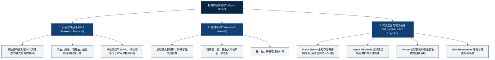

# 托克集团 (Trafigura Group) —— 全球独立大宗商品贸易与物流巨擘全景介绍

> **《财富》世界500强排名：第 25 位**  
> **年度营业收入：$240,268 百万美元（约 2403 亿美元）**  
> **官方网站：[www.trafigura.com](https://www.trafigura.com)**

---

## 🏢 企业基本信息 (Corporate Snapshot)

| 维度 | 详细信息 |
| :--- | :--- |
| **公司全称** | 托克集团有限公司 (Trafigura Group Pte. Ltd.) |
| **成立时间** | 1993 年 (创立于荷兰/瑞士，由克劳德·多芬等原马克·里奇核心团队组建) |
| **全球总部** | 🇸🇬 新加坡 (亚太行政总部) / 🇨🇭 瑞士 日内瓦 (主要运营总部) |
| **创始人** | 克劳德·多芬 (Claude Dauphin)、埃里克·德·图克海姆 (Eric de Turckheim) 等 |
| **现任董事长兼 CEO** | 杰里米·威尔 (Jeremy Weir) |
| **公司所有权属性** | 100% 由员工持股的私营合伙人制企业 (约 1,400+ 名员工股东) |
| **全球员工总数** | 约 12,000+ 人（覆盖全球近 160 个国家与办事机构） |
| **核心业务赛道** | 原油与精炼石油产品、有色金属精矿与精炼金属、液化天然气 (LNG) 与电力、大宗物流终端基础设施 |

---

## 🌐 核心业务矩阵与商业版图 (Business Ecosystem)

---

## ⚡ 核心竞争壁垒与护城河 (Competitive Advantages)

### 1. 纯粹的员工持股合伙人制 (Employee-Owned Partnership)
- 托克拒绝外部风险投资和公开上市，100% 股权由全球约 1,400 名核心业务骨干直接持有。这种机制杜绝了华盛顿和华尔街追逐季度短期财报的弊端，使团队能以极长远的十年期视角重仓高价值物流基础设施，并在危机时保持极高的团队凝聚力与风险共担意识。

### 2. 强大的物理物流资产（油库、港口、冶炼厂）协同
- 拥有全资/控股的 **Impala Terminals**（在拉美、非洲和欧洲拥有数十座深水码头与保税仓库）以及 **Puma Energy**（近 2,000 座零售加油站与机场航油供应点），使托克不仅能做纸面价差交易，更能掌控实物调配与加工混兑（Blending）的核心工艺。

### 3. 有色金属与原油全球双霸主地位
- 托克是全球极少数同时在“湿货”（原油与成品油）和“干货”（有色金属精矿）两大领域均位居全球前三的超级独立贸易巨头，在能源与金属之间具备跨商品套利与对冲能力。

---

## 📈 历史里程碑年表 (Historical Milestones)

- **1993年**：原 Marc Rich + Co 核心交易员克劳德·多芬、埃里克·德·图克海姆等 6 人在荷兰阿姆斯特丹创办 **Trafigura (托克)**。
- **1997年**：收购并成立下游成品油分销平台 **Puma Energy**，进军拉美和非洲新兴市场零售基础设施。
- **2000年代**：迅速成长为全球最大的独立有色金属精矿贸易商，开创大宗商品物流与仓储专用子公司 **Impala Terminals**。
- **2012年**：托克将全球主要注册行政总部迁往**新加坡**，深度融入亚太能源与矿业贸易中心。
- **2015年**：创始人克劳德·多芬在日内瓦因病逝世，**杰里米·威尔 (Jeremy Weir)** 接任董事长兼首席执行官。
- **2019年**：全面收购陷入重组困境的全球锌铅冶炼巨头 **Nyrstar**，将高附加值工业冶炼资产纳入版图。
- **2022-2023年**：在地缘政治危机与全球能源供应链重构大潮中，托克净利润创下超 70 亿美元的历史最高纪录。
- **2024-2026年**：托克集团营收达 2402 亿美元，稳居《财富》世界500强第 25 位。

---

## 🎯 企业文化与价值观 (Core Culture)

1. **合伙人精神 (Partnership and Ownership)**：人人皆股东，利益与风险深度绑定。
2. **严守风控纪律 (Strict Risk Management)**：不盲目押注单边单向行情，以背对背锁定与严格基差套期保值作为生存法则。
3. **深入一线实物 (Physical Reality)**：大宗商品的本质是货物的物理转移，脚踏实地掌控每一个码头、货舱与油罐。
