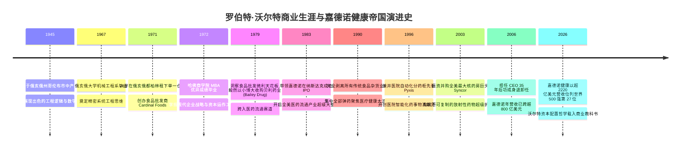
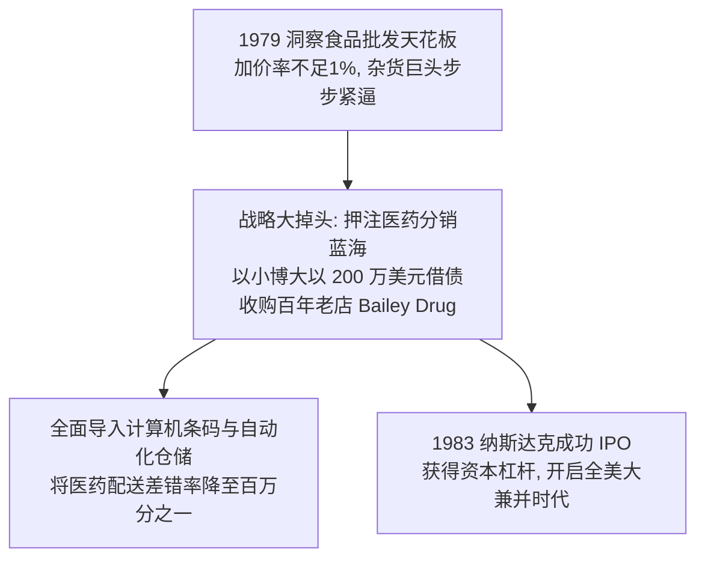
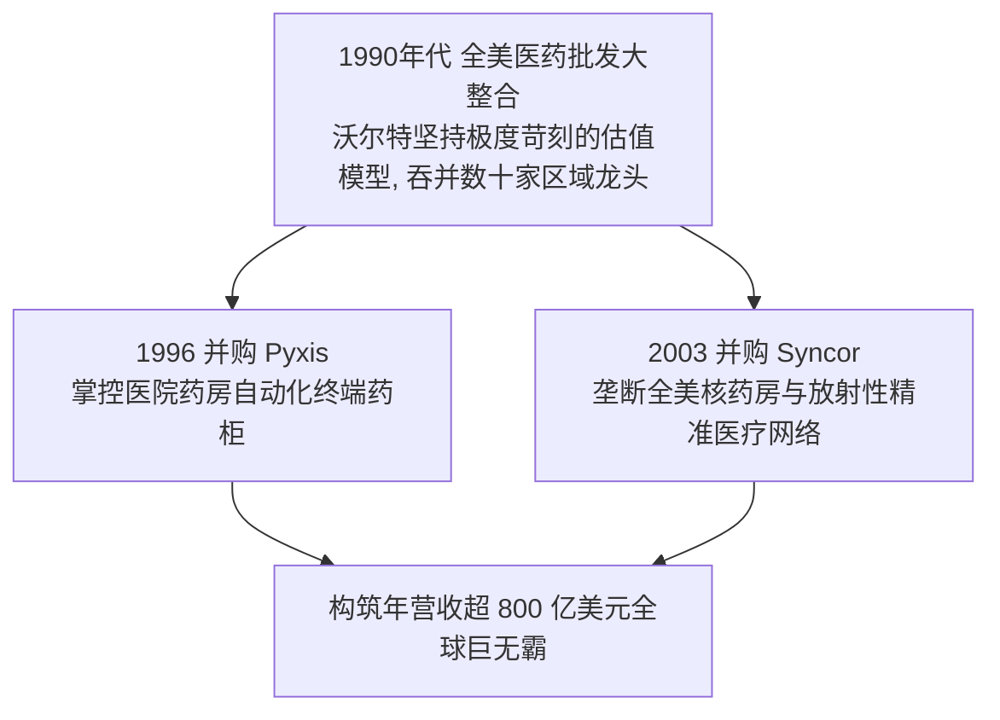

# 罗伯特·D·沃尔特 (Robert D. Walter)：从食品仓库到两千亿医疗帝国的造局宗师

> **“在低毛利的流通行业里，平庸者在每一个细节上流血致死，而卓越者在每一个微小的流程上榨取效率。你不需要去发明一种奇迹药物，只要你能比任何人都更快、更准、更省地把药物送到医生和患者手中，你就是整个医疗生态系统不可或缺的心脏。”**  
> —— 罗伯特·D·沃尔特 (Robert D. Walter)

---

```text
==================================================================================================
【传主档案速览】
• 全名：罗伯特·D·沃尔特 (Robert D. Walter, "Bob Walter")
• 生辰：1945 年 (天蝎座) | 出生地：美国 俄亥俄州 哥伦布市 (Columbus, OH)
• 身份：嘉德诺健康集团 (Cardinal Health) 创始人、前董事长兼 CEO (执掌长达35年)
• 学历：俄亥俄大学机械工程学士 (B.S. in Mechanical Engineering, 1967)、哈佛商学院 MBA (1972)
• 董事会资历：曾任美国运通 (American Express)、诺德斯特龙 (Nordstrom)、百胜餐饮 (Yum! Brands) 独立董事
• 核心商业成就：以 26 岁食品批发小仓库起家，35 年主导逾 100 起教科书级并购，缔造两千亿级世界 500 强医疗巨头
• 核心精神图腾：战略大转型魄力、资本配置纪律、流程精细化工程、不可或缺的枢纽哲学
==================================================================================================
```

---

## 🧭 全景生命历程与重大历史决断编年轴 (Chronological Epic)



---

## ⚙️ 第一章：俄亥俄的工程师、哈佛 MBA 与都柏林小仓库 (1945 — 1972)

### 1. 机械工程学的严谨底色
- **1945 年**，罗伯特·沃尔特（朋友们亲切地称他为“鲍勃·沃尔特”）出生于美国俄亥俄州哥伦布市。
- 沃尔特天生对复杂机械结构与物理系统的运作逻辑着迷。1963 年他考入俄亥俄大学攻读机械工程学。在大学期间，他深入学习了热力学、流体力学与运筹学模型。
- 工程学的训练塑造了沃尔特终生受用的思维方式：**任何看似庞大混乱的商业系统，本质上都是一系列关于物料流速、摩擦损耗与管道通量的工程问题；只要把每一个节点的摩擦阻力降到最低，系统的吞吐效率就能成倍释放。**

### 2. 26 岁创办 Cardinal Foods 与哈佛商学院洗礼 (1971–1972)
- 1971 年，26 岁的沃尔特在俄亥俄州都柏林小镇租下了一座老旧的冷库，创立了 **Cardinal Foods**，为当地杂货店配送冷冻食品和杂货。
- 与此同时，沃尔特考入**哈佛商学院 (Harvard Business School)** 攻读 MBA。
- 他在哈佛系统研习了公司财务、资本结构与竞争战略理论。白天在波士顿课堂上与教授探讨跨国公司并购案例，周末坐红眼航班飞回俄亥俄亲自清点仓库库存。1972 年哈佛毕业时，沃尔特已经具备了兼具“工程师精细落地”与“华尔街资本战略眼光”的顶级商业操盘能力。

---

## 🔄 第二章：惊天大转型：以小博大收购 Bailey Drug (1979 — 1989)

### 1. 发现食品批发的死胡同与医药蓝海 (1979)
- 经过 8 年打拼，Cardinal Foods 年销售额突破数千万美元，但沃尔特越来越感到不安：
  - 传统食品批发加价率被大型连锁超市压得极低，净利润率长期在 1% 边缘挣扎，且商品保质期极短、损耗巨大；
  - 与此同时，沃尔特敏锐地发现：美国战后婴儿潮人口逐渐步入中年，新药研发层出不穷，而当时的医药分销市场极其碎片化——全美有上千家守着一亩三分地的家族式小药批，信息化程度极低，配送效率低下。



### 2. 借债 200 万美元并购 Bailey Drug
- 1979 年，沃尔特做出了改写公司命运的决定：抵押全部资产借贷，以 **200 万美元** 收购了位于俄亥俄州赞斯维尔的百年医药批发商 **Bailey Drug Company**。
- 这是一场典型的“蛇吞象”式冒险。沃尔特将机械工程方法论引入医药分销：
  - 在业内率先投资昂贵的大型 IBM 主机与计算机条形码扫描系统；
  - 建立全自动立库分拣流水线，把原本需要人工翻找数小时的配药单，压缩到几分钟内全自动出库，次日清晨准时送达药店柜台。
- 1983 年，公司以 **Cardinal Distribution** 之名在纳斯达克成功挂牌上市，获得了源源不断进入资本市场的融资跑道。

---

## 📈 第三章：百场并购无一败绩的“资本配置大师” (1990 — 2006)

### 1. 彻底剥离食品，全面聚焦医疗大健康 (1990–1994)
- 1990 年代初，沃尔特做出了极具决断力的一刀切决策：将为公司带来起家资本的所有传统食品杂货业务全部出售剥离，将企业正式更名为 **Cardinal Health (嘉德诺健康)**，把所有的管理带宽与资金全面投入医疗产业。



### 2. 精准外科手术式并购艺术
- 在沃尔特担任 CEO 的 35 年间，他主导了 **超过 100 起兼并收购**，被哈佛商学院誉为“全美最卓越的资本配置者之一”：
  1. **纪律严苛**：绝不支付非理性的并购溢价，每一笔交易必须在 3 年内产生高于资本成本 (WACC) 的自由现金流回报；
  2. **跨界进军医院智能硬件 (Pyxis, 1996)**：以 9 亿美元换股收购 Pyxis 公司，让嘉德诺的触角直接伸进全美各大医院的手术室和护士站分药柜，牢牢锁定了终端处方流向；
  3. **布局核医学壁垒 (Syncor, 2003)**：斥资数十亿美元收购 Syncor International，一举拿下全美上百座特种放射性核药房，构筑了竞争对手数十年都无法逾越的准入牌照与超短半衰期供应链高墙。

---

## 🏛️ 第四章：罗伯特·沃尔特的管理哲学与底层认知工具箱

### 1. 枢纽模型 (The Irreplaceable Hub Theory)
- 沃尔特认为：“在一个高度分散的产业中，做上游（研发新药）面临巨大的临床失败风险，做下游（零售诊所）面临激烈的价格内卷。最稳健的商业模式是成为**连接两端的不可或缺的超级枢纽**。只要水流经你的管道，不论哪一种水草更茂盛，你都能持续收取过路费。”

### 2. 摩擦力归零工程学 (Zero-Friction Operations)
- 将机械工程中的“流体阻力最小化”移植到现代商业流转中：
  - 减少搬运次数、优化货位算法、推行供应商直通发货（Cross-Docking）；
  - 嘉德诺在业内率先做到单日处理数百万行订单而差错率低于 99.999%，以近乎零损耗的极致运营抵御通胀侵蚀。

---

## 💬 第五章：罗伯特·沃尔特经典名言金句 (Iconic Quotes)

1. **论战略转型的决断力**  
   > *“当你发现自己身处一艘正在慢慢下沉的破船上时，最聪明的做法不是拼命去舀水，而是果断跳上一艘正迎着朝阳全速前进的巨轮。”*  
   > _“When you find yourself in a leaking boat with no future, the smartest move is not to pump faster, but to leap decisively onto a ship sailing toward the dawn.”_

2. **论资本配置与并购**  
   > *“并购从来不是为了在新闻头条上炫耀规模，而是关于资本回报率的数学题。如果你买下了一家资产却无法通过精细运营让它的齿轮转得更快，那你只是在给自己的资产负债表堆积垃圾。”*  
   > _“Acquisitions are never about ego or headlines; they are pure mathematics of capital return. If you cannot make the acquired gears spin faster through operational rigor, you are merely accumulating waste on your balance sheet.”_

3. **论做医疗流通的责任**  
   > *“我们运送的不是普通的肥皂和薯片，那是拯救垂危生命的胰岛素、靶向药与放射源。在我们的字典里，准时率 99% 不叫优秀，那意味着有 1% 的患者在绝望中等待抢救。”*  
   > _“We do not ship soap or potato chips; we deliver life-saving insulins, oncology therapies, and radioactive tracers. 99% reliability is not acceptable—it means 1% of patients were left waiting in critical moments.”_
