# Meta Platforms公司 (Meta) —— 全球社交网络与开源人工智能帝国全景介绍

> **《财富》世界500强排名：第 30 位**  
> **年度营业收入：$200,966 百万美元（约 2010 亿美元）**  
> **官方网站：[about.meta.com](https://about.meta.com)**

---

## 🏢 企业基本信息 (Corporate Snapshot)

| 维度 | 详细信息 |
| :--- | :--- |
| **公司全称** | Meta Platforms公司 (Meta Platforms, Inc. / 前身为 Facebook, Inc.) |
| **成立时间** | 2004 年 2 月 4 日 (创立于美国哈佛大学柯克兰宿舍) |
| **全球总部** | 🇺🇸 美国 加利福尼亚州 门洛帕克 (Menlo Park, CA) |
| **创始人** | 马克·扎克伯格 (Mark Zuckerberg)、爱德华多·萨维林、达斯汀·莫斯科维茨、克里斯·休斯 |
| **现任董事长兼 CEO** | 马克·扎克伯格 (Mark Zuckerberg) |
| **股票代码** | NASDAQ: `META` (标普500与纳斯达克100核心龙头，市值突破 1.5 万亿美元) |
| **全球员工总数** | 约 70,000+ 人 |
| **全球月活跃用户 (MAP)** | 超过 39 亿人（每天超 32 亿人使用 Meta 旗下应用） |
| **核心业务赛道** | 社交应用矩阵 (Facebook/Instagram/WhatsApp/Threads)、AI 数字广告系统、开源大模型 (Llama)、VR/AR 空间计算硬件 (Quest/Ray-Ban Meta) |

---

## 🌐 核心业务矩阵与商业版图 (Business Ecosystem)

```mermaid
graph TD
    META["Meta Platforms 商业帝国 (Meta)"]
    
    META --> FOA["1. 应用家族 (Family of Apps - FoA)"]
    FOA --> FB["Facebook (全球超 30 亿 MAU 最大社交网络)"]
    FOA --> IG["Instagram (Reels 竖屏短视频、Stories 与 Threads 社交)"]
    FOA --> WA["WhatsApp (全球超 20 亿 MAU 私域即时通讯与企业商务)"]
    FOA --> ADS["Meta Ads (Advantage+ AI 驱动的全球最大精准数字广告拍卖网络)"]
    
    META --> AI["2. 人工智能与开源生态 (Meta AI & Open Source)"]
    AI --> LLAMA["Llama 系列前沿开源大语言模型 (Llama 3.1/3.2, Llama 4)"]
    AI --> PT["PyTorch (全球科研与产业界最主流深度学习开发框架)"]
    AI --> MTIA["MTIA 自研专用 AI 训练与推理芯片"]
    
    META --> RL["3. 现实实验室 (Reality Labs - RL 空间计算)"]
    RL --> QUEST["Meta Quest 3 / 3S 消费级 VR/MR 空间计算头显"]
    RL --> GLASSES["Ray-Ban Meta 智能音频与多模态 AI 眼镜 (爆款级硬件)"]
    RL --> ORION["Orion 全息真 AR 增强现实眼镜技术原型"]
    RL --> HORIZON["Horizon Worlds 元宇宙沉浸式社交平台"]

    classDef main fill:#0668e1,stroke:#000,stroke-width:2px,color:#fff;
    classDef branch fill:#0080fb,stroke:#0668e1,stroke-width:1px,color:#fff;
    classDef sub fill:#f5f8fc,stroke:#0668e1,stroke-width:1px,color:#000;
    class META main;
    class FOA,AI,RL branch;
    class FB,IG,WA,ADS,LLAMA,PT,MTIA,QUEST,GLASSES,ORION,HORIZON sub;
```

---

## ⚡ 核心竞争壁垒与护城河 (Competitive Advantages)

### 1. 人类历史上最庞大的双向社交图谱 (Social Graph) 与网络效应
- 旗下应用每天触达全球 **超过 32 亿日活跃用户 (DAP)**，连接了全球近一半的人口。极强的直接双向网络效应使得用户关系链极其牢固，为 Meta 构筑了竞争对手难以逾越的留存与分发壁垒。

### 2. AI 深度赋能的 Advantage+ 全自动广告引擎
- 凭借庞大的自建算力集群与领先的推荐大模型，Meta 将广告主的创意生成、受众定位、竞价与归因完全交由 AI 实时自适应优化，带来了极高的高转化率 (ROAS)，年广告营收跨越 1900 亿美元。

### 3. 开源 AI 战略打造全球开发者事实标准 (De Facto Standard)
- 通过全力开源 **Llama** 系列基础大模型和维护 **PyTorch** 架构，Meta 成功打破了闭源 AI 巨头的垄断，使全球数百万开发者围绕 Meta 的技术栈进行优化创新，极大降低了自身的基础算力与算法生态研发边际成本。

---

## 📈 历史里程碑年表 (Historical Milestones)

- **2004年2月4日**：马克·扎克伯格与哈佛大学室友在宿舍创办 **Thefacebook**。
- **2006年**：正式向全球公众开放注册，推出颠覆性的 **News Feed (动态汇总/信息流)** 功能；同年拒绝雅虎 10 亿美元收购要约。
- **2012年5月**：在纳斯达克成功挂牌上市（IPO 融资 160 亿美元）。
- **2012年**：以 **10 亿美元** 闪电收购成立仅 18 个月、只有 13 名员工的照片分享应用 **Instagram**。
- **2014年**：以 **190 亿美元** 巨资收购全球即时通讯龙头 **WhatsApp**；同年以 **20 亿美元** 收购虚拟现实先驱 **Oculus VR**。
- **2021年10月**：马克·扎克伯格宣布公司全面进军元宇宙，将母公司更名为 **Meta Platforms, Inc.**。
- **2023年**：扎克伯格推行“效率之年 (Year of Efficiency)”，精简组织；推出开源大语言模型 **Llama 2** 与文字社交平台 **Threads**（上线 5 天突破 1 亿注册用户）。
- **2024年**：发布拥有 4050 亿参数的开源旗舰大模型 **Llama 3.1**，与雷朋合作的 **Ray-Ban Meta AI 智能眼镜** 成为全球破圈现象级硬件产品。
- **2024-2026年**：Meta 年营收跨过 2000 亿美元大关，位列《财富》世界500强第 30 位，市值稳超 1.5 万亿美元。

---

## 🎯 企业文化与黑客精神 (The Hacker Way)

1. **快速行动 (Move Fast)**：在激烈竞争中，行动速度比追求绝对完美更为重要。
2. **专注于影响力 (Focus on Impact)**：做最少但最具杠杆效应、能改变最多人生活的大事。
3. **勇于冒险 (Be Bold)**：在一个变化比光速还快的世界里，不冒任何风险是唯一注定失败的策略。
4. **保持开放与开源 (Be Open)**：坚信开放与去中心化的协作能够创造更大的社会总价值。
