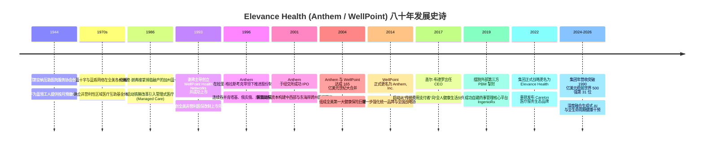
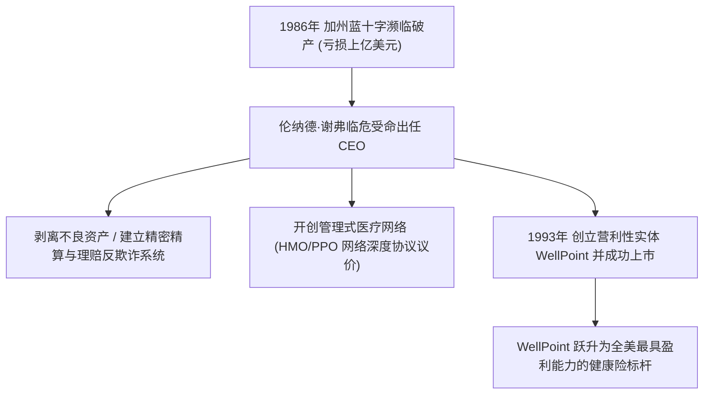
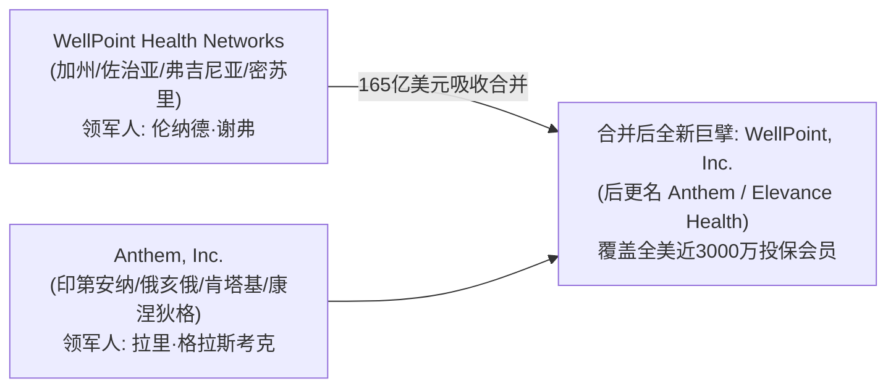
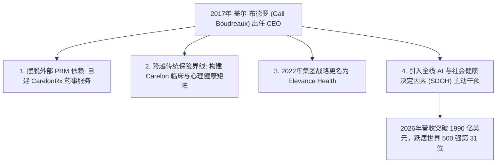

# Elevance Health 奠基先驱与转型领袖：重构全美健康保障的八十年史诗人物志

> **“健康保险的终极使命绝不是坐在办公室里计算冷冰冰的理赔发生率，而是必须走入患者的生活之中，提升整个生命周期的健康质量。唯有超越传统保险，我们才能真正实现对人类健康的庄严承诺。”**  
> —— 盖尔·布德罗 (Gail K. Boudreaux)

---

```text
==================================================================================================
【Elevance Health 领袖与奠基档案】
• 历史发端：1944 年印第安纳互助医院互保计划 (Associated Mutual Hospital Service)
• 现代版图构建者：
  - 伦纳德·谢弗 (Leonard Schaeffer)：WellPoint 商业化与管理式医疗体系总设计师，加州蓝十字救世主
  - 拉里·格拉斯考克 (Larry Glasscock)：Anthem 股份制改制与全国蓝十字兼并航母操盘手
  - 盖尔·布德罗 (Gail K. Boudreaux)：Elevance Health 战略更名与 Carelon 综合医疗生态总设计师
• 核心精神图腾：全人健康理念、特许经营网络合纵连横、价值医疗逆向闭环、去中介化服务延伸
==================================================================================================
```

---

## 🧭 八十年跨越式进化与重大决断编年轴 (Chronological Epic)



---

## 🏛️ 第一章：战火中的互助契约与印第安纳医保初心 (1944 — 1980)

### 1. 战时经济管制下的医疗危机
1940 年代初，正值第二次世界大战的高潮。美国战时劳工委员会实行严格的工资冻结政策，企业无法通过提高薪资来招募稀缺的工业劳动力。为了吸引产业工人，各大制造企业与医院管理者开始寻找新的员工福利形式——**预付型医疗保障**。

1944 年，在印第安纳州印第安纳波利斯市，几家主要社区医院的院长与当地知名医师携手，创立了**印第安纳互助医院服务协会 (Mutual Hospital Insurance Inc.)**。
- **运作机制**：投保雇员每月仅需缴纳极低的固定费用（最初仅为每月几十美分），即可在生病住院时由协会直接向医院结算病房与护理费用，免除工薪家庭因突发重病而破产的灭顶之灾。
- **蓝十字与蓝盾的雏形**：该协会后来分别演进为印第安纳蓝十字（负责住院保障）与印第安纳蓝盾（负责门诊与医生手术保障）。它们以“社区费率制 (Community Rating)”为原则，秉持非营利性与互助共济理念，深深植根于美国中西部的制造业腹地。

### 2. 区域壁垒与非营利体制的增长瓶颈
在随后的三十年间，蓝十字与蓝盾模式在全美各州独立开花。然而，这种按州割裂、彼此独立的非营利互助社模式，在进入 1970-1980 年代后遭遇了严峻的结构性挑战：
- **医疗通胀失控**：随着现代尖端医疗器械与新药的爆发式普及，美国医疗费用年复合增长率飙升至两位数；
- **商业保险公司的降维打击**：以旅行者保险 (Travelers)、大都会人寿 (MetLife) 为代表的营利性商业保险公司，通过“经验费率制（仅挑选年轻健康群体投保）”掠夺优质客户，把高风险、高成本的老弱病残群体留给了非营利性的蓝十字协会，导致后者陷入巨额亏损。

---

## ⚡ 第二章：伦纳德·谢弗与加州蓝十字的生死突围 (1986 — 1996)



### 1. 救火队长：临危受命的华盛顿改革者
1986 年，加利福尼亚州蓝十字协会（Blue Cross of California）由于成本失控、管理混乱，净资产已跌至负数，濒临破产倒闭边缘。加州保险局甚至已准备对其进行强制接管清算。

此时，年仅 41 岁的**伦纳德·谢弗 (Leonard Schaeffer)** 被董事会推选为首席执行官。
- **谢弗的传奇履历**：毕业于普林斯顿大学经济学系，曾在卡特总统执政时期担任美国联邦医疗保险与医疗补助服务局（HCFA，现 CMS）局长，亲手管理着全美庞大的联邦医疗账单。他深谙美国医疗体制最深层的利益博弈与系统性漏洞。

### 2. 铁血重组：管理式医疗 (Managed Care) 的引入
谢弗上任后，展现出极其罕见的战略决断力与铁腕执行力：
1. **彻底终结“按项目无底线付费 (Fee-for-Service)”**：谢弗率先在全美推行严密的**管理式医疗网络 (HMO/PPO)**。保险公司不再无条件为医院开出的每一项检查买单，而是与精选的优质医院和诊所建立深度绑定网络，实行按人头付费 (Capitation) 或严格的打包折扣费率。
2. **构建全流程临床利用度审查 (Utilization Review)**：组建专业的护士与医学专家团队，对非紧急住院、高风险手术进行事前必要性评估，彻底挤干医疗过度治疗的巨大水分。
3. **分立上市：WellPoint 的诞生 (1993)**：为了打破非营利机构无法在公开资本市场融资的死结，谢弗创造性地将加州蓝十字的优质管理式医疗资产剥离，组建为营利性的 **WellPoint Health Networks Inc.**，并于 1993 年在纽交所成功挂牌上市。这一石破天惊的创举，不仅为公司注入了数亿美元的并购弹药，更为全美非营利医保体系的现代化改制树立了划时代的标杆。

---

## 🛡️ 第三章：拉里·格拉斯考克与 Anthem 的全国并购长征 (1996 — 2004)

在加州 WellPoint 崛起的同一时期，位于印第安纳波利斯的 Anthem 也在另一位商业战略大师**拉里·格拉斯考克 (Larry Glasscock)** 的操盘下，掀起了一场席卷全美的跨州整合风暴。

### 1. 走出印第安纳：跨州蓝十字多米诺骨牌
格拉斯考克敏锐地意识到，健康保险在本质上是一场**规模效应与网络密度**的残酷游戏。一家仅局限于单个州的保险公司，在面对通用汽车、IBM 等跨国跨州大型雇主时毫无议价能力。
- **闪电式跨州兼并**：从 1990 年代中后期开始，Anthem 凭借强大的信息系统整合能力与稳健的资产负债表，先后吞并了：
  - **肯塔基蓝十字与蓝盾** (Blue Cross and Blue Shield of Kentucky)
  - **俄亥俄蓝十字与蓝盾** (Community Mutual in Ohio)
  - **康涅狄格蓝十字与蓝盾** (Blue Cross and Blue Shield of Connecticut)
  - **新罕布什尔与缅因州蓝十字** 等多个东北部与中西部关键战略据点。

### 2. 2001年 Anthem 纽交所上市与资本飞轮
2001 年 11 月，在格拉斯考克的强力推进下，Anthem 正式完成股份制改制并登陆纽约证券交易所（股票代码：ATH）。
- 在上市首日，Anthem 获得了全美机构投资者的狂热认购。格拉斯考克将募集到的数十亿美元资本，全部转化为继续兼并各州割裂蓝十字协会的弹药库，为接下来撼动全美医疗界的那场世纪大重组埋下了伏笔。

---

## 💥 第四章：2004年 165 亿美元世纪大合并——两强合璧铸造全美第一 (2004)



### 1. 密室谈判与巅峰对话
2003 年秋天，加州千橡市的 WellPoint 总部与印第安纳波利斯的 Anthem 总部之间展开了高度保密的谈判。
- **谢弗与格拉斯考克的共识**：尽管两家公司各自在东西部独霸一方，但全美联合健康 (UnitedHealth Group) 与安泰 (Aetna) 正在全国范围内大肆蚕食市场。唯有将 WellPoint 卓越的商业化产品创新能力与 Anthem 雄厚的运营基础设施结合，才能打造出一个无法被逾越的超级巨无霸。

### 2. 扫清监管障碍与正式组建
2004 年 11 月 30 日，耗资 **165 亿美元** 的 Anthem 与 WellPoint 合并案正式获得全美各州监管机构的批准。
- **合并后的超级体量**：新公司拥有超过 **2,800 万** 投保会员（超越联合健康成为当时全美第一大医疗保险公司），在全美 14 个州独家掌握蓝十字蓝盾金字招牌，年营业收入瞬间跨入数百亿美元梯队。伦纳德·谢弗出任合并后新董事会执行主席，拉里·格拉斯考克出任总裁兼首席执行官。

---

## 🚀 第五章：盖尔·布德罗与全人健康战略大转型 (2017 — 2026)



### 1. 传奇女将挂帅：从全美全明星球员到医疗铁娘子
2017 年 11 月，Anthem 董事会宣布任命**盖尔·布德罗 (Gail K. Boudreaux)** 为新任首席执行官。
- **传奇底色**：布德罗青年时代是达特茅斯学院的明星女子篮球队队长、全美最佳球员（至今保持着多项得分与篮板历史纪录），拥有哥伦比亚大学商学院 MBA 学位。在执掌 Anthem 之前，她曾担任联合健康旗下核心保险业务 UnitedHealthcare 的全球首席执行官，被公认为全美医疗健康行业执行力最强、战略眼光最敏锐的女性领袖。

### 2. 斩断掣肘：自建 PBM 与创立 Carelon 生态
上任伊始，布德罗做出了两个颠覆性的重大战略抉择：
1. **全面终结与外部 PBM 巨头的依赖关系**：处方药是医疗支出中增速最快、利润最丰厚的板块。布德罗顶住供应链切换的巨大风险，提前自建全新药事服务管理平台，并将处方药数据与临床医疗数据彻底融合。
2. **创立 Carelon 综合健康服务品牌**：2022 年，布德罗主导将集团旗下的药事管理、行为心理健康、先进基层诊疗中心、术后居家康复与大数据分析业务全面整合为独立服务品牌 **Carelon**。Carelon 不仅服务于自身的 4700 万保险会员，更直接面向全美其他商业保险公司、雇主与政府机构输出高附加值服务，成为驱动集团盈利的第二超级引擎。

### 3. 2022年战略更名：Elevance Health 的诞生
2022 年 6 月，拥有数十年历史的 Anthem, Inc. 正式在纽交所敲钟更名为 **Elevance Health, Inc.**。
- 布德罗在更名演讲中宣告：*“‘Elevance’代表着 Elevate（提升健康水准）与 Advance（推进社会福祉）。我们不再仅仅是一家在人们生病后寄送支票的报销公司，我们是全生命周期的健康伙伴。”*

---

## 🧠 第六章：领袖底层认知与战略决策工具箱 (Cognitive Toolbox)

```text
==================================================================================================
【Elevance Health 战略管理心法】

1. 全人健康价值链模型 (Whole-Person Health Framework)
   • 核心心法：人类的健康 80% 取决于医疗诊室之外的因素（饮食营养、心理压力、居住环境）。
               必须将生理、心理与社会决定因素 (SDOH) 打通干预，从源头消灭高昂的晚期重症赔付。

2. 去中介化服务留存模型 (Service Insourcing & Value Capture)
   • 核心心法：绝不将高毛利的产业链环节（如 PBM 药事管理、专科转诊、慢病管理）拱手让与外部第三方。
               通过内生化运营将理赔支出转化为自身服务板块的营业收入与净利润。

3. 特许经营网络飞轮效应 (The BCBS License Network Moat)
   • 核心心法：依托无可替代的地域独占蓝十字品牌，以会员规模撬动医院最低折扣费率，
               再以费率优势转化为市场定价竞争力，实现跨周期的高黏性客户滚雪球。

4. 价值医疗逆向共赢机制 (Value-Based Care Alignment)
   • 核心心法：改变“医院看的病越多赚得越多”的传统弊端，与核心医生集团建立基于“治愈率与控费节余”
               的利益分成机制，让医生因“让病人少生病、少住院”而获得丰厚奖励。
==================================================================================================
```

---

## 🎭 第七章：经典轶事与领袖语录 (Anecdotes & Quotes)

### 1. 达特茅斯球场上的“不可阻挡之肘”
在达特茅斯学院求学期间，身高 1.88 米的盖尔·布德罗不仅连续三年当选常春藤联盟年度最佳球员，更在铅球与篮球赛场上展现出无与伦比的竞争意志。布德罗后来常对高管团队说：**“在篮球场上，如果你不敢迎着对方的严密防守强攻篮下，你就永远得不到制胜的分数；在医疗改革的深水区也是如此，所有的突破都必须在对抗与碰撞中完成。”**

### 2. 伦纳德·谢弗的“五角大楼式沙盘演练”
在 2004 年 Anthem 与 WellPoint 进行百亿美元大合并前夕，面对可能遭遇的联邦反垄断审查与加州监管部门的刁难，谢弗在洛杉矶的一家秘密酒店包房内组织了长达三周的“红蓝对抗沙盘演练”。他聘请了顶尖的反垄断律师与公共关系专家，模拟监管机构可能提出的上百个最刁钻问题，逐字逐句打磨应对策略，最终让这起世纪大兼并创造了全美大型医疗并购无条件过审的奇迹。

### 3. 传世经典名言
1. **论医疗保障的本质**  
   > *“如果我们只在客户躺进重症监护室时才开始介入，那不仅是医学的遗憾，更是商业策略上的彻底失败。最好的医疗保障，是让你一辈子都不需要用到那张住院理赔单。”* —— 盖尔·布德罗
2. **论危机变革**  
   > *“当一家组织濒临破产时，渐进式的修修补补是毒药；你必须敢于把旧系统彻底砸碎，重构利益链条与激励机制。”* —— 伦纳德·谢弗
