# Centene公司 (Centene Corporation) —— 全美政府赞助医疗保障与平价管理式医疗霸主全景介绍

> **《财富》世界500强排名：第 32 位**  
> **年度营业收入：$194,777 百万美元（约 1948 亿美元）**  
> **官方网站：[www.centene.com](https://www.centene.com)**

---

## 🏢 企业基本信息 (Corporate Snapshot)

| 维度 | 详细信息 |
| :--- | :--- |
| **公司全称** | Centene公司 (Centene Corporation) |
| **成立时间** | 1984 年 (由伊丽莎白·布林在威斯康星州密尔沃基家庭医院地下室创立) |
| **全球总部** | 🇺🇸 美国 密苏里州 圣路易斯 (St. Louis, MO) |
| **创始人** | 伊丽莎白·“贝蒂”·布林 (Elizabeth "Betty" Brinn, 1923–1992) |
| **功勋领袖 / 奠基人** | 迈克尔·内多夫 (Michael F. Neidorff, 1942–2022) |
| **现任 CEO** | 莎拉·伦敦 (Sarah M. London) |
| **股票代码** | NYSE: `CNC` (标普500指数核心成分股、财富美国50强核心企业) |
| **全球员工总数** | 约 **67,000+ 人** |
| **服务会员总规模** | 全美各州覆盖超过 **2,800 万** 投保会员 |
| **核心业务赛道** | Medicaid 州政府医疗救助管理式医保（全美第 1）、Ambetter 个人与家庭平价医保交易所计划（全美第 1）、Wellcare 联邦老年医疗保险 (Medicare Advantage & Part D)、Magellan Health 行为与心理健康、Envolve 专业药事与眼科/牙科健康综合服务 |

---

## 🌐 核心业务矩阵与商业版图 (Business Architecture)

```mermaid
graph TD
    CNC["Centene 集团核心商业版图 (Centene Corporation)"]
    
    CNC --> MCD["1. 州政府医疗救助业务 (Medicaid Managed Care)"]
    MCD --> MCD1["全美最大的 Medicaid 管理式医疗服务商 (覆盖全美近30个州)"]
    MCD --> MCD2["儿童健康保险计划 (CHIP) 与低收入母婴健康保障"]
    MCD --> MCD3["老年残障与长期护理综合保障 (ABD / LTSS)"]
    MCD --> MCD4["双重资格受益人计划 (Dual Eligible Medicare-Medicaid)"]
    
    CNC --> ACA["2. 商业平价医保交易所 (Ambetter Marketplace)"]
    ACA --> ACA1["全美排名第一的 ACA 平价医疗法案个人与家庭交易所保险品牌"]
    ACA --> ACA2["覆盖全美 28 个州，连续多年蝉联全美市场份额第一"]
    ACA --> ACA3["针对灵活就业、自由职业者与无雇主保险群体的高性价比计划"]
    
    CNC --> MCR["3. 联邦老年医保业务 (Wellcare Medicare)"]
    MCR --> MCR1["Wellcare Medicare Advantage (全美排名前列的老年红蓝卡优选计划)"]
    MCR --> MCR2["Medicare Part D 独立处方药保险计划 (覆盖全美50州)"]
    
    CNC --> SPEC["4. 专业医疗健康服务 (Specialty Healthcare Services)"]
    SPEC --> SPEC1["Magellan Health: 全美顶尖心理健康、药物成瘾与复杂特种病管理"]
    SPEC --> SPEC2["Envolve: 专业药房服务、视力健康、口腔健康及远程医疗解决方案"]

    classDef main fill:#00529b,stroke:#00a3e0,stroke-width:2px,color:#fff;
    classDef branch fill:#002855,stroke:#00a3e0,stroke-width:1px,color:#fff;
    classDef sub fill:#f0f4f8,stroke:#002855,stroke-width:1px,color:#000;
    class CNC main;
    class MCD,ACA,MCR,SPEC branch;
    class MCD1,MCD2,MCD3,MCD4,ACA1,ACA2,ACA3,MCR1,MCR2,SPEC1,SPEC2 sub;
```

---

## ⚡ 核心竞争壁垒与护城河 (Competitive Moats)

### 1. 全美独一无二的“政府赞助医疗保险”第一绝对垄断
- **Medicaid 领域的绝对王者**：Centene 长期专注于政府赞助型医疗保险市场。在全美各州政府将低收入医疗补助外包给商业管理机构的过程中，Centene 凭借近 40 年对州政策、地方立法的深度理解，保持着全美最高的政府标书中标率（RFP Win Rate）与续约率。
- **逆周期天然对冲属性**：当宏观经济下行或失业率上升时，商业雇主医保人数往往下滑，但符合 Medicaid 救助标准的低收入群体与投保 ACA 个人平价医保的人数却激增，赋予 Centene 无与伦比的抗经济周期防御韧性。

### 2. Ambetter：全美个人平价医保交易所（ACA）的绝对霸主
- **逆向布局的史诗级胜利**：当 2014-2017 年奥巴马医保面临诸多不确定性、联合健康与安泰等巨头纷纷退出交易所市场时，Centene 依托其在低收入人群运营中积累的极致精算与控费能力，果断逆势扩张 **Ambetter** 品牌，一跃成为全美 ACA 个人医保市场占有率第一的绝对王者。

### 3. “Local First（本地化深度扎根）”组织运作架构
- Centene 坚决摒弃传统跨国企业“总部高高在上、一刀切指令”的弊端，在所服务的每一个州设立完全独立运营的本地子公司（如 Sunshine Health in Florida, Superior HealthPlan in Texas, Peach State Health Plan in Georgia）。本地领导团队深谙当地医疗资源分布与社群文化，极大增强了州政府与社区的极高信任度。

---

## 📈 历史里程碑年表 (Historical Milestones)

- **1984年**：伊丽莎白·布林 (Elizabeth Brinn) 在威斯康星州密尔沃基市家庭医院（Family Hospital）地下室创办家庭医院医师协会（Family Hospital Plan），致力于为贫困群体提供有尊严的管理式医疗。
- **1992年**：伊丽莎白·布林逝世，其遗嘱设立慈善基金会造福密尔沃基儿童与社区。
- **1996年**：资深医疗高管**迈克尔·内多夫 (Michael F. Neidorff)** 出任总裁兼 CEO，制定以“政府赞助医疗管理”为核心的全国扩张战略，公司更名为 **Centene Corporation**。
- **2001年**：Centene 成功在纽约证券交易所挂牌上市（股票代码：CNC），年营收突破数亿美元。
- **2014年**：随着《平价医疗法案》(ACA) 落地，推出 **Ambetter** 个人交易所品牌，开启现象级爆发式增长。
- **2016年**：斥资 **68 亿美元** 收购加利福尼亚州医疗巨头 Health Net，全面打通美西高价值医疗市场。
- **2020年**：完成以 **173 亿美元** 对全美著名医疗险巨头 **WellCare Health Plans** 的世纪大并购，一举跃居全美最大的 Medicaid 与 Medicare Advantage 双龙头之一。
- **2022年**：功勋领袖迈克尔·内多夫功成身退并辞世；**莎拉·伦敦 (Sarah London)** 正式接任首席执行官，启动“价值创造计划 (Value Creation Plan)”，剥离非核心资产，全力推动数字化降本增效。
- **2024-2026年**：Centene 年营业收入稳步突破 **1940 亿美元**，位列《财富》世界500强第 **32** 位，成为美国社会民生医疗安全网最坚实的基石。

---

## 🎯 企业使命与核心价值观 (Mission & Purpose)

- **企业崇高使命 (Mission)**：
  > **“改善社区健康，关爱每一个独特的鲜活个体 (Transforming the health of the community, one person at a time)”**
- **核心价值观 (Core Values)**：
  1. **聚焦个体 (Focus on the Individual)**：深知每位低收入者背后的生活困境，拒绝将人抽象为统计数字。
  2. **全人关怀 (Whole-Health Approach)**：将医疗护理与住房、食物、心理健康紧密交织。
  3. **积极融入本地 (Active Local Involvement)**：做社区最忠诚的守望者与建设者。
