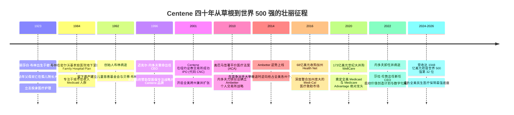
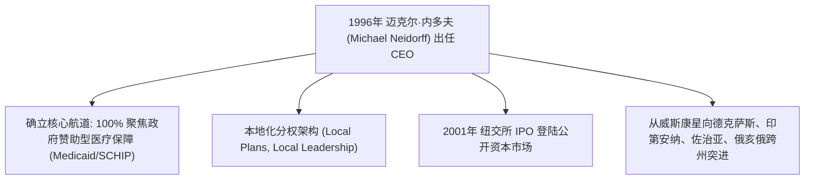
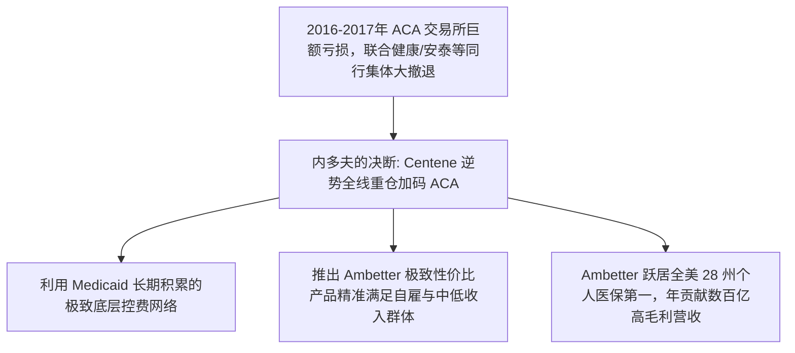

# 伊丽莎白·布林与迈克尔·内多夫：从医院地下室到两千亿帝国的医疗平民史诗

> **“无论一个人多么贫穷、处于社会的哪个阶层，当疾病降临时，他们都有权利获得最体面、最温暖且最高水准的医疗照护。尊严，是不可定价的处方药。”**  
> —— 伊丽莎白·“贝蒂”·布林 (Elizabeth Brinn)

---

```text
==================================================================================================
【Centene 创始人与关键领袖档案】
• 创始人：伊丽莎白·“贝蒂”·布林 (Elizabeth "Betty" Brinn, 1923–1992)
  - 身份：密尔沃基护士、医院管理者、平民医保先驱、慈善家
  - 核心功绩：1984 年在密尔沃基家庭医院地下室创办 Centene 前身，开创贫困人口管理式医疗
• 功勋总建筑师：迈克尔·内多夫 (Michael F. Neidorff, 1942–2022)
  - 身份：Centene 功勋董事长兼 CEO (执掌 26 年)
  - 核心功绩：将 4000 万美元营收的区域小微机构打造成近 2000 亿美元的全球 500 强顶级航母
• 现任掌门人：莎拉·伦敦 (Sarah M. London, 1980–)
  - 核心功绩：主导“价值创造计划”、数字化与 AI 临床赋能，实现跨时代战略交接
==================================================================================================
```

---

## 🧭 四十年史诗历程与重大战略决断编年轴 (Chronological Epic)



---

## 🏥 第一章：孤儿院里的微光与密尔沃基地下室革命 (1923 — 1992)

### 1. 苦难淬炼的仁心护士
1923 年，伊丽莎白·“贝蒂”·布林出生在威斯康星州密尔沃基市一个极度贫困的移民家庭。在幼年时期，父母便不幸相继离世，年幼的贝蒂被送往当地孤儿院抚养长大。
- 在清贫与孤独中成长的经历，没有让贝蒂变得冷漠，反而让她对底层社会的苦难与病痛拥有极其敏锐的同理心。
- 高中毕业后，她凭借半工半读完成了护士专业培训，进入密尔沃基当地医院成为一名一线白衣天使，后逐步晋升为医院资深行政管理者。

### 2. 1984年家庭医院地下室的平民医保创举
在 1980 年代初的美国，里根政府推行医疗费用缩减政策，各州针对贫困家庭的医疗救助计划（Medicaid）面临巨大资金窟窿。许多大型私立医院和医生将 Medicaid 患者视为“亏损源”，甚至直接拒诊低收入母亲和儿童。

1984 年，时任密尔沃基家庭医院负责人的伊丽莎白·布林，在医院逼仄阴暗的**地下室**里做出了一个改变美国医疗史的决定：
- **成立家庭医院医师协会 (Family Hospital Physician Associates / Plan)**：布林说服了医院里的一批骨干全科医生，与威斯康星州政府签订了一项试点协议：由协会按固定月费全面承包低收入家庭的健康管理。
- **有尊严的预防医学**：布林在地下室里设立了专门的孕妇营养指导站与儿童免疫登记簿。她向贫困母亲承诺：“只要来到这里，你们和你们的孩子将获得与华尔街富商完全一样的尊重与细致诊疗。”通过将关口前移至产前检查与儿童疫苗接种，协会不仅大幅降低了低收入家庭的新生儿死亡率和急诊住院率，还奇迹般地实现了收支平衡。这正是 Centene 商业模式最初始的基因种子。

---

## 📈 第二章：迈克尔·内多夫与两千亿帝国的战略筑基 (1996 — 2010)



### 1. 临危受命的医药界操盘手
1992 年，创始人伊丽莎白·布林因癌症不幸离世。失去了灵魂人物的协会在随后的几年里面临战略迷茫。
1996 年，董事会迎来了重塑其命运的商业天才——**迈克尔·内多夫 (Michael F. Neidorff)**。
- 内多夫拥有深厚的医药与消费品高管背景（曾任拜耳医疗 Bayer Healthcare 高管及 Miles Laboratories 核心负责人）。当他考察完这家年营收仅 4000 万美元、偏居中西部一隅的机构后，敏锐地洞察到了一个万亿美元级的时代机遇：**美国联邦与各州政府，终将无法承受日益膨胀的直接医疗报销重负，必定会将整个 Medicaid 体系全面外包给专业管理式医疗公司**。

### 2. 打造 Centene 航母与 2001 纽交所破冰
内多夫接管后，正式将公司更名为 **Centene Corporation**，并将总部迁至密苏里州圣路易斯。
- **独创“本地化自主运营”体系**：内多夫清醒地认识到，美国每个州的政治生态、医保法规和医疗网络千差万别。他拒绝建立中央集权式的官僚总部，而是在开拓每一个州时，都在当地注册独立法人、聘请熟悉当地社群的本土总裁，并赋予其极大的运营决策权。
- **2001年纽交所上市**：2001 年 12 月，Centene 成功在纽交所敲钟上市（NYSE: CNC）。内多夫利用资本市场募集的资金，如水银泻地般在德州、印第安纳、佐治亚等大州攻城略地，构筑起无法被撼动的政府招投标信任壁垒。

---

## ⚡ 第三章：逆行平价医保 (ACA)——华尔街集体溃逃时的惊天封神 (2010 — 2018)

2010 年，奥巴马总统签署了具有历史意义的《平价医疗法案》(Affordable Care Act, ACA)。然而，在 2014-2017 年法案进入个人交易所实操阶段时，全美医疗保险巨头遭遇了严重的精算灾难：
- 涌入交易所的个人投保者大多患有长期慢性病，理赔发生率远超预期；
- 联合健康 (UnitedHealth)、安泰 (Aetna)、胡玛纳 (Humana) 等巨头在蒙受数亿美元亏损后，纷纷公开发表声明宣布大面积撤出 ACA 交易所市场，华尔街分析师甚至预言“平价医保交易所即将彻底崩溃”。



### 内多夫的世纪豪赌：Ambetter 的全面下注
面对全行业的恐慌撤退，迈克尔·内多夫展现出了惊世骇俗的战略定力与逆向思维：
1. **洞察本质**：内多夫指出，传统商业保险巨头之所以在 ACA 上亏损，是因为他们习惯了向高收入白领雇主推销高价宽松网络，根本不具备管理中低收入、无固定雇主群体的底层控费能力。
2. **Ambetter 逆势横扫全美**：Centene 利用其为 Medicaid 建立的紧密型医生网络和严苛精算模型，为个人交易所量身定制了 **Ambetter** 品牌。当其他巨头撤离留下巨大市场真空时，Ambetter 几乎以零竞争态势横扫佛罗里达、德克萨斯、佐治亚等人口大州，连续多年蝉联全美市场份额第一，成为 Centene 历史上最赚钱的黄金业务。

---

## 🏛️ 第四章：百亿吞并与新掌门莎拉·伦敦的数字化新篇 (2016 — 2026)

### 1. 173 亿美元大吞并 WellCare
在确立了 Medicaid 与 ACA 的双王地位后，内多夫于 2019-2020 年完成了其职业生涯的收官巅峰之作——以 **173 亿美元** 彻底收购了全美老年医保巨头 **WellCare Health Plans**。
- 这场世纪大并购让 Centene 的会员规模瞬间突破 2500 万，直接填补了其在联邦红蓝卡老年医保（Medicare Advantage）领域的最后一块拼图。

### 2. 莎拉·伦敦与价值创造新纪元 (2022–2026)
2022 年，功勋卓著的迈克尔·内多夫正式卸任并于同年离世。Centene 董事会一致推选年轻有为的女性领袖**莎拉·伦敦 (Sarah London)** 出任首席执行官。
- **伦敦的改革新政**：莎拉·伦敦毕业于哈佛大学与芝加哥大学布斯商学院，曾是医疗大数据与风险投资界的顶尖精英。
- 上任后，她果断启动了轰动华尔街的“**价值创造计划 (Value Creation Plan)**”：坚决剥离非核心的国际业务与边缘资产，将数百亿美元资本集中投向临床级 AI、理赔自动化以及针对弱势群体的社会决定因素 (SDOH) 主动干预系统，推动 Centene 年营业收入跨过 **1940 亿美元** 大关，稳居世界 500 强第 **32** 位。

---

## 🧠 第五章：底层认知与战略决策工具箱 (Cognitive Toolbox)

```text
==================================================================================================
【Centene 逆向商业哲学与决策模型】

1. 弱势群体逆向精算模型 (Vulnerable Population Economics)
   • 核心心法：传统保险认为低收入人群是高赔付“负资产”，Centene 证明：只要通过及时的
               孕期管理、疫苗接种、胰岛素合规服药干预，就能消灭 80% 的突发急诊天价账单，
               将“高风险人群”转化为极具可预测性的高利润健康池。

2. 逆周期反脆弱护城河 (Counter-Cyclical Antifragility)
   • 核心心法：深度绑定政府财政民生安全网。经济繁荣时享受人口与税收增长红利；
               经济萧条失业激增时，政府 Medicaid 救助规模与平价医保补贴逆向暴涨，企业天然免疫经济寒冬。

3. 本地化自主与联邦规模飞轮 (Local Autonomy at Continental Scale)
   • 核心心法：绝不搞中央集权的大一统管理。把权力下放给 50 个州的本土团队去跟州议会与医生打交道，
               总部仅提供底层算力、资金中台与合规支持，实现“大而不僵、敏捷如狼”。

4. 社会决定因素 (SDOH) 高 ROI 闭环
   • 核心心法：为一个无家可归的高血压患者提供每月 300 美元的食品券和稳定住所，
               比在他发生脑中风后支付 30 万美元的 ICU 抢救账单要划算一千倍。善意即最高的商业理性。
==================================================================================================
```

---

## 🎭 第六章：经典轶事与领袖金句 (Anecdotes & Quotes)

### 1. 永远保留的密尔沃基地下室铭牌
在 Centene 位于圣路易斯的现代超甲级总部大楼核心展示厅内，至今悬挂着一块从密尔沃基家庭医院拆卸下来的黄铜旧门牌，上面写着“Family Hospital Plan - Basement Office 1984”。内多夫生前立下铁律：所有新入职的总监级以上高管，第一天必须在这块门牌前静立三分钟，时刻牢记公司源自泥泞草根的平民初心。

### 2. 贝蒂·布林儿童博物馆的笑声
创始人伊丽莎白·布林终生未育，但她在临终前签署了不可撤销信托，将自己持有的早期全部股份收益捐赠给密尔沃基市民，建成了享誉全美的**贝蒂·布林儿童博物馆 (Betty Brinn Children's Museum)**。四十年来，数百万来自贫困家庭的孩子在这里免费探索科学与艺术的殿堂。

### 3. 传世名言金句
1. **论医疗公平**  
   > *“在美国，一个人的寿命不应该取决于他出生地所在的邮政编码。无论财富多寡，生命的尊严至高无上。”* —— 伊丽莎白·布林
2. **论商业与社会责任**  
   > *“很多人问我 Centene 是如何赚到钱的。我告诉他们：我们之所以成功，是因为我们从不把服务穷人当成一门施舍的慈善，而是当成一项需要以最高专业度、最高科技含量去经营的崇高事业。”* —— 迈克尔·内多夫
