# 英国石油公司 (BP p.l.c.) —— 全球综合能源巨擘与低碳转型先锋全景介绍

> **《财富》世界500强排名：第 33 位**  
> **年度营业收入：$192,549 百万美元（约 1925 亿美元）**  
> **官方网站：[www.bp.com](https://www.bp.com)**

---

## 🏢 企业基本信息 (Corporate Snapshot)

| 维度 | 详细信息 |
| :--- | :--- |
| **公司全称** | 英国石油公司 (BP p.l.c.，前身盎格鲁-波斯石油公司 APOC) |
| **成立时间** | 1909 年 4 月 14 日 (发轫于 1901 年波斯石油特许权协定) |
| **全球总部** | 🇬🇧 英国 伦敦 (London, St James's Square) |
| **创始人 / 关键奠基人** | 威廉·诺克斯·达西 (William Knox D'Arcy)、乔治·雷诺兹 (George Reynolds)、温斯顿·丘吉尔 (Winston Churchill) |
| **现任 CEO** | 默里·奥金克罗斯 (Murray Auchincloss) |
| **股票代码** | LSE: `BP.` (富时100核心成份股), NYSE: `BP` |
| **全球员工总数** | 约 **87,000+ 人** |
| **全球业务网络** | 业务遍及全球 70 多个国家，日产油气当量超 **230 万桶** |
| **核心业务赛道** | 传统油气上游勘探与生产 (Upstream E&P)、炼油与石化产品、全球零售与便捷出行服务 (Retail & Convenience)、嘉实多 (Castrol) 高端润滑油、bp pulse 全球电动出行补能、低碳能源 (海上风电、太阳能 Lightsource bp、生物燃料与氢能)、综合能源贸易与套利 (Integrated Supply and Trading, IST) |

---

## 🌐 核心业务矩阵与全球版图 (Business Architecture)

```mermaid
graph TD
    BP["BP 全球综合能源生态 (BP p.l.c.)"]
    
    BP --> UP["1. 优质上游油气业务 (resilient hydrocarbons)"]
    UP --> UP1["墨西哥湾深水超深水油气资产 (Thunder Horse/Mad Dog/Argos)"]
    UP --> UP2["英国北海与挪威近海成熟油气田"]
    UP --> UP3["阿塞拜疆里海油气走廊 (ACG / Shah Deniz)"]
    UP --> UP4["中东阿联酋/伊拉克及全球液化天然气 (LNG) 资产"]
    
    BP --> DOWN["2. 客户与产品终端 (Customers & Products)"]
    DOWN --> DOWN1["全球 20,000+ 座品牌加油及便利充电服务站 (bp connect)"]
    DOWN --> DOWN2["嘉实多 (Castrol): 百年全球顶级润滑油与热管理流体霸主"]
    DOWN --> DOWN3["Air bp: 全球领先的航空燃油与可持续航空燃料 (SAF) 供应"]
    
    BP --> TRANS["3. 低碳转型与新能源 (Transition Growth Engines)"]
    TRANS --> TRANS1["bp pulse: 全球超高速电动汽车公共充电桩网络 (覆盖英美欧中)"]
    TRANS --> TRANS2["生物能源 (Bioenergy): 生物柴油、生物天然气与农业废弃物提纯"]
    TRANS --> TRANS3["氢能与碳捕集 (Hydrogen & CCUS): 工业级绿氢与蓝氢工程"]
    TRANS --> TRANS4["可再生电力: 控股全美最大光伏开发商之一 Lightsource bp 与海上风电"]
    
    BP --> IST["4. 综合供需与大宗贸易 (Supply & Trading, IST)"]
    IST --> IST1["全球最大的物理石油与天然气现货/期货大宗交易套利中心之一"]
    IST --> IST2["跨区域、跨季节、跨品种能源衍生品精准风险对冲"]

    classDef main fill:#007a3d,stroke:#ffcc00,stroke-width:2px,color:#fff;
    classDef branch fill:#004b23,stroke:#ffcc00,stroke-width:1px,color:#fff;
    classDef sub fill:#f4fbf4,stroke:#004b23,stroke-width:1px,color:#000;
    class BP main;
    class UP,DOWN,TRANS,IST branch;
    class UP1,UP2,UP3,UP4,DOWN1,DOWN2,DOWN3,TRANS1,TRANS2,TRANS3,TRANS4,IST1,IST2 sub;
```

---

## ⚡ 核心竞争壁垒与飞轮引擎 (Competitive Advantages)

### 1. 全球顶级深水勘探与低平衡成本油气资产
- **极致的抗周期韧性**：经历 2010 年代与 2020 年代多次油价暴跌洗礼后，BP 彻底重塑了上游资产组合，将其优质深水油气田（如墨西哥湾、阿塞拜疆、特立尼达）的新项目平均完全成本压降至 **30-40 美元/桶** 以下，具备在任何极端低油价周期中持续产生数十亿美元自由现金流的超强盈利底座。

### 2. 全球无与伦比的“能源贸易套利引擎 (IST)”
- **BP 最神秘且最赚钱的王牌武器**：BP 拥有全球石油巨头中最强大的综合供求贸易部门 (Integrated Supply and Trading, IST)。依托全球数千名专业交易员、庞大的超级油轮船队、遍布各大洋的储油罐区与跨国长输管道，BP 能够在全球任何地域出现能源供应短缺或价格畸变时，利用毫秒级的信息优势进行跨大西洋、跨欧亚的物理与金融期现套利，在油气价格剧烈波动的动荡年份屡创数十亿美元的超额利润。

### 3. 百年全球品牌嘉实多 (Castrol) 与终端便利零售网络
- **全球润滑油金字招牌**：嘉实多品牌拥有超百年的全球顶级声誉，在高端乘用车机油、工业风电机组精密润滑油以及下一代电动汽车专用浸没式电池冷却液（Castrol ON）领域占据全球第一梯队份额。
- **高坪效零售与超充枢纽**：在全球拥有的 20,000+ 座零售站点正加速升级为集便利零售（与 Marks & Spencer 等联营）、高品质咖啡与 bp pulse 超快充一体的综合出行驿站。

---

## 📈 历史里程碑年表 (Historical Milestones)

- **1901年**：威廉·诺克斯·达西与波斯帝国国王签署长达 60 年的石油开采特许权协议。
- **1908年**：地质家乔治·雷诺兹在伊朗马斯吉德苏莱曼钻出中东历史上第一口商业高产油井，揭开世界中东石油纪元序幕。
- **1909年**：**盎格鲁-波斯石油公司 (Anglo-Persian Oil Company, APOC)** 在伦敦正式挂牌成立。
- **1914年**：在海军大臣**温斯顿·丘吉尔**推动下，英国政府出资 200 万英镑收购公司 51% 控股权，皇家海军全面由燃煤动力转向燃油动力。
- **1954年**：公司正式更名为**英国石油公司 (The British Petroleum Company)**。
- **1969年**：在极其严寒的美国阿拉斯加发现北美史上最大的油田——**普拉德霍湾油田 (Prudhoe Bay)**。
- **1970年代**：在英国苏格兰近海发现并成功开发**北海福蒂斯油田 (Forties Field)**，彻底改变英国能源安全格局。
- **1998年**：以 **480 亿美元** 巨资与美国阿莫科公司 (Amoco) 完成全球石油史上规模空前的超级大合并，随后并购阿科 (ARCO) 与嘉实多 (Castrol)。
- **2010年**：墨西哥湾马孔多油井“深水地平线”发生重大事故；BP 历经断腕自救，支付超 650 亿美元巨额赔偿与生态修复金，完成企业安全文化与管理架构的彻底重构。
- **2020年**：发布全新战略定位，宣布从一家传统的国际石油公司 (IOC) 向集油气、低碳、氢能、充电于一体的**综合能源公司 (IEC)** 转型。
- **2024-2026年**：BP 年营业收入稳居 **1920 亿美元** 以上，位列《财富》世界500强第 **33** 位，持续在能源安全保供与绿色低碳转型中保持全球领先。

---

## 🎯 企业文化与行动准则 (Culture & Principles)

- **企业崇高宗旨 (Purpose)**：
  > **“为人类与地球重新构想能源 (Reimagining energy for people and our planet)”**
- **行动准则 (Who We Are)**：
  1. **践行使命 (Live our purpose)**：确保每一次能源勘探与供应都兼顾安全与社会责任。
  2. **追求胜利 (Play to win)**：在竞争激烈的全球大宗商品市场中保持敏锐嗅觉与卓越执行力。
  3. **关爱他人 (Care for others)**：将生命安全置于一切利润与产量之上。
