# 中国农业银行股份有限公司 (Agricultural Bank of China Limited) —— 全球大型综合银行与普惠乡村振兴主力军全景介绍

> **《财富》世界500强排名：第 35 位**  
> **年度营业收入：$190,708 百万美元（约 1907 亿美元）**  
> **官方网站：[www.abchina.com](https://www.abchina.com)**

---

## 🏢 企业基本信息 (Corporate Snapshot)

| 维度 | 详细信息 |
| :--- | :--- |
| **公司全称** | 中国农业银行股份有限公司 (Agricultural Bank of China Limited, ABC) |
| **成立时间** | 1951 年 7 月 10 日 (农业合作银行成立；1979年恢复设立，2009年整体改制为股份制) |
| **全球总部** | 🇨🇳 中国 北京 (东城区建国门内大街69号) |
| **奠基先驱 / 关键领袖** | 南汉宸 (新中国金融奠基人、首任央行行长兼农行筹建主导者)、历代农行领导集体与广大基层开拓者 |
| **股票代码** | 上交所: `601288`, 港交所: `01288` (恒生指数、沪深300指数核心成份股) |
| **全球员工总数** | 约 **450,000+ 人** (全球员工规模最大、扎根最深的金融机构之一) |
| **网点网络覆盖** | 境内分支机构超 **22,000 家**，覆盖全中国 100% 县域及主要乡镇 |
| **服务客户总规模** | 服务个人客户超 **8.6 亿** 户，企业法人客户超 **1,000 万** 户，总资产超 **40 万亿人民币** |
| **核心业务赛道** | 现代三农金融与乡村振兴贷款、普惠小微金融、重大基础设施与大中型企业金融、全渠道个人零售与财富管理、金融市场资金业务、农银国际 (投行)、农银理财、农银人寿、农银租赁、农银投资 (债转股) |

---

## 🌐 核心业务矩阵与商业版图 (Business Architecture)

```mermaid
graph TD
    ABC["中国农业银行金融航母 (Agricultural Bank of China)"]
    
    ABC --> SANNONG["1. 三农与乡村振兴金融 (Sannong & Rural Revitalization)"]
    SANNONG --> SN1["惠农e贷: 万亿级农户线上化纯信用秒批智能贷款"]
    SANNONG --> SN2["国家粮食安全与现代种业振兴专项金融支持"]
    SANNONG --> SN3["农业产业化龙头企业与现代农业产业园全产业链金融"]
    SANNONG --> SN4["县域城乡融合与农村基础设施补短板信贷"]
    
    ABC --> CORP["2. 公司金融与国家重大战略 (Corporate Banking)"]
    CORP --> CP1["重大基础设施工程信贷 (高铁、高速公路、水利、特高压)"]
    CORP --> CP2["先进制造业与国家战略新兴产业专精特新支持"]
    CORP --> CP3["绿色金融与碳减排支持工具 (绿色信贷规模数万亿)"]
    CORP --> CP4["跨境金融、自贸区金融与“一带一路”国际银团"]
    
    ABC --> RETAIL["3. 个人零售与财富管理 (Retail Banking & Wealth)"]
    RETAIL --> RT1["全国最大规模低成本个人储蓄存款与社保金融生态"]
    RETAIL --> RT2["个人住房按揭贷款与个人消费信贷 (网捷贷)"]
    RETAIL --> RT3["金钥匙财富管理与私人银行全生命周期资产配置"]
    RETAIL --> RT4["掌上银行 App: 超 2 亿高活跃度移动金融终端"]
    
    ABC --> SUBS["4. 综合化全牌照金融子公司 (Integrated Subsidiaries)"]
    SUBS --> SB1["农银国际 (ABCI): 境外投行、跨境上市承销与私募股权投资"]
    SUBS --> SB2["农银理财: 万亿级银行理财产品研发与财富管理"]
    SUBS --> SB3["农银人寿: 养老保险与全方位人身保险保障"]
    SUBS --> SB4["农银租赁 (金融租赁) & 农银投资 (市场化债转股实施机构)"]

    classDef main fill:#008573,stroke:#00a388,stroke-width:2px,color:#fff;
    classDef branch fill:#005c53,stroke:#00a388,stroke-width:1px,color:#fff;
    classDef sub fill:#f0f9f8,stroke:#005c53,stroke-width:1px,color:#000;
    class ABC main;
    class SANNONG,CORP,RETAIL,SUBS branch;
    class SN1,SN2,SN3,SN4,CP1,CP2,CP3,CP4,RT1,RT2,RT3,RT4,SB1,SB2,SB3,SB4 sub;
```

---

## ⚡ 核心竞争壁垒与飞轮引擎 (Competitive Advantages)

### 1. 独步全球的“县域最后一公里”物理与数字网点护城河
- **全国唯一的县域全覆盖网络**：农行拥有超过 **22,000 家** 实体网点，其中近半数深扎于县域及乡镇农村，覆盖了中国 100% 的县级行政区。
- **低成本负债的天然水源**：深厚的基层根基为农行带来了全中国规模最大、稳定性最高、付息成本最低的居民储蓄活期存款底座，使农行在激烈的息差竞争中拥有无与伦比的负债端成本护城河。

### 2. “惠农e贷”：万亿级大数据普惠信贷技术革命
- **数字化重塑农村信用**：农行打破了传统农村信贷依赖人工上门、缺乏抵押物的百年困局，创新融合土地确权、农业补贴、电商交易、水电气费及卫星遥感影像大数据，打造了全国规模第一的纯线上秒批信贷产品“**惠农e贷**”（贷款余额超 **万亿人民币**），坏账率长期保持在极低优良水平。

### 3. “城乡双轮驱动”与国家战略主力军地位
- 农行既是服务国家重大战略、支持南水北调、特高压电网、高端智能制造等国之重器的“国家金融重器”，又是扎根田间地头、精准扶贫与乡村振兴的“金融普惠中坚”，实现了高收益城市对公业务与高黏性县域零售业务的完美对冲与互哺。

---

## 📈 历史里程碑年表 (Historical Milestones)

- **1951年**：中央人民政府政务院批准成立新中国第一家专业银行——**农业合作银行**，开辟新中国农村金融体系建设纪元。
- **1951-1978年**：伴随国民经济体制调整，农行经历“四落五起”的历史曲折，在艰难中守卫农村金融火种。
- **1979年**：国务院下发《关于恢复中国农业银行的通知》，农行在改革开放春雷中正式恢复设立，全面支持家庭联产承包责任制与乡镇企业腾飞。
- **1994年**：中国农业发展银行分设成立，农行剥离政策性业务，全面向国有独资商业银行转轨。
- **1999年**：成立中国长城资产管理公司，剥离历史不良资产，开启商业化大攻坚。
- **2009年**：**中国农业银行股份有限公司**在北京正式创立，完成从国有独资到现代股份制商业银行的世纪蜕变。
- **2010年**：**7月15日与16日分别在上海证券交易所和香港联合交易所成功挂牌上市**，募集资金超 221 亿美元，创下当时全球资本市场史上最大规模的 IPO 纪录。
- **2018年**：全面打响脱贫攻坚与乡村振兴金融战役，推出数字化“一号工程”。
- **2024-2026年**：营业收入突破 **1907 亿美元**，资产总额迈上 **40 万亿人民币** 新台阶，位列《财富》世界500强第 **35** 位。

---

## 🎯 企业文化与办行理念 (Culture & Values)

- **企业崇高使命 (Mission)**：
  > **“面向‘三农’，服务图强 (Serving Sannong and Flourishing the Nation)”**
- **核心价值观 (Core Values)**：
  1. **诚信立业 (Integrity First)**：坚守合规底线与契约精神，珍惜人民托付的每一分钱。
  2. **稳健行远 (Prudent Progress)**：敬畏金融风险规律，做跨越经济周期的百年长青大行。
- **行训精神 (Motto)**：
  > **“严谨、求实、创新、奉献”**
