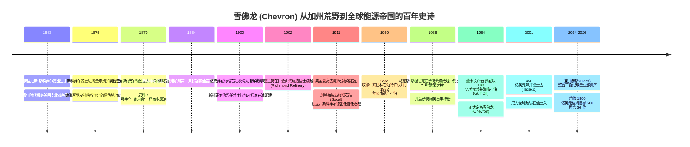
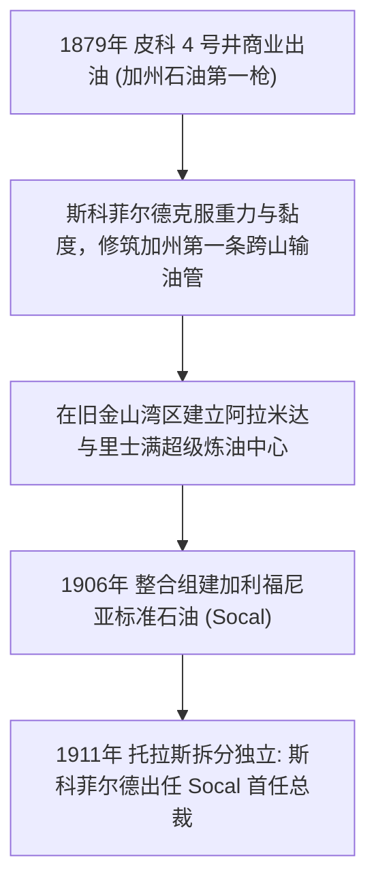
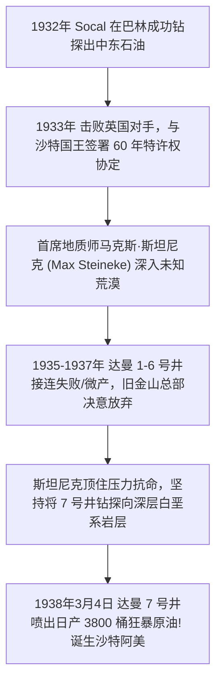

# 德米特里厄斯·斯科菲尔德与马克斯·斯坦尼克：从加州沥青荒山到阿拉伯石油传奇的探险人物志

> **“在石油这个行业，大地绝不会轻易交出它的秘密。唯有那些敢于踏入未知荒原、在无数次干涸失败中依然坚信地质规律的人，才能点亮文明前进的灯火。”**  
> —— 德米特里厄斯·斯科菲尔德 (Demetrius Scofield)

---

```text
==================================================================================================
【雪佛龙 (Chevron) 奠基人与关键开拓者档案】
• 商业创始人：德米特里厄斯·斯科菲尔德 (Demetrius Scofield, 1843–1917)
  - 核心功绩：1879 年联合创立太平洋海岸石油公司，打通加州第一条输油管道，打造美西石油工业基石
• 资本先驱：查尔斯·费尔顿 (Charles N. Felton, 1828–1914)
  - 核心功绩：加州前副州长与联邦参议员，为加州第一口商业油井（皮科 4 号井）提供决定性早期资本
• 探险总地质师：马克斯·斯坦尼克 (Max Steineke, 1898–1952)
  - 核心功绩：加利福尼亚标准石油 (Socal) 首席地质师，1938 年力排众议钻出沙特“达曼 7 号井”，缔造沙特阿美
==================================================================================================
```

---

## 🧭 百年拓荒征途与重大历史决断编年轴 (Chronological Epic)



---

## 🌲 第一章：淘金热后的黑色狂想——斯科菲尔德与加州第一桶油 (1843 — 1879)

### 1. 纽约老兵的加州探险
1843 年，德米特里厄斯·斯科菲尔德出生于美国纽约州。年轻时，他在美国南北战争中参加联邦军队服役，磨砺出了极其坚毅果敢、处变不惊的军人性格。
内战结束后，随着加利福尼亚淘金热的余波，斯科菲尔德怀揣着发财的梦想来到了旧金山。然而，他在加州中央山谷看到的不是闪闪发光的金沙，而是从山涧与峡谷泥土中不断渗出的黑色粘稠沥青与石油。

### 2. 查尔斯·费尔顿与皮科峡谷 4 号井的传奇
1870 年代，在加州洛杉矶北部的皮科峡谷（Pico Canyon），几名拓荒者用最原始的木制顿钻机艰难凿井。
- **1879 年 9 月 10 日**：斯科菲尔德联合加州政商界巨头**查尔斯·费尔顿 (Charles N. Felton)** 以及弗雷德里克·泰勒，在旧金山正式注册成立了**太平洋海岸石油公司 (Pacific Coast Oil Company，雪佛龙的直系前身)**。
- 费尔顿注入了数万美元的重磅资本，斯科菲尔德负责现场运营。在皮科峡谷，他们将 **4 号井 (Pico Well No. 4)** 钻探至 370 英尺深处。随着一阵剧烈的喷发，该井每天稳定喷出 25 桶高质量原油——**这是加利福尼亚州乃至整个美国西部历史上第一口真正具有商业开采价值的高产油井**！这一发现彻底终结了加州完全依赖东海岸宾夕法尼亚运送煤油的落后历史。

---

## 🏭 第二章：打通美西石油大动脉与里士满炼厂 (1880 — 1911)



### 1. 管道与炼厂：斯科菲尔德的基建奇迹
加利福尼亚原油重度高、黏度大，如何在没有铁路的崇山峻岭中将原油运到海港成为致命难题。
- 斯科菲尔德亲自带领工人在峡谷绝壁上铺设了加州第一条长途原油管道，将原油输送至圣佩德罗湾，并主导建造了旧金山湾区阿拉米达炼油厂；
- 随后，他推动建造了美国西海岸第一艘现代化蒸汽动力散装油轮，打通了从加州油田到旧金山、波特兰乃至夏威夷的跨洋原油销售网络。

### 2. 1911年拆分与加利福尼亚标准石油 (Socal) 的独立
1900 年，约翰·洛克菲勒的标准石油托拉斯看中了太平洋海岸石油公司的巨大潜力并将其收购。斯科菲尔德凭借无可替代的领导力留任核心管理层，并于 1906 年操盘将其与标准石油在西海岸的资产重组为**加利福尼亚标准石油公司 (Standard Oil Co. of California, Socal)**。
- 斯科菲尔德主导选址并修建了著名的**里士满超级炼油厂 (Richmond Refinery)**，至今仍是全美最重要的能源枢纽之一。
- **1911 年独立封神**：1911 年美国最高法院判定标准石油垄断并强令拆解。Socal 独立脱离托拉斯控制，德米特里厄斯·斯科菲尔德众望所归当选为独立后的 Socal 首任总裁。他确立了“立足加州、放眼太平洋、探矿全球”的雄伟纲领。

---

## 🏜️ 第三章：马克斯·斯坦尼克与沙特阿拉伯的“达曼 7 号”奇迹 (1930 — 1938)

加利福尼亚标准石油在 1930 年代完成了一场足以撼动人类现代文明进程的伟大探险——发现沙特阿拉伯巨型油田。



### 1. 英国人不要的荒漠，加州人来了
1930 年代初，英国各大石油巨头傲慢地认为“阿拉伯半岛除了骆驼和沙子一无所有”。
然而，Socal 的地质学家们坚信阿拉伯地质构造与伊朗和伊拉克存在深层关联。1933 年，Socal 击败了犹豫不决的英国竞争对手，与沙特阿拉伯开国国王伊本·沙特签署了覆盖巨额领土的 60 年特许权协定，成立了加利福尼亚阿拉伯标准石油公司（CASOC，即**沙特阿美 Saudi Aramco** 的前身）。

### 2. 斯坦尼克与达曼 7 号“繁荣之井”
Socal 派出了毕业于斯坦福大学的顶尖天才地质学家——**马克斯·斯坦尼克 (Max Steineke)**。
- **绝境中的孤注一掷**：从 1935 到 1937 年，斯坦尼克带领钻井队在酷热难耐的沙漠中接连钻探了 1 号到 6 号井，结果无一例外全部失败或仅有微弱气苗。旧金山董事会耗资数百万美元无果，拍发紧急指令要求全面撤出沙特。
- 斯坦尼克凭借对波斯湾古海洋沉积地层的深刻直觉，坚信白垩系阿拉伯深层石灰岩中必有大油层。他用自己的职业生涯作赌注，说服管理层允许他将 **7 号井 (Dammam No. 7)** 钻至更深的未知深度。
- **1938 年 3 月 4 日**：当钻头突破地下 4,727 英尺时，阿拉伯地底沉睡亿万年的黑色黄金狂暴喷出，日产原油迅速飙升至 **3,800 桶**，随后该构造被证实为全球历史上储量最庞大的超级大油田！
- 这口被誉为“繁荣之井 (Prosperity Well)”的达曼 7 号井，不仅彻底改变了沙特阿拉伯王国的历史命运，也让加州标准石油一跃成为全球石油资源的执牛耳者。

---

## 💥 第四章：世纪超级并购与雪佛龙的现代帝国版图 (1984 — 2026)

### 1. 1984年 133 亿美元惊天吞并海湾石油 (Gulf Oil)
1984 年，面对华尔街野蛮人皮肯斯 (T. Boone Pickens) 对“石油七姊妹”之一海湾石油公司发起的恶意收购，Socal 董事长乔治·凯勒 (George Keller) 果断出击，以 **133 亿美元** 全现金与股票完成对海湾石油的白衣骑士大吞并。
- 这场当时全球商业史上最大规模的并购案，诞生了全新的**雪佛龙公司 (Chevron Corporation)**，将全球两大石油帝国的油田、管道与炼厂完美融为一体。

### 2. 2001年兼并德士古与现代全景飞轮
- **2001 年 450 亿美元大兼并德士古 (Texaco)**：彻底将全球三大百年品牌（Chevron、Texaco、Caltex）收归麾下；
- **2020-2026 年战略收官**：在迈克尔·沃斯的领导下，雪佛龙先后吞并诺贝尔能源与赫斯公司（获得圭亚那世界级超级深水油田 30% 黄金权益），在二叠纪页岩油、澳洲巨型 LNG 与低碳转型科技中构筑起坚不可摧的全球护城河，年营收稳达 **1890 亿美元**，高居世界 500 强第 **36** 位。

---

## 🧠 第五章：底层认知与战略决策工具箱 (Cognitive Toolbox)

```text
==================================================================================================
【雪佛龙资本与地质探矿心法】

1. 地质深层第一性原理 (Geological First-Principles)
   • 核心心法：勘探不能被浅层的连续干井所吓倒。只要盆地的烃源岩、储集层与圈闭结构
               在第一性原理上成立，就必须有敢于向更深地层打穿最后一公里的战略笃定。

2. 铁血资本纪律与 ROCE 门槛 (Capital Discipline & Return Threshold)
   • 核心心法：绝不在油价暴涨的狂热期做高估值并购；在周期底部以低成本整合优质储量。
               一切上游投资必须通过“35美元极端压力测试”，做穿越牛熊周期的最高回报机器。

3. 特许权多边合资共赢机制 (The Consortium Joint-Venture Moat)
   • 核心心法：面对千亿美元级的海外国家级特大工程（如沙特阿美、哈萨克斯坦 TCO、澳洲 Gorgon），
               通过组建利益共享的跨国联合体分散地缘政治与资本风险，形成坚固的国家级盟友圈。
==================================================================================================
```

---

## 🎭 第六章：经典轶事与先贤金句 (Anecdotes & Quotes)

### 1. 斯坦尼克的沙漠手绘地图
在 1930 年代没有卫星导航和航空测绘的阿拉伯半岛，马克斯·斯坦尼克骑着骆驼和福特敞篷改装车，顶着沙尘暴在沙漠里用双眼和指南针手绘了上百幅地质剖面图。沙特老一辈贝都因向导对这位加州地质师惊叹不已：“这个美国人闭着眼睛用手摸一摸地里的沙子，就能说出几千英尺地底下埋的是什么岩石。”

### 2. 皮科峡谷 4 号井的长寿传奇
斯科菲尔德在 1879 年钻出的皮科峡谷 4 号井，不仅开创了加州石油工业，而且这口传奇油井一直不间断自喷开采了整整 **111 年**，直到 1990 年才作为加利福尼亚历史地标正式光荣封井退休，成为全球工业史上服役时间最长的伟大功勋井之一。

### 3. 传世名言金句
1. **论拓荒与坚持**  
   > *“真正的石油人从来不是坐在旧金山的办公室里看图纸，他们的脚上必须沾满现场的泥浆，他们的鼻腔里必须流淌着原油的气味。”* —— 德米特里厄斯·斯科菲尔德
2. **论地质信仰**  
   > *“只要地下的构造在向我们呼唤，哪怕上面覆盖着一千英尺看似绝望的干石，我们也必须钻下去。财富永远属于对大地规律坚信不疑的人。”* —— 马克斯·斯坦尼克
