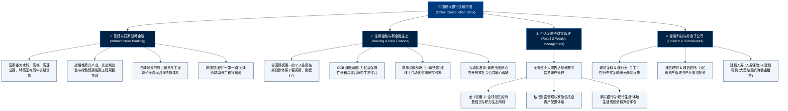

# 中国建设银行股份有限公司 (China Construction Bank Corporation) —— 全球大型综合商业银行与基建住房金融领军者全景介绍

> **《财富》世界500强排名：第 37 位**  
> **年度营业收入：$188,657 百万美元（约 1887 亿美元）**  
> **官方网站：[www.ccb.com](https://www.ccb.com)**

---

## 🏢 企业基本信息 (Corporate Snapshot)

| 维度 | 详细信息 |
| :--- | :--- |
| **公司全称** | 中国建设银行股份有限公司 (China Construction Bank Corporation, CCB) |
| **成立时间** | 1954 年 10 月 1 日 (中国人民建设银行创立；2004年股份制改制，2005年香港上市) |
| **全球总部** | 🇨🇳 中国 北京 (西城区金融大街25号) |
| **奠基先驱 / 关键领袖** | 武博山 (首任行长、新中国基建金融体系开创者)、历任建行领导集体与广大建设先锋 |
| **股票代码** | 上交所: `601939`, 港交所: `00939` (恒生指数、富时中国50核心成份股) |
| **全球员工总数** | 约 **375,000+ 人** |
| **全球分支机构** | 境内外拥有超 **14,000 家** 营业网点，在近 30 个国家和地区设立境外机构 |
| **总资产规模** | 总资产超 **38 万亿人民币**，服务个人客户超 **7.5 亿** 户，公司客户超 **1,000 万** 户 |
| **核心业务赛道** | 国家重大基础设施与战略工程信贷、住房金融与住房租赁生态 (CCB建融家园)、普惠金融小微快贷、龙卡信用卡与个人财富管理、金融科技输出 (建信金科 / 建行云)、建信理财、建信信托、建信人寿、建信租赁、建信投资 |

---

## 🌐 核心业务矩阵与商业版图 (Business Architecture)

---

## ⚡ 核心竞争壁垒与护城河 (Competitive Moats)

### 1. “国家基建首席银行”七十年专业技术壁垒与风控护城河
- **无人可及的项目精算能力**：建设银行自诞生之日起就深深烙印着“懂工程、懂预算、懂造价”的专业基因。建行拥有一支由数万名拥有国家注册造价师、建造师资质的工程技术与金融复合型专家队伍，能够对千亿级大型工程（如港珠澳大桥、白鹤滩水电站、大兴国际机场）的施工进度、现金流测算与工程概算进行毫米级精准穿透审查，不良贷款率长期处于大行最优之列。

### 2. 全球最大的住房金融生态与“长租房”先行者
- **从按揭垄断到长租生态**：建行不仅拥有中国规模最大、资产质量最坚固的个人住房按揭贷款底座，更率先在全行业启动“住房租赁”战略。打造“CCB建融家园”长租房运营平台，盘活存量房源数百万套，实现了从“传统按揭放贷人”向“国家租购并举新机制综合运营商”的升维进化。

### 3. “新金融行动”与“建行云”自研数字中枢
- 建行率先在业内提出并践行以“普惠金融、住房租赁、金融科技”为核心的新金融战略，打造了行业领先的“小微快贷”秒级审批体系与自研自主可控的“建行云”技术底座，赋能数百家金融机构与政务数字化服务平台。

---

## 📈 历史里程碑年表 (Historical Milestones)

- **1954年10月1日**：中央人民政府政务院决定设立**中国人民建设银行**，首任行长武博山受命组建，专门承接国家“一五”计划 156 项重点工程的建设资金管理与监督。
- **1979年**：在全国率先推行**“拨改贷”**改革试验，实现国家基本建设投资由无偿财政拨款向有偿银行贷款的历史性转变。
- **1994年**：国家开发银行设立，建设银行剥离政策性基建贷款业务，全面转向国有商业银行。
- **1996年**：正式更名为**中国建设银行**，并在全行业率先推出个人住房抵押贷款，唱响“要买房，到建行”的时代强音。
- **2004年**：**中国建设银行股份有限公司**正式成立，成功引入美洲银行与淡马锡作为战略投资者。
- **2005年10月27日**：**在香港联合交易所主板挂牌上市（股票代码：00939）**，打响了中国四大国有商业银行海外股改上市的“第一枪”，为中国银行业全面改革树立了标杆。
- **2007年**：成功回归 A 股在上海证券交易所挂牌上市。
- **2018年**：全行全面实施“住房租赁、普惠金融、金融科技”三大战略，设立全国首家国有大行金融科技子公司——建信金科。
- **2024-2026年**：年营业收入达到 **1886 亿美元**，总资产超 **38 万亿人民币**，位列《财富》世界500强第 **37** 位。

---

## 🎯 企业文化与价值观 (Culture & Purpose)

- **企业崇高使命 (Mission)**：
  > **“为客户提供更好服务，为股东创造更大价值，为员工搭建广阔平台，为社会承担全面责任”**
- **核心价值观 (Core Values)**：
  > **“诚实、公正、稳健、创造”**
- **服务理念 (Service Philosophy)**：
  > **“客户至上，注重细节”**
