# 福特汽车公司 (Ford Motor Company) —— 全球汽车工业缔造者与 Ford+ 智能出行巨擘全景介绍

> **《财富》世界500强排名：第 38 位**  
> **年度营业收入：$187,267 百万美元（约 1873 亿美元）**  
> **官方网站：[www.ford.com](https://www.ford.com)**

---

## 🏢 企业基本信息 (Corporate Snapshot)

| 维度 | 详细信息 |
| :--- | :--- |
| **公司全称** | 福特汽车公司 (Ford Motor Company) |
| **成立时间** | 1903 年 6 月 16 日 (创立于美国密歇根州底特律) |
| **全球总部** | 🇺🇸 美国 密歇根州 迪尔伯恩 (Dearborn, MI) |
| **传奇创始人** | 亨利·福特 (Henry Ford, 1863–1947) |
| **现任董事长 / CEO** | 比尔·福特 (William Clay Ford Jr. 执行董事长) / 吉姆·法利 (Jim Farley 总裁兼 CEO) |
| **股票代码** | NYSE: `F` (标普500指数核心成份股) |
| **全球员工总数** | 约 **177,000+ 人** |
| **全球年汽车销量** | 年交付量超 **440 万辆** (全球排名前列的超级汽车跨国集团) |
| **核心业务赛道** | Ford Blue (高盈利燃油与混动乘用车/SUV)、Ford Model e (纯电动智能汽车与自研软件)、Ford Pro (全球商用车、全顺 Transit、商用软件与全生命周期服务)、Ford Credit (汽车信贷与金融) |

---

## 🌐 核心业务矩阵与商业版图 (Business Architecture)

```mermaid
graph TD
    FORD["福特汽车全球业务版图 (Ford Motor Company)"]
    
    FORD --> BLUE["1. Ford Blue: 燃油与混合动力优势业务"]
    BLUE --> BLUE1["F-Series 超级皮卡家族 (全美连续 47 年最畅销卡车)"]
    BLUE --> BLUE2["Mustang 野马传奇肌肉跑车与高性能赛道文化"]
    BLUE --> BLUE3["Bronco & Explorer 烈马与探险者硬派越野 SUV"]
    BLUE --> BLUE4["高能效油电混动系统 (PowerBoost Hybrid)"]
    
    FORD --> MODELE["2. Ford Model e: 纯电动与智能软件中心"]
    MODELE --> ME1["F-150 Lightning 纯电动全尺寸超级皮卡"]
    ME2["Mustang Mach-E 纯电智能跨界轿跑 SUV"]
    ME3["自研整车操作系统 (Ford Operating System) 与电子电气架构"]
    ME4["BlueCruise 蓝智驾准 L3 级高速公路全自动领航辅助"]
    MODELE --> ME1
    MODELE --> ME2
    MODELE --> ME3
    MODELE --> ME4
    
    FORD --> PRO["3. Ford Pro: 全球商用车与商业车队解决方案"]
    PRO --> PRO1["Ford Transit (全顺): 全球销量第一的商用货运厢式轻客"]
    PRO --> PRO2["Super Duty 重载商用皮卡与市政特种作业改装车"]
    PRO --> PRO3["Ford Pro Telematics 车队数字化智能调度与远程能耗云"]
    PRO --> PRO4["专属商用快充网络与一站式全生命周期驻场维保"]
    
    FORD --> CREDIT["4. Ford Credit: 全球汽车金融与保险服务"]
    CREDIT --> FC1["全球经销商库存批售融资与零售客户购车分期租赁"]

    classDef main fill:#003478,stroke:#5c88da,stroke-width:2px,color:#fff;
    classDef branch fill:#001c48,stroke:#5c88da,stroke-width:1px,color:#fff;
    classDef sub fill:#f0f4fa,stroke:#001c48,stroke-width:1px,color:#000;
    class FORD main;
    class BLUE,MODELE,PRO,CREDIT branch;
    class BLUE1,BLUE2,BLUE3,BLUE4,ME1,ME2,ME3,ME4,PRO1,PRO2,PRO3,PRO4,FC1 sub;
```

---

## ⚡ 核心竞争壁垒与护城河 (Competitive Moats)

### 1. F-Series 皮卡神话：全美商业史上最赚钱的单一产品线
- **连续 47 年全美卡车销量冠军**：福特 F 系列皮卡（以 F-150 为代表）是美国汽车文化的代名词。平均每 49 秒就有一辆福特 F 系列皮卡售出。
- **超高毛利的现金流堡垒**：F 系列不仅年贡献近 400 亿美元营收，单车毛利率更远超普通轿车，为福特向电动化与智能化转型提供了源源不断的资金弹药。

### 2. Ford Pro：高壁垒、高黏性全球商用车生态第一王者
- **不可替代的企业级客户黏性**：福特 Transit（全顺）与 Super Duty 商用车在欧美市政、物流、建筑工程中占据近半壁江山。CEO 吉姆·法利打造的 **Ford Pro** 将商用车辆、远程车队车联网软件、专属充电桩与 24 小时巡回维修深度捆绑，软件与服务高毛利订阅收入年复合增长超 50%。

### 3. 百年热血品牌资产：Mustang 野马与 Bronco 烈马
- 福特拥有汽车工业史上最具文化号召力的超级 IP 矩阵：从 1964 年诞生、全球销量超千万台的 Mustang 跑车，到征服落基山脉的硬派越野 Bronco，赋予福特强大的溢价能力与狂热的全球车主社区生态。

---

## 📈 历史里程碑年表 (Historical Milestones)

- **1903年**：亨利·福特在底特律创立**福特汽车公司 (Ford Motor Company)**。
- **1908年**：正式推出划时代的 **T 型车 (Model T)**，开启全球平民汽车普及新纪元。
- **1913年**：亨利·福特在高地公园工厂发明世界上第一条**现代化汽车移动装配流水线 (Moving Assembly Line)**，装配时间缩短近 90%。
- **1914年**：宣布实行**“5美元工作日”**（日薪由 2.34 美元翻倍至 5 美元，工时缩短至 8 小时），奠定现代产业工人中产阶级基石。
- **1927年**：建成当时全球最大的一体化垂直制造工业奇迹——**胭脂河工厂 (Rouge River Complex)**，推出全新 A 型车。
- **1941-1945年**：二战期间建造著名的**柳树奔工厂 (Willow Run)**，实现每 63 分钟生产一架 B-24“解放者”重型轰炸机，被罗斯福总统赞誉为“民主兵工厂的核心引擎”。
- **1964年**：在纽约世博会发布传奇跑车 **Ford Mustang (野马)**，首日订单突破 2.2 万台，创造汽车营销史奇迹。
- **1966年**：福特 GT40 赛车在勒芒 24 小时耐力赛中包揽前三名，终结法拉利六连冠神话。
- **2006年**：传奇 CEO 艾伦·穆拉利 (Alan Mulally) 推行“一个福特 (One Ford)”战略，抵押全部资产借入 236 亿美元，成为 2008 年底特律三巨头中唯一没有申请政府破产救助的汽车巨头。
- **2021-2026年**：CEO 吉姆·法利大刀阔斧重组为 Blue、Model e、Pro 三大事业群；年营收达到 **1872 亿美元**，位列世界 500 强第 **38** 位。

---

## 🎯 企业文化与愿景 (The Ford+ Plan)

- **企业崇高宗旨 (Purpose)**：
  > **“通过构建一个每个人都能自由出行并追求梦想的美好世界，来帮助人类前行 (To help build a better world, where every person is free to move and pursue their dreams)”**
- **Ford+ 核心价值观 (Values)**：
  1. **做正确的事 (Do the right thing)**：恪守对客户、员工与社会的最高诚信与安全承诺。
  2. **探索未知 (Discover & Be curious)**：永葆对技术极限与制造创新的好奇心。
  3. **追求共赢与胜利 (Play to win)**：在智能出行新时代重塑敏捷与卓越竞争力。
