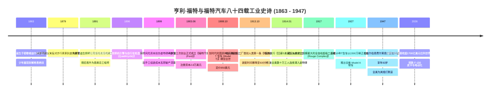
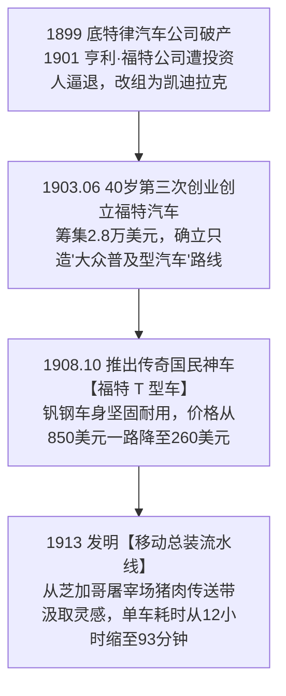
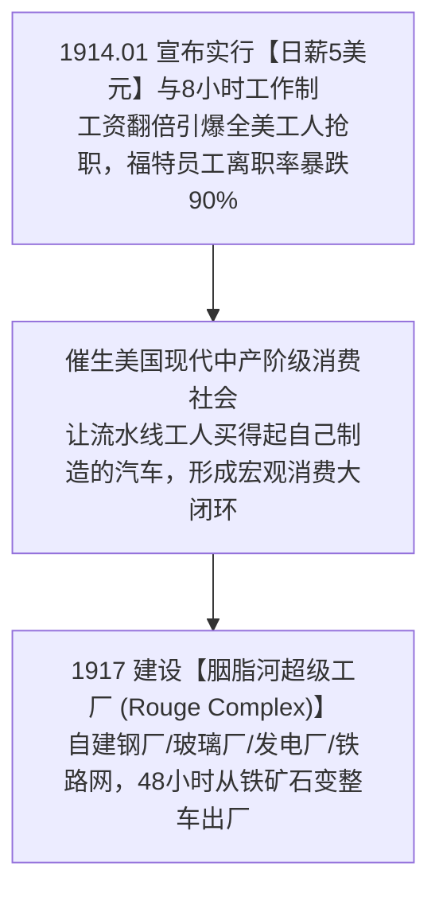

# 亨利·福特 (Henry Ford)：流水线工业革命、T型车传奇与日薪五美元神话全景史诗传记

> **“如果我当年去问顾客他们想要什么，他们只会告诉我：‘一匹跑得更快的马！’我的使命是为所有人制造一辆买得起的平民汽车。我们要把价格降到全美任何一名流水线工人只需花费几个月的薪水就能开走它！”**  
> —— 亨利·福特 (Henry Ford)

---

```text
==================================================================================================
【传主档案速览】
• 全名：亨利·福特 (Henry Ford, 1863–1947) | 狮子座 (享年 83 岁)
• 出生地：美国 密歇根州 韦恩县 迪尔伯恩 (爱尔兰移民农场)
• 机械起点：16岁离家前往底特律担任机械学徒 -> 爱迪生照明公司首席总工程师 (年薪1000美元)
• 创办实体：底特律汽车公司 (1899, 破产)、亨利·福特公司 (1901, 被逐后重组为凯迪拉克)、福特汽车公司 (Ford Motor Company, 1903)
• 工业革命创举：
  - 1908 年推出国民神车 **福特 T 型车 (Model T)**，累计狂销超 1500 万辆；
  - 1913 年发明人类工业史上第一条**移动汽车总装流水线 (Moving Assembly Line)**，将单车组装时间从 12 小时暴降至 93 分钟；
  - 1914 年震惊全美宣布实行**“日薪 5 美元与 8 小时工作制”**（相当于同行工资翻倍），直接催生了美国现代中产阶级消费社会；
  - 建设人类工业史上规模最庞大的全产业链自给工业城——**胭脂河超级工厂 (Rouge Complex)**。
• 历史地位：全球现代工业流水线与大众汽车普及之父、“福特主义 (Fordism)”奠基人
• 核心精神图腾：四轮车 (Quadricycle)、高地公园流水线、日薪五美元、黑漆 T 型车、全产业链自给胭脂河工厂
==================================================================================================
```

---

## 🧭 全景生命历程与福特工业帝国大编年轴 (Chronological Epic)



---

## 🔧 第一章：农场逃兵、爱迪生麾下总工与后院四轮车 (1863 — 1896)

### 1. 拆解全村怀表的 12 岁少年
- **1863 年 7 月 30 日**，亨利·福特出生在密歇根州底特律郊外迪尔伯恩的一个爱尔兰移民农场。
- 父亲威廉·福特希望他一生务农继承农田，但福特自幼极其厌恶繁重原始的农田劳作。
- **自制工具修理全村钟表**：
  - 12 岁那年，福特用自磨的小螺丝刀和镊子，把父亲送给他的怀表完全拆解成几百个细小齿轮又完整重新拼装好；
  - 随后他自愿给方圆十里的所有邻居免费修理了上百只钟表，并在 1876 年母亲不幸病逝后，彻底坚定了离开农场的决心。
- **16 岁步行前往底特律**：
  - 1879 年，16 岁的福特不顾父亲的严厉阻拦，徒步 8 英里走进底特律，进入詹姆斯·弗劳尔兄弟机械厂担任学徒工，每周薪水仅 2.5 美元，晚上还要到珠宝店给钟表匠打工以支付食宿。

### 2. 爱迪生照明公司首席工程师与 1896 砸墙开出四轮车
- 1891 年，福特进入托马斯·爱迪生旗下的底特律爱迪生照明公司担任夜班工程师，很快因精湛的机械维护手艺升任**首席总工程师**（年薪 1,000 美元）。
- **1896 年 6 月 4 日凌晨 2 点：后院砖棚的刺耳轰鸣**：
  - 福特在自家位于巴格利大道 58 号后院的小砖棚里，利用两只气缸、一台单缸汽油内燃机和四只自行车轮胎，纯手工敲打组装出了人生第一辆汽车——**“四轮车 (Quadricycle)”**；
  - 完工后他兴奋地发现车身过宽无法通过砖棚的大门。狂喜的福特抓起一把铁锤，**毫不犹豫地砸碎了后院的砖墙**，开着噗噗作响冒着黑烟的四轮车冲上了底特律空无一人的雨夜街道！
- **爱迪生在纽约晚宴上的拍肩激赏**：
  - 1896 年在纽约举办的爱迪生公司全国高管晚宴上，发明大王托马斯·爱迪生听完福特对轻量化汽油内燃机汽车的构想后，用力拍着桌子赞叹：
    > **“年轻人，你抓住了真正的未来！电力车太重受制于笨重蓄电池，而你的汽油内燃机自备动力源，轻巧敏捷，这才是未来的真正王者！坚持干下去！”**

---

## 🚗 第二章：两次破产出局、T 型车奇迹与流水线诞生 (1899 — 1913)



### 1. 两次创业破产出局与 1903 年 40 岁创立福特汽车
- 福特的早期创业之路布满荆棘：
  - 1899 年创办**底特律汽车公司**，因手工单件组装成本过高、故障频发而破产清算；
  - 1901 年创立**亨利·福特公司**，因与华尔街投资人就“造赛车还是造平民车”产生激烈冲突，福特被扫地出门（该厂随后被投资人请来亨利·利兰改组为名车**凯迪拉克**）。
- **1903 年 6 月 16 日：第三次创业创立福特汽车**：
  - 40 岁两手空空的福特联合煤炭商亚历山大·马尔科姆森等人凑集了 **2.8 万美元**，在麦克大道上一家改装过的货车厂房里正式创立了**福特汽车公司 (Ford Motor Company)**。

### 2. 1908 年福特 T 型车：改变人类出行方式的神车
- 1908 年 10 月 1 日，福特正式发布 **Model T（T 型车）**。
- **神车的三大第一性革命**：
  1. **采用高强度轻质钒钢 (Vanadium Steel)**：车身坚固耐用且极其轻盈，能够轻松跨越当时全美泥泞坑洼的乡村土路；
  2. **极简操作与易维修**：普通农民只需一把扳手和老虎钳就能修理发动机；
  3. **“任何颜色都可以，只要它是黑色的”**：因为黑色日本瓷漆干燥速度最快，能最大限度缩短流水线等待时间！

### 3. 1913 年发明移动总装流水线：人类工业制造第一奇迹
- 1913 年 10 月，在密歇根高地公园工厂，福特从芝加哥屠宰场流水传送带汲取灵感，设计出了**人类历史上第一条移动汽车总装流水线**。
- 用电动绞盘拉动汽车底盘向前匀速移动，工人们固定站在工位上重复装配单一零件：
  - 单台 T 型车的底盘装配时间从原先的 **12 小时 28 分钟**，瞬间骤降至 **1 小时 33 分钟（93分钟）**！
  - 生产效率暴增数倍使得 T 型车售价从早期的 850 美元，一路狂降至不可思议的 **260 美元**，全美普通工薪家庭家家开上了汽车。

---

## 💵 第三章：日薪五美元神话与全自给胭脂河超级工厂 (1914 — 1947)



### 1. 1914 年“日薪 5 美元”：催生美国现代中产阶级
- 1914 年 1 月 5 日，亨利·福特向全世界投下了一枚重磅炸弹：**福特工厂全体工人日薪从 2.34 美元直接翻倍暴增至 5 美元，每日工作时间从 9 小时缩短为 8 小时！**
- **福特的惊天商业逻辑**：
  > **“如果我自己的流水线工人都买不起自己制造的汽车，那么谁来买我的汽车？支付高工资绝不是慈善，而是创造庞大内需中产阶级的最高明战略！”**
- 消息传出次日，全美超过 10,000 名工人冒着暴风雪围堵在底特律工厂门前抢着应聘。福特工厂的工人离职率暴跌 90%，生产效率再次成倍跃升。

### 2. 胭脂河超级工厂 (Rouge Complex)：全产业链自给世界奇迹
- 1917 年，福特在底特律郊外开工建设了人类工业史上规模最庞大的**胭脂河超级工厂**。
- 内部拥有自己的炼钢厂、玻璃厂、橡胶林、铁矿山、发电厂与百公里铁路网。铁矿石从轮船卸下，在 48 小时内就能炼成钢水、铸成发动机并开出崭新的整车，实现了全宇宙最极致的工业闭环！
- **1947 年 4 月 7 日**，亨利·福特在迪尔伯恩的费尔莱恩庄园安详长眠，享年 83 岁。

---

## 🧠 第四章：亨利·福特底层工业心法 (Mental Models)

```text
==================================================================================================
【亨利·福特四大工业心法】

1. 极致规模效应与降价飞轮 (Extreme Economies of Scale)
   • 核心心法：不要通过高价格获取高利润。
               通过极限降低生产成本换取无敌低价，用无敌低价引爆海量需求，海量需求反过来进一步均摊固定资产折旧。

2. 移动流水线标准化分工 (Assembly Line Specialization)
   • 核心心法：让零件走向工人，而不是让工人走向零件。
               把复杂的机械手工手艺解构为最简单的秒级标准动作，消灭一切非生产性的肢体移动浪费。

3. 劳资共生与需求创造闭环 (High-Wage Consumption Loop)
   • 核心心法：工人不仅是生产成本，更是最终产品的消费者。
               提高一线员工收入能够将无产劳工转化为高购买力的现代中产阶级，创造无穷内需。

4. 全产业链垂直自给抗脆弱 (Full Vertical Self-Sufficiency)
   • 核心心法：在基础设施极其脆弱的工业拓荒期，
               将从铁矿石、橡胶、玻璃到总装的全部供应链牢牢掌控在自己手中，消除一切外部供应商扯皮与供应中断风险。
==================================================================================================
```

---

## 📅 第五章：亨利·福特重大年表 (Chronology)

- **1863年7月30日**：出生于密歇根州迪尔伯恩。
- **1896年6月4日**：在后院棚屋造出首台四轮内燃机汽车。
- **1903年6月16日**：创立福特汽车公司。
- **1908年10月1日**：正式推出福特 T 型车。
- **1913年10月**：发明人类首条移动汽车装配流水线。
- **1914年1月**：推行“日薪 5 美元”与 8 小时工作制。
- **1917年**：胭脂河超级工厂破土动工。
- **1927年5月**：第 1500 万辆 T 型车下线。
- **1947年4月7日**：在迪尔伯恩庄园逝世，享年 83 岁。
- **至今**：福特汽车稳居全球汽车工业巨头前列。
