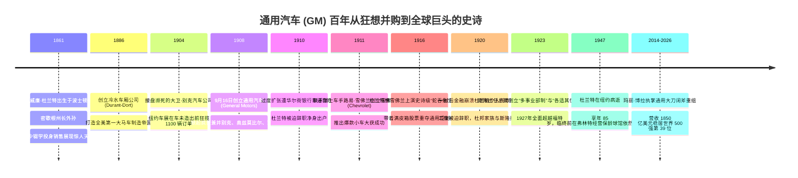
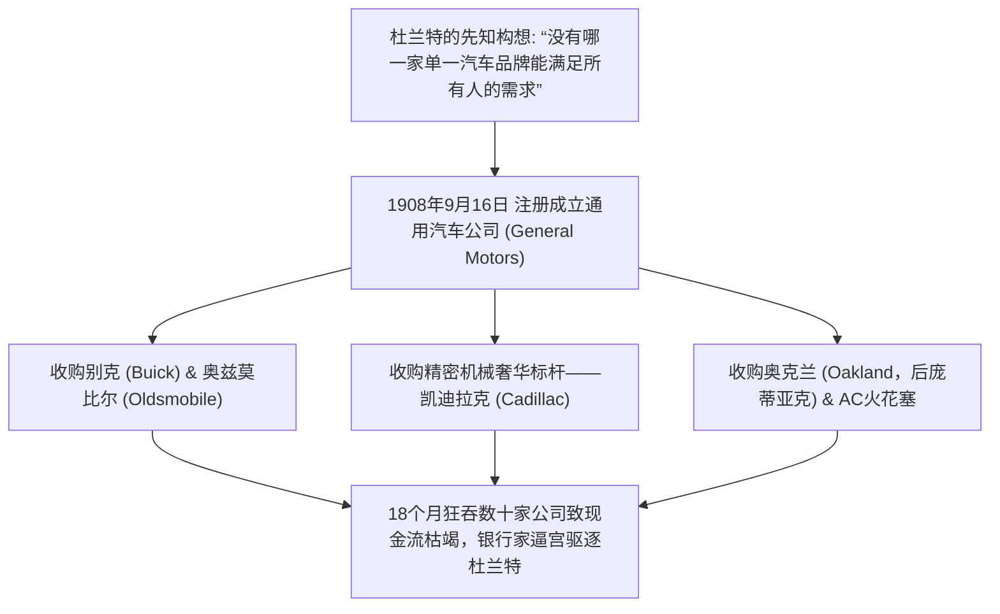
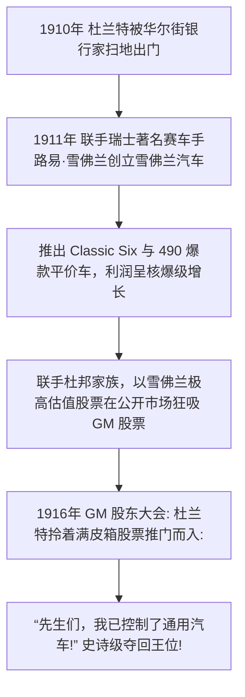
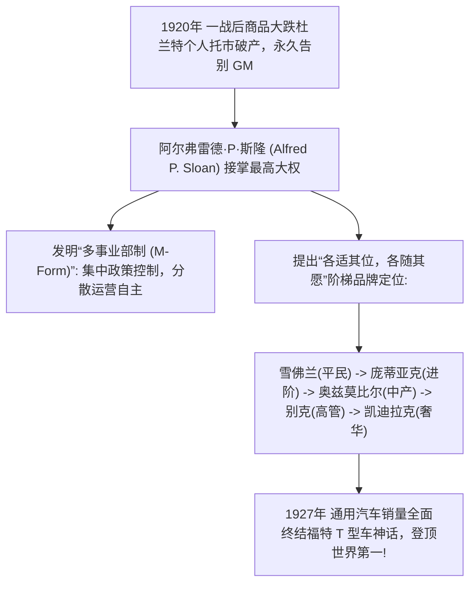

# 威廉·杜兰特与阿尔弗雷德·斯隆：汽车帝国的狂想缔造者与管理哲学宗师

> **“有些人把商业看作是小心翼翼的算账游戏，而我把商业看作是构筑宏伟文明的狂野史诗。如果你的梦想大到连自己都感到害怕，那么整个世界都会为你让路。”**  
> —— 威廉·C·杜兰特 (William Crapo Durant)

---

```text
==================================================================================================
【通用汽车 (GM) 创始人与宗师档案】
• 传奇创始人：威廉·C·“比利”·杜兰特 (William Crapo "Billy" Durant, 1861–1947)
  - 身份：弗林特马车大王、通用汽车创始人、雪佛兰联合创始人、华尔街资本造浪狂人
  - 核心功绩：1908 年创立通用汽车开创汽车集团并购模式；1916 年雪佛兰“蛇吞象”反向收购重夺控制权
• 现代管理学宗师：阿尔弗雷德·P·斯隆 (Alfred P. Sloan, 1875–1966)
  - 身份：通用汽车功勋总裁/董事长 (执掌 33 年)、现代企业多事业部制架构奠基人
  - 核心功绩：确立“各适其位，各随其愿”多品牌梯度战略，击溃福特登顶世界第一长达 70 年
• 现代掌门人：玛丽·博拉 (Mary T. Barra, 1961–)
  - 全球首位大型汽车巨头女性 CEO，引领通用汽车向“零事故、零排放、零拥堵”全面转型
==================================================================================================
```

---

## 🧭 百年跌宕风云与重大历史决断编年轴 (Chronological Epic)



---

## 🐴 第一章：弗林特的马车大王与拯救别克的销售奇才 (1861 — 1904)

### 1. 州长外孙的街头销售天赋
1861 年 12 月 8 日，威廉·克拉波·杜兰特（人称“比利·杜兰特”）出生于波士顿。他的外祖父亨利·克拉波曾是密歇根州著名州长兼木材大亨。然而，杜兰特从未依靠家族恩荫，他在高中时主动退学，在密歇根州弗林特的木材厂从搬运工做起，随后涉足药品、五金与保险销售。
- 杜兰特拥有历史上最罕见的商业魅力与说服力。一位与他共事的高管曾惊叹：**“比利·杜兰特能把一只死鸟从树上说下来，还能说服它为你唱一首欢快的歌；哪怕是向他追讨死债的最严厉银行家，走出他办公室时不仅不会要走一分钱，反而会笑着再开一张十万美元的贷款支票借给他。”**

### 2. 冷水车厢公司：全美第一大马车巨头
1886 年，杜兰特在弗林特街头试骑了一辆带有专利减震弹簧的双轮轻便马车。他敏锐地看到了商机，当晚就借了 1500 美元买下了该专利。
- 杜兰特联合好友达拉斯·多特创立了**弗林特轻便车厢公司（后更名冷水车厢公司 Durant-Dort Carriage Co.）**。
- 凭借极具侵略性的全国代理商网络和标准化装配，短短几年间，公司年产马车超过 **5 万辆**，成为当时全世界规模最大的马车制造商，杜兰特在 40 岁前便已成为富甲一方的百万富翁。

### 3. 1904年拯救别克：车还没造出来，先卖出 1100 辆
1904 年底，底特律发明家大卫·邓巴·别克（David Buick）研制出了优秀的顶置气门发动机，但因不善经营濒临破产倒闭，累计仅手工造出了两辆汽车。弗林特的商人们恳求马车大王杜兰特接盘。
- 杜兰特试驾了别克汽车后，立刻决定全资接管重组。
- **1905 年纽约车展神话**：杜兰特将唯一的一辆别克样车运到纽约车展。在展位上，杜兰特凭借三寸不烂之舌和宏伟图纸，**在短短三天内，在工厂甚至还没有一间像样厂房的前提下，一口气狂揽了 1,108 辆别克汽车的不可退定金订单**！别克汽车一战成名，成为底特律最抢手的品牌。

---

## 🏛️ 第二章：1908年通用汽车横空出世与疯狂吞并潮 (1908 — 1910)



### 1. 超越亨利·福特的帝国构想
在 1908 年，亨利·福特坚信全世界只需要一种单一型号的黑色 T 型车。
然而，杜兰特提出了完全相反的划时代商业洞见：
> **“汽车行业具有极高的时尚性与周期性。任何单一车型的辉煌都不可能永恒。唯有把不同价格、不同风格、不同功能的多个品牌组合在同一家大型集团之下，才能抵御周期波动，包揽所有客户！”**

### 2. 18个月吞并数十家公司的狂暴扩张
1908 年 9 月 16 日，杜兰特正式在新泽西州注册成立了**通用汽车公司 (General Motors Company)**。
随后，杜兰特展开了人类商业史上最狂风暴雨式的闪电并购：
- **1908 年**：将别克与奥兹莫比尔（Oldsmobile）纳入旗下；
- **1909 年**：以 450 万美元收购亨利·利兰创立的豪华车标杆**凯迪拉克 (Cadillac)**；
- 同年兼并奥克兰汽车（Oakland，即后来的庞蒂亚克 Pontiac）、重型卡车制造厂及阿尔伯特·钱皮恩的 AC 火花塞公司。
- **险些收购福特**：杜兰特甚至与亨利·福特达成了以 800 万美元全现金收购福特汽车的协议，但最终因华尔街银行家拒绝借出 800 万现金而抱憾搁浅。

### 3. 第一次被逐出帝国 (1910)
由于杜兰特的收购完全依靠激进的短期借款，1910 年全美遭遇突发流动性紧缩，通用汽车陷入现金流断裂危机。
华尔街银行家辛迪加同意注资 1500 万美元救急，但提出了极端苛刻的条件：**杜兰特必须辞去一切管理职务，被彻底剥夺控制权扫地出门**。

---

## 🐍 第三章：雪佛兰“蛇吞象”——商业史上最霸气的王者归来 (1911 — 1916)



### 1. 废墟中联手路易·雪佛兰
被赶出通用汽车的杜兰特没有丝毫沮丧。1911 年，他找到了曾经为别克车队效力的瑞士著名赛车手兼天才机械师**路易·雪佛兰 (Louis Chevrolet)**，在底特律成立了**雪佛兰汽车公司 (Chevrolet Motor Company)**。
- 杜兰特给雪佛兰定下了极致的战略定位：制造在性能上超越福特 T 型车、配备更平顺的四缸与六缸发动机、外观更加优雅但售价极具亲民竞争力的国民爆款车（如著名的雪佛兰 490）。
- 雪佛兰汽车一经上市便引爆全美，销量从数千辆飙升至数十万辆，盈利能力甚至超越了当时陷入内耗的通用汽车。

### 2. 世纪大猎杀：用雪佛兰股票吞并通用汽车
杜兰特暗中启动了商业史上最精妙绝伦的反向收购战：
- 他向公众和投资者宣布：**一股雪佛兰股票可以兑换五股通用汽车股票**！
- 同时，杜兰特获得了财力雄厚的特拉华**杜邦家族 (Du Pont)** 的鼎力支持，在华尔街二级市场以惊人的耐心秘密狂吸通用汽车流通股。
- **1916 年 5 月通用汽车股东大会的历史性一幕**：当华尔街银行家们正准备开会连任董事时，会议室大门被猛然推开，杜兰特带着助手走入全场，重重地将装满股权证明的皮箱砸在会议桌上，微笑着宣布：
  > **“各位先生，我想通知大家：我现在代表雪佛兰公司持有通用汽车超过半数的绝对控股权。我，正式接管通用汽车！”**
- 全场银行家目瞪口呆。杜兰特上演了人类商业史上最不可思议的“蛇吞象”反向收购，王者归来重登通用汽车最高宝座！

---

## 👑 第四章：斯隆时代登场——管理学圣经与超越福特 (1920 — 1956)



### 1. 杜兰特的悲壮谢幕与斯隆接棒
1920 年底，一战后全球大宗商品与股市爆发毁灭性暴跌。为了维护通用汽车股价，杜兰特动用全部个人身家和杠杆在公开市场拼死护盘托市，最终欠下两千万美元巨额债务而破产。杜邦家族接管债务，杜兰特于 1920 年 11 月永久辞去了通用汽车总裁职务。
1923 年，在杜邦家族支持下，麻省理工学院毕业的精密机械天才——**阿尔弗雷德·P·斯隆 (Alfred P. Sloan)** 正式出任通用汽车总裁兼首席执行官。

### 2. 现代管理学圣经：斯隆的多事业部制与品牌梯度
斯隆用了十年时间，彻底重构了通用汽车的灵魂，并将通用汽车打造为全世界最强大的现代企业组织机器：
1. **多事业部制 (M-Form Organization)**：确立了“**集中决策控制，分散运营自主 (Centralized Control with Decentralized Operations)**”的管理架构，各大品牌（雪佛兰、别克、凯迪拉克等）独立核算、自主竞争，总部负责战略、财务审计与大宗协同，这一模式至今仍是全球跨国巨头的标准组织架构；
2. **“各适其位，各随其愿 (A car for every purse and purpose)”**：
   - 彻底打破福特单一车型的死板模式，斯隆建立了严密的品牌阶梯：
     - **雪佛兰**：面向工薪阶层与年轻人的第一台车；
     - **庞蒂亚克**：面向追求运动与时尚的进阶青年；
     - **奥兹莫比尔**：面向稳健的中产家庭；
     - **别克**：面向成功的企业主与资深中产；
     - **凯迪拉克**：面向社会名流与顶级政商领袖的巅峰奢华。
3. **1927年全面击溃福特**：凭借多样的色彩、每年升级的车身设计（由哈利·厄尔 Harley Earl 主导的现代汽车造型设计部）以及分期付款服务（GMAC），通用汽车在 1927 年彻底击垮了停滞不前的福特 T 型车，一跃登顶全球汽车销量第一宝座，并统治世界车坛长达整整 70 余年。

---

## 🎳 第五章：跌落凡尘的乐观巨星与永远的传奇 (1930 — 1947)

### 1. 破产保龄球馆里的旷达老人
1929 年大萧条爆发后，杜兰特晚年创立的“杜兰特汽车”以及他的全部金融投资灰飞烟灭。1936 年，75 岁的杜兰特正式申请个人破产，名下只剩下一张价值 250 美元的旧书桌。
- 然而，这位曾经翻云覆雨、掌管万亿工业帝国的造浪者没有流露出一丝怨尤。
- 他在弗林特买下了一家废弃建筑，开办了一家**投币保龄球馆**与快餐馆。每天下午，这位白发苍苍的老人乐呵呵地在球馆里为小镇工人们擦拭保龄球、递送热狗。当记者问他是否后悔当年的疯狂冒险时，杜兰特爽朗大笑：
  > **“如果命运夺走了我的一切，那我就再从零开始！金钱不过是人生记分牌上的数字，真正让我着迷的，永远是造梦和开拓的过程！”**

### 2. 历史铭记：1947年的永恒告别
1947 年 3 月 18 日，威廉·C·杜兰特在纽约的一间普通公寓里安详辞世，享年 85 岁。通用汽车全体工厂降半旗致哀。历史终将铭记：是他以超前于时代的狂野想象力，无中生有地创造了通用汽车这艘人类工业史上最宏伟的商业巨舰。

---

## 🧠 第六章：底层认知与战略决策工具箱 (Cognitive Toolbox)

```text
==================================================================================================
【通用汽车帝国治理与资本心法】

1. 阶梯品牌矩阵定位模型 (Market Segmentation & Brand Laddering)
   • 核心心法：客户不是单一画像的集合体。
               通过建立阶梯式品牌矩阵，让产品覆盖从平民到顶级奢华的每一道收入阶梯，
               锁定用户终生价值，彻底消除单一爆品的周期性断崖风险。

2. 反向收购杠杆整合法 (Reverse Merger Synergy)
   • 核心心法：当主战场受阻时，寻找高成长性的单点爆品（如雪佛兰），
               用高成长资产作为杠杆武器，在资本市场反向吞并规模停滞的庞大母体。

3. 斯隆多事业部协同模型 (Sloan Decentralized Governance)
   • 核心心法：大企业死于僵化，小企业死于失控。
               总部只管资本分配、战略边界与风控审计；把战术决策与产品研发彻底还给一线事业部。

4. 乐观造浪与流动性反脆弱 (Optimism vs. Balance Sheet Fragility)
   • 核心心法：企业家必须具备改变世界的狂热乐观主义，
               但必须在组织内部设立最冷酷无情的“首席财务官与风险刹车器”，防止资金链在狂热中崩塌。
==================================================================================================
```

---

## 🎭 第七章：经典轶事与先贤金句 (Anecdotes & Quotes)

### 1. 杜兰特的“魔力握手”
杜兰特拥有一双极其清澈而温暖的蓝眼睛。当通用汽车在 1908 年疯狂收购凯迪拉克时，凯迪拉克创始人亨利·利兰原本极度鄙视杜兰特的投机做派。然而在一家酒店套房里，杜兰特与利兰闭门长谈了四个小时，当利兰走出房门时，他激动地流着眼泪对助理说：“比利·杜兰特不仅是一个绅士，他是一个洞悉未来的圣徒，我把凯迪拉克交给他死而无憾！”

### 2. 斯隆的“无声会议”
阿尔弗雷德·斯隆在主持通用汽车最高决策委员会时，有一条著名规则：如果一项重大投资提议在会议上获得了所有高管的一致赞成，斯隆会当场宣布散会：“既然大家没有任何反对意见，说明我们所有人都没有看清这项决策潜藏的致命风险。请大家回去寻找至少五个反对理由，下周再开会讨论！”

### 3. 传世名言金句
1. **论梦想与开拓**  
   > *“如果你的梦想大到连自己都感到害怕，那么整个世界都会为你让路。”* —— 威廉·C·杜兰特
2. **论组织与管理**  
   > *“现代管理的本质，在于找到政策控制与一线自由之间的黄金平衡点。”* —— 阿尔弗雷德·P·斯隆
