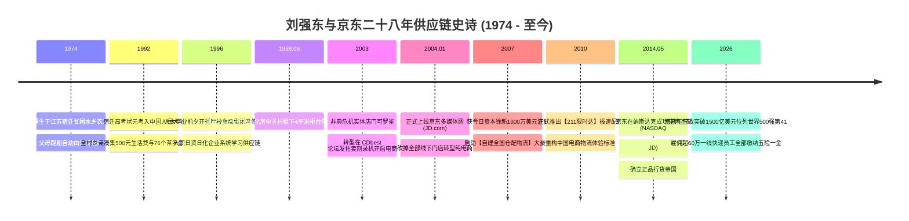
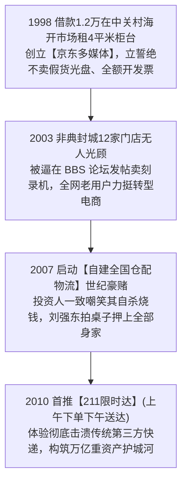

# 刘强东 (Richard Liu) 与京东：宿迁七十六个茶叶蛋、重资产自建物流与万亿供应链帝国全景史诗传记

> **“在过去的中国电商世界里，大家都习惯了轻资产、赚快钱的平台模式。但我坚信：唯有做最苦、最累、没人愿意碰的重资产自建仓配物流，把商品搬运次数从五次降到两次，将每一件货物在 24 小时内亲手送到老百姓手里，才是最坚不可摧的终极护城河！如果一家企业靠克扣一线兄弟的五险一金来赚钱，那是耻辱的利润！”**  
> —— 刘强东 (Richard Liu)

---

```text
==================================================================================================
【传主档案速览】
• 全名：刘强东 (Richard Liu / 大强子) | 1974.02.14 (水瓶座，江苏宿迁人)
• 求学履历：宿迁中学高考文科状元 -> 中国人民大学社会学系本科 (1992–1996)
• 草根起点：大学期间自学编程赚得第一桶金、大四开餐馆遭遇员工贪腐惨赔 24 万
• 创办实体：京东多媒体 (1998, 中关村海开市场 4 平米柜台) -> 京东商城 (JD.com, 2004)
• 颠覆壮举：
  - 2003 年非典危机毅然关闭 12 家实体柜台，全面转型线上电子商务；
  - 2007 年力排众议顶住投资人巨大质疑，豪赌全流程**自建仓储物流 (京东物流)** 与“211限时达”；
  - 坚决贯彻“正品行货、绝不卖假货、全额开发票”的商业底线；
  - 坚持为全集团超 60 万一线快递物流员工全额足额缴纳“五险一金”。
• 历史地位：中国自营电商与智慧供应链第一巨擘缔造者 (年营收超1500亿美元位列世界500强第41)
• 核心精神图腾：宿迁 76 个熟鸡蛋与 500 元缝在内裤里、十节甘蔗理论、重资产亚洲一号大库、211限时达
==================================================================================================
```

---

## 🧭 全景生命历程与京东征途大编年轴 (Chronological Epic)



---

## 🥚 第一章：宿迁水乡、七十六个茶叶蛋与大四开餐馆惨败 (1974 — 1997)

### 1. 宿迁水乡的贫苦童年与全村人的 500 元恩情
- **1974 年 2 月 14 日**，刘强东出生在江苏省宿迁市宿豫区来龙镇光明村一个极其贫困的农家。
- 父母常年在骆马湖上跑船运货，刘强东由外婆抚养长大。童年一年到头只能吃红薯和玉米糊，过年才能吃上一口猪油渣拌饭。
- **1992 年考入中国人民大学社会学系**：
  - 宿迁一中高考全校文科状元。
  - 全村父老乡亲知道刘家出了个大学生，村民们凑齐了 **500 元毛票零钱**，挨家挨户煮了 **76 个茶叶蛋** 塞进他的书包。刘强东的母亲将 500 元钱缝在他的贴身内裤里。这 76 个熟鸡蛋与 500 元巨恩，塑造了刘强东一生“知恩图报、绝不负乡亲兄弟”的草莽义气。

### 2. 人大机房自学编程与大四开餐馆背债 24 万
- 进京读大学后，刘强东深知社会学不好找工作，每天通宵泡在人大机房里自学 C 语言和编程。
- 大三时，他给外面的公司编写电力管理系统和证券公司分析软件，赚到了人生的第一桶金（**33 万元人民币**）。
- **大四开餐馆的惨痛教训 (1995)**：
  - 刘强东在人大西门外盘下了一家小饭馆，给员工开出高薪并送手表，实行绝对放权。
  - 然而由于缺乏制度与财务风控，大厨和收银员串通贪污做假账，不到一年餐馆彻底倒闭，刘强东不仅赔光了 33 万积蓄，还倒欠了 **24 万元巨债**！
  - 这次血淋淋的惨败，让刘强东深刻顿悟到了**“人性经不起考验，商业必须依靠严密制度与闭环流程”**的铁律。

---

## 💻 第二章：中关村 4 平米柜台、非典转线上与自建物流豪赌 (1998 — 2010)



### 1. 1998 年中关村 4 平米柜台：“绝不卖假货”
- 1998 年 6 月 18 日，在日资日化公司打工还清债务后，刘强东怀揣仅有的 1.2 万元积蓄，在北京中关村海开市场租下了一间仅 **4 平米** 的小柜台，起名 **“京东多媒体”**（取自初恋女友名字中的“霞”字与自己名字中的“东”字组合）。
- 当时中关村盗版假货泛滥。刘强东定下三条铁律：**“明码标价、绝不卖翻新假货、一律开具正规发票”**，在中关村骗子横行的泥潭里树立了一面清流旗帜。

### 2. 2003 年非典危机：逼上梁山转线上
- 2003 年非典席卷北京，中关村人迹罕至，12 家京东实体连锁店每天巨额亏损。
- 绝望之中，刘强东带着员工在 CDbest 等计算机论坛上发帖推销刻录机和光盘。由于京东多年积累的“绝不卖假货”极高信誉，一位论坛版主公开担保：“京东是我在中关村见过唯一不卖假货的光盘店！”订单瞬间从全国雪片般飞来。
- **2004 年 1 月 1 日**：刘强东果断关闭全部 12 家线下门店，全线押注纯互联网自营电商——**京东商城 (JD.com)**。

### 3. 2007 年自建物流超级豪赌：十年亏损砸出万亿护城河
- 2007 年，今日资本**徐新**看中刘强东的坚毅，给京东注入了 **1000 万美元** 救命资金。
- **刘强东力排众议的世纪大决策**：
  - 当时第三方快递丢件率极高、暴力分拣、延误数周，甚至偷换贵重电子产品。
  - 刘强东在董事会上拍板：**“京东必须把全部融资拿来自建全国仓储大库与自营快递队伍！”**
  - 当时所有华尔街分析师和互联网同行都嘲笑京东是在“自寻死路、重资产自杀”。
- **“211 限时达”神话 (2010)**：
  - 京东在全国各大中心城市建立“亚洲一号”智能物流园区，实现了**“上午 11 点前下单，下午送达；夜里 11 点前下单，次日中午送达”**的极限履约体验，彻底重构了中国消费者的购物信任。

---

## 👑 第三章：纳斯达克敲钟与六十万快递兄弟的全额社保 (2014 — 至今)

### 1. 2014 年纳斯达克成功 IPO
- 2014 年 5 月 22 日，京东集团正式在纳斯达克挂牌上市（NASDAQ: `JD`），市值突破 300 亿美元。

### 2. 坚决给 60 万一线快递员工全额缴纳“五险一金”
- 当其他平台通过层层外包劳务派遣逃避社保责任时，刘强东在全员大会上坚定宣告：
  > **“如果一家企业靠克扣一线快递员、保洁员那点微薄的社保退休金来换取账面利润，那是耻辱的利润！京东的每一位快递兄弟，必须全额缴纳五险一金，让他们干满二十年能在老家买得起房、体面养老！”**
- 京东每年为此承担数百亿元社保支出，换来的是数十万一线员工视包裹如生命的高效忠诚度。

---

## 🧠 第四章：刘强东底层商业心法 (Mental Models)

```text
==================================================================================================
【刘强东三大供应链商业心法】

1. 倒三角与十节甘蔗理论 (The Ten-Section Sugar Cane Theory)
   • 核心心法：消费品产业链就像一根有十节的甘蔗。
               单纯做中间撮合平台只能吃到最薄的一节利润；唯有垂直吃掉仓储、分拣、干线、
               最后一公里配送与售后等全链条多节甘蔗，才能将供应链综合成本压到最低。

2. 搬运次数决定效率法则 (Minimizing Goods-Handling Touches)
   • 核心心法：零售的终极利润来自于减少物理搬运次数。
               传统零售从出厂到消费者手中需要搬运 5 到 7 次；京东通过产地直达销地前置仓，
               将全流程搬运次数压缩至 2 次以内，从物理上消灭供应链一切磨损与库存积压。

3. 正道成功与信任护城河 (Integrity as Long-Term Economic Moat)
   • 核心心法：商业竞争看似比拼技巧与流量，底层比拼的是全社会的信任资产。
               坚持正品行货、足额纳税、善待一线员工，走正道换来的信任能够在任何危机中化险为夷。
==================================================================================================
```

---

## 📅 第五章：刘强东重大年表 (Chronology)

- **1974年2月14日**：出生于江苏省宿迁市。
- **1992年**：考入中国人民大学社会学系。
- **1998年6月18日**：在中关村租下 4 平米柜台创立京东多媒体。
- **2003年**：非典期间开启线上电商转型。
- **2004年1月**：正式上线京东多媒体网。
- **2007年**：启动自建全国仓配物流大战略。
- **2010年**：首推“211限时达”。
- **2014年5月**：京东在纳斯达克成功挂牌上市。
- **至今**：京东年营收突破 1500 亿美元，稳居全球综合零售电商前列。
