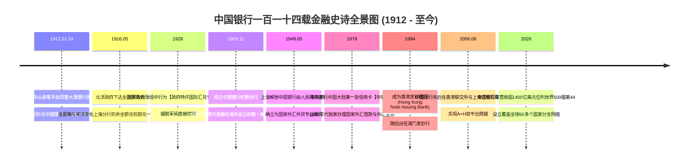
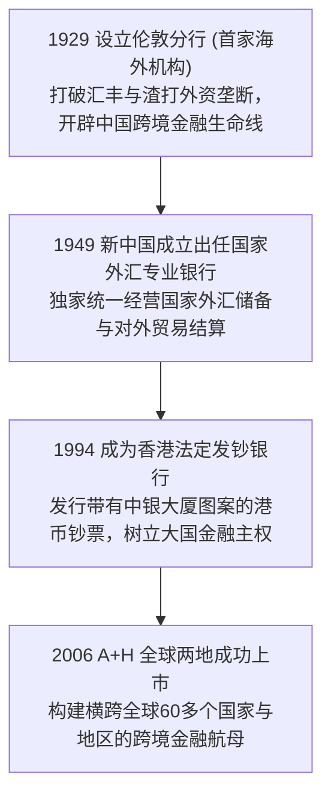

# 中国银行 (Bank of China) 奠基史诗：孙中山批示立行、张嘉璈抗拒停兑令与百年跨境金融全景史诗传记

> **“银行者，国家经济之枢纽，对外贸易之命脉。中国银行自诞生之日起，便承载着重振华夏金融主权、沟通中外贸易血脉的历史重托。无论时代风云变幻，中国银行的信誉，千金不移！”**  
> —— 张嘉璈（中国银行早期实际奠基人、原总经理兼副董事长）

---

```text
==================================================================================================
【机构与奠基功勋档案速览】
• 核心实体：中国银行股份有限公司 (Bank of China Limited / BOC)
• 历史渊源：1905年清政府大清户部银行 -> 1912年中华民国临时大总统孙中山亲笔手批改组立行 -> 新中国外汇外贸专业银行 -> 现代国际化大型商业银行
• 政治立行人：孙中山 (1866–1925, 中华民国临时大总统，1912年1月亲笔手批同意设立中国银行)
• 业务奠基人：张嘉璈 (1889–1979, 中国现代中央银行与商业银行制度奠基人，主政中行二十余年)
• 标志性传奇：1916 年上海分行“抗拒北洋政府停兑令”保全全额信用、1929 年伦敦设立首家海外分行打破西方垄断、港币法币发钞行
• 历史地位：中国持续经营历史最悠久的银行机构 (超114年)、中国全球化与多元化程度最高的商业银行巨擘 (年营收超1400亿美元位列世界500强第44)
• 核心精神图腾：卓越服务稳健创造、百年信誉、融通世界造福社会
==================================================================================================
```

---

## 🧭 全景百年大行编年轴 (Chronological Epic)



---

## 🏛️ 第一章：孙中山批复立行与 1916“抗拒停兑令”一战封神 (1912 — 1928)

### 1. 1912 年孙中山亲笔手批立行
- 1912 年 1 月 1 日，中华民国临时政府在南京成立。
- **1912 年 1 月 24 日**：临时大总统孙中山正式批复了由原大清银行清理处提出的立行报告，同意将清廷官商合办的大清银行改组为**中国银行**，作为新生的共和国中央银行。
- **1912 年 2 月 5 日**：中国银行总行在上海汉口路 3 号（原大清银行旧址）正式宣告成立开业。

### 2. 1916 年上海分行抗拒北洋停兑令：千金难买的信用基石
- 1916 年 5 月，袁世凯称帝失败导致国库枯竭。北洋政府国务卿段祺瑞突然密令中国银行与交通银行：**自即日起全线停止兑换银元现金、停止支付活期存款！**
- 当时各省分行纷纷遵令停兑，引发全社会恐慌性挤兑风暴。
- **张嘉璈与宋汉章的铁血抗命**：
  - 时任中国银行副总裁兼上海分行经理**张嘉璈**与副经理**宋汉章**密商后做出惊天决断：**坚决拒绝执行北洋政府的停兑密令！**
  - 张嘉璈联合上海各大钱庄与工商界名流，设立第三方监管基金，向全上海市民公开宣告：**“上海中国银行开门营业，所有持中行钞票者，照常全额兑换现银，绝不打折！”**
  - 连续数天，上海市民排起长龙兑现，中行堆积如山的真金白银如数兑付。挤兑潮不仅未拖垮中行，反而使全上海的存款源源不断从其他外资洋行涌入中国银行。这一抗命壮举，奠定了中国银行延续百年的最高金融信誉！

---

## 🌍 第二章：走向世界、外汇专业银行与港币发钞 (1929 — 2005)



### 1. 1929 年设立伦敦分行：打破西方垄断
- 1929 年 11 月 4 日，中国银行在英国伦敦设立办事处（后改组为分行），成为中国现代金融业在海外设立的第一座桥头堡，打破了西方老牌殖民银行对远东外汇兑换的独家垄断。

### 2. 新中国外汇专业银行与香港发钞行 (1949–1994)
- 1949 年后，中国银行被中央确立为**国家唯一的外汇外贸专业银行**，承担起新中国冲破西方经济封锁、统筹国家外汇储备与对外经贸结算的枢纽重任。
- **1994 年成为香港法定发钞行**：中国银行正式成为香港三大发钞银行之一（香港中银大厦成为维多利亚港最亮眼的国家金融地标），随后担任澳门发钞行。

---

## 🧠 第三章：中国银行百年底层金融心法 (Mental Models)

```text
==================================================================================================
【中国银行三大百年跨境金融心法】

1. 信用兑付第一性底线 (Inviolable Currency Convertibility)
   • 核心心法：银行的生命在兑付。宁可承受行政处罚或短期流动性重压，
               也绝不撕毁对储户的见票即兑承诺，危难关头守住信用就是守住了企业百年的基业。

2. 全球跨境融通双循环 (Cross-Border Global Bridge)
   • 核心心法：立足本土，放眼全球。
               做连接境内市场与全球离岸金融的最稳固桥梁，以多元化币种与跨国结算构建差异化护城河。
==================================================================================================
```

---

## 📅 第四章：中国银行重大年表 (Chronology)

- **1912年1月24日**：孙中山亲笔批复设立中国银行。
- **1912年2月5日**：中国银行在上海正式成立开业。
- **1916年5月**：上海分行抗拒停兑令，树立百年信用。
- **1929年11月**：设立伦敦分行。
- **1949年5月**：人民政府接管，确立为国家外汇外贸专业银行。
- **1994年5月**：正式在香港发行港币钞票。
- **2006年6月-7月**：在香港与上海先后挂牌上市。
- **至今**：年营收超 1400 亿美元，稳居全球跨境金融巨擘前列。
