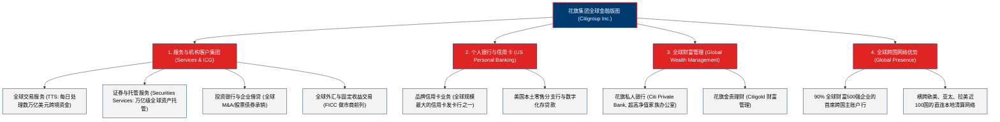

# 花旗集团 (Citigroup Inc.) —— 全球跨国银行与跨境金融网络霸主全景介绍

> **《财富》世界500强排名：第 45 位**  
> **年度营业收入：$168,297 百万美元（约 1683 亿美元）**  
> **官方网站：[www.citigroup.com](https://www.citigroup.com)**

---

## 🏢 企业基本信息 (Corporate Snapshot)

| 维度 | 详细信息 |
| :--- | :--- |
| **公司全称** | 花旗集团 (Citigroup Inc.) |
| **成立时间** | 1812 年 6 月 16 日 (纽约城市银行创立) / 1998 年合并组建花旗集团 |
| **全球总部** | 🇺🇸 美国 纽约州 纽约市 格林威治街388号 (388 Greenwich Street) |
| **首任总裁/奠基人** | 塞缪尔·奥斯古德 (Samuel Osgood) / 桑福德·威尔 (Sandy Weill, 现代重组者) |
| **首席执行官 (CEO)**| 范洁恩 (Jane Fraser, 华尔街首位大型跨国银行女性 CEO) |
| **股票代码** | NYSE: `C` (标普500指数与道琼斯金融核心成分股) |
| **全球员工总数** | 约 **23+ 万人**（在近 100 个国家和地区拥有实体运营机构） |
| **核心业务赛道** | 机构客户集团 (ICG)、全球交易与贸易解决方案 (TTS)、全球财富管理 (Global Wealth)、美国个人银行 (USPB) |

---

## 🌐 核心业务矩阵与全球版图 (Business Architecture)

---

## ⚡ 核心竞争壁垒与护城河 (Competitive Advantages)

### 1. 全球超级跨国交易服务网络 (Treasury and Trade Solutions, TTS)
- **全球跨国巨头的资金“水管”**：花旗 TTS 每天在近 100 个国家、使用 140 多种货币处理数万亿美元的跨国清算与贸易结算。全球 90% 以上的《财富》世界500强企业依赖花旗进行全球供应链与现金池流动性调拨。

### 2. 全球顶级外汇与 FICC 交易做市能力
- 凭借遍布全球的交易台与算法定价中枢，花旗长年在全球外汇交易（FX）与跨境跨币种利率衍生品市场占据领导地位。

### 3. 极具壁垒的全球本地牌照与监管互信
- 在全球近 100 个国家持有本地商业银行完全牌照，这种耗费两百年沉淀的全球物理与合规网络，几乎无法被任何后来者或科技新贵整体复制。

---

## 📈 历史里程碑年表 (Historical Milestones)

- **1812年6月16日**：塞缪尔·奥斯古德等人在纽约创办“纽约城市银行 (City Bank of New York)”。
- **1897年**：设立外国部，成为第一家开辟海外业务的美国大型国家银行。
- **1902年**：设立中国上海分行，因大门悬挂美国星条旗（花旗），被中国人亲切称为“花旗银行”。
- **1961年**：发明**可转让大额定期存单 (Negotiable CD)**，彻底颠覆现代商业银行负债端管理。
- **1977年**：在沃尔特·里斯顿（Walter Wriston）领导下，斥巨资在纽约全面铺设**自动取款机 (ATM)**，引爆零售银行业数字化革命。
- **1998年**：桑迪·威尔（Sandy Weill）主导旅行者集团与花旗银行完成 **700 亿美元世纪合并**，直接促成美国废除 1933 年《格拉斯-斯蒂格尔法案》。
- **2008年**：全球金融危机爆发，花旗接受美国政府救助，随后大刀阔斧剥离非核心资产。
- **2021年**：**范洁恩 (Jane Fraser)** 就任 CEO，启动全面业务精简战略，退出多国非核心零售业务，聚焦高毛利全球机构客户（TTS/投行/外汇）与财富管理。
- **2024-2026年**：花旗营收稳跨 1680 亿美元，机构业务强劲反弹，稳居全球跨国企业金融服务第一梯队。

---

## 🎯 企业文化与核心价值观 (Corporate Values)

- **客户至上 (Client-Centric)**：做全球跨国企业与高净值客户最值得托付的金融伙伴。
- **卓越与执行 (Excellence)**：追求无瑕疵的跨境清算与资本市场交易执行。
- **负责任的金融 (Responsible Finance)**：坚守道德底线、风控严明、支持全球可持续与绿色金融转型。
