# 家得宝 (The Home Depot, Inc.) —— 全球家居改善与建材仓储零售霸主全景介绍

> **《财富》世界500强排名：第 46 位**  
> **年度营业收入：$164,683 百万美元（约 1647 亿美元）**  
> **官方网站：[www.homedepot.com](https://www.homedepot.com)**

---

## 🏢 企业基本信息 (Corporate Snapshot)

| 维度 | 详细信息 |
| :--- | :--- |
| **公司全称** | 家得宝公司 (The Home Depot, Inc.) |
| **成立时间** | 1978 年 6 月 29 日 (创立于美国佐治亚州亚特兰大) |
| **全球总部** | 🇺🇸 美国 佐治亚州 亚特兰大 (Atlanta, GA) |
| **创始人** | 伯尼·马库斯 (Bernie Marcus)、阿瑟·布兰克 (Arthur Blank)、罗恩·布里尔 (Ron Brill)、帕特·法拉 (Pat Farrah) |
| **董事长兼 CEO**| 泰德·戴克 (Ted Decker) |
| **股票代码** | NYSE: `HD` (道琼斯工业平均指数、标普500指数核心成分股) |
| **全球员工总数** | 约 **47+ 万人**（全美最大的私营雇主之一） |
| **全球门店网络** | 在美国、加拿大和墨西哥拥有超过 **2,330 家** 巨型仓储式家居建材商场 |
| **核心业务赛道** | DIY (Do-It-Yourself) 个人建材零售、DIFM (Do-It-For-Me) 专业安装、Pro 专业承包商供应链、互联全渠道零售 |

---

## 🌐 核心业务矩阵与商业版图 (Business Ecosystem)

```mermaid
graph TD
    HD["家得宝商业帝国 (The Home Depot, Inc.)"]
    
    HD --> DIY["1. DIY 个人家庭改善零售 (Do-It-Yourself)"]
    DIY --> DIY1["五金工具与动力装备 (Milwaukee/DeWalt/Ryobi)"]
    DIY --> DIY2["建筑木材、板材与水泥基础建材"]
    DIY --> DIY3["室内装潢 (地砖/地板/壁纸/照明灯饰)"]
    DIY --> DIY4["园艺花卉、户外动力设备与烧烤户外"]
    
    HD --> PRO["2. Pro 专业承包商业务 (Home Depot Pro)"]
    PRO --> PRO1["大宗建材批发直供与施工现场专属配送"]
    PRO --> PRO2["Pro Xtra 专属会员权益与商业授信"]
    PRO --> PRO3["SRS Distribution 并购整合 (千亿级屋顶与特种建材分销)"]
    
    HD --> DIFM["3. DIFM 专业代客安装 (Do-It-For-Me)"]
    DIFM --> DIFM1["全屋定制厨房与卫浴整装翻新"]
    DIFM --> DIFM2["HVAC 暖通空调系统设计与换装"]
    DIFM --> DIFM3["门窗与专业屋顶铺装服务"]
    
    HD --> OMNI["4. 全渠道互联零售 (Interconnected Retail)"]
    OMNI --> OMNI1["线上订购与 2 小时门店极速自提 (BOPIS)"]
    OMNI --> OMNI2["平价卡车直配工地与最后一公里履约网络"]

    classDef main fill:#f96302,stroke:#232f3e,stroke-width:2px,color:#fff;
    classDef branch fill:#232f3e,stroke:#f96302,stroke-width:1px,color:#fff;
    classDef sub fill:#f3f3f3,stroke:#232f3e,stroke-width:1px,color:#000;
    class HD main;
    class DIY,PRO,DIFM,OMNI branch;
    class DIY1,DIY2,DIY3,DIY4,PRO1,PRO2,PRO3,DIFM1,DIFM2,DIFM3,OMNI1,OMNI2 sub;
```

---

## ⚡ 核心竞争壁垒与护城河 (Competitive Advantages)

### 1. 万能仓储式“品类杀手 (Category Killer)”规模壁垒
- 单店平均面积超过 **10.5 万平方英尺（约 1 万平方米）**，常备 **35,000 至 40,000 种 SKU**，以极具竞争力的低廉价格现货供应。任何家庭修缮或建筑工地所需的每一个螺母、木板到大型发电机均可一站式购齐。

### 2. 标志性“橙色围裙 (Orange Apron)”懂行顾问服务
- 家得宝员工身穿鲜明橙色围裙，多数来自具有实操经验的水管工、电工、木匠或退伍军人。他们不单纯推销商品，而是像邻居导师一样耐心指导顾客“如何自己动手换马桶、修屋顶、铺地板”，建立了无与伦比的顾客忠诚度。

### 3. 重金加码 Pro 专业承包商供应链网络
- 2024 年以 **182.5 亿美元** 史诗级收购全美顶尖建材分销商 **SRS Distribution**，彻底打通了从住宅 DIY 散客到万亿美元级大型专业建筑承包商的全链路供应链。

---

## 📈 历史里程碑年表 (Historical Milestones)

- **1978年6月**：伯尼·马库斯与阿瑟·布兰克在被原公司解雇后，在洛杉矶与肯·朗格尼共同创立家得宝。
- **1979年6月22日**：在佐治亚州亚特兰大租下两座破旧的 J.C. Penney 仓库，开出前两家大型仓储店。
- **1981年9月22日**：家得宝在纳斯达克成功上市（后转至纽交所：HD）。
- **1989年**：销售额超越 Lowe's，一跃成为**全美第一大建材零售商**。
- **2000年**：建立高度集中的全美快速分销中心（RDC），实现供应链物流效率质的飞跃。
- **2020年**：受益于疫情期间全球居家办公与家庭修缮浪潮，年销售额历史性突破 1300 亿美元。
- **2024年**：以 182.5 亿美元收购 SRS Distribution，创下公司历史上最大并购交易。
- **2025-2026年**：年营业收入超 1640 亿美元，连续多年稳居《财富》世界500强 TOP 50。

---

## 🎯 企业文化与核心价值观 (Corporate Values)

### 1. 核心哲学：“倒金字塔”管理模型 (The Inverted Pyramid)
- **顾客与橙色围裙一线员工在最顶层**：公司一切资源都围绕着在一线服务顾客的店员运转。
- **管理层在最底层**：CEO 和高管团队的唯一职责就是移走一线员工面前的障碍，提供最好的系统、工具与薪酬福利支持。

### 2. 八大核心价值观
- 照顾我们的人 (Taking Care of Our People)
- 回馈社区 (Giving Back)
- 建立牢固关系 (Building Strong Relationships)
- 做正确的事 (Doing the Right Thing)
- 提供卓越客户服务 (Excellent Customer Service)
- 创造股东价值 (Creating Shareholder Value)
- 企业家精神 (Entrepreneurial Spirit)
- 尊重每个人 (Respect for All People)
