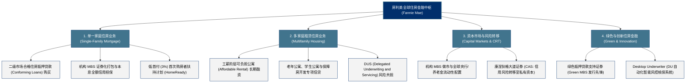

# 房利美 (Fannie Mae) —— 全球最大住房抵押贷款支持与流动性中枢全景介绍

> **《财富》世界500强排名：第 47 位**  
> **年度营业收入：$159,169 百万美元（约 1592 亿美元）**  
> **官方网站：[www.fanniemae.com](https://www.fanniemae.com)**

---

## 🏢 企业基本信息 (Corporate Snapshot)

| 维度 | 详细信息 |
| :--- | :--- |
| **公司全称** | 联邦国民抵押贷款协会 (Federal National Mortgage Association，通称 Fannie Mae 房利美) |
| **成立时间** | 1938 年 2 月 10 日 (富兰克林·德拉诺·罗斯福总统签署《国民住房法》修正案创立) |
| **全球总部** | 🇺🇸 美国 华盛顿哥伦比亚特区 (Washington, D.C.) |
| **奠基背景** | 罗斯福新政核心立法设立的政府赞助企业 (GSE)，现由联邦住房金融局 (FHFA) 监管托管 |
| **首席执行官 (CEO)**| 普里西拉·阿尔莫多瓦 (Priscilla Almodovar) |
| **股票代码** | OTC: `FNMA` (自 2008 年次贷危机后从纽交所退市转入 OTC 市场) |
| **资产与担保规模** | 担保支持的美国未偿住房抵押贷款总额超过 **4.3 万亿美元** |
| **核心业务赛道** | 单一家庭住房抵押贷款二级市场购买、机构 MBS 发行与担保、多家庭公寓可负担租赁融资、绿色住房金融 |

---

## 🌐 核心业务矩阵与商业版图 (Business Ecosystem)

---

## ⚡ 核心竞争壁垒与护城河 (Competitive Advantages)

### 1. 全美住房抵押贷款二级市场的终极流动性提供者
- 房利美不直接向普通老百姓放贷，而是在二级市场上从数千家商业银行、信用社和抵押贷款经纪商手中买入符合标准的房贷。这让放贷机构能够立即回笼资金，源源不断地为全美数千万家庭提供 30 年固定利率的稳定低息房贷。

### 2. 全球规模最大、流动性仅次于美债的机构 MBS 市场
- 房利美发行的机构抵押贷款支持证券（Fannie Mae MBS）享有美国政府事实上的隐性兜底担保，被全球央行、主权财富基金、大型养老金和商业银行视为最核心的安全避险资产之一。

### 3. Desktop Underwriter (DU) 行业标准级风控基础设施
- 其开发的 DU 自动化核保系统已成为全美抵押贷款行业的行业通用事实标准，沉淀了近百年跨越周期的海量违约概率与房产估值大数据模型。

---

## 📈 历史里程碑年表 (Historical Milestones)

- **1938年2月**：富兰克林·罗斯福总统签署法案正式设立联邦国民抵押贷款协会（FNMA）。
- **1968年**：林登·约翰逊总统签署《住房与城市发展法》，将房利美私有化为政府赞助企业（GSE），并剥离出纯政府机构吉利美（Ginnie Mae）。
- **1970年**：房利美在纽交所挂牌上市；美国国会同年设立房地美（Freddie Mac）以形成良性竞争。
- **1981年**：房利美发行**全美第一笔常规住房抵押贷款支持证券 (MBS)**，拉开现代结构化金融革命大幕。
- **2008年9月6日**：受次贷危机重创，美国联邦住房金融局（FHFA）宣布接管房利美和房地美，美国财政部注资提供流动性支持。
- **2012年起**：房利美全面恢复持续盈利，累计向美国财政部上缴的高级优先股股息与利润分红已**远超当年的救助本金总额**。
- **2024-2026年**：房利美年营收突破 1590 亿美元，稳居全球金融与资产支持机构前列，深度推动全美住房公平与绿色建筑金融。

---

## 🎯 企业文化与核心价值观 (Corporate Mission)

- **核心使命**：为全美住房市场提供源源不断的流动性、稳定性和可负担性支持。
- **核心价值观**：
  - 严守诚信与风控底线 (Lead with Integrity)
  - 倾听与服务社区 (Serve the Community)
  - 推动住房公平 (Drive Housing Equity)
  - 追求卓越创新 (Pursue Excellence)
