# 宝马集团 (BMW Group) —— 全球豪华汽车制造与纯粹驾驶乐趣领航者全景介绍

> **《财富》世界500强排名：第 50 位**  
> **年度营业收入：$150,524 百万美元（约 1505 亿美元）**  
> **官方网站：[www.bmwgroup.com](https://www.bmwgroup.com)**

---

## 🏢 企业基本信息 (Corporate Snapshot)

| 维度 | 详细信息 |
| :--- | :--- |
| **公司全称** | 宝马汽车股份有限公司 (Bayerische Motoren Werke AG，通称 BMW Group 宝马集团) |
| **成立时间** | 1916 年 3 月 7 日 (巴伐利亚飞机制造厂创立) / 1917 年更名 BMW |
| **全球总部** | 🇩🇪 德国 巴伐利亚州 慕尼黑 (Munich, 著名的“四缸大厦”总部) |
| **创始人 / 奠基者**| 卡尔·拉普 (Karl Rapp)、弗朗茨·约瑟夫·波普 (Franz Josef Popp)、卡米洛·卡斯蒂利奥尼 (Camillo Castiglioni)、赫伯特·匡特 (Herbert Quandt) |
| **董事长兼 CEO**| 奥利弗·齐普策 (Oliver Zipse) |
| **股票代码** | FWB: `BMW` (德国 DAX 40 指数核心成分股) |
| **全球员工总数** | 约 **15+ 万人**（在全球 15 个国家运营超过 30 处生产与组装基地） |
| **核心业务赛道** | BMW 豪华乘用车与 M 高性能部门、Rolls-Royce 超豪华汽车、MINI 潮流品牌、BMW Motorrad 摩托车、出行金融与充电网络 |

---

## 🌐 核心业务矩阵与 4 大品牌版图 (Brand Architecture)

```mermaid
graph TD
    BMW["宝马集团豪华出行帝国 (BMW Group)"]
    
    BMW --> CAR["1. BMW 核心乘用车矩阵 (BMW Core)"]
    CAR --> CAR1["经典轿车与轿跑家族 (BMW 1至8系 / i3/i4/i7纯电)"]
    CAR --> CAR2["全地形运动型多功能车 (BMW X1至X7 / iX3/iX)"]
    CAR --> CAR3["BMW M 部门 (M2/M3/M4/M5/XM 极致高性能赛道基因)"]
    CAR --> CAR4["新世代架构 (Neue Klasse: 800V高压/大圆柱电池)"]
    
    BMW --> RR["2. 劳斯莱斯超豪华 (Rolls-Royce Motor Cars)"]
    RR --> RR1["幻影 (Phantom) & 古思特 (Ghost) 顶级商务定制"]
    RR --> RR2["库里南 (Cullinan) 顶级奢华全地形SUV"]
    RR --> RR3["闪灵 (Spectre) 超豪华纯电超级轿跑"]
    
    BMW --> MINI["3. MINI 个性与英伦潮流 (MINI)"]
    MINI --> MINI1["MINI Cooper 三门/五门经典卡丁车驾趣"]
    MINI --> MINI2["MINI Countryman 纯电与混动紧凑型SUV"]
    
    BMW --> MOTO["4. 摩托车与出行金融 (Motorrad & Financial)"]
    MOTO --> MOTO1["BMW Motorrad (拳击手引擎GS探险车/巡航车/性能重机)"]
    MOTO --> MOTO2["宝马金融服务与全欧洲 CHARGE NOW 充电网络"]

    classDef main fill:#0066b1,stroke:#232f3e,stroke-width:2px,color:#fff;
    classDef branch fill:#232f3e,stroke:#0066b1,stroke-width:1px,color:#fff;
    classDef sub fill:#f3f3f3,stroke:#232f3e,stroke-width:1px,color:#000;
    class BMW main;
    class CAR,RR,MINI,MOTO branch;
    class CAR1,CAR2,CAR3,CAR4,RR1,RR2,RR3,MINI1,MINI2,MOTO1,MOTO2 sub;
```

---

## ⚡ 核心竞争壁垒与护城河 (Competitive Advantages)

### 1. “纯粹驾驶乐趣 (Freude am Fahren)”顶级品牌心智
- 跨越一个世纪，“人车合一的敏捷操控、近乎完美的 50:50 前后车身轴荷分配、直列六缸引擎的平顺咆哮与极致底盘调校”构筑起全球消费者心智中无可替代的运动豪华图腾。

### 2. 百年顶级动力总成与精密底盘工程壁垒
- 从一战时期的航空发动机，到如今的高效内燃机、双涡轮增压系统以及自研的高集成电驱总成，宝马在动力系统能量转化效率与机械调校领域沉淀了行业顶级工程护城河。

### 3. “新世代 (Neue Klasse)”全电与循环设计未来护城河
- 投资数百亿欧元研发的“新世代”电动架构，采用 800V 超充平台、能量密度提升 20% 的大圆柱电芯以及高达 100% 可回收循环材料理念，重新定义智能电动时代的豪华基准。

---

## 📈 历史里程碑年表 (Historical Milestones)

- **1916年3月7日**：巴伐利亚飞机制造厂（BFW）成立，1917年更名为巴伐利亚发动机制造股份有限公司（BMW）。
- **1917年**：推出著名的蓝天白云螺旋桨圆形徽标（融入巴伐利亚州旗蓝白配色）。
- **1923年**：马克斯·弗里兹设计推出首款摩托车 **BMW R32**，确立水平对置“拳击手”引擎与轴传动布局。
- **1928年**：收购艾森纳赫汽车厂生产 BMW 3/15 (Dixi)，正式进军汽车制造业。
- **1959年12月9日**：在面临被戴姆勒-奔驰吞并的破产绝境中，**赫伯特·匡特 (Herbert Quandt)** 大举增持股份，保住宝马独立自主地位。
- **1961年**：推出划时代紧凑型运动轿车 **BMW 1500 (“Neue Klasse 新世代”)**，拯救公司并确立运动豪华轿车定位。
- **1972年**：慕尼黑“四缸大厦”全球总部落成；成立 **BMW Motorsport (M 部门)**。
- **1998年**：成功收购英国超豪华皇冠上的明珠——**劳斯莱斯 (Rolls-Royce)**。
- **2001年**：重塑 **MINI** 品牌推出全新车型，引爆全球精品小车风潮。
- **2025-2026年**：全系量产交付“新世代 Neue Klasse”智能电动车，年营收超 1500 亿美元，稳居全球高档汽车制造商第一梯队。

---

## 🎯 企业文化与核心价值观 (Corporate Values)

### 1. 核心企业口号：“Freude am Fahren”（纯粹驾驶乐趣）
- 一切产品与工程研发的终极目标，是让驾驶者在每一次握紧方向盘、踩下踏板的瞬间，感受到激情、愉悦与绝对掌控感。

### 2. 核心价值观与可持续愿景
- **激情与精准 (Passion & Precision)**：对机械与软件精益求精。
- **循环与责任 (Circularity & Responsibility)**：倡导“全生命周期减碳”，做全球可持续豪华制造典范。
