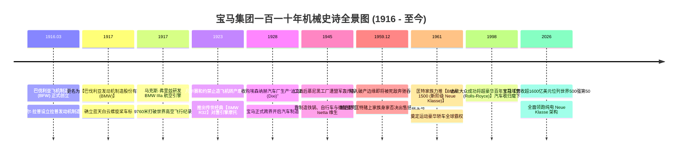
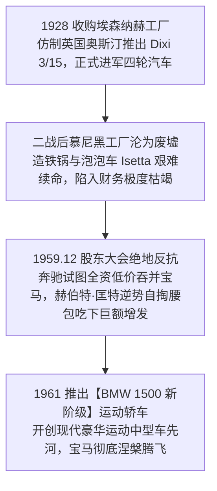

# 卡尔·拉普 (Karl Rapp) 与匡特家族：从巴伐利亚高空引擎到豪华终极驾驶机器全景史诗传记

> **“终极驾驶机器 (The Ultimate Driving Machine) 不只是一句广告词，它是烙印在宝马血液里的工程宗教。无论是上世纪翱翔阿尔卑斯山巅的航空引擎，还是今天征战纽博格林北环的 M 动力超跑，纯粹的动力操控与无畏的机械激情，永远是巴伐利亚蓝天白云螺旋桨的灵魂！”**  
> —— 赫伯特·匡特 (Herbert Quandt，拯救宝马重生的功勋掌门人)

---

```text
==================================================================================================
【机构与奠基功勋档案速览】
• 历史奠基人：卡尔·拉普 (Karl Rapp, 1882–1962) & 马克斯·弗里兹 (Max Friz, 天才航空引擎大师)
• 重生救世主：赫伯特·匡特 (Herbert Quandt, 1910–1982, 1959年破产边缘倾家荡产阻击戴姆勒并购拯救宝马)
• 创办时间地点：1916 年 3 月 7 日 | 德国 巴伐利亚州 慕尼黑
• 颠覆作品：
  - BMW IIIa 直列六缸高空航空引擎 (1917, 创 9760 米人类高空飞行纪录)；
  - BMW R32 水平对置拳击手摩托车 (1923, 奠定百年摩托车机械经典)；
  - BMW 328 轻量化传奇赛车 (1936, 斩获一千英里耐力赛冠军)；
  - BMW 1500“新阶级 (Neue Klasse)”中型运动轿车 (1961, 彻底将宝马带出破产泥潭)；
  - 拥有宝马 (BMW)、MINI 与超豪华王冠**劳斯莱斯 (Rolls-Royce)** 三大王牌品牌。
• 历史地位：全球最著名的豪华运动汽车与摩托车制造商 (年营收超1600亿美元位列世界500强第50)
• 核心精神图腾：巴伐利亚蓝天白云车标、双肾进气格栅 (Kidney Grille)、直列六缸双涡轮引擎、前后 50:50 黄金轴荷分配
==================================================================================================
```

---

## 🧭 全景生命历程与宝马帝国大编年轴 (Chronological Epic)



---

## ✈️ 第一章：慕尼黑飞机引擎、蓝天白云车标与 R32 摩托车 (1916 — 1928)

### 1. 卡尔·拉普与 1917 蓝天白云车标诞生
- **1916 年 3 月 7 日**，巴伐利亚飞机制造厂（BFW）在慕尼黑正式成立。1917 年更名为**巴伐利亚发动机制造股份有限公司 (Bayerische Motoren Werke AG / BMW)**。
- **蓝天白云车标的传奇渊源**：
  - 车标由四个扇形蓝白相间的色块组成，取自巴伐利亚自由州的蓝白州旗颜色，象征着一架双翼飞机在蔚蓝晴空中高速旋转的白色螺旋桨。

### 2. 马克斯·弗里兹与 1917 BMW IIIa 航空神机
- 天才工程师马克斯·弗里兹设计出了 **BMW IIIa 直列六缸高空航空发动机**，配备了创新的高空化油器。
- 1919 年，装有 BMW 引擎的双翼机飞出了 **9,760 米** 的人类极限高空，创下当时的世界飞行最高纪录。

### 3. 《凡尔赛和约》逼转民用：1923 传世经典 BMW R32 摩托车
- 一战战败后，《凡尔赛和约》严禁德国制造任何军用航空发动机。
- 面对工厂停工破产危机，弗里兹仅用 5 周时间画出了一台搭载**风冷水平对置双缸（拳击手 Boxer）发动机与轴传动系统**的传奇摩托车——**BMW R32**。
- 这款车在 1923 年巴黎车展上艳惊四座，奠定了宝马摩托车百年不衰的机械宗教。

---

## 🚗 第二章：埃森纳赫造车、二战废墟与 1959 匡特家族生死救援 (1928 — 1961)



### 1. 1928 年收购埃森纳赫造车与 1936 传奇 BMW 328
- 1928 年宝马收购埃森纳赫汽车厂，正式跨入四轮汽车制造领域。
- **1936 年推出传奇赛车 BMW 328**：搭载管状车架与轻量化铝合金车身，在意大利 Mille Miglia 千里耐力赛中以打破全场纪录的成绩斩获冠军，奠定了宝马“纯粹运动操控”的品牌血统。

### 2. 1959 年 12 月 9 日：生死存亡的股东大会与赫伯特·匡特救主
- 二战后宝马慕尼黑工厂遭毁灭性轰炸，豪华轿车 BMW 501 销量惨淡，宝马负债累累、现金流彻底断裂。
- **死敌戴姆勒-奔驰的恶意吞并案**：
  - 德国最大的德意志银行起草了由戴姆勒-奔驰全资低价收购宝马的重组方案。
  - 1959 年 12 月 9 日，在慕尼黑近千名中小股东与经销商组成的联合抵制下，德国工业巨子**赫伯特·匡特 (Herbert Quandt)** 站了出来：
  - 匡特被宝马工人和工程师不屈的尊严深深打动，宣布**由匡特家族自掏腰包全额吃下宝马增发的所有股票，将持股比例增持至 50% 以上，彻底粉碎了奔驰的吞并企图！**

### 3. 1961 年 BMW 1500“新阶级”：拯救宝马的封神神作
- 拿到匡特家族的救命资金后，宝马全力研发中型运动轿车 **BMW 1500 (Neue Klasse)**。
- 1961 年法兰克福车展上一炮而红，订单排到了三年之后，宝马一举彻底摆脱破产泥潭，开启了日后 3 系、5 系、7 系统治全球豪华运动轿车的黄金半个世纪！

---

## 🧠 第三章：宝马底层运动驾驶心法 (Mental Models)

```text
==================================================================================================
【宝马三大终极驾驶心法】

1. 50:50 黄金前后配重与后驱操稳第一性原理 (50:50 Weight Distribution)
   • 核心心法：豪华不等于笨重的沙发。
               追求前后轴 50:50 的极致物理平衡与后轮驱动推背感，人车合一的操控灵动性是宝马永不妥协的工程灵魂。

2. 独立品牌家族精神传承 (Family-Backed Long-Termism)
   • 核心心法：匡特家族长达数十年的控股不干预职业经理人日常运作，
               但为重大工程架构（Neue Klasse 与纯电转型）提供无惧短期季报波动的长期战略定力。
==================================================================================================
```

---

## 📅 第四章：宝马集团重大年表 (Chronology)

- **1916年3月7日**：巴伐利亚飞机制造厂 (BFW) 成立。
- **1917年**：更名为 BMW，推出蓝天白云螺旋桨车标。
- **1923年**：推出首款摩托车 BMW R32。
- **1928年**：收购埃森纳赫工厂进军汽车制造。
- **1936年**：推出传奇赛车 BMW 328。
- **1959年12月**：赫伯特·匡特注资拯救宝马。
- **1961年**：推出划时代 BMW 1500“新阶级”。
- **1998年**：收购劳斯莱斯 (Rolls-Royce) 汽车品牌。
- **至今**：年营收超 1600 亿美元，稳居全球豪华汽车第一梯队。
