# 梅赛德斯-奔驰集团 (Mercedes-Benz Group AG) —— 全球豪华汽车发明者与科技出行帝国全景介绍

> **《财富》世界500强排名：第 51 位**  
> **年度营业收入：$149,126 百万美元（约 1491 亿美元）**  
> **官方网站：[group.mercedes-benz.com](https://group.mercedes-benz.com)**

---

## 🏢 企业基本信息 (Corporate Snapshot)

| 维度 | 详细信息 |
| :--- | :--- |
| **公司全称** | 梅赛德斯-奔驰集团股份公司 (Mercedes-Benz Group AG) |
| **创立时间** | 1886 年 1 月 29 日 (发明现代汽车) / 1926 年 6 月 28 日 (戴姆勒与奔驰正式合并) |
| **全球总部** | 🇩🇪 德国 巴登-符腾堡州 斯图加特 (Stuttgart, Baden-Württemberg, Germany) |
| **奠基创始人** | 卡尔·本茨 (Karl Benz)、戈特利布·戴姆勒 (Gottlieb Daimler)、贝尔塔·本茨 (Bertha Benz)、威廉·迈巴赫 (Wilhelm Maybach) |
| **现任董事会主席兼CEO** | 康林松 (Ola Källenius) |
| **股票代码** | XETRA: `MBG` (法兰克福证券交易所 DAX 40 核心蓝筹股) |
| **全球员工总数** | 约 16.6 万人 |
| **核心业务赛道** | 高端豪华乘用车 (Mercedes-Benz)、高性能赛道与公路跑车 (Mercedes-AMG)、超奢华定制轿车与SUV (Mercedes-Maybach)、硬派越野 (G-Class)、智能电动与车载操作系统 (MB.OS)、出行金融与车联网服务 |

---

## 🌐 核心业务矩阵与商业版图 (Business Ecosystem)

```mermaid
graph TD
    MBG["梅赛德斯-奔驰集团 (Mercedes-Benz Group AG)"]
    
    MBG --> LUX["1. 顶级豪华与核心乘用车 (Core Luxury & Top-End)"]
    LUX --> LUX1["梅赛德斯-奔驰 (S级 / E级 / C级 / GLC / GLE / GLS)"]
    LUX --> LUX2["梅赛德斯-迈巴赫 (Mercedes-Maybach: S级/GLS/EQS SUV)"]
    LUX --> LUX3["梅赛德斯-AMG (高性能跑车/GT家族/F1赛车技术民用化)"]
    LUX --> LUX4["G级家族 (Mercedes-Benz G-Class 燃油与纯电硬派越野)"]
    
    MBG --> ELEC["2. 智能纯电与前瞻平台 (Electric & Tech Architectures)"]
    ELEC --> ELEC1["MMA 架构 (紧凑型/中型纯电与高效混动全新平台)"]
    ELEC --> ELEC2["MB.EA 平台 (中大型与大型核心豪华纯电平台)"]
    ELEC --> ELEC3["AMG.EA 平台 (高性能纯电动专属架构)"]
    ELEC --> ELEC4["VISION EQXX (超低风阻 0.17Cd / 1000km+ 真实续航先导车)"]
    
    MBG --> SOFT["3. 数字化与智能驾驶软件 (MB.OS & Drive Pilot)"]
    SOFT --> SOFT1["MB.OS (自研端到端软硬件解耦智能操作系统)"]
    SOFT --> SOFT2["Drive Pilot (全球首款获批商用 L3 级有条件自动驾驶系统)"]
    SOFT --> SOFT3["MBUX 智能人机交互系统 (搭载大语言模型与虚拟助理)"]
    
    MBG --> VAN["4. 梅赛德斯-奔驰轻型商务车 (Mercedes-Benz Vans)"]
    VAN --> VAN1["V-Class / EQV 高端商务多用途车"]
    VAN --> VAN2["Sprinter / eVito 现代城市物流与定制底盘"]
    
    MBG --> MOB["5. 出行与金融服务 (Mercedes-Benz Mobility)"]
    MOB --> MOB1["汽车金融与融资租赁 (Financing & Leasing)"]
    MOB --> MOB2["全球高功率超充网络 (Mercedes-Benz High-Power Charging Network)"]
    MOB --> MOB3["车联网与订阅服务 (Mercedes me Connected Services)"]

    classDef main fill:#000000,stroke:#00adef,stroke-width:2px,color:#fff;
    classDef branch fill:#1c2d37,stroke:#00adef,stroke-width:1px,color:#fff;
    classDef sub fill:#f5f5f5,stroke:#333,stroke-width:1px,color:#000;
    class MBG main;
    class LUX,ELEC,SOFT,VAN,MOB branch;
    class LUX1,LUX2,LUX3,LUX4,ELEC1,ELEC2,ELEC3,ELEC4,SOFT1,SOFT2,SOFT3,VAN1,VAN2,MOB1,MOB2,MOB3 sub;
```

---

## ⚡ 核心竞争壁垒与护城河 (Competitive Moats)

### 1. 汽车发明者的百年品牌溢价与美学定义权
- **138 年历史底蕴**：作为汽车工业的公认发明者，梅赛德斯-奔驰拥有无可匹敌的品牌号召力与文化象征意义。三叉星徽不仅是机械制造的桂冠，更代表了全球政要、商界领袖与精英阶层的身份图腾。
- **旗舰 S 级的行业风向标地位**：行业素有“汽车工业看奔驰，奔驰看 S 级”的定论。每一代 S 级的技术迭代（从安全气囊、ABS、ESP，到主动悬挂 Magic Body Control 与数字大灯）都定义了随后十年全球汽车工业的技术与奢华标准。

### 2. 安全与工程架构的绝对行业权威
- **被动安全奠基者**：奔驰工程师贝拉·巴恩伊 (Béla Barényi) 在 1951 年发明的“刚性乘员舱 + 前后溃缩吸能区（安全车身）”专利，至今仍是全世界所有现代乘用车的强制安全基石；
- **主动安全与 L3 智驾破局者**：奔驰是全球首家在德国和美国（加州、内华达州）获得法律许可、合法在公共道路投入商用的 **L3 级自动驾驶 (Drive Pilot)** 汽车制造商，在开启 L3 模式时率先承诺由车企承担法律责任，展现出对毫米波雷达、激光雷达与冗余线控系统的极致自信。

### 3. 全球领先的超豪华子品牌矩阵 (Maybach, AMG, G-Class)
- 集团构筑了从主流豪华（C/E/GLC/GLE）向超高端细分（Top-End Luxury）全面延伸的立体护城河。梅赛德斯-迈巴赫在百万级以上超豪华轿车市场占据主导份额；梅赛德斯-AMG 依托 8 次 F1 车队世界冠军的赛道基因构筑高性能图腾；G 级越野车则以梯形车架与三把差速锁成就永不过时的硬派标杆。

### 4. 工业 4.0 旗舰——辛德芬根 Factory 56
- 耗资数亿欧元打造的 Factory 56 是全球汽车制造智能化的典范。实现 100% 数字化无纸化装配、5G 专网全覆盖、AGV 自主移动物流车精准调度，能够让燃油车、插电混动车与纯电动车在同一条柔性流水线上实现混流共线生产。

---

## 📈 历史里程碑年表 (Historical Milestones)

- **1886年1月29日**：卡尔·本茨获得德国专利局颁发的专利号 DRP 37435 “汽油发动机三轮汽车 (Patent-Motorwagen)”，人类汽车文明正式诞生。
- **1888年8月**：贝尔塔·本茨完成人类历史上首次汽车长途自驾（曼海姆至普福尔茨海姆往返 180 公里），成功验证汽车实用性。
- **1900年**：戴姆勒汽车公司开发出首款以奥地利商人女儿名字命名的“梅赛德斯 35 PS”轿车，开创现代汽车低重心布局。
- **1926年6月28日**：戴姆勒汽车公司 (DMG) 与本茨公司 (Benz & Cie.) 正式合并，成立**戴姆勒-奔驰股份公司 (Daimler-Benz AG)**，统一采用三叉星徽车标。
- **1954年**：推出传奇鸥翼门跑车 **Mercedes-Benz 300 SL**，成为首款采用燃油直喷技术的公路量产车。
- **1972年**：正式推出第一代以 **S-Class (Sonderklasse)** 命名的豪华旗舰轿车（W116）。
- **1978年**：与博世 (Bosch) 联合率先在 S 级轿车上量产装配电子防抱死制动系统 (**ABS**)。
- **1995年**：在 S 级双门轿跑车上首发电子车身稳定系统 (**ESP**)，彻底改变汽车主动安全历史。
- **1998年**：与美国克莱斯勒公司以 360 亿美元实行“世纪大合并”，组建戴姆勒-克莱斯勒；后于 2007 年分道扬镳。
- **2021年**：戴姆勒集团实施历史性战略重组，分拆重型商用车业务（戴姆勒卡车独立上市），乘用车主体正式更名为**梅赛德斯-奔驰集团 (Mercedes-Benz Group AG)**。
- **2023-2026年**：奔驰自研操作系统 **MB.OS** 全面装车，L3 级 Drive Pilot 领跑欧美商用，以近 1500 亿美元营收稳居《财富》世界500强头部豪华车企。

---

## 🎯 企业文化与战略哲学 (Corporate Culture & Strategy)

梅赛德斯-奔驰百年不变的精神图腾凝练于创始人戈特利布·戴姆勒的名言：
> **“唯有最好 (The Best or Nothing / Das Beste oder nichts)”**

集团核心价值准则：
1. **开拓创新精神 (Pioneering Spirit)**：永不满足于现状，视技术突破为企业生存之本。
2. **卓越匠心品质 (Craftsmanship & Passion)**：在每一处内饰缝线、每一个按键阻尼、每一处底盘调校中倾注极致工程美学。
3. **安全至上承诺 (Safety Above All)**：将保护人类生命安全置于所有商业利益之上，持续向全球开放核心安全专利。
4. **可持续豪华 (Sustainable Modern Luxury)**：致力于在生产制造、供应链脱碳与全固态绿色电池领域实现全生命周期碳中和。
