# 西班牙国家银行 (Banco Santander) —— 跨大西洋综合金融与数字化银行巨舰全景介绍

> **《财富》世界500强排名：第 54 位**  
> **年度营业收入：$145,070 百万美元（约 1450 亿美元）**  
> **官方网站：[www.santander.com](https://www.santander.com)**

---

## 🏢 企业基本信息 (Corporate Snapshot)

| 维度 | 详细信息 |
| :--- | :--- |
| **公司全称** | 西班牙国家银行 (Banco Santander, S.A. / 桑坦德银行) |
| **创立时间** | 1857 年 5 月 15 日 (西班牙女王伊莎贝拉二世皇家特许设立) |
| **全球总部** | 🇪🇸 西班牙 桑坦德 (Santander, Cantabria) / 运营总部：马德里博阿迪利亚 (Boadilla del Monte, Madrid) |
| **奠基人与核心领袖** | 西班牙女王伊莎贝拉二世 (Isabel II)、博廷家族 (Emilio Botín, Ana Botín) |
| **现任执行董事会主席** | 安娜·博廷 (Ana Botín) |
| **股票代码** | BME: `SAN` (马德里证券交易所 IBEX 35 权重股) / NYSE: `SAN` |
| **全球员工总数** | 约 21+ 万人 |
| **核心业务赛道** | 欧洲与拉丁美洲零售商业银行、企业与全球投资银行 (SCIB)、财富管理与私人银行 (Wealth Management)、跨国数字支付网络 (PagoNxt)、纯数字直销银行 (Openbank) |

---

## 🌐 核心业务矩阵与商业版图 (Business Ecosystem)

```mermaid
graph TD
    SAN["西班牙国家银行 (Banco Santander, S.A.)"]
    
    SAN --> EUR["1. 欧洲零售与商业银行 (Europe Hub)"]
    EUR --> EUR1["西班牙本土核心业务 (Banco Santander España)"]
    EUR --> EUR2["英国桑坦德 (Santander UK: 全英主要抵押贷款与商业银行)"]
    EUR --> EUR3["葡萄牙与波兰零售银行业务 (Santander Portugal & Poland)"]
    
    SAN --> LATAM["2. 拉丁美洲跨大西洋核心支柱 (South America & Mexico)"]
    LATAM --> L1["桑坦德巴西 (Santander Brasil: 巴西领先的私营全牌照银行)"]
    LATAM --> L2["桑坦德墨西哥 (Santander Mexico: 跨国制造与商业融资枢纽)"]
    LATAM --> L3["智利 / 阿根廷 / 乌拉圭 区域领先零售金融网点"]
    
    SAN --> US["3. 北美与汽车金融 (North America & Auto)"]
    US --> US1["桑坦德美国 (Santander US: 零售银行与高收益消费信贷)"]
    US --> US2["Santander Consumer Finance (欧洲第一大汽车消费金融网络)"]
    
    SAN --> SCIB["4. 跨国企业与全球投资银行 (Santander CIB)"]
    SCIB --> CIB1["跨国大宗商品贸易融资与全球外汇清算"]
    SCIB --> CIB2["全球绿色能源转型与基础设施项目银团贷款"]
    
    SAN --> DIG["5. 数字化平台与支付科技 (Digital & PagoNxt)"]
    DIG --> D1["PagoNxt (全球商户收单/跨境贸易快汇 Getnet/PagoFX)"]
    DIG --> D2["Openbank (全云端架构纯数字银行，拓展欧美年轻客群)"]

    classDef main fill:#ec0000,stroke:#222,stroke-width:2px,color:#fff;
    classDef branch fill:#2d3748,stroke:#ec0000,stroke-width:1px,color:#fff;
    classDef sub fill:#fff5f5,stroke:#333,stroke-width:1px,color:#000;
    class SAN main;
    class EUR,LATAM,US,SCIB,DIG branch;
    class EUR1,EUR2,EUR3,L1,L2,L3,US1,US2,CIB1,CIB2,D1,D2 sub;
```

---

## ⚡ 核心竞争壁垒与护城河 (Competitive Moats)

### 1. 独创的“独立子公司模式 (Autonomous Subsidiary Model)”
- **严格的流动性与资本防火墙**：桑坦德在英国、巴西、墨西哥、美国等所有核心海外子行均作为独立的法定实体运作，独立在当地接受金融监管、自给自足筹集存款与流动性。
- **卓越的抗危机能力**：该架构确保一旦某一个国家发生主权债务危机或货币贬值，其风险被牢牢锁定在单一实体内部，绝不发生跨国传染，帮助桑坦德在 2008 年金融危机与欧债危机中成为全球最稳健的跨国银行之一。

### 2. 无可撼动的欧洲—拉丁美洲跨大西洋金融走廊
- 桑坦德是拉丁美洲最大的国际金融集团，在巴西、墨西哥、智利等核心经济体拥有数千家实体网点和极高的市场份额。
- 构筑起连接欧洲资本与拉美资源、制造业的超级跨大西洋贸易融资、外汇清算与企业并购中枢通道。

### 3. 领先的汽车消费金融帝国 (Santander Consumer Finance)
- 在全欧洲汽车金融与耐用品分期领域占据绝对领先地位，与全球主流车企建立长期排他性金融合作，在不同经济周期中为集团贡献高韧性、高息差的稳定现金流。

### 4. PagoNxt 与 Openbank 领衔的数字化转型
- 集团整合旗下收单、跨境贸易支付与数字钱包业务成立 **PagoNxt**，打造出能与 Stripe、Adyen 同台竞争的全球商户支付基础设施；纯数字银行 **Openbank** 依托全云原生架构，实现了极低的单客运营成本与极高 NPS 客户满意度。

---

## 📈 历史里程碑年表 (Historical Milestones)

- **1857年5月15日**：西班牙女王伊莎贝拉二世颁布皇家法令，特许成立桑坦德银行 (Banco de Santander)。
- **1920年**：博廷家族第一代掌门人介入管理，开启银行全国化扩张之路。
- **1986年**：埃米尔·博廷 (Emilio Botín) 出任董事会主席，全面推行激进的现代化扩张战略。
- **1989年**：推出划时代的“超级账户 (Supercuenta)”，彻底颠覆西班牙银行业高息差垄断格局。
- **1994年**：以闪电战方式全资收购陷入危机的西班牙信贷银行 (**Banesto**)。
- **1999年**：与中央西班牙美洲银行 (BCH) 实行对等合并，组建桑坦德中央西班牙美洲银行 (BSCH)，成为西班牙第一大银行。
- **2000年**：以 40 亿美元成功收购巴西圣保罗州银行 (**Banespa**)，奠定拉美金融霸主地位。
- **2004年**：以 85 亿英镑历史性收购英国第六大银行 **Abbey National**，震撼伦敦金融城。
- **2014年**：埃米尔·博廷逝世，其女**安娜·博廷 (Ana Botín)** 出任集团执行董事长，全面启动数字化再造。
- **2020年**：整合全球支付业务，正式推出独立数字化科技平台 **PagoNxt**。
- **2024-2026年**：年营业收入突破 1450 亿美元，服务全球超 1.6 亿活跃客户，蝉联欧元区最具盈利能力与市值排名前列的跨国银行巨头。

---

## 🎯 企业文化与价值观 (Corporate Values)

桑坦德银行的核心使命：
> **“帮助人们和企业繁荣发展 (To help people and businesses prosper)”**

核心经营原则：
1. **简单 (Simple)**：提供清晰明了、无隐形陷阱的金融产品与极简数字流程。
2. **个人 (Personal)**：尊重每一位客户的个性化诉求，量身定制财务解决方案。
3. **公平 (Fair)**：恪守商业道德与透明准则，把员工、客户与股东利益紧密结合。
