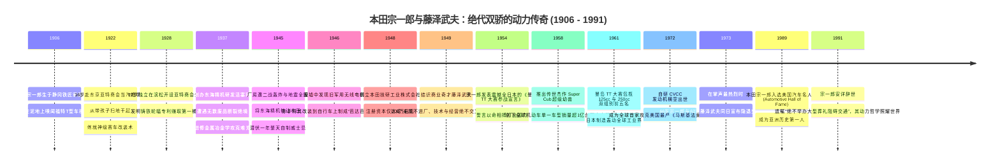
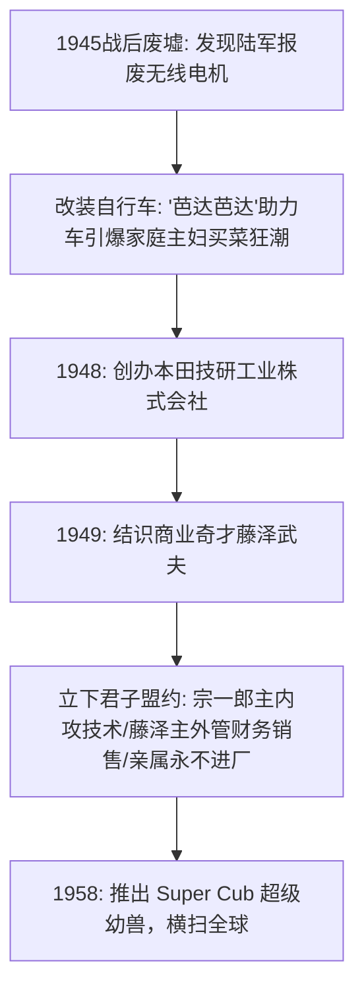
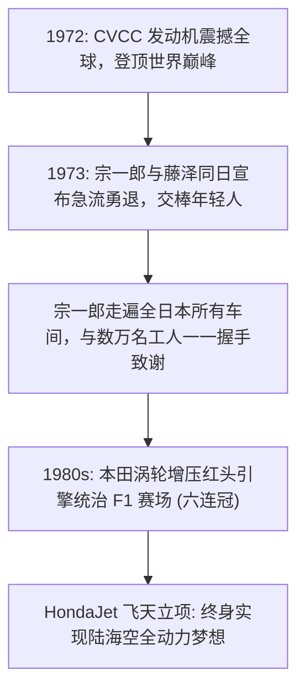

# 本田宗一郎与藤泽武夫：热血机械狂人、绝代双骄与本田动力史诗

> **“如果因为害怕失败而不敢去探索未知，那就是对生命的背叛。在我的字典里，成功只占 1%，那是建立在 99% 的失败基础之上的。把扳手握在沾满机油的手里，用耳朵去倾听气缸每一次爆发的心跳——只要你拥有对机械最纯粹的热爱，全世界都会为你让路。”**  
> —— 本田宗一郎 (Soichiro Honda)
>
> **“宗一郎负责向世界展现天才的梦想，而我的职责，就是为这个梦想修筑一条永远不会断裂的商业铁轨。”**  
> —— 藤泽武夫 (Takeo Fujisawa)

---

```text
==================================================================================================
【传主档案速览】
• 技术灵魂：本田宗一郎 (Soichiro Honda, 1906.11.17 – 1991.08.05, 享年84岁)
  - 身份：本田技研工业创始人、日本“战后四大经营之神”之一、入选美国汽车名人堂（首位日本人）
  - 出生地：日本 静冈县 磐田郡 光明村 | 学历：滨松高等工业学校旁听结业（无正规大学文凭）
• 经营之神：藤泽武夫 (Takeo Fujisawa, 1910.11.10 – 1988.12.30, 享年78岁)
  - 身份：本田技研联合创始人兼前最高专务顾问、现代分销网络与研发体制总设计师
• 核心技术奇迹：CVCC 发动机破马斯基法案、超级幼兽破亿、VTEC 可变气门、HondaJet 翼上支架
• 核心精神图腾：扳手社长、白工装平等文化、三个喜悦、急流勇退交棒机制、曼岛TT豪赌
==================================================================================================
```

---

## 🧭 全景生命历程与重大历史决断编年轴 (Chronological Epic)



---

## 🔧 第一章：铁匠之子、汽修学徒与东海精机活塞环 (1906 — 1945)

### 1. 滨松铁匠铺的机油少年
- **1906 年 11 月 17 日**，本田宗一郎出生在日本静冈县天龙川畔的一个贫寒铁匠家庭。
- 父亲本田仪平是一名手艺精湛的铁匠，兼营修理旧自行车的营生。宗一郎从小在铁砧与火炉旁长大，最心爱的玩具就是父亲的锤子、锉刀与废弃齿轮。
- **灵魂深处的机油启蒙**：
  - 小学二年级时，一辆罕见的福特 T 型汽车驶过村头。小宗一郎跟在车后狂奔数里，当汽车停下离去后，他趴在地面上久久凝视地上滴落的一滩黑色机油，甚至伸出手指蘸取机油放在鼻尖深嗅。宗一郎晚年回忆：**“那一刻，我闻到了世界上最美妙的香气，那就是现代机械文明的气味。我下定决心，一生都要与引擎为伴。”**

### 2. 东京亚特商会学徒与赛车改装狂人 (1922–1936)
- 1922 年，高小毕业的 16 岁宗一郎怀揣一张报纸广告，独自前往东京本乡区著名的汽车修理厂“亚特商会（Art Shokai）”当学徒。
- 最初半年，老板只让他照看婴儿和扫地洗碗。宗一郎在严冬深夜借着微弱灯光自学汽车结构图，终于凭借对金属构件的敏锐感知获得下车间机会。
- **神级改装手艺**：他协助老板改装了一辆搭载美式柯蒂斯飞机引擎的“科蒂斯赛车”，并在 1924 年全日本汽车锦标赛中一举夺冠；
- 1928 年，22 岁的宗一郎学成出师，回到滨松独立开设亚特商会分店。他不仅修车，还发明了将木制车轮辐条改为金属冲压铸铁条的专利，名震远州。

### 3. 东海精机：从 99% 废品到冶金专家的绝地蜕变 (1937–1945)
- 宗一郎清醒地意识到单纯修车只是为人做嫁衣，必须制造核心零部件。1937 年他创办“东海精机”，立志研发难度极高的发动机**活塞环**。
- **遭遇惨痛滑铁卢**：他制造的第一批数万枚活塞环送往丰田汽车检验，结果仅有 3 枚合格，其余全因脆硬断裂或弹性不足被直接扔进垃圾桶。
- 傲气受挫的宗一郎没有气馁，已近 30 岁的他毅然以旁听生身份进入滨松高等工业学校，恶补金属冶金学与金相学。经过两年日夜不眠数千次调配合金配比，东海精机终于成功量产高品质活塞环，成为丰田与中岛飞机的核心供应商。

---

## 🛵 第二章：战后废墟的芭达芭达与绝代双骄缔盟 (1946 — 1957)



### 1. 废墟上的“芭达芭达”助力车 (1946–1948)
- 1945 年二战结束，宗一郎将受损厂房作价转让给丰田，换取现金整整沉寂了一年。
- 1946 年秋天，宗一郎在朋友的废品仓库里偶然发现了大批旧日本陆军遗弃的小型无线电发电机。
- 宗一郎灵机一动：战后日本交通瘫痪，人们出行全靠步行，何不把这些小引擎装在自行车上？
- 他亲手用热水袋改造成油箱、焊接传动齿轮，造出了第一辆机械助力自行车。因发动机排气声发出清脆的“芭达芭达（Bata-Bata）”声，被市民亲切称为“芭达芭达车”。妻子佐智甚至亲自骑着它去黑市买米，引得全城主妇争相订购。
- **1948 年 9 月 24 日**，32 名员工在滨松一间漏雨的破木板房里集合，本田宗一郎正式宣告成立**本田技研工业株式会社**。

### 2. 宗一郎与藤泽武夫：日本商业史上最完美的双星契约 (1949)
- 宗一郎虽是技术天才，却对财务报表、渠道分销和资本运作一窍不通，本田技研一度因急速扩产濒临资金链断裂。
- 1949 年，经朋友引荐，宗一郎在东京结识了当时经营木材与机械销售的**藤泽武夫**。
- **一见钟情的灵魂相拥**：两人在小酒馆彻夜长谈，宗一郎描绘了打造世界顶级摩托车和汽车的宏大狂想；藤泽武夫则敏锐地洞察到宗一郎身上无可替代的技术纯粹感。
- **确立传世“三条铁律”**：
  1. **职权绝对分立**：宗一郎担任社长，全权主导研发与车间制造；藤泽担任专务，全权负责财务、人事、销售与战略投资，宗一郎绝不插手经营账目，藤泽绝不干涉技术细节；
  2. **消除家族裙带**：两人的任何亲属（包括子女、兄弟）一律严禁进入公司核心管理层，彻底消灭家族式企业弊端；
  3. **研发绝对独立**：藤泽在 1960 年主导将研发部门独立为“本田技术研究所”，给予工程师完全脱离母公司财报考核的终极创新自由。

---

## 🏆 第三章：超级幼兽神话、曼岛豪赌与 CVCC 奇迹 (1958 — 1973)

### 1. 超级幼兽 (Super Cub)：改变人类机动车史的杰作 (1958)
- 1958 年，宗一郎与藤泽联手推出了**本田 Super Cub (C100)**。
- 这款车凝聚了宗一郎所有的天才构思：
  - 首创**自动离心式离合器**，无需手动捏离合，单手就能换挡（方便日本荞麦面外卖员一手端面一手骑车）；
  - 采用低跨度聚乙烯塑料前挡板，女性穿裙子也能优雅跨骑；
  - 搭载高效超省油的 50cc 四冲程 OHV 引擎，皮实耐用到“往油箱里加花生油也能跑”。
- 藤泽武夫在美国打出划时代的广告语：**“You meet the nicest people on a Honda (骑本田车，遇见最美好的人)”**，彻底洗刷了摩托车在西方“飞车党/流氓”的负面形象。超级幼兽成为全球机动车历史上首个累计销量突破 **1 亿台** 的空前绝后神话！

### 2. 曼岛 TT 大赛的生死豪赌 (1954–1961)
- 1954 年，本田公司尚在襁褓之中，宗一郎便在全员面前发表了震惊业界的《曼岛 TT 大赛宣言》：“我要把本田的引擎送上世界赛车圣地——英国曼岛 TT 大赛，夺取世界冠军！”
- 宗一郎亲自带队在车间日夜打磨高转速四气门发动机，1961 年，本田车队在曼岛 TT 赛道上包揽了 125cc 与 250cc 组别的第 1 至第 5 名！全欧洲媒体惊呼：“本田不仅击败了欧洲，它彻底改写了世界内燃机工业的标准！”

### 3. CVCC 发动机：突破美国《马斯基法案》的封神之战 (1972)
- 1970 年，美国国会通过了史上最严苛的环保法案《清洁空气法案》（又称“马斯基法案”），要求 1975 年起将汽车尾气排放污染削减 90%。通用、福特、丰田等全球汽车巨头一致抗议称这是“物理上绝对不可能达到的空想”。
- **宗一郎的逆向狂飙**：
  - 宗一郎向研发团队下死命令：“巨头退缩之时，正是本田登顶之日！”
  - 1972 年 10 月，本田正式发布 **CVCC (复合涡流控制燃烧)** 发动机。该发动机利用副燃烧室点燃稀薄混合气，**在完全不加装任何贵金属催化转化器的情况下，成为全球首个全指标通过马斯基法案的汽车企业**！
  - 随后搭载 CVCC 的本田思域（Civic）和雅阁（Accord）以无可匹敌的省油与环保性能席卷北美，彻底奠定了本田在世界四轮汽车工业的一线霸主地位。

---

## 🍃 第四章：急流勇退、F1 红头霸权与 HondaJet 飞天 (1973 — 1991)



### 1. 日本企业史上最优雅的交棒退隐 (1973)
- 1973 年 10 月，正值本田技研成立 25 周年、CVCC 发动机大获全胜的最高峰，藤泽武夫悄悄对宗一郎说：“社长，我们该退了。”宗一郎爽朗大笑：“是啊，武夫，该交棒了！”
- 两人在同一天正式宣布辞去全部职务，将这家千亿巨舰交给了 45 岁的一线工程师河岛喜好，确立了“本田历任社长必须出身一线工程师”的硬核铁律。
- 退休后，宗一郎花费数月时间走遍了全日本本田的每一个工厂和维修站，微笑着与数万名沾满机油的基层工人一一握手拥抱，说：“谢谢你，辛苦了！”

### 2. F1 赛场的红头神话与宗一郎离世 (1980s — 1991)
- 20 世纪 80 年代后半期，本田研发的 1.5 升 V6 双涡轮增压 F1 发动机输出超过 1000 匹马力，助力迈凯伦车队（车神塞纳、普罗斯特）横扫 F1 车坛，创下单赛季 16 站豪取 15 胜的无敌纪录。
- **1991 年 8 月 5 日**，84 岁的本田宗一郎在东京顺天堂医院安详辞世。
- 他在遗嘱中留下最后一条严令：**“绝不举行大型社葬！如果因为我一个老头子出殡造成东京街道大塞车、影响普通市民出行，那将是我一生最大的耻辱！”**

---

## 🧠 第五章：本田宗一郎底层认知工具箱 (Mental Model Toolkit)

```text
==================================================================================================
【本田宗一郎五大传世技术与管理认知模型】

1. 1% 成功与 99% 失败模型 (The 99% Failure Paradigm)
   • 核心心法：创新不是计算出来的，是试出来的。每一次炸裂、断裂与抛锚，都是物理世界在向你揭示
               真相。不敢承担99次失败的人，永远没有资格触碰那1%颠覆式突破的桂冠。

2. 异质共生双子星法则 (Heterogeneous Partnership Dyad)
   • 核心心法：最伟大的组织架构是“天才技术狂人 + 顶级商业架构师”的绝配组合。彼此专业高度互补，
               私下保持绝对信任与权力边界，消除家族裙带，以制度确保基业长青。

3. 现场主义与第一线直觉 (Gemba Intuition)
   • 核心心法：真正的答案永远在车间和赛道上，而不是在冷冰冰的汇报文件里。用沾满油污的手去触摸
               零件，用耳朵去辨别气缸声音，现场的物理反馈是最高维的数据。

4. 极限竞技反哺量产循环 (Motorsport Stress-Test Flywheel)
   • 核心心法：把产品推向世界上最残酷的赛场（曼岛TT、F1）。在生死时速的极端工况下暴露并修复
               每一个微小缺陷，赛场淬炼出的技术降维用于民用车，将形成不可逾越的技术代差。

5. 消除官僚之白工装哲学 (White Overalls Egalitarianism)
   • 核心心法：在真理和物理定律面前人人平等。从社长到清洁工统一身着无阶级标识的白色工装，
               任何人都有权根据事实反驳权威，创造力只在绝对平等的土壤中绽放。
==================================================================================================
```

---

## 💬 第六章：传世名言金句 (Iconic Quotes)

1. **论创新的代价**  
   > *“许多人只看到我成功的荣耀，却看不到我脚下踩着的数以千计的失败残骸。成功不是凭空降临的，它是你经历了 99 次绝望的碰壁后，依然愿意敲响第 100 扇门所换来的赏赐。”*  
   > —— 本田宗一郎 (Soichiro Honda)

2. **论年轻一代与权力**  
   > *“老人的经验固然宝贵，但往往也是阻碍突破的最大枷锁。如果一家企业不能把决定权交给那些不怕犯错的年轻人，那么这家企业就已经脑死亡了。”*  
   > —— 本田宗一郎

3. **论藤泽武夫的搭档之谊**  
   > *“没有宗一郎，我不过是一个普通的日本商人；但没有我，宗一郎的梦想可能会撞得粉身碎骨。我们是同一块硬币的两面，共同铸造了本田的灵魂。”*  
   > —— 藤泽武夫 (Takeo Fujisawa)
