# 中国铁建 (CRCC) —— 全球特大型综合建筑、高端装备与超级基建帝国全景介绍

> **《财富》世界500强排名：第 57 位**  
> **年度营业收入：$143,507 百万美元（约 1435 亿美元）**  
> **官方网站：[www.crcc.cn](https://www.crcc.cn)**

---

## 🏢 企业基本信息 (Corporate Snapshot)

| 维度 | 详细信息 |
| :--- | :--- |
| **公司全称** | 中国铁道建筑集团有限公司 (China Railway Construction Corporation) |
| **前身创立时间** | 1948 年 7 月 5 日 (中国人民解放军铁道兵) / 2007 年 11 月 5 日 (重组改制) |
| **全球总部** | 🇨🇳 中国 北京市 海淀区复兴路 40 号 |
| **奠基统帅 / 队伍** | 中国人民解放军铁道兵 (王震、滕代远等开国将领领导创立) |
| **现任董事长 / 党委书记** | 戴和根 (Dai Hegen) |
| **股票代码** | 上交所: `601186` (A股) / 港交所: `01186` (H股) |
| **全球员工总数** | 约 26.5 万人 |
| **核心业务赛道** | 高铁与普速铁路工程承包、公路与桥梁跨海工程、城市轨道交通与市政基建、铁建重工高端装备制造 (超大直径盾构机)、铁四院/铁一院勘察设计咨询、海外重大基建特许经营 |

---

## 🌐 核心业务矩阵与商业版图 (Business Ecosystem)

```mermaid
graph TD
    CRCC["中国铁道建筑集团 (CRCC)"]
    
    CRCC --> ENG["1. 特大型工程承包与施工 (Engineering & Construction)"]
    ENG --> E1["高速铁路与客运专线 (设计建设全国半数以上高铁里程)"]
    ENG --> E2["复杂跨海大桥与长大深埋隧道 (港珠澳大桥 / 深中通道)"]
    ENG --> E3["城市轨道交通与地铁轻轨 (覆盖全国数十座核心都市圈)"]
    ENG --> E4["水利水电 / 港口航道 / 机场跑道与综合管廊"]
    
    CRCC --> MFG["2. 工业制造与高端重工装备 (Industrial Manufacturing)"]
    MFG --> M1["铁建重工 (688425.SH: 全球领先全断面掘进机/盾构机/TBM)"]
    MFG --> M2["大直径泥水平衡盾构机 ('京华号' 16米级国产自主之王)"]
    MFG --> M3["大型养路机械 / 高速道岔 / 电气化接触网接触部件"]
    
    CRCC --> SUR["3. 规划设计与勘察咨询 (Survey & Design Institutes)"]
    SUR --> S1["中铁第四勘察设计院 (铁四院: 中国高铁设计领头羊)"]
    SUR --> S2["中铁第一勘察设计院 (铁一院: 高原与西北冻土地质勘察权威)"]
    SUR --> S3["中铁第五勘察设计院 (铁五院) 及各专业甲级设计院所"]
    
    CRCC --> GLOB["4. 海外重大基建与一带一路 (Global Operations)"]
    GLOB --> G1["印尼雅万高铁 / 尼日利亚阿卡铁路 / 亚吉铁路"]
    GLOB --> G2["沙特麦加朝觐轻轨 / 莫斯科地铁西南段 / 卢塞尔体育场"]
    
    CRCC --> REAL["5. 房地产与绿色新兴产业 (Real Estate & Emerging)"]
    CRCC --> R1["中国铁建地产 (国匠精工 / 绿色健康住宅科技)"]
    CRCC --> R2["生态环保治理 / 矿山修复 / 海上风电基础施工"]

    classDef main fill:#003399,stroke:#e60012,stroke-width:2px,color:#fff;
    classDef branch fill:#002244,stroke:#003399,stroke-width:1px,color:#fff;
    classDef sub fill:#f0f4ff,stroke:#333,stroke-width:1px,color:#000;
    class CRCC main;
    class ENG,MFG,SUR,GLOB,REAL branch;
    class E1,E2,E3,E4,M1,M2,M3,S1,S2,S3,G1,G2,R1,R2 sub;
```

---

## ⚡ 核心竞争壁垒与护城河 (Competitive Moats)

### 1. 复杂地质与极限地理超级工程建造绝对王者
- **中国高铁半壁江山**：规划、设计并施工了中国半数以上的高速铁路里程，包括京沪高铁、京广高铁、武广高铁等骨干通道。
- **攻克人类地质建造极限**：在青藏铁路多年冻土、成昆铁路极高烈度地震断裂带、宜万铁路岩溶暗河等被西方工程界判定为“不可逾越”的极端地质条件下，攻克了数百项世界级工程科技难题。

### 2. 铁建重工：打破西方垄断的大国重器自研高地
- 旗下上市公司**铁建重工 (688425.SH)** 彻底打破了西方对高端全断面隧道掘进机（盾构机/TBM）长达 30 年的技术垄断。
- 成功下线我国自主研制的最大直径（16.07 米）泥水平衡盾构机**“京华号”**，实现核心主轴承、控制系统与高强度刀具的 100% 国产化自主可控，产品远销全球数十个国家。

### 3. 国家级顶级勘察设计“国家队”集群 (铁四院、铁一院)
- 拥有包含数名中国工程院院士、全国工程勘察设计大师领衔的顶尖科研团队。在高铁无砟轨道、高寒动车段、海底沉管隧道、跨座式单轨等领域拥有海量原创知识产权与国际标准话语权。

### 4. 红色铁军基因与组织动员力
- 传承自中国人民解放军铁道兵的优良传统，具备召之即来、来之能战、战之能胜的超强组织纪律性与应急抢险能力，在汶川抗震、抗洪抢险与海外复杂安全局势下展现出无可比拟的攻坚力量。

---

## 📈 历史里程碑年表 (Historical Milestones)

- **1948年7月5日**：中国人民解放军铁道纵队在东北解放战场正式组建。
- **1950年**：铁道兵入朝参战，战胜美军狂轰滥炸，建成“打不烂、炸不断的钢铁运输线”。
- **1958年**：铁道兵建成**鹰厦铁路**，劈开武夷山天险，打通福建出海大通道。
- **1970年7月1日**：历经艰苦卓绝的牺牲与拼搏，**成昆铁路**正式全线通车，被联合国评为人类征服大自然的二十世纪三大奇迹之一。
- **1984年1月1日**：铁道兵三十五万官兵集体脱下军装转业并入铁道部，改称**铁道部工程指挥部**。
- **2007年11月5日**：整体重组设立**中国铁建股份有限公司**。
- **2008年3月**：在上海证券交易所（A股）和香港联交所（H股）成功同步挂牌上市。
- **2010年**：主导建设的沙特麦加朝觐轻轨成功运营，创下全球轨道交通单日最高客运密度纪录。
- **2020年9月**：自主研发的国产最大直径（16.07米）超大盾构机“京华号”在铁建重工长沙第一产业园成功下线。
- **2023年**：参建的东南亚首条时速 350 公里高铁——**印尼雅万高铁**正式开通运营。
- **2024-2026年**：中国铁建年营收稳定在 1430 亿美元以上，稳居全球顶尖工程承包商前列。

---

## 🎯 企业文化与价值观 (Corporate Culture)

- **企业精神**：**不畏艰险，勇攀高峰，领先行业，创誉中外**
- **核心价值观**：诚信创新永恒，精品人品同在
- **发展愿景**：建设成为最具价值创造力的综合建筑产业集团
