# 法国巴黎银行 (BNP Paribas S.A.) —— 欧洲大陆第一大综合银行与全球绿色金融巨舰全景介绍

> **《财富》世界500强排名：第 58 位**  
> **年度营业收入：$141,642 百万美元（约 1416 亿美元）**  
> **官方网站：[group.bnpparibas](https://group.bnpparibas)**

---

## 🏢 企业基本信息 (Corporate Snapshot)

| 维度 | 详细信息 |
| :--- | :--- |
| **公司全称** | 法国巴黎银行股份有限公司 (BNP Paribas S.A.) |
| **历史渊源** | 1848 年 (巴黎国民贴现行 CNEP 设立) / 1872 年 (巴黎巴银行成立) / 2000 年 (两行世纪合并) |
| **全球总部** | 🇫🇷 法国 巴黎市 意大利林荫大道 16 号 (16 Boulevard des Italiens, Paris) |
| **世纪合并奠基人** | 米歇尔·佩贝罗 (Michel Pébereau)、让·勒米埃 (Jean Lemierre) |
| **现任董事会主席 / CEO** | 让·勒米埃 (Jean Lemierre, 主席) / 让-洛朗·博纳菲 (Jean-Laurent Bonnafé, CEO) |
| **股票代码** | 泛欧交易所: `BNP` (CAC 40 与 Euro Stoxx 50 核心指数股) |
| **全球员工总数** | 约 18.3 万人 |
| **核心业务赛道** | 企业与机构银行 (CIB: 全球市场/全球投行/证券服务)、四大本土商业与个人银行 (CPBS: 法国/比利时/意大利/卢森堡)、投资与保护服务 (IPS: 资产管理/私人银行/Cardif保险)、Arval 移动出行车辆全包租赁 |

---

## 🌐 核心业务矩阵与商业版图 (Business Ecosystem)

```mermaid
graph TD
    BNP["法国巴黎银行商业帝国 (BNP Paribas S.A.)"]
    
    BNP --> CIB["1. 企业与机构银行 (Corporate & Institutional Banking)"]
    CIB --> CIB1["全球市场业务 (Global Markets: 跨资产固定收益/外汇/股票衍生品)"]
    CIB --> CIB2["全球企业金融 (Global Banking: 跨境银团贷款/并购重组顾问/IPO承销)"]
    CIB --> CIB3["全球证券服务 (Securities Services: 托管全球超12万亿欧元资产)"]
    
    BNP --> CPBS["2. 欧洲核心商业与个人银行 (CPBS - 四大本土市场)"]
    CPBS --> CP1["法国商业银行 (French Retail Banking - 覆盖千万人群)"]
    CPBS --> CP2["比利时富通商业银行 (BNP Paribas Fortis - 比利时第一大行)"]
    CPBS --> CP3["意大利劳工银行 (BNL - 意大利核心综合金融网络)"]
    CPBS --> CP4["卢森堡国际商业银行 (BGL BNP Paribas)"]
    
    BNP --> IPS["3. 投资与保护服务 (Investment & Protection Services)"]
    IPS --> IPS1["BNP Paribas Cardif (全球领先的借款人信用保险与人寿保险)"]
    IPS --> IPS2["BNP Paribas Wealth Management (欧洲第一大私人财富管理机构)"]
    IPS --> IPS3["BNP Paribas Asset Management (全球资产管理与绿色 ESG 基金)"]
    
    BNP --> MOB["4. 移动出行与特种金融 (Mobility & Specialized Finance)"]
    MOB --> M1["Arval (全球领先的企业级车辆全包长期租赁与车队管理)"]
    MOB --> M2["BNP Paribas Personal Finance (欧洲个人消费信贷龙头)"]
    MOB --> M3["Nickel (全法领先的烟草店/社区纯数字便捷账户服务)"]

    classDef main fill:#00915a,stroke:#222,stroke-width:2px,color:#fff;
    classDef branch fill:#1c2d37,stroke:#00915a,stroke-width:1px,color:#fff;
    classDef sub fill:#f0fff8,stroke:#333,stroke-width:1px,color:#000;
    class BNP main;
    class CIB,CPBS,IPS,MOB branch;
    class CIB1,CIB2,CIB3,CP1,CP2,CP3,CP4,IPS1,IPS2,IPS3,M1,M2,M3 sub;
```

---

## ⚡ 核心竞争壁垒与护城河 (Competitive Moats)

### 1. 欧洲大陆资产规模第一与多元化“全能银行”双支柱
- 法国巴黎银行是欧洲大陆资产规模最大（总资产超 2.6 万亿欧元）的银行集团。
- 其最强大的护城河在于极度均衡的**“全能银行模式 (Universal Banking)”**：四大本土商业银行与消费金融贡献稳定的存款与净利息收入，而顶级 CIB 投行业务与全球市场衍生品交易则在市场波动周期中贡献丰厚的手续费与交易利润，形成完美的抗周期自我对冲闭环。

### 2. 全球绿色可持续金融第一梯队领跑者
- 集团长期领跑全球**绿色债券 (Green Bonds)** 承销与能源转型银团贷款，积极参与全球跨国企业低碳脱碳战略，成为欧洲乃至全球规模最大的可持续发展投行之一。

### 3. 全球领先的证券托管与资产服务 (Securities Services)
- 资产服务部门为全球主权财富基金、大型养老金和跨国对冲基金托管超过 12 万亿欧元的金融资产，构筑了极其深厚、高转换成本的机构客户粘性护城河。

### 4. Arval 移动出行与高毛利非息收入底座
- 旗下全资车队租赁与移动出行公司 **Arval** 运营超过 170 万辆租赁车辆，不仅贡献了丰厚的高毛利现金流，更为集团在汽车电动化与车联网时代锁定了庞大的企业级优质客户群。

---

## 📈 历史里程碑年表 (Historical Milestones)

- **1848年3月**：法兰西第二共和国临时政府签署法令设立**巴黎国民贴现行 (CNEP)**。
- **1860年**：CNEP 进军远东，在上海设立分行，成为首批进入中国开展贸易结算的外资银行。
- **1872年**：泛欧金融财团在阿姆斯特丹和巴黎创立**巴黎巴银行 (Banque de Paris et des Pays-Bas)**。
- **1966年**：法国政府主导 CNEP 与全国工商银行 (BNCI) 合并组建**巴黎国民银行 (BNP)**。
- **1993年**：米歇尔·佩贝罗 (Michel Pébereau) 主导 BNP 完成私有化，启动现代化重塑。
- **1999年**：佩贝罗发起震惊全球资本市场的“双重反向敌意收购”，成功将巴黎巴银行收入麾下，组建全新的**法国巴黎银行 (BNP Paribas)**。
- **2006年**：收购意大利第六大银行——意大利劳工银行 (BNL)。
- **2009年**：在金融海啸中逆势以 145 亿欧元收购**富通银行 (Fortis Bank)** 比利时与卢森堡业务，一跃成为欧元区存款规模第一大行。
- **2023年**：以 163 亿美元全现金完成向蒙特利尔银行出售美国西部银行 (Bank of the West)，释放出海量资本弹药回购股票并聚焦泛欧核心市场。
- **2024-2026年**：年营业收入超 1410 亿美元，稳居《财富》世界500强欧洲综合金融龙头。

---

## 🎯 企业文化与价值观 (Corporate Values)

法国巴黎银行的核心品牌承诺：
> **“变革世界的银行 (The Bank for a Changing World)”**

核心经营原则：
1. **敏捷创新 (Agility)**：在宏观变局与绿色低碳浪潮中快速迭代金融工具。
2. **开放合作 (Openness)**：倾听全球企业与个人客户诉求，构建共赢金融生态。
3. **合规审慎 (Compliance & Security)**：恪守最严苛的国际金融监管标准，维护金融体系基石稳定。
4. **可持续承诺 (Sustainability)**：用资本力量引导全球工业向低碳绿色转型。
