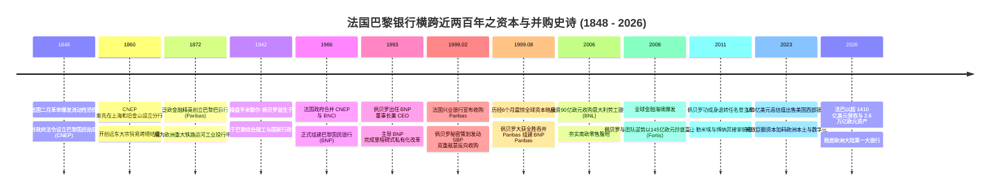
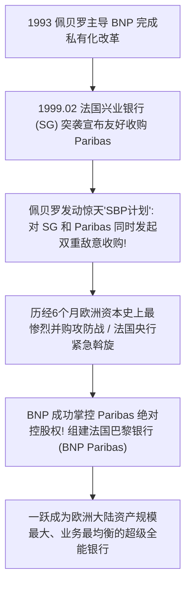

# 米歇尔·佩贝罗与法巴帝国：从二月革命贴现行到欧洲第一大行的世纪资本战

> **“在欧洲金融业的棋盘上，你永远不能安于当一个温和的观察者。当历史的裂缝出现、当旧秩序发生动摇时，你必须拥有制定规则的铁腕意志与战略嗅觉。我们打赢那场震惊世界的 6 个月并购战，不是为了虚荣的规模，而是为了让欧洲大陆拥有一艘能够与华尔街巨鳄平起平坐的真正超级航母。”**  
> —— 米歇尔·佩贝罗 (Michel Pébereau)

---

```text
==================================================================================================
【传主与奠基档案速览】
• 历史制度源头：1848 年法兰西第二共和国临时政府设立的“巴黎国民贴现行 (CNEP)”
• 投资银行源头：1872 年泛欧金融精英在阿姆斯特丹与巴黎设立的“巴黎巴银行 (Paribas)”
• 现代帝国总操盘手：米歇尔·佩贝罗 (Michel Pébereau, 1942.01.23 生于巴黎)
  - 身份：法国巴黎银行终身名誉董事长、法国金融界泰斗、“并购之王”
  - 学历：巴黎综合理工学院 (École Polytechnique)、法国国家行政学院 (ENA 财政督察)
• 核心历史战役：1860远东贸易金融布局、1999年欧洲银行业世纪并购（SBP战役）、2009抄底富通银行
• 核心精神图腾：全能银行模式、双支柱抗周期、冷静沉着的铁腕操盘、欧洲金融自主权
==================================================================================================
```

---

## 🧭 全景生命历程与重大历史决断编年轴 (Chronological Epic)



---

## 🏛️ 第一章：革命烈火中的救市法案与远东上海的贸易先锋 (1848 — 1900)

### 1. 1848 年二月革命与 CNEP 的紧急诞生
- 1848 年春，法国二月革命爆发，七月王朝覆灭，法兰西第二共和国建立。政治剧变引发严重的全国性挤兑潮，全法商业信用瞬间冻结，数百家私人钱庄相继破产。
- **1848 年 3 月 8 日**，为恢复商业票据流通与拯救实体经济，临时政府颁布紧急法令，在巴黎设立**巴黎国民贴现行 (Comptoir National d'Escompte de Paris, CNEP)**，由国家、巴黎市政府与工商界共同出资担保。
- CNEP 迅速建立起高效的票据贴现与短期周转信贷机制，成功平息了金融恐慌，成为法国现代商业银行体制的摇篮。

### 2. 1860 年开拓远东：上海分行与全球网络
- 19 世纪 60 年代，CNEP 成为全球化扩张最激进的欧洲银行：
  - 1860 年，CNEP 在中国**上海**和印度**加尔各答**设立分行，是最早进入中国开展丝绸、茶叶贸易融资与外汇汇兑的外资银行之一；
  - 随后在旧金山、墨尔本、悉尼建立分支，专门服务加利福尼亚淘金热与澳大利亚羊毛贸易，构建起覆盖五大洲的跨国贸易融资网络。

---

## 🎩 第二章：巴黎巴银行：工业革命与跨国运河背后的投行贵族 (1872 — 1966)

### 1. 泛欧投资银行之王——Paribas
- **1872 年 1 月**，在经历普法战争创伤后，一批来自阿姆斯特丹、布鲁塞尔、日内瓦和巴黎的顶级私人银行家在巴黎联合创立了**巴黎巴银行 (Banque de Paris et des Pays-Bas，后简称 Paribas)**。
- 与专注于吸纳大众存款的商业银行不同，巴黎巴从诞生第一天起就是一家纯粹的**顶级投资银行**：
  - 它全权承销了法国、沙皇俄国、奥匈帝国的国家主权公债；
  - 它资助了泛欧铁路网的铺设、苏伊士运河的拓展以及西班牙和南美的矿山开发；
  - 巴黎巴银行汇聚了欧洲最顶尖的金融分析师与工业顾问，被誉为“欧洲工业化背后真正的隐形金主”。

### 2. 战后重组与巴黎国民银行 (BNP) 诞生
- 二战结束后，法国戴高乐政府为了集中力量进行战后经济重建，将法国前四大商业银行全部收归国有。
- **1966 年**，时任法国财政部长米歇尔·德布雷主导，将 CNEP 与全国工商银行 (BNCI) 强强合并，正式定名为**巴黎国民银行 (Banque Nationale de Paris, BNP)**，一跃成为全法国网络最庞大的国有商业银行。

---

## ⚔️ 第三章：米歇尔·佩贝罗与 1999 年世纪并购暗战 (1993 — 2000)



### 1. 铁血学者米歇尔·佩贝罗的崛起
- **米歇尔·佩贝罗 (Michel Pébereau)** 是法国“国家精英培养体系”的最高典范：毕业于巴黎综合理工学院和国家行政学院，早年在法国财政部担任高级官员。
- 1993 年，佩贝罗出任处于国企僵化状态的 BNP 董事长。他以极高的战略执行力大刀阔斧推行裁员增效、引入现代风险管理，成功主导了 BNP 的私有化上市，使其成为资本市场上极具进攻性的金融利刃。

### 2. 1999 年欧洲银行业世纪大战：惊心动魄的“SBP 战役”
- 1999 年 2 月，法国兴业银行 (Société Générale) 突然宣布与巴黎巴银行 (Paribas) 达成协议，拟以对等换股方式合并组建全法最大银行。
- 一旦该交易完成，BNP 将被彻底边缘化。
- **佩贝罗的惊天反击**：
  - 1999 年 3 月 9 日清晨，佩贝罗召集全球媒体，投下了一枚震碎欧洲金融界的重磅炸弹——BNP 宣布正式启动代号为**“SBP 计划”**的双重敌意收购：**BNP 不仅要竞购 Paribas，还要同时对法国兴业银行发起全面恶意收购**！
  - 这场涉及金额超 **370 亿欧元** 的世纪并购战持续了整整 6 个月。三家银行在巴黎、伦敦和纽约资本市场上演了极其残酷的公开辩论、游说机构股东、法律诉讼以及广告舆论战，法国央行行长甚至多次深夜紧急召集三方调解。
  - **终局胜出**：1999 年 8 月，法国金融市场监管局公布最终投票结果：BNP 成功获得了 Paribas **65.2% 的绝大多数投票权**！
- **2000 年 5 月**，合并后的**法国巴黎银行 (BNP Paribas)** 正式挂牌成立。佩贝罗将 BNP 的庞大零售网络与 Paribas 顶尖的投资银行和资产管理能力完美融合，创造了欧洲大陆最强大的全能银行旗舰。

---

## 🛡️ 第四章：金融海啸抄底富通与现代欧洲霸权 (2001 — 2026)

### 1. 2008 年金融危机中的大师级抄底：富通银行 (Fortis)
- 2008 年 9 月雷曼倒闭后，比利时-荷兰金融巨头富通银行陷入流动性绝境，濒临倒闭清算。
- 在各家跨国银行人人自危时，佩贝罗与现任 CEO 博纳菲迅速与比利时和卢森堡政府谈判，以极具优势的条件（145 亿欧元换股与政府注资）**全资收购了富通银行在比利时和卢森堡的核心商业银行业务**。
- 这场教科书级的逆势抄底，直接让法巴在比利时一举拿下 30% 以上的零售与企业市场份额，巩固了其作为泛欧无可撼动的存款霸主地位。

### 2. 现代演进：数字化与绿色先锋
- 2011 年佩贝罗功成身退，让·勒米埃与博纳菲接掌帅印。
- 2023 年，集团以高达 163 亿美元全现金将美国西部银行出售给蒙特利尔银行，将全部战略重心聚焦于欧洲本土数字化再造与全球绿色可持续投行业务，以坚如磐石的资本充足率和盈利能力稳居欧洲金融之巅。

---

## 🧠 第五章：米歇尔·佩贝罗底层认知工具箱 (Mental Model Toolkit)

```text
==================================================================================================
【米歇尔·佩贝罗四大传世金融与并购认知模型】

1. 全能银行双支柱抗周期模型 (Universal Banking Symmetry)
   • 核心心法：零售商业银行是“提供低成本稳定资金的防守底盘”，企业投行与全球市场是“在波动期
               博取超额收益的进攻矛头”。两者深度咬合，方能穿越百年一切金融风暴。

2. 关键节点不对称突袭战术 (Asymmetric Preemptive Strike)
   • 核心心法：当战略生存空间面临被对手封锁挤压的致命威胁时，与其坐以待毙，不如实施超预期
               的双重反向突袭（如SBP计划）。以进攻作为最强防御，彻底打乱敌方部署。

3. 泛欧腹地高粘性深耕战略 (Pan-European Core Consolidation)
   • 核心心法：不在散乱的非核心海外市场过度消耗资本，而是牢牢锁定欧洲富庶核心区（法、比、意、卢）
               的高净值财富管理与企业基本盘，构筑极高转换成本的物理与数字护城河。

4. 危机极值资产收割法则 (Crisis Asset Harvesting)
   • 核心心法：在金融海啸与国家政府最迫切需要救市白衣骑士的时刻，以国家信誉背书和极低估值
               收购系统重要性银行（如富通银行），用一笔交易完成平日三十年无法达成的版图扩张。
==================================================================================================
```

---

## 💬 第六章：传世名言金句 (Iconic Quotes)

1. **论欧洲银行家的雄心**  
   > *“如果我们欧洲人不敢建立起属于我们自己的世界级跨国银行，那么欧洲的实体企业就不得不永远仰人鼻息、依赖华尔街的资金来生存。法巴的存在，就是为了捍卫欧洲的经济独立。”*  
   > —— 米歇尔·佩贝罗 (Michel Pébereau)

2. **论危机中的清醒**  
   > *“最优秀的银行家从来不是在顺境中跑得最快的那个人，而是在所有人都失去理智疯狂加杠杆时，依然死守风险底线的那个人。”*  
   > —— 米歇尔·佩贝罗
