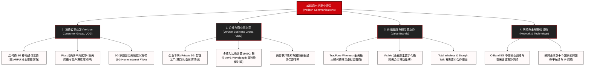

# 威瑞森电信 (Verizon Communications) —— 全美网络质量之王与 5G 超宽带基建帝国全景介绍

> **《财富》世界500强排名：第 60 位**  
> **年度营业收入：$138,191 百万美元（约 1381 亿美元）**  
> **官方网站：[www.verizon.com](https://www.verizon.com)**

---

## 🏢 企业基本信息 (Corporate Snapshot)

| 维度 | 详细信息 |
| :--- | :--- |
| **公司全称** | 威瑞森电信公司 (Verizon Communications Inc.) |
| **成立时间** | 1983 年 (原大西洋贝尔成立) / 2000 年 6 月 30 日 (与 GTE 世纪合并定名 Verizon) |
| **全球总部** | 🇺🇸 美国 纽约州 纽约市 美洲大道 1095 号 (1095 Avenue of the Americas, New York) |
| **奠基与合并领袖** | 雷·史密斯 (Ray Smith)、伊万·塞登伯格 (Ivan Seidenberg) |
| **现任董事长兼CEO** | 卫翰思 (Hans Vestberg) |
| **股票代码** | NYSE: `VZ` / NASDAQ: `VZ` (道琼斯工业平均指数与标普500核心成分股) |
| **全球员工总数** | 约 10.5 万人 |
| **核心业务赛道** | 5G 移动超宽带网络 (5G Ultra Wideband)、Fios 纯光纤千兆家庭宽带、企业级专网 (Private 5G)、跨国企业通信与边缘计算 (MEC)、预付费价值品牌 (TracFone / Visible) |

---

## 🌐 核心业务矩阵与商业版图 (Business Ecosystem)

---

## ⚡ 核心竞争壁垒与护城河 (Competitive Moats)

### 1. 全美公认第一的网络质量与可靠性金字招牌
- **连续 30+ 次蝉联 J.D. Power 冠军**：在全美第三方网络质量评估中，威瑞森在呼叫质量、数据传输速率、网络连接可靠性方面长期位居第一，是全美高端商务人士与中产家庭首选的通信运营商。
- **高 ARPU 忠诚客户群**：拥有全行业最低的客户流失率（Churn Rate）与极高的每用户平均收入（ARPU），构筑了坚固的现金流护城河。

### 2. Fios 纯光纤与 C-Band 5G 协同底座
- 威瑞森从 2005 年起耗资数百亿美元铺设了直达家庭的纯光纤网络 **Fios**，不仅在家庭宽带领域树立了高对称网速标杆，更为其 5G 基站回传（Backhaul）提供了现成的极高带宽光纤底座。

### 3. 企业级 5G 专网与边缘计算生态
- 与 AWS、微软 Azure 深度合作，在全美数十个核心大都市边缘部署 **Wavelength** 移动边缘计算节点，为全美各行各业提供低于 10 毫秒的超低时延工业级专网服务。

### 4. 彻底收回无线业务股权的战略自主权
- 2014 年以 1300 亿美元全额回购沃达丰所持 Verizon Wireless 的 45% 股权，消除了复杂的跨境股东利益纠葛，能够将全部无线现金流用于资本开支与股东分红。

---

## 📈 历史里程碑年表 (Historical Milestones)

- **1984年1月1日**：AT&T 世纪大分拆，大西洋贝尔 (Bell Atlantic) 与 NYNEX 正式独立运作。
- **1997年**：大西洋贝尔以 256 亿美元与 NYNEX 完成合并，掌控美国东海岸通信命脉。
- **2000年4月**：大西洋贝尔与英国沃达丰 (Vodafone) 合资组建 **Verizon Wireless**。
- **2000年6月30日**：大西洋贝尔与全美最大独立本地电信商 GTE 完成 520 亿美元世纪合并，正式定名为**威瑞森电信 (Verizon Communications)**。
- **2005年**：正式推出全美首个光纤入户 (FTTH) 宽带服务品牌 **Fios**。
- **2010年12月**：率先在全美 38 个大都市开通商业化 **4G LTE** 网络，引领北美移动互联提速。
- **2014年2月**：以 **1300 亿美元** 现金与股票全额收购沃达丰所持 Verizon Wireless 45% 股权，创下全球企业并购史上第三大交易。
- **2019年4月**：在芝加哥和明尼阿波利斯开通全球首个商业化 5G 超宽带移动网络。
- **2021年**：斥巨资在 FCC 拍卖中竞得黄金 C-Band 5G 频段，并以 60 亿美元收购全美最大预付费虚拟运营商 TracFone。
- **2024-2026年**：年营业收入突破 1380 亿美元，稳居《财富》世界500强全球顶级电信巨擘。

---

## 🎯 企业文化与价值观 (Corporate Purpose)

威瑞森的核心使命：
> **“我们创造连接，让世界充满希望 (We deliver the promises of the digital world)”**

核心价值观（The Verizon Credo）：
1. **诚信为本 (Integrity)**：言必信、行必果，网络质量与客户隐私绝不妥协；
2. **追求卓越 (Excellence)**：以最高的工程标准打造全美最值得信赖的基础网络；
3. **以人为本 (Respect & Care)**：关爱员工、赋能社区，消灭数字化发展不均衡。
