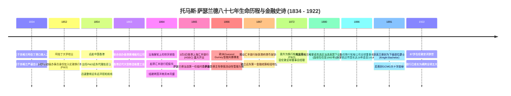
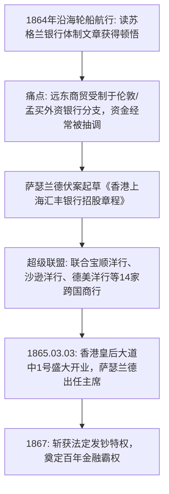

# 托马斯·萨瑟兰德 (Thomas Sutherland)：苏格兰水手后裔、远东金融架构师与汇丰帝国的开山教父

> **“在遥远的东方，成千上万的商行每天在惊涛骇浪中从事着数以千万计的跨国贸易。但令人难以置信的是，这里竟然没有一家真正属于本土、由本地商人自主管理并由本地资本支撑的银行！我们要改变这一切——我们要建立一家永远根植于香港与上海的现代金融灯塔。”**  
> —— 托马斯·萨瑟兰德 (Sir Thomas Sutherland)

---

```text
==================================================================================================
【传主档案速览】
• 全名：托马斯·萨瑟兰德爵士 (Sir Thomas Sutherland) | 中文名：汤马士·修打兰
• 生卒：1834 年 8 月 16 日 – 1922 年 1 月 1 日 (享年 87 岁)
• 出生地：英国 苏格兰 阿伯丁 (Aberdeen, Scotland) | 逝世地：英国伦敦
• 身份：香港上海汇丰银行 (HSBC) 创始人兼首任主席、铁行轮船公司 (P&O) 董事长、英国国会议员
• 学历：阿伯丁文法学校、阿伯丁大学马歇尔学院 (Marischal College, University of Aberdeen)
• 贵族荣誉：圣米迦勒及圣乔治大十字勋章 (GCMG)、下级勋位爵士 (Knight Bachelor)
• 核心精神图腾：本地化资本同盟、远东贸易金融闭环、黄埔船坞重工业拓荒、铁行航运霸权
==================================================================================================
```

---

## 🧭 全景生命历程与重大历史决断编年轴 (Chronological Epic)



---

## 🌊 第一章：北海海风、阿伯丁商魂与18岁伦敦学徒 (1834 — 1853)

### 1. 严谨苏格兰港口商人的血脉传承
1834 年 8 月 16 日，托马斯·萨瑟兰德出生于苏格兰东北部著名的花岗岩港口城市阿伯丁（Aberdeen）。
- 父亲**罗伯特·萨瑟兰德 (Robert Sutherland)** 是一名备受尊敬的涂料与船舶物资商人；母亲**克里斯蒂安·韦伯斯特 (Christian Webster)** 出身于苏格兰长老会虔诚的知识分子家庭。
- 在苏格兰启蒙运动与严密商业会计文化的熏陶下，托马斯自幼便展现出惊人的数字天赋与井井有条的组织逻辑。

### 2. 阿伯丁大学与初入航运殿堂
托马斯先后在阿伯丁文法学校及**阿伯丁大学马歇尔学院**完成学业。
- 1852 年，年仅 18 岁的萨瑟兰德带着母亲缝在内衬里的几封推荐信，独自乘马车前往伦敦寻找机遇。
- 凭借出色的数学速算能力与一手娟秀的书法，他被刚刚获得英国皇家邮政越洋邮件特许权的**铁行轮船公司 (Peninsular and Oriental Steam Navigation Company, 简称 P&O)** 录用，成为伦敦总部的见习初级书记员。
- 在堆满航海日志与货运清单的办公室里，萨瑟兰德每天工作 12 个小时，深入研究了每一条航线的燃煤消耗、风向水文、保险费率与港口停泊规费。

---

## ⚓ 第二章：闯荡维多利亚港、重构远东航运与黄埔船坞 (1854 — 1863)

### 1. 20岁远赴香港：乱局中的年轻总督
1854 年，正值太平天国运动与远东贸易急剧扩张时期，P&O 驻香港远东办事处由于管理混乱、账目亏空陷入危机。
- 20 岁的萨瑟兰德被总部委以重任，派往万里之遥的英国殖民地香港担任财务监督。
- 抵达维多利亚港后，萨瑟兰德展现出超越年龄的铁腕与决断力：他迅速清退贪腐买办、重建透明航线排班表，并在两年内将 P&O 在香港、广州与上海之间的班轮准点率提升至 95% 以上。
- **1858 年**：年仅 24 岁的萨瑟兰德被正式任命为 **P&O 远东地区总代表 (Superintendent)**，全权统辖从加尔各答、新加坡到香港、横滨的整个亚太航运枢纽。

### 2. 创立香港黄埔船坞：奠定近代修船工业基石 (1863)
在管理航运过程中，萨瑟兰德发现远洋轮船一旦在远东海域遭遇台风触礁损坏，往往必须冒险航行数千海里返回孟买或英国本土修理，耗时数月且成本高昂。
- 1863 年，萨瑟兰德联手苏格兰同乡兼著名船商道格拉斯·拉普莱克（Douglas Lapraik），在九龙红磡投资兴建了**香港黄埔船坞公司 (Hong Kong and Whampoa Dock Company)**。
- 这座大型干船坞不仅彻底解决了 P&O 船队的维保难题，更成为远东规模最大、技术最先进的造修船基地，直接推动了香港从一个单纯的中转贸易港向现代化重工业港口的飞跃。

---

## 🏛️ 第三章：沿海轮船上的顿悟、汇丰创世纪与超级同盟 (1864 — 1865)



### 1. 1864年沿海轮船上的惊天顿悟
1864 年初，萨瑟兰德搭乘一艘沿海客轮从香港前往福州巡视业务。旅途中，他在颠簸的船舱里阅读了一篇刊登在《黑伍德爱丁堡杂志 (Blackwood's Edinburgh Magazine)》上的文章，详细阐述了苏格兰现代合股银行制度的成功经验。
- 萨瑟兰德脑海中瞬间划过一道闪电：
  - 当时远东所有的外资银行（如丽如银行 Oriental Bank、麦加利银行 Chartered Bank）全都是伦敦或孟买总部的派驻分支机构；
  - 这些银行的董事会远在千里之外，不仅根本不了解中国贸易的实际运作周期，更经常在远东商人最需要资金时将资本强行抽回欧洲本土填补亏空；
  - 远东本地贸易商每年创造数千万英镑的现金流，却不得不忍受极其严苛且缺乏弹性的借贷条件。
- 萨瑟兰德拍案而起：“为什么我们不能在香港创办一家**资本属于本地、股东由本地洋商组成、管理层坐镇本地**的真正属于远东的合股银行？！”

### 2. 伏案起草招股书与组建跨国超级同盟
回到香港后，萨瑟兰德利用短短几天时间，亲手起草了一份逻辑严密、极具远见的《香港上海汇丰银行招股章程》。
- 为了确保银行拥有广泛的代表性与抗风险能力，萨瑟兰德没有局限于英国同胞，而是以高超的外交手腕打破国籍与教派藩篱，将当时在港最有势力的各大洋行首脑全部拉入发起人阵营：
  - **英资霸主**：宝顺洋行 (Dent & Co.) 核心合伙人托马斯·登特；
  - **犹太金融巨头**：新沙逊洋行 (E.D. Sassoon) 掌门人阿瑟·沙逊；
  - **美资巨头**：旗昌洋行代表与闻名遐迩的 Heard & Co.；
  - **德资与欧陆商行**：禅臣洋行 (Siemssen & Co.) 与鲁宾斯洋行；
  - **帕西与印度商人**：著名的商业名流柯玛斯吉 (R.H. Cama)。
- 这一创举不仅瞬间募集到了 500 万港元的初始股本，更将整个远东贸易界最有实力的客户群变成了银行自身的股东与忠实储户。

### 3. 1865年3月3日：皇后大道中1号开门迎客
1865 年 3 月 3 日，**香港上海汇丰银行 (The Hongkong and Shanghai Banking Corporation, HSBC)** 在香港皇后大道中 1 号正式对外开业，萨瑟兰德当选为第一任临时董事会主席。
- 一个月后（4月3日），汇丰上海分行在外滩盛大营业。
- 汇丰确立了“立足本地、快速放贷、严控汇兑”的运营原则，业务迅速席卷整个远东沿海。

---

## 🌪️ 第四章：风暴中的反脆弱、发钞权与铁行霸主 (1866 — 1922)

### 1. 1866年伦敦金融风暴：绝境中的反脆弱坚守
汇丰开业仅一年，1866 年 5 月，伦敦百年老牌贴现巨头奥弗伦·格尼银行 (Overend, Gurney & Co.) 突然倒闭，引发席卷全球的系统性金融大海啸。
- 在香港，英国传统老牌外资银行纷纷挤兑倒闭，连汇丰的发起股东之一宝顺洋行也惨遭破产清算。
- 在最危急的关头，萨瑟兰德与董事会沉着应对：
  - 坚决拒绝盲目对外拆借投机性高风险头寸；
  - 调集充足的金银现款在香港和上海大厅堆叠如山，向所有恐慌的储户保证“见票即兑”；
  - 汇丰不仅没有在风暴中倒下，反而在同侪的废墟上收割了大量避险资金，一举奠定了远东第一信用中枢的崇高声誉。

### 2. 斩获法定发钞特权 (1867)
凭借在金融危机中展现出的铁血信用，1867 年港英政府正式授予汇丰银行发行合法纸币的特权。
- 汇丰发行的港币纸币迅速成为华南及远东贸易中最受信任的硬通货，甚至在清朝海关关税结算中成为指定通用货币。

### 3. 执掌全球航运巨无霸：P&O董事长与国会议员
完成汇丰银行的奠基布局后，萨瑟兰德于 1870 年代初返回伦敦，出任母公司 P&O 的全球掌门人。
- **执掌铁行 28 年 (1886-1914)**：萨瑟兰德推动铁行船队全面完成从木质明轮船向全钢质螺旋桨蒸汽轮船的技术跃迁，开通苏伊士运河特快邮轮航线，使 P&O 成为大英帝国全球海上交通的绝对生命线。
- **政坛风云 (1880-1900)**：萨瑟兰德代表苏格兰格里诺克选区当选英国下议院国会议员，积极推动跨国商贸保护与海事法典现代化。
- **1922 年元旦**，87 岁高龄的萨瑟兰德爵士在伦敦寓所安详辞世，走完了其兼具航运霸王与金融教父的传奇一生。

---

## 🧠 第五章：萨瑟兰德的底层认知与战略工具箱

### 1. “去中心化本地赋能”模型 (Decentralized Local Governance)
- 萨瑟兰德在 19 世纪中叶就深刻洞察到跨国管理的“信息时滞死角”。他坚决反对由伦敦远程微观遥控远东业务，坚持“让听得见炮声的人做决策”，赋予香港本地管理团队极大的贷款审批与利率自主权。

### 2. “超阶级商业同盟”网络构建 (Cross-Coalition Ecosystem)
- 在创办汇丰时，萨瑟兰德展现出非凡的政治包容力。他不搞排他性的英格兰单一小圈子，而是将苏格兰人、德意志人、犹太人、美国人与帕西商人深度捆绑在同一利益飞轮上，以利益共享化解一切地缘分歧。

### 3. “实体航运与金融信用”双螺旋闭环 (Maritime-Banking Nexus)
- 萨瑟兰德一手执掌 P&O 航运与黄埔造船，一手开创汇丰银行。货物流动与资金流动在他手中形成了完美的正向互哺机制：航运为银行带来海量贸易结算客户与抵押品，银行则为航运扩张提供源源不断的长期低成本资本支持。

---

## 💬 第六章：经典语录与传世风采

### 经典名言录
1. *“一个远离业务一万英里的董事会，无论多么睿智，也无法代替现场一名敏锐经理人的瞬间判断。”*
2. *“银行的资本不在于金库里堆放了多少金条，而在于市场在最黑暗的时刻对你签名的绝对信任。”*
3. *“把不同国籍、不同信仰的商人们聚集在一起的最佳方式，就是为他们创造一个公正、透明且共同获利的清算平台。”*
