# 马拉松原油公司 (Marathon Petroleum Corporation) —— 全美第一大炼油巨头全景介绍

> **《财富》世界500强排名：第 63 位**  
> **年度营业收入：$135,222 百万美元（约 1352.2 亿美元）**  
> **官方网站：[www.marathonpetroleum.com](https://www.marathonpetroleum.com)**

---

## 🏢 企业基本信息 (Corporate Snapshot)

| 维度 | 详细信息 |
| :--- | :--- |
| **公司全称** | 马拉松原油公司 (Marathon Petroleum Corporation, 简称 MPC) |
| **成立时间** | 1887 年（前身俄亥俄石油公司创立于俄亥俄州芬德利；2011 年从马拉松石油分拆为独立下游炼化公司） |
| **全球总部** | 🇺🇸 美国 俄亥俄州 芬德利 (Findlay, OH) |
| **奠基人** | 俄亥俄石油公司 14 位独立油农联盟 (Henry M. Ernst 等) & 唐奈尔家族 (James C. Donnell 等) |
| **现任 CEO** | 玛丽安·曼宁 (Maryann T. Mannen) |
| **股票代码** | NYSE: `MPC` (标普500指数成分股) |
| **全球员工总数** | 约 18,000+ 人 |
| **核心业务赛道** | 原油炼化与高价值成品油精炼 (Refining & Marketing)、中游油气管道物流与天然气加工 (MPLX LP)、品牌加油站零售终端 (Marathon/ARCO)、低碳可再生柴油 (Renewable Diesel) |

---

## 🌐 核心业务矩阵与商业版图 (Business Architecture)

```mermaid
graph TD
    MPC["马拉松原油商业帝国 (Marathon Petroleum Corp)"]
    
    MPC --> REF["1. 原油炼制与加工 (Refining)"]
    REF --> REF1["全美13座战略级大型高复杂度炼厂"]
    REF --> REF2["全美第一大原油精炼产能 (超 290 万桶/日)"]
    REF --> REF3["Garyville (路易斯安那) & Galveston Bay (德州) 超级单体炼厂"]
    REF --> REF4["高硫重质原油深度裂解与高清洁汽柴油出品率"]
    
    MPC --> MID["2. 中游物流与天然气基础设施 (MPLX LP)"]
    MID --> MID1["控股主导型上市中游合伙企业 (NYSE: MPLX)"]
    MID --> MID2["超 10,000 英里原油与成品油管道干线"]
    MID --> MID3["阿巴拉契亚马塞勒斯 (Marcellus) 页岩区最大天然气处理商"]
    MID --> MID4["密西西比河与沿海大型驳船船队及沿海接卸储油码头"]
    
    MPC --> MKT["3. 品牌分销与零售终端 (Marketing)"]
    MKT --> MKT1["Marathon 与 ARCO 覆盖全美核心交通走廊"]
    MKT --> MKT2["数千家独立授权品牌加油站与批发供应协议"]
    MKT --> MKT3["与 7-Eleven 签署全美 Speedway 加油站长期独家成品油供货长协"]
    
    MPC --> REN["4. 可再生与低碳燃料转型 (Renewables)"]
    REN --> REN1["加州 Martinez 炼厂改建大型可再生柴油合资基地 (与Neste合作)"]
    REN --> REN2["北达科他州 Dickinson 可再生柴油工厂"]

    classDef main fill:#002f6c,stroke:#e31837,stroke-width:2px,color:#fff;
    classDef branch fill:#e31837,stroke:#002f6c,stroke-width:1px,color:#fff;
    classDef sub fill:#f8f9fa,stroke:#002f6c,stroke-width:1px,color:#000;
    class MPC main;
    class REF,MID,MKT,REN branch;
    class REF1,REF2,REF3,REF4,MID1,MID2,MID3,MID4,MKT1,MKT2,MKT3,REN1,REN2 sub;
```

---

## ⚡ 核心竞争优势与行业护城河 (Strategic Moats)

### 1. 全美规模第一且无与伦比的炼油规模效益
- **290万桶/日加工能力**：自 2018 年斥资 230 亿美元完成对安德弗公司（Andeavor）的划时代超级并购后，MPC 超越瓦莱罗（Valero），一跃成为全美原油加工能力第一大的独立炼油商，占全美总炼油产能的 16% 以上。
- **沿海超级炼厂与内陆核心区无缝互补**：旗下的 Galveston Bay（德州，加工能力 59.3 万桶/日）与 Garyville（路易斯安那，加工能力 59.6 万桶/日）跻身北美最大单体炼油厂前列，具有极高的原油进料柔性与副产品利用率。

### 2. 控股中游巨舰 MPLX 的现金流与物流锁喉
- MPC 控股的 **MPLX LP** 拥有极为庞大的原油管道、成品油管道、内河驳船及储罐资产，并在阿巴拉契亚马塞勒斯和尤蒂卡页岩盆地占据天然气采集与分馏的绝对垄断优势。
- 中游资产为 MPC 提供了穿越油价周期的巨额、高确定性免税现金分红，构筑了行业内罕见的高防御性安全网。

### 3. 高度协同的终端销售与长期保底消纳渠道
- 尽管在 2021 年以 210 亿美元将旗下 Speedway 连锁便利店网络出售给 7-Eleven 实现巨额现金回流与去杠杆，MPC 同时锁定了长达 15 年的独家燃料供应协议（每年锁定数十亿加仑燃油批发），既回笼了数百亿美元资本，又毫发无损地保留了炼厂下游的稳定出货通道。

### 4. 领先的生物质与可再生柴油转型资产
- 与芬兰 Neste 深度合作，将加州 Martinez 传统炼厂改建为大型可再生柴油设施，年产可达 7.3 亿加仑，牢牢锁定加州等高碳价法规市场的清洁燃料溢价。

---

## 📈 历史关键里程碑 (Historical Milestones)

- **1887年**：俄亥俄州芬德利的 14 家独立钻井油商联合创办**俄亥俄石油公司 (The Ohio Oil Company)**。
- **1889年**：洛克菲勒旗下的标准石油托拉斯收购俄亥俄石油公司，委任詹姆斯·C·唐奈尔（James C. Donnell）统辖生产与管网。
- **1911年**：美国最高法院裁定解散标准石油，俄亥俄石油公司重获独立，唐奈尔出任独立后的首任总裁。
- **1926年**：在德克萨斯州发现超级大油田——**耶茨油田 (Yates Field)**，开采出北美历史上最丰产的自喷油流。
- **1962年**：公司正式更名为**马拉松石油公司 (Marathon Oil Company)**，以著名的希腊长跑健将图腾为商标。
- **1982年**：美国钢铁公司 (USX) 出资 65 亿美元收购马拉松，抵御莫比尔石油的敌意收购。
- **2011年7月1日**：马拉松正式一分为二：上游勘探保留为马拉松石油 (Marathon Oil)，下游炼油、物流与零售资产拆分为全新独立上市公司——**马拉松原油 (Marathon Petroleum Corporation, MPC)**。
- **2018年**：以 230 亿美元完成对安德弗 (Andeavor) 的历史性合并，成功统领西海岸炼油资产与 ARCO 品牌，荣登全美第一大炼油商。
- **2021年**：以 210 亿美元全现金完成 Speedway 零售资产出售给 7-Eleven，执行全美史上最大规模的能源零售剥离，大幅优化资产负债表。
- **2024-2026年**：年营收跨越 1350 亿美元，位居世界500强第 63 位，在高效炼化与可再生能源双轮驱动下持续领跑。

---

## 🎯 企业文化与核心价值观 (Values & Mission)

MPC 恪守 **“负责任地提供驱动全美经济的核心动力”**，坚持四大核心价值观：

1. **安全与环境卓越 (Safety & Environmental Stewardship)**：将零事故安全文化融入每一座炼厂与管线操作规程。
2. **诚信守正 (Integrity)**：对投资者、业务伙伴和社区保持毫不妥协的透明与道德底线。
3. **包容多元 (Inclusiveness)**：赋能全美数万名员工，激发全员创新潜能。
4. **携手共赢 (Collaboration)**：与供应链伙伴及地方社区休戚与共，推动长远可持续繁荣。
