# 德国电信 (Deutsche Telekom AG) —— 全球跨大西洋电信霸主与数字中枢全景介绍

> **《财富》世界500强排名：第 65 位**  
> **年度营业收入：$134,313 百万美元（约 1343.1 亿美元）**  
> **官方网站：[www.telekom.com](https://www.telekom.com)**

---

## 🏢 企业基本信息 (Corporate Snapshot)

| 维度 | 详细信息 |
| :--- | :--- |
| **公司全称** | 德国电信股份公司 (Deutsche Telekom AG) |
| **成立时间** | 1995 年 1 月 1 日 (前身可溯源至 1870 年代德意志帝国邮电部；1995 年完成私有化改制) |
| **全球总部** | 🇩🇪 德国 北莱茵-威斯特法伦州 波恩 (Bonn, Germany) |
| **奠基与领袖人物** | 海因里希·冯·施特凡 (帝国邮电之父) / 罗恩·佐默 (私有化奠基CEO) / 提姆·霍特格斯 (现任集团CEO) |
| **现任 CEO** | 提姆·霍特格斯 (Timotheus Höttges) |
| **主要股东** | 德意志联邦共和国政府及德国复兴信贷银行 (KfW) 持股约 30%+ |
| **股票代码** | XETRA: `DTE` / OTCQX: `DTEGY` (DAX 40 指数核心成分股，欧洲市值最大电信集团) |
| **全球员工总数** | 约 200,000+ 人 |
| **核心业务赛道** | 美国无线移动通信 (T-Mobile US)、德国及欧洲本土宽带与5G网络 (Magenta)、企业级数字化与主权云服务 (T-Systems)、全球批发通信连接 |

---

## 🌐 核心业务矩阵与商业版图 (Business Architecture)

```mermaid
graph TD
    DT["德国电信全球商业版图 (Deutsche Telekom AG)"]
    
    DT --> TMUS["1. T-Mobile 美国 (T-Mobile US, 占比超65%)"]
    TMUS --> TMUS1["全美第一大 5G 覆盖与网络速率领头羊"]
    TMUS --> TMUS2["超 1.25 亿全美移动通信签约用户"]
    TMUS --> TMUS3["并购 Sprint 后的 2.5GHz 黄金中频段频谱霸权"]
    TMUS --> TMUS4["5G 家庭无线宽带 (Home Internet) 爆发式增长"]
    
    DT --> GER["2. 德国本土核心业务 (Telekom Deutschland)"]
    GER --> GER1["超 4000 万移动通信用户与全德最大 5G 基站网"]
    GER --> GER2["全德 FTTH 千兆光纤入户超级工程"]
    GER --> GER3["MagentaTV 宽带融合电视与数字家庭中枢"]
    
    DT --> EUR["3. 欧洲综合板块 (Europe Segment)"]
    EUR --> EUR1["统辖波兰、希腊 (OTE)、奥地利、匈牙利、捷克等10国国家级运营商"]
    EUR --> EUR2["泛欧一体化 IP 网络与跨国漫游协同基础设施"]
    
    DT --> TSYS["4. 数字化与企业IT系统 (T-Systems)"]
    TSYS --> TSYS1["欧洲工业4.0与主权合规公有云 (Gaia-X倡导者)"]
    TSYS --> TSYS2["跨国车联网 (Connected Mobility) 与企业网络安全"]

    classDef main fill:#e20074,stroke:#000,stroke-width:2px,color:#fff;
    classDef branch fill:#222,stroke:#e20074,stroke-width:1px,color:#fff;
    classDef sub fill:#fdf4f8,stroke:#222,stroke-width:1px,color:#000;
    class DT main;
    class TMUS,GER,EUR,TSYS branch;
    class TMUS1,TMUS2,TMUS3,TMUS4,GER1,GER2,GER3,EUR1,EUR2,TSYS1,TSYS2 sub;
```

---

## ⚡ 核心竞争壁垒与护城河 (Strategic Moats)

### 1. T-Mobile US：超越 AT&T 和 Verizon 的跨大西洋超级印钞机
- 凭借精准收购 Sprint 获得的 2.5GHz 中频段黄金频谱，T-Mobile US 在全美 5G 独立组网（SA）覆盖深度、网络速率与用户口碑上全面反超传统双雄（AT&T、Verizon）。
- T-Mobile US 贡献了德国电信集团超过 65% 的营收与近 70% 的核心利润，成为欧洲跨国企业出海美国最成功的商业传奇。

### 2. 德国本土与泛欧固网光纤资产的垄断性壁垒
- 德国电信在德国拥有无可比拟的“最后一公里”地下管廊和光纤基础设施，正在以每年数百万户的速率加速全德 FTTH（光纤到户）改造，其极高的宽带客户留存率与 Magenta 融合套餐为集团提供了源源不断的防守型正向自由现金流。

### 3. T-Systems 与欧洲数字主权（Gaia-X）技术高地
- 依托德国对数据隐私和 GDPR 的极高标准，T-Systems 为大众、宝马、西门子以及欧洲多国政府提供合规的私有云、工业互联网与网络安全服务，在欧洲本土数字化转型中占据绝对信任中枢地位。

### 4. 卓越的跨大西洋资本配置与双向协同
- 既享受欧洲本土稳健公用事业属性的现金分红，又深度分享美国移动互联网与 AI 终端升级的高增长红利，形成了独特的跨周期抗风险资产组合。

---

## 📈 历史关键里程碑 (Historical Milestones)

- **1870年代**：海因里希·冯·施特凡统一德意志帝国邮政与电报网络，开创现代电信服务雏形。
- **1995年1月1日**：根据德国《第二阶段邮政改革法》，原德国联邦邮政电信部正式改制为**德国电信股份公司 (Deutsche Telekom AG)**。
- **1996年11月**：在首任 CEO 罗恩·佐默（Ron Sommer）推动下，德国电信实施欧洲历史上规模最大的 IPO（**“Die T-Aktie”**），募资超 130 亿美元，引发全德国民炒股与资本市场启蒙热潮。
- **2001年**：佐默力排众议，以 350 亿美元完成对美国移动运营商 VoiceStream 和 Powertel 的跨国超级收购，为 **T-Mobile US** 的诞生奠定基石。
- **2013年**：T-Mobile US 联合 CEO 约翰·莱杰尔（John Legere）发起著名的 **“Un-carrier (非运营商)”** 颠覆式营销战役，取消霸王合同与漫游费，掀起全美用户大迁徙。
- **2014年**：**提姆·霍特格斯 (Timotheus Höttges)** 出任德国电信集团全球 CEO，全面推行跨大西洋聚焦战略。
- **2020年4月**：T-Mobile US 以 260 亿美元完成对全美第四大运营商 **Sprint** 的世纪对等合并，历史性跃居全美 5G 领跑者。
- **2023-2024年**：德国电信将其在 T-Mobile US 的控股权提升至 50% 以上，实现绝对控制；集团市值跨越 1100 亿欧元，蝉联全欧第一。
- **2024-2026年**：年营收跨越 1340 亿美元，位居《财富》世界500强第 65 位，在生成式 AI 与 6G 预研领域加速布局。

---

## 🎯 企业文化与品格 (The Magenta Spirit)

德国电信以标志性的品红色（Magenta）为灵魂，恪守五大核心行为准则：

1. **顾客至上，令人愉悦 (Delight our customers)**：消灭一切繁琐套路，为客户提供简单、透明的通信服务。
2. **坦诚相待，迅速解决 (Be open and get things done)**：倡导透明直接的沟通，快速决策并强力落地。
3. **团队同心，携手共赢 (Team together - Team apart)**：在内部激烈碰撞达成共识后，全员全力以赴执行。
4. **追求卓越与价值创造 (Create value with excellence)**：以严苛标准驱动资本高效配置与基础设施品质。
5. **严守诚信与社会责任 (Stay curious and grow)**：秉承对社会数字包容、绿色低碳与数据隐私的庄严承诺。
