# StoneX集团 (StoneX Group Inc.) —— 全球机构金融网络与大宗商品做市巨擎全景介绍

> **《财富》世界500强排名：第 69 位**  
> **年度营业收入：$132,378 百万美元（约 1323.8 亿美元）**  
> **官方网站：[www.stonex.com](https://www.stonex.com)**

---

## 🏢 企业基本信息 (Corporate Snapshot)

| 维度 | 详细信息 |
| :--- | :--- |
| **公司全称** | StoneX集团 (StoneX Group Inc.，前身为 INTL FCStone Inc.) |
| **成立时间** | 1924 年 (Saul Stone & Company 与 Farmers Commodity Corporation 分别创立于芝加哥与爱荷华州) |
| **全球总部** | 🇺🇸 美国 纽约州 纽约市 曼哈顿 (New York, NY) |
| **创始人** | 索尔·斯通 (Saul Stone) 与 美国中西部农场合作社拓荒先驱 |
| **现任 CEO** | 肖恩·奥康纳 (Sean M. O'Connor) |
| **股票代码** | NASDAQ: `SNEX` (纳斯达克高流动性金融科技成分股) |
| **全球员工总数** | 约 4,400+ 人 (遍布全球 40 多个国际金融中心办事处) |
| **全球交易规模** | 年均衍生品与证券交易清算量超 **4.4 万亿美元**，直连全球 180+ 交易所与做市网络 |
| **核心业务赛道** | 商业大宗商品对冲与风险管理 (Commercial Hedging)、新兴市场跨境支付 (Global Payments)、机构证券与固定收益主经纪、实物大宗现货贸易、零售外汇与差价合约 (Forex.com & City Index) |

---

## 🌐 核心业务矩阵与全球金融版图 (Business Architecture)

```mermaid
graph TD
    SNEX["StoneX全球金融服务网络 (StoneX Group Inc.)"]
    
    SNEX --> HEDG["1. 商业大宗商品对冲 (Commercial Hedging)"]
    HEDG --> HEDG1["农产品套期保值 (谷物、大豆、乳业、牲畜期货期权)"]
    HEDG --> HEDG2["能源与基础/贵金属定制化场外 (OTC) 衍生品结构"]
    HEDG --> HEDG3["可再生能源碳配额与林业产品衍生品交易"]
    
    SNEX --> PAY["2. 全球跨境支付网络 (Global Payments)"]
    PAY --> PAY1["支持全球 140+ 种货币点对点无缝跨境实时清算"]
    PAY --> PAY2["覆盖 180 多个新兴经济体本地银行直连路由通道"]
    PAY --> PAY3["联合国/NGO国际非政府组织与跨国银行首选跨境支付通道"]
    
    SNEX --> SEC["3. 机构证券与主经纪 (Institutional Securities)"]
    SEC --> SEC1["美股、欧股及新兴市场股票高频做市与执行经纪"]
    SEC --> SEC2["市政债券、高收益企业债及抵押支持证券 (MBS) 做市"]
    SEC --> SEC3["对冲基金主经纪清算 (Prime Brokerage) 与大宗托管"]
    
    SNEX --> PHYS["4. 实物大宗现货与零售交易 (Physical & Retail)"]
    PHYS --> PHYS1["实物黄金/白银/铂金现货交割、仓储与冶炼代销"]
    PHYS --> PHYS2["Forex.com (嘉盛) & City Index 全球零售外汇与差价合约"]

    classDef main fill:#0b2545,stroke:#134074,stroke-width:2px,color:#fff;
    classDef branch fill:#134074,stroke:#8da9c4,stroke-width:1px,color:#fff;
    classDef sub fill:#eef4f8,stroke:#0b2545,stroke-width:1px,color:#000;
    class SNEX main;
    class HEDG,PAY,SEC,PHYS branch;
    class HEDG1,HEDG2,HEDG3,PAY1,PAY2,PAY3,SEC1,SEC2,SEC3,PHYS1,PHYS2 sub;
```

---

## ⚡ 核心竞争优势与行业护城河 (Strategic Moats)

### 1. 百年积淀的农业与大宗商品风险对冲绝对护城河
- 根植于 1924 年中西部农场合作社与芝加哥农产品期货市场，StoneX 深度服务全球数千家农业合作社、谷物仓储升降机运营商、大型粮油加工商、牧场与咖啡可可种植园。其对大宗商品物理供应链的深刻理解与定制化场外期权（OTC）设计能力，构成业内难以复制的专业壁垒。

### 2. 独一无二的新兴市场全球跨境支付通道 (Global Payments)
- 拥有直连全球 140 多种异域币种（Exotic Currencies）与 180 多个发展中国家本地银行的清算路由网络。成为全球前 50 大银行、世界银行、联合国机构及跨国援助组织向非洲、拉美、中亚等偏远地区调拨资金的核心底层枢纽。

### 3. 高周转、极度中立的纯通道型做市商模式
- 与传统投行从事高风险自营方向性押注不同，StoneX 严格坚持“以客驱动、撮合做市、零方向性敞口”原则。通过为数万家机构客户提供高流动性做市与清算执行，在极低资本风险下赚取稳定、高频的佣金与买卖价差（Spread）。

### 4. 极致多元化与全球资产跨界打通
- 将实物大宗现货交割、场内期货期权清算、固定收益做市以及零售外汇平台（Forex.com）高度整合于同一资产负债表与数字技术中台下，实现跨资产类别的全天候协同效应。

---

## 📈 历史关键里程碑 (Historical Milestones)

- **1924年**：索尔·斯通在芝加哥创办 **Saul Stone & Company**，同年爱荷华州农场合作社联合设立 **Farmers Commodity Corporation (FCC)**。
- **1929年**：在席卷全球的华尔街大崩盘中，Saul Stone 凭借严密风控实现 100% 客户履约，创造零违约奇迹。
- **1987年**：肖恩·奥康纳等人在纽约创立 **International Assets Holding Corporation (INTL)**，专注于新兴市场金融中介。
- **2000年**：Saul Stone & Co. 与 Farmers Commodity Corporation 合并组建 **FCStone**，打造全美领先的大宗商品经纪商。
- **2009年**：INTL 与 FCStone 实施对等合并，组建 **INTL FCStone Inc.**，实现跨国金融与大宗商品的全方位融合。
- **2020年7月**：公司正式更名为 **StoneX集团 (StoneX Group Inc., NASDAQ: SNEX)**；同年斥资 2.36 亿美元成功收购全球零售外汇巨头**嘉盛集团 (GAIN Capital Holdings / Forex.com)**。
- **2024-2026年**：营业收入跨越 1320 亿美元，稳居《财富》世界500强第 69 位，年清算交易额突破 4.4 万亿美元。

---

## 🎯 企业文化与价值观 (Core Principles)

StoneX 以 **“连接客户与全球金融市场生态”** 为使命：

1. **卓越透明 (Excellence & Transparency)**：以毫无瑕疵的诚信为客户提供清晰的市场透明度。
2. **客户第一 (Client-First Focus)**：为全球农场主、跨国企业与机构投资者量身定制最适配的风控工具。
3. **全球无界 (Global Mindset)**：拥抱全球多元文化，打破跨境资本流动的物理藩篱。
4. **恪守纪律 (Risk Discipline)**：时刻保持对极端市场尾部风险的高度敬畏。
