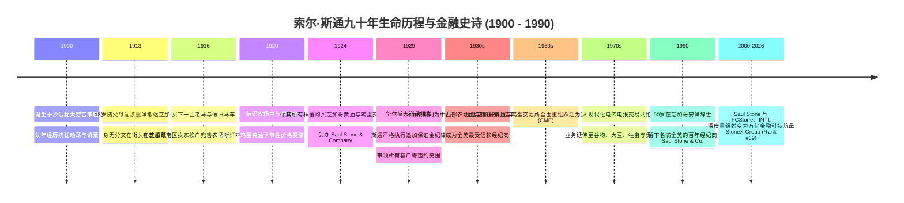
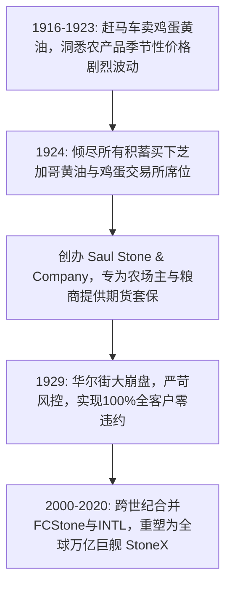

# 索尔·斯通 (Saul Stone)：俄罗斯难民少年、马车运蛋贩与百年大宗期货巨擘的开山传奇

> **“在期货交易大厅里，你可以没有显赫的家世，也可以没有哈佛的文凭；但你必须有一颗比黄金还纯粹的守信之心。‘言出必行 (My word is my bond)’，只要你在交易池里对我点了点头，就算天塌下来，我也必须把合同兑现到底！”**  
> —— 索尔·斯通 (Saul Stone)

---

```text
==================================================================================================
【传主档案速览】
• 全名：索尔·斯通 (Saul Stone) | 原名：索尔·斯托尼茨基 (Saul Stonitsky)
• 生卒：1900 年 6 月 15 日 – 1990 年 11 月 24 日 (享年 90 岁)
• 出生地：俄罗斯帝国 犹太人聚居区 (Shtetl, Russian Empire) | 逝世地：美国伊利诺伊州芝加哥
• 身份：Saul Stone & Company (1924) 创始人、芝加哥商业交易所 (CME) 终身资深会员、StoneX集团精神奠基人
• 求学历程：未受过正规大学教育 (13岁抵美流浪打工，在芝加哥商品交易第一线淬炼成宗师)
• 历史极值成就：从赶马车卖鸡蛋的难民小贩，成长为掌控全球农产品期货对冲定价权的开山泰斗
• 核心精神图腾：芝加哥南区运蛋马车、CME交易席位、大萧条零违约铁律、FCStone跨世纪蜕变
==================================================================================================
```

---

## 🧭 全景生命历程与重大历史决断编年轴 (Chronological Epic)



---

## ❄️ 第一章：逃离沙俄、芝加哥贫民窟与13岁报童 (1900 — 1915)

### 1. 冰天雪地里的苦难童年
1900 年 6 月 15 日，索尔·斯通出生在沙皇俄国西部边陲一个贫穷的犹太人村落。
- 沙俄末期，反犹浪潮与社会动荡席卷东欧。索尔一家在恐惧与贫困中苦苦挣扎，父亲靠做零星木工勉强糊口。
- 1913 年初，在亲戚的资助下，13 岁的索尔随父母挤在横跨大西洋的轮船三等舱最底层，历经数周颠簸抵达纽约埃利斯岛，随后转乘火车来到了当时全美工业与肉类加工中心——**芝加哥**。

### 2. 芝加哥寒冬里的坚韧报童
刚到芝加哥时，全家人挤在南区阴暗潮湿的地下室里，索尔一句英语也不会说。
- 13 岁的少年为了给病弱的母亲凑钱买药，每天清晨 4 点就顶着密歇根湖刺骨的暴风雪，站在喧嚣的电车站旁大声叫卖《芝加哥论坛报》。
- 索尔不仅拼命自学英语，更展现出对街头市井商机的惊人感知：他摸清了哪趟电车上的乘客出手最阔绰，用真诚的微笑和准确的找零赢得了整条街区工人们的喜爱。

---

## 🥚 第二章：一匹马、一辆车与“鸡蛋大王”的商业觉醒 (1916 — 1923)

### 1. 马车上的生鲜运销传奇
16 岁那年，索尔用卖报纸积攒下的十几美元，从旧货市场买下了一辆破旧的双轮木马车和一匹瘦弱的老马。
- 他开始每天清晨前往芝加哥城郊的农场，直接向农民收购新鲜鸡蛋、黄油和奶酪，然后赶着马车穿梭于市中心的杂货店、犹太烘焙坊和高档餐厅之间。
- **极致的新鲜与诚信**：在那个没有现代冷藏技术的年代，鸡蛋极易变质。索尔发明了一套用烛光逐枚透光检验蛋黄新鲜度的自制质检标准，向所有买家承诺：“只要敲出一枚坏蛋，我双倍免费补送一盒！”这让他在短时间内垄断了数十家大型烘焙坊的采购订单。

### 2. 发现大宗商品价格剧烈波动的秘密
在运销鸡蛋和黄油的过程中，索尔发现了一个深刻的经济现象：
- 每年春夏季母鸡产蛋旺季，市场上鸡蛋泛滥成灾，价格暴跌至谷底，农场主亏损连连；
- 而一到严冬，鸡蛋产量骤减，价格暴涨数倍，烘焙坊因原料昂贵痛苦不堪。
- 索尔苦苦思索：“为什么不能建立一种契约，让农场主在春天就能提前锁定秋天和冬天的售价，让面包房也能提前确定原料成本？”这个朴素的思考，正是现代大宗商品**期货与套期保值（Hedging）**的精髓所在。

---

## 🏛️ 第三章：创办 Saul Stone、CME席位与大萧条零违约传奇 (1924 — 1945)



### 1. 1924年创办 Saul Stone & Company
1924 年，24 岁的索尔·斯通做出了人生中最重要的冒险决定：他卖掉了自己的马车车队，拿出了全部积蓄，买下了刚刚重组成立的**芝加哥黄油与鸡蛋交易所 (Chicago Butter and Egg Board)** 的正式交易席位，并在芝加哥金融街正式挂牌成立了 **Saul Stone & Company**。
- 索尔成为了交易池里最敏锐的年轻红马甲经纪人。他不仅为芝加哥的食品商交易，更亲自坐火车走遍伊利诺伊、爱荷华和威斯康星的农场，用通俗生动的农家话向农场主们普及如何利用期货合约锁定利润。

### 2. 1929年华尔街大崩盘：零违约的传世神话
1929 年 10 月，“黑色星期二”引爆了人类历史上最惨烈的大萧条。全美大宗商品价格雪崩，棉花、小麦、黄油价格跌去 80%，数百家华尔街老牌经纪商因为客户穿仓爆仓而灰飞烟灭。
- 在全行业陷入恐慌疯狂抛售的至暗时刻，索尔·斯通展现出宗师级的风控铁律：
  - 在崩盘前数周，他敏锐察觉到杠杆投机的异常泡沫，坚决要求所有杠杆客户提前追加足额现金准备金，拒绝任何违规垫资；
  - 当大崩溃发生时，Saul Stone & Company 的资产负债表坚如磐石，**没有发生哪怕一笔客户穿仓违约，所有受托对冲合约全部 100% 履约结算**！
- 这场战役让 Saul Stone 成为整个美国中西部农业与食品行业中最受敬重的名字，“找斯通做套保，睡觉都踏实”成为全美农商界的流行语。

---

## 🌐 第四章：从 Saul Stone 到 StoneX：跨世纪万亿进化 (1950 — 2026)

### 1. 芝加哥商业交易所 (CME) 的黄金支柱
二战后，索尔推动交易所全面扩大交易品种，正式定名为世界闻名的**芝加哥商业交易所 (Chicago Mercantile Exchange, CME)**。
- Saul Stone & Company 迅速将业务从黄油鸡蛋拓展至生猪、活牛、玉米、大豆、黄金与国债期货，成为全美排名前列的大宗商品清算商。

### 2. 世纪大合并与 StoneX 腾飞
索尔·斯通于 1990 年以 90 岁高龄辞世后，他创立的基业在资本与技术驱动下开启了宏伟的跨世纪整合：
- **2000年**：Saul Stone & Co. 与拥有深厚农场合作社背景的 **Farmers Commodity Corporation (FCC)** 合并成立 **FCStone**；
- **2009年**：FCStone 与新兴市场跨境金融巨头 **International Assets (INTL)** 合并为 **INTL FCStone**；
- **2020年**：全面升级更名为 **StoneX集团 (StoneX Group Inc., NASDAQ: SNEX)**，并完成对零售外汇龙头嘉盛集团（Forex.com）的收购，一举成长为年营收超 1320 亿美元、年结算清算规模突破 4.4 万亿美元的全球超级金融网络。

---

## 🧠 第五章：索尔·斯通的底层认知与风控哲学

### 1. “中立通道与零方向性敞口”法则 (Neutral Infrastructure Mindset)
- 斯通给后人留下的最核心家训是：“永远不要试图去猜明天大宗商品是涨还是跌，那是上帝的事情。我们唯一的使命是建造一座绝对安全、畅通无阻的高速公路，为买卖双方提供最公正的过路服务。”

### 2. “信用即硬通货”契约伦理 (My Word is My Bond)
- 在喧嚣混乱的交易池中，斯通将口头承诺视同法律契约。他坚信：“在金融行业，聪明的人数不胜数，但最终能活过半个世纪的，永远只有那些在极端行情下依然信守承诺的笨人。”

### 3. “极端尾部风险防守”模型 (Extreme Tail-Risk Discipline)
- 斯通从不相信“这次不一样”的繁荣神话。在日常运营中，他始终强制保留超额流动性储备，对任何高杠杆投机保持本能的警惕，从而让企业在 1929 大萧条、1970 滞胀与 2008 金融海啸中均安然无恙。

---

## 💬 第六章：经典语录与传世轶事

### 经典名言录
1. *“在期货大厅里，‘言出必行’四个字比你银行账户里的所有数字都更有分量。”*
2. *“我们不是在赌博，我们是在给辛勤劳作的农民和企业撑起一把遮风避雨的保护伞。”*
3. *“当你赶着马车走在雪地里时，你最先学会的不是能跑多快，而是如何保证车上的每一个鸡蛋都不被打破。”*
